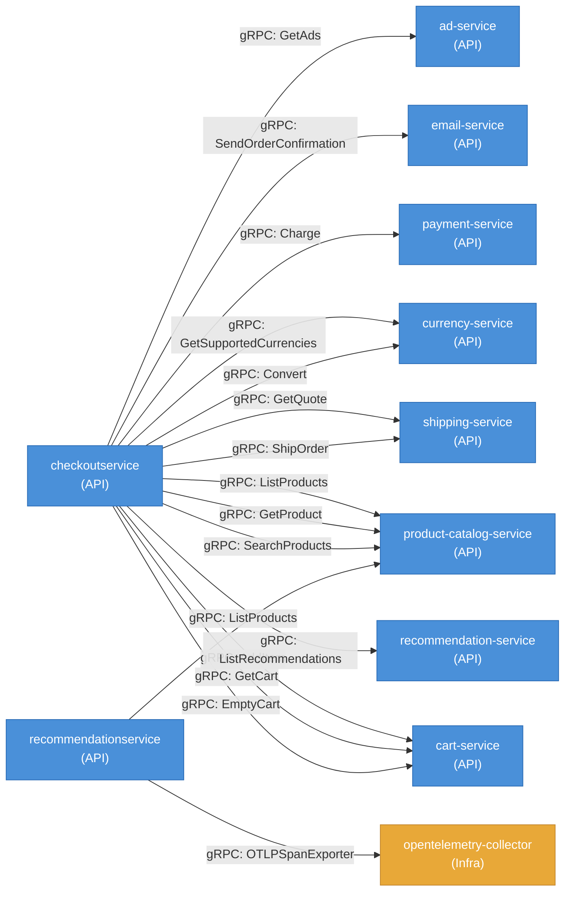
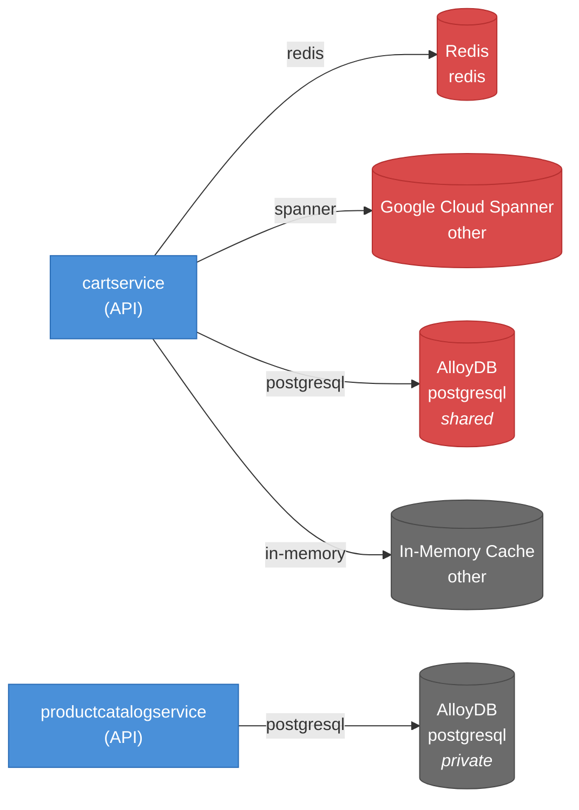

# Data Flow — GoogleCloudPlatform

## TL;DR for Agents

- **14 internal service-to-service gRPC calls** originating from `checkoutservice` (the primary orchestrator) and `recommendationservice`, targeting 8 distinct downstream services.
- **0 event/message topics detected** — all communication is synchronous gRPC; there is no asynchronous messaging layer.
- **5 database instances** across 2 services: Redis, Google Cloud Spanner, AlloyDB (×2), and an In-Memory Cache. AlloyDB appears in both `cartservice` (shared) and `productcatalogservice` (private).
- **Key external integrations**: Google Cloud Secret Manager, Google Cloud Profiler, OpenTelemetry, Google Cloud AlloyDB Connector, and a simple-card-validator payment library.
- **Most critical data path**: `checkoutservice` → `cartservice` → `paymentservice` → `shippingservice` → `emailservice` — a failure in any link blocks order completion.

---

## Service Call Graph

### Call Summary

| Source | Target | Protocol | Endpoints |
|--------|--------|----------|-----------|
| `checkoutservice` | `cart-service` | gRPC | `AddItem`, `GetCart`, `EmptyCart` |
| `checkoutservice` | `recommendation-service` | gRPC | `ListRecommendations` |
| `checkoutservice` | `product-catalog-service` | gRPC | `ListProducts`, `GetProduct`, `SearchProducts` |
| `checkoutservice` | `shipping-service` | gRPC | `GetQuote`, `ShipOrder` |
| `checkoutservice` | `currency-service` | gRPC | `GetSupportedCurrencies`, `Convert` |
| `checkoutservice` | `payment-service` | gRPC | `Charge` |
| `checkoutservice` | `email-service` | gRPC | `SendOrderConfirmation` |
| `checkoutservice` | `ad-service` | gRPC | `GetAds` |
| `recommendationservice` | `product-catalog-service` | gRPC | `ListProducts` |
| `recommendationservice` | `opentelemetry-collector` | gRPC | `OTLPSpanExporter` |

> **Note:** `checkoutservice` is the central orchestrator with fan-out to 8 downstream services. Any latency or failure in its dependencies directly impacts checkout availability.

---

## Event & Message Flows

**No event or message flows were detected.** All inter-service communication in this product uses synchronous gRPC calls. There are no pub/sub topics, message queues, or asynchronous event buses present in the data.

> ⚠️ **Implication for debugging:** Because there is no async decoupling, failures propagate synchronously. A timeout in `payment-service` will block the entire `checkoutservice` request.

---

## Data Ownership

### Database Inventory

| Database | Type | Owner Service | Shared? | Purpose |
|----------|------|---------------|---------|---------|
| Redis | redis | `cartservice` | ✅ Yes | Cart data caching / primary cart store |
| Google Cloud Spanner | other | `cartservice` | ✅ Yes | Cart persistence (globally distributed) |
| AlloyDB | postgresql | `cartservice` | ✅ Yes | Cart data storage (PostgreSQL-compatible) |
| In-Memory Cache | other | `cartservice` | ❌ No | Local in-process cart cache |
| AlloyDB | postgresql | `productcatalogservice` | ❌ No | Product catalog data storage |

> ⚠️ **Shared Database Risk:** Three of `cartservice`'s databases (Redis, Google Cloud Spanner, AlloyDB) are marked as **shared**. This means other services — not captured in this dataset — may read from or write to these stores. Shared databases create hidden coupling: schema changes, load spikes, or connection pool exhaustion in one consumer can impact all others. Engineers should audit which additional services access these stores and consider adding read replicas or API-mediated access patterns.

> **Note:** `cartservice` uses multiple storage backends (Redis, Spanner, AlloyDB, In-Memory Cache), suggesting a pluggable or multi-tier persistence architecture where the active backend may be selected via configuration.

---

## External Integrations

| Integration | Category | Used by Service(s) | Purpose |
|-------------|----------|---------------------|---------|
| Google Cloud Secret Manager | secrets | `cartservice`, `productcatalogservice` | Secure retrieval of credentials and configuration secrets |
| Google Cloud AlloyDB Connector | database | `productcatalogservice` | Managed secure connection proxy to AlloyDB instances |
| simple-card-validator | payment | `paymentservice` | Client-side credit card number validation (Luhn check) |
| Google Cloud Profiler | observability | `paymentservice`, `recommendationservice` | Continuous CPU/heap profiling in production |
| OpenTelemetry | observability | `paymentservice`, `recommendationservice` | Distributed tracing and telemetry collection |
| gRPC | rpc-framework | `recommendationservice` | Core RPC framework for service communication |
| gRPC Health Check | health-check | `recommendationservice` | Standard gRPC health checking protocol implementation |
| Python JSON Logger | logging | `recommendationservice` | Structured JSON log formatting |
| Google Auth | authentication | `recommendationservice` | Google OAuth/service account authentication |

---

## Critical Data Paths

1. **Checkout Flow (highest business criticality):**
   `checkoutservice` → `cart-service` (GetCart) → `product-catalog-service` (GetProduct) → `currency-service` (Convert) → `shipping-service` (GetQuote) → `payment-service` (Charge) → `shipping-service` (ShipOrder) → `cart-service` (EmptyCart) → `email-service` (SendOrderConfirmation). This is a fully synchronous chain — failure at any step blocks order completion. The `checkoutservice` is a single point of orchestration with no fallback.

2. **Cart Persistence Path:**
   `checkoutservice` → `cart-service` (AddItem / GetCart / EmptyCart) → one of [Redis | Google Cloud Spanner | AlloyDB | In-Memory Cache]. The multi-backend architecture means debugging cart data issues requires identifying which storage backend is active. Secrets for database connections are fetched from **Google Cloud Secret Manager**.

3. **Product Catalog Retrieval:**
   `checkoutservice` → `product-catalog-service` (ListProducts / GetProduct / SearchProducts) → AlloyDB (via **Google Cloud AlloyDB Connector**). Also consumed by `recommendationservice` → `product-catalog-service` (ListProducts). This makes `product-catalog-service` and its AlloyDB instance a shared dependency for both checkout and recommendations.

4. **Recommendation Generation:**
   `recommendationservice` → `product-catalog-service` (ListProducts) → AlloyDB. Telemetry for this path is exported via `recommendationservice` → `opentelemetry-collector` (OTLPSpanExporter). If `product-catalog-service` is degraded, both recommendations and checkout are impacted.

5. **Payment Processing:**
   `checkoutservice` → `payment-service` (Charge). The `paymentservice` uses **simple-card-validator** for card validation and has no database — it is stateless. Observability is provided by **OpenTelemetry** and **Google Cloud Profiler**. As a stateless service with no retry queue, failed charges require the client (`checkoutservice`) to handle retries.

---

## See Also

- [`PRODUCT.md`](./PRODUCT.md) — Product overview and architecture context
- [`cartservice/DEPENDENCIES.md`](./cartservice/DEPENDENCIES.md) — Cart service dependencies (Redis, Spanner, AlloyDB, In-Memory Cache, Secret Manager)
- [`checkoutservice/DEPENDENCIES.md`](./checkoutservice/DEPENDENCIES.md) — Checkout service dependencies (orchestrator, 8 downstream gRPC targets)
- [`productcatalogservice/DEPENDENCIES.md`](./productcatalogservice/DEPENDENCIES.md) — Product catalog service dependencies (AlloyDB, AlloyDB Connector, Secret Manager)
- [`paymentservice/DEPENDENCIES.md`](./paymentservice/DEPENDENCIES.md) — Payment service dependencies (simple-card-validator, Cloud Profiler, OpenTelemetry)
- [`recommendationservice/DEPENDENCIES.md`](./recommendationservice/DEPENDENCIES.md) — Recommendation service dependencies (product-catalog-service, OpenTelemetry, Cloud Profiler)