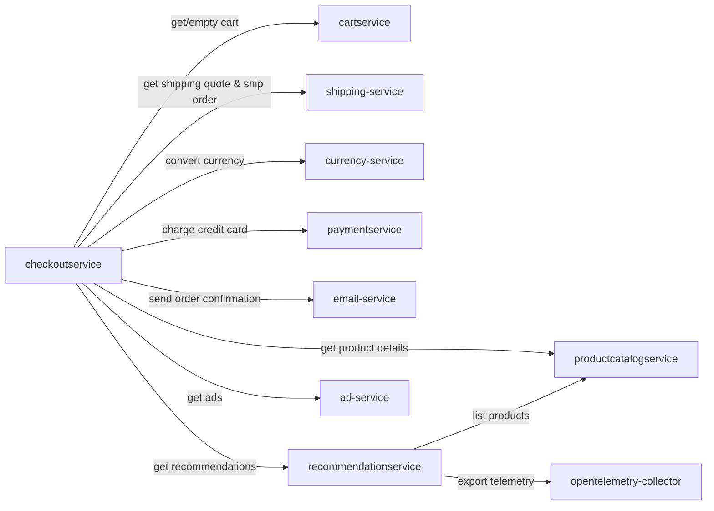

# GoogleCloudPlatform

> A cloud-native e-commerce microservices demo platform built on gRPC, showcasing distributed architecture patterns on Google Cloud.

---

## TL;DR for Agents

- **What it does**: A fully functional e-commerce backend composed of 5 microservices handling product browsing, cart management, checkout orchestration, payments, and recommendations.
- **Service count**: 5 services spanning 4 languages (Go, C#, Python, JavaScript).
- **Most critical service**: `checkoutservice` — it is the central orchestrator that coordinates with nearly every other service to complete an order.
- **Where most bugs will originate**: `checkoutservice` due to its fan-out dependency on 7+ downstream services; any single failure cascades into a failed order.
- **Data-sensitive services**: `cartservice` (stateful, backed by Redis/Spanner/AlloyDB) and `productcatalogservice` (catalog data from JSON or AlloyDB) are the primary data owners.
- **Auth/identity**: No dedicated auth service is present in this architecture; identity/authentication is not handled by any of the analyzed services.

---

## What This Product Does

GoogleCloudPlatform is a microservices-based e-commerce demonstration platform designed to showcase cloud-native architecture patterns on Google Cloud. It models a realistic online shopping experience where users can browse a product catalog, receive personalized product recommendations, manage a shopping cart, and complete purchases through a multi-step checkout flow.

The platform is composed of loosely coupled services communicating over gRPC, each owning a distinct business domain. This separation allows each service to be independently developed, deployed, and scaled. The architecture supports pluggable storage backends — Redis, Google Cloud Spanner, and AlloyDB — demonstrating how cloud-managed databases integrate into microservice topologies.

The primary users of this platform are developers and architects learning distributed systems patterns, as well as teams evaluating Google Cloud services (Spanner, AlloyDB, GKE) in a realistic workload context. The core value lies in providing a production-representative reference architecture that exercises observability (OpenTelemetry), polyglot service development, and service mesh communication patterns.

---

## Service Map

| Service | Type | Language / Framework | Purpose | Start here when... |
|---|---|---|---|---|
| `cartservice` | API | C# / ASP.NET Core | Manages shopping carts with pluggable storage (Redis, Spanner, AlloyDB) | Cart items are missing, duplicated, or cart state is inconsistent |
| `checkoutservice` | API | Go / gRPC | Orchestrates the entire checkout flow by coordinating cart, catalog, shipping, currency, payment, and email services | Orders are failing, checkout hangs, or any downstream service error surfaces during purchase |
| `productcatalogservice` | API | Go / gRPC | Serves product listings, lookups, and search from JSON or AlloyDB | Products not displaying, search returning wrong results, or catalog data stale |
| `paymentservice` | API | JavaScript / — | Validates credit cards and processes charges, returning transaction IDs | Payment declined unexpectedly, invalid card errors, or missing transaction IDs |
| `recommendationservice` | API | Python / gRPC | Returns product recommendations by filtering catalog against user's current cart | Recommendations missing, duplicating cart items, or returning empty results |

---

## Service Dependency Graph

> **Note**: `shipping-service`, `currency-service`, `email-service`, and `ad-service` appear as outbound dependencies of `checkoutservice` but are not among the 5 analyzed services. They are shown as external nodes for completeness.

---

## Technology Stack

| Language | Framework | Services Using It |
|---|---|---|
| Go | gRPC | `checkoutservice`, `productcatalogservice` |
| C# | ASP.NET Core (gRPC) | `cartservice` |
| Python | gRPC | `recommendationservice` |
| JavaScript | Node.js (gRPC) | `paymentservice` |

**Shared infrastructure patterns:**
- All inter-service communication uses **gRPC** (Protocol Buffers)
- Observability via **OpenTelemetry**
- Storage backends: **Redis**, **Google Cloud Spanner**, **AlloyDB (PostgreSQL)**

---

## Debugging Entry Points

| Symptom | First Service to Check | Why |
|---|---|---|
| Cart items missing or wrong quantities | `cartservice` | Owns all cart state; check storage backend connectivity (Redis/Spanner/AlloyDB) |
| Checkout fails with generic error | `checkoutservice` | Orchestrator for the entire flow; inspect logs to identify which downstream call failed |
| Products not showing in catalog or search | `productcatalogservice` | Serves all product data; verify JSON file or AlloyDB connection |
| Payment declined unexpectedly | `paymentservice` | Handles card validation and charge logic; check card validation rules and transaction ID generation |
| Recommendations are empty or include items already in cart | `recommendationservice` | Filters catalog against cart contents; verify it can reach `productcatalogservice` |
| Order placed but no confirmation email | `checkoutservice` → `email-service` | `checkoutservice` calls `email-service` post-order; check if the call is failing silently |
| Shipping cost is zero or incorrect | `checkoutservice` → `shipping-service` | `checkoutservice` fetches quotes from `shipping-service`; verify that dependency is reachable |
| Prices displayed in wrong currency | `checkoutservice` → `currency-service` | Currency conversion happens during checkout; check `currency-service` availability and exchange rate data |
| High latency on checkout | `checkoutservice` | Fan-out to 7+ services means any slow dependency adds latency; trace the request with OpenTelemetry |

---

## How the Services Fit Together

The user journey begins with product discovery. The `productcatalogservice` serves the full product catalog — listing, detail retrieval, and keyword search — sourced from either a local JSON file or an AlloyDB PostgreSQL database. Alongside browsing, the `recommendationservice` enhances the experience by querying the product catalog, filtering out items already in the user's cart, and returning a randomized subset of suggestions.

As the user adds items to their cart, the `cartservice` persists cart state to a pluggable storage backend (Redis for fast ephemeral storage, or Spanner/AlloyDB for durable managed storage). The cart service exposes add-item, get-cart, and empty-cart operations over gRPC, making it the single source of truth for shopping session state.

When the user initiates checkout, the `checkoutservice` takes over as the critical-path orchestrator. It retrieves the user's cart from `cartservice`, fetches product details from `productcatalogservice`, requests a shipping quote from `shipping-service`, converts prices via `currency-service`, charges the user's credit card through `paymentservice`, arranges shipment via `shipping-service`, sends an order confirmation through `email-service`, and finally empties the cart. This fan-out pattern means `checkoutservice` is the single most failure-prone point in the system — a degradation in **any** downstream dependency directly impacts order completion. Observability through OpenTelemetry (exported from services like `recommendationservice` to the collector) is essential for tracing failures across this distributed transaction.

---

## See Also

- [INDEX.md](INDEX.md) — Top-level repository index
- [cartservice Overview](services/cartservice/OVERVIEW.md)
- [checkoutservice Overview](services/checkoutservice/OVERVIEW.md)
- [productcatalogservice Overview](services/productcatalogservice/OVERVIEW.md)
- [paymentservice Overview](services/paymentservice/OVERVIEW.md)
- [recommendationservice Overview](services/recommendationservice/OVERVIEW.md)