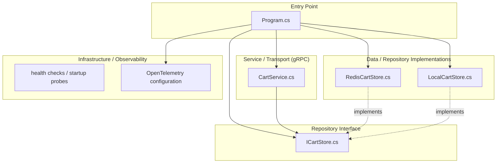
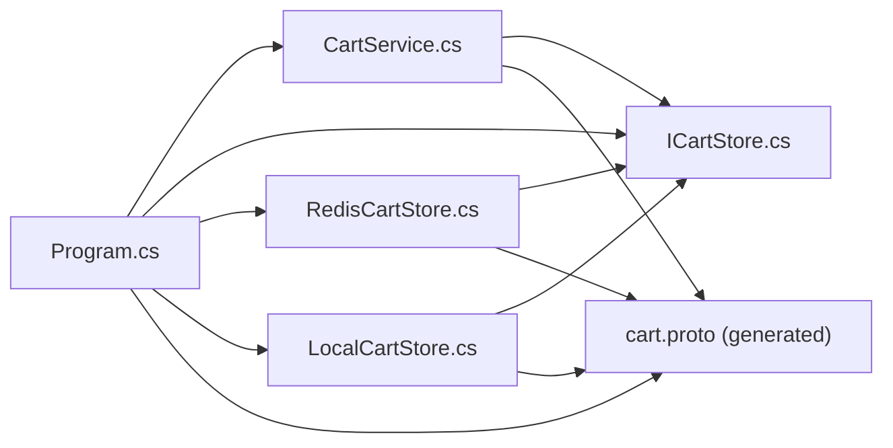

<!-- generated: 2026-04-13T05:09:56.296Z | model: claude-opus-4-6 | sha: c9857ee5 -->

# Architecture — cartservice

## TL;DR for Agents

- **ASP.NET Core gRPC service** following a simplified layered architecture: Entry Point → Service/Transport → Repository/Data.
- **Key modules**: `Program.cs` (entry point), `CartService.cs` (gRPC service implementation), `ICartStore.cs` (repository interface), `RedisCartStore.cs` and `LocalCartStore.cs` (data layer implementations).
- **No circular dependencies detected** — dependency flow is strictly top-down from transport to data layer.
- **Dependency injection** is the primary wiring mechanism; the cart store implementation is resolved at startup via DI container in `Program.cs`.
- **Entry point for code changes**: start at `src/cartservice/src/Program.cs` for startup/config, `CartService.cs` for business logic, or the `ICartStore` implementations for data access changes.

## Layer Architecture

## Module Dependency Graph

> No dependency violations detected. All arrows flow from upper layers (entry point, transport) toward lower layers (interface, implementation). No repository module imports a transport module.

## Layer Descriptions

| Layer | Directories / Files | Responsibility | May Import From |
|---|---|---|---|
| **Entry Point** | `Program.cs` | Application bootstrap, DI registration, gRPC server configuration, OpenTelemetry setup, health check wiring | All layers below |
| **Service / Transport** | `CartService.cs` | gRPC endpoint implementation; maps incoming protobuf requests to cart store operations; handles request validation and error responses | Repository Interface, Proto-generated types |
| **Repository Interface** | `ICartStore.cs` | Defines the `ICartStore` contract (`AddItemAsync`, `GetCartAsync`, `EmptyCartAsync`) decoupling service logic from storage | Proto-generated types (for model definitions) |
| **Data / Repository Impl** | `RedisCartStore.cs`, `LocalCartStore.cs` | Concrete storage backends — Redis (production) and in-memory ConcurrentDictionary (dev/test fallback) | Repository Interface, Proto-generated types |
| **Infrastructure / Observability** | OpenTelemetry config in `Program.cs`, health probes | Distributed tracing, metrics export, liveness/readiness probes | N/A (configured at entry point) |

## Circular Dependencies

No circular dependencies detected. The dependency graph is a clean DAG flowing from `Program.cs` through `CartService.cs` to the `ICartStore` interface and its implementations. The use of an interface (`ICartStore`) as an abstraction boundary prevents any upward dependency from the data layer back to the service layer.

## Key Design Patterns

### Dependency Injection via Interface Abstraction

The most prominent pattern in `cartservice` is **constructor injection through an interface**. `CartService.cs` depends only on `ICartStore`, never on a concrete implementation. At startup, `Program.cs` inspects configuration (e.g., the `REDIS_ADDR` environment variable) to decide whether to register `RedisCartStore` or `LocalCartStore` in the ASP.NET Core DI container. This makes the service trivially testable — a mock `ICartStore` can be injected without any Redis infrastructure — and allows swapping storage backends without modifying business logic.

### Strategy Pattern for Storage Backends

`RedisCartStore` and `LocalCartStore` are interchangeable strategies behind the `ICartStore` contract. `RedisCartStore` serializes cart data as protobuf bytes into Redis using `StackExchange.Redis`, while `LocalCartStore` uses a `ConcurrentDictionary` for zero-dependency local development. This strategy selection happens once at startup and is transparent to the gRPC service layer. Adding a new backend (e.g., Memorystore, Spanner) requires only implementing `ICartStore` and registering it in `Program.cs`.

### gRPC Service as a Thin Transport Layer

`CartService.cs` acts as a **thin adapter** between the gRPC transport and the domain logic encapsulated in the cart store. It deserializes protobuf requests, delegates to `ICartStore`, and maps results back to protobuf responses. Error handling (e.g., `RpcException` with appropriate status codes) is localized here, keeping the repository implementations free of transport concerns. This aligns with the **Ports and Adapters** (hexagonal) philosophy even within a simplified layered structure.

### OpenTelemetry Instrumentation at the Edge

Observability is configured centrally in `Program.cs` using the OpenTelemetry SDK for .NET. Traces are automatically captured for incoming gRPC calls and outgoing Redis commands, providing end-to-end distributed tracing across the microservices-demo without polluting business logic with instrumentation code. This follows the **cross-cutting concern** pattern where infrastructure behavior is wired at the composition root.

## See Also

- [microservices-demo repository](https://github.com/GoogleCloudPlatform/microservices-demo) — parent repository with all services and deployment manifests
- [src/cartservice/src/](https://github.com/GoogleCloudPlatform/microservices-demo/tree/main/src/cartservice/src) — source directory for the cart service
- [protos/demo.proto](https://github.com/GoogleCloudPlatform/microservices-demo/blob/main/protos/demo.proto) — shared protobuf definitions including `CartService` RPC contract
- [kubernetes-manifests/](https://github.com/GoogleCloudPlatform/microservices-demo/tree/main/kubernetes-manifests) — Kubernetes deployment specs showing how `cartservice` is configured with Redis in production