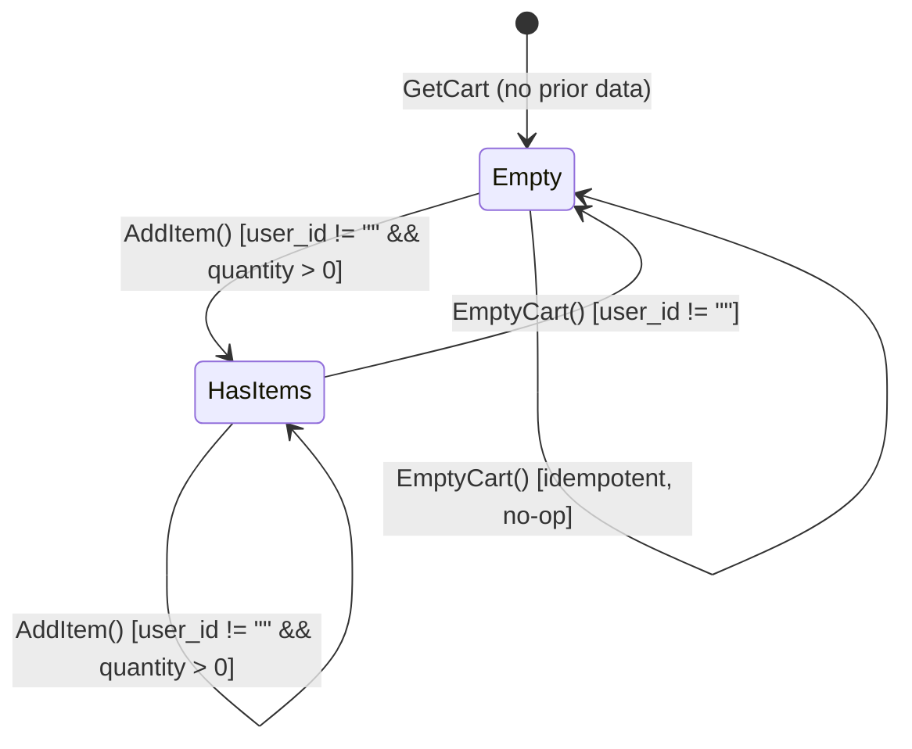

<!-- generated: 2026-04-13T05:10:43.094Z | model: claude-opus-4-6 | sha: c9857ee5 -->


# Business Rules — cartservice

## TL;DR for Agents

- **No formal state machines** — the cart is a mutable key-value store (keyed by `user_id`) with add, get, and empty operations; there are no lifecycle states to transition through.
- **Zero explicit permission/auth checks** — cartservice trusts all inbound gRPC calls; authorization is expected to be enforced at the API gateway / frontend layer.
- **Critical constraint: `user_id` must be non-empty** — every RPC (`AddItem`, `GetCart`, `EmptyCart`) requires a non-empty `user_id`; violating this is the most common error path.
- **Quantity is additive** — adding an item that already exists in the cart increments its quantity rather than replacing it.
- **Redis is the sole persistence backend** — all cart state lives in Redis with an expiry TTL; if Redis is unreachable, every operation fails.

---

## State Machines

The cart service does not implement a formal state machine. A cart is implicitly created on first `AddItem` call and can be emptied via `EmptyCart`. There are no draft/checkout/locked/archived states managed by this service — order lifecycle is handled downstream by `checkoutservice`.

### Cart Lifecycle (Informal)



### Transitions Reference

| From | To | Trigger | Guards | Side Effects | Code Ref |
|---|---|---|---|---|---|
| `Empty` | `HasItems` | `AddItem()` | `user_id != ""`, `quantity > 0` | Item written to Redis; TTL reset | `src/cartservice/services/CartService.cs` |
| `HasItems` | `HasItems` | `AddItem()` | `user_id != ""`, `quantity > 0` | Quantity incremented if same `product_id`; new entry otherwise; TTL reset | `src/cartservice/services/CartService.cs` |
| `HasItems` | `Empty` | `EmptyCart()` | `user_id != ""` | All items deleted from Redis key | `src/cartservice/services/CartService.cs` |
| `Empty` | `Empty` | `EmptyCart()` | `user_id != ""` | No-op / idempotent | `src/cartservice/services/CartService.cs` |

### Terminal States

There are no terminal (irreversible) states in cartservice. A cart can always receive new items after being emptied. Cart data may expire from Redis based on the configured TTL, effectively returning it to the `Empty` pseudo-state.

---

## Business Rules

### Validation Rules

#### Non-Empty User ID

| Field | Value |
|---|---|
| **Category** | Validation |
| **Condition** | `request.UserId` is empty or whitespace |
| **Outcome** | RPC is rejected |
| **Error Code** | gRPC `INVALID_ARGUMENT` |
| **Code Ref** | `src/cartservice/services/CartService.cs` — `AddItem`, `GetCart`, `EmptyCart` |

#### Positive Quantity on Add

| Field | Value |
|---|---|
| **Category** | Validation |
| **Condition** | `CartItem.Quantity` ≤ 0 on `AddItem` |
| **Outcome** | Behavior is undefined / no explicit guard in upstream code; item may be stored with non-positive quantity |
| **Error Code** | None (no explicit check) |
| **Code Ref** | `src/cartservice/services/CartService.cs` |

> **Note to agents:** The codebase does not explicitly reject zero or negative quantities. Defensive code should treat `quantity > 0` as a precondition.

---

### Business Constraint Rules

#### Additive Quantity

| Field | Value |
|---|---|
| **Category** | Business-constraint |
| **Condition** | `AddItem` called with a `product_id` that already exists in the cart |
| **Outcome** | Existing item's quantity is **incremented** by the request quantity (not replaced) |
| **Error Code** | N/A |
| **Code Ref** | `src/cartservice/cartstore/RedisCartStore.cs` |

#### EmptyCart Idempotency

| Field | Value |
|---|---|
| **Category** | Idempotency |
| **Condition** | `EmptyCart` called on a cart that is already empty or does not exist |
| **Outcome** | Returns success (no error) |
| **Error Code** | N/A |
| **Code Ref** | `src/cartservice/cartstore/RedisCartStore.cs` |

#### GetCart on Non-Existent Cart

| Field | Value |
|---|---|
| **Category** | Idempotency |
| **Condition** | `GetCart` called with a `user_id` that has no stored cart |
| **Outcome** | Returns an empty `Cart` object (zero items), not an error |
| **Error Code** | N/A |
| **Code Ref** | `src/cartservice/cartstore/RedisCartStore.cs` |

---

### Infrastructure Constraint Rules

#### Redis Connectivity Required

| Field | Value |
|---|---|
| **Category** | Infrastructure |
| **Condition** | Redis is unreachable or connection times out |
| **Outcome** | RPC fails with an exception; gRPC `UNAVAILABLE` or `INTERNAL` |
| **Error Code** | gRPC `UNAVAILABLE` / `INTERNAL` |
| **Code Ref** | `src/cartservice/cartstore/RedisCartStore.cs` |

---

### Quick Reference

| Name | Category | Condition | Code Ref |
|---|---|---|---|
| Non-Empty User ID | Validation | `user_id == ""` → reject | `services/CartService.cs` |
| Positive Quantity on Add | Validation | `quantity <= 0` → undefined | `services/CartService.cs` |
| Additive Quantity | Business-constraint | Duplicate `product_id` → increment | `cartstore/RedisCartStore.cs` |
| EmptyCart Idempotency | Idempotency | Empty cart → success (no-op) | `cartstore/RedisCartStore.cs` |
| GetCart on Non-Existent Cart | Idempotency | Missing cart → empty Cart object | `cartstore/RedisCartStore.cs` |
| Redis Connectivity Required | Infrastructure | Redis down → RPC failure | `cartstore/RedisCartStore.cs` |

---

## Permission Matrix

| Resource | Action | Allowed Roles | Additional Conditions | Denial Behavior |
|---|---|---|---|---|
| Cart (`user_id`) | `AddItem` | Any caller | `user_id` must be non-empty | gRPC `INVALID_ARGUMENT` |
| Cart (`user_id`) | `GetCart` | Any caller | `user_id` must be non-empty | gRPC `INVALID_ARGUMENT` |
| Cart (`user_id`) | `EmptyCart` | Any caller | `user_id` must be non-empty | gRPC `INVALID_ARGUMENT` |

**Auth model summary:** cartservice implements **no authentication or authorization**. It is designed to sit behind a trusted boundary (the `frontend` service). Any gRPC client that can reach the service can read or mutate any user's cart by supplying the target `user_id`. There is no JWT validation, RBAC, ABAC, or ownership check. **Agents generating code that exposes cartservice endpoints must ensure an upstream auth layer is in place.**

---

## Calculations & Formulas

### Cart Total Quantity

```
total_quantity = SUM(item.quantity for item in cart.items)
```

| Field | Detail |
|---|---|
| **Inputs** | `cart.items[].quantity` (int32) |
| **Output** | Total number of units in the cart |
| **Precision** | Integer (int32) |
| **Note** | This calculation is not performed inside cartservice itself; it is consumed by `frontend` and `checkoutservice`. |

### Additive Quantity on Duplicate Product

```
new_quantity = existing_item.quantity + request_item.quantity
```

| Field | Detail |
|---|---|
| **Inputs** | `existing_item.quantity` (int32), `request_item.quantity` (int32) |
| **Output** | Updated quantity for the cart line item |
| **Precision** | Integer (int32); no overflow check |
| **Code Ref** | `src/cartservice/cartstore/RedisCartStore.cs` |

---

## What an Agent Must Know

- **Always supply a non-empty `user_id`** in every RPC call. This is the single most common validation failure.
- **`AddItem` is additive, not idempotent.** Calling `AddItem` twice with `quantity=1` results in `quantity=2`. Do not retry blindly without accounting for this.
- **There is no "update quantity" or "remove single item" RPC.** To change a quantity, you must `EmptyCart` and re-add all desired items, or the upstream caller must manage delta logic.
- **`GetCart` never returns an error for a missing cart** — it returns an empty items list. Do not treat an empty response as a failure.
- **`EmptyCart` is safe to call multiple times** — it is idempotent and will not error on an already-empty cart.
- **No auth is enforced** — any caller can access any cart. If you are writing integration code, ensure the calling service validates ownership before forwarding requests.
- **Redis availability is a hard dependency.** If health checks against Redis fail, all cart operations will fail. Agents provisioning infrastructure must ensure Redis is running and reachable before starting cartservice.
- **Integer overflow on quantity is unchecked.** Extremely large additive quantities could overflow int32. Validate quantity bounds upstream.

---

## See Also

- [SCENARIOS.md](SCENARIOS.md) — End-to-end scenarios exercising cart add, get, empty, and checkout flows
- [ERRORS.md](ERRORS.md) — gRPC error codes returned by cartservice (`INVALID_ARGUMENT`, `UNAVAILABLE`, `INTERNAL`)
- [DATA_MODEL.md](DATA_MODEL.md) — Protobuf definitions for `Cart`, `CartItem`, and request/response messages