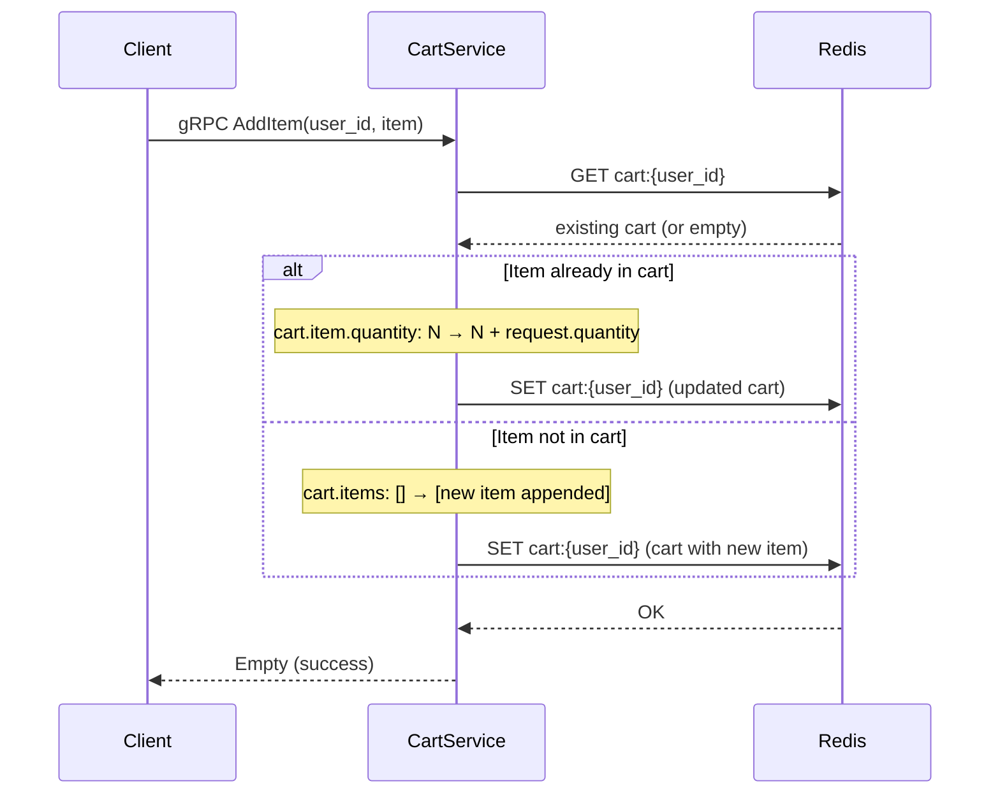
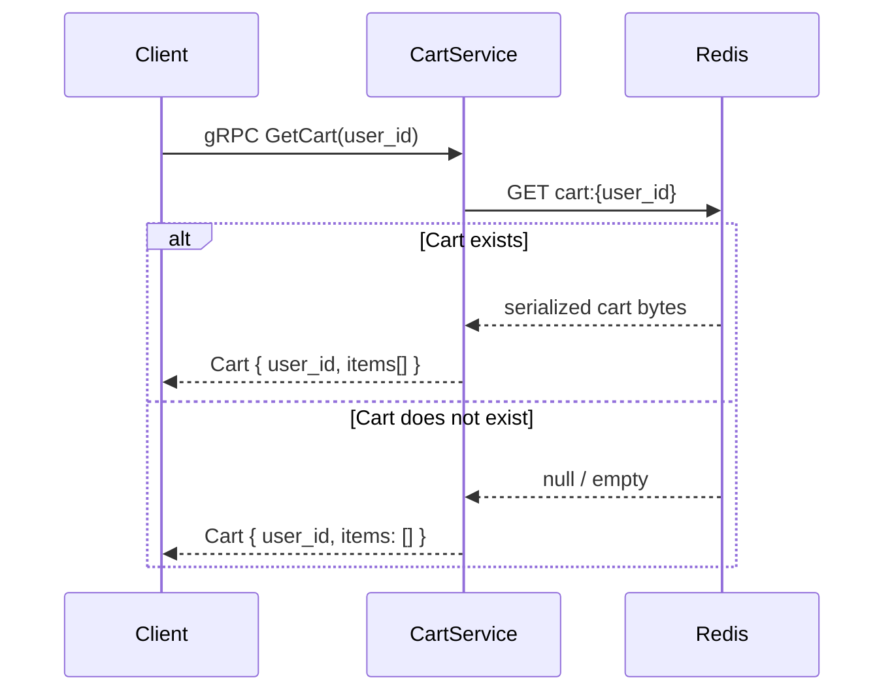
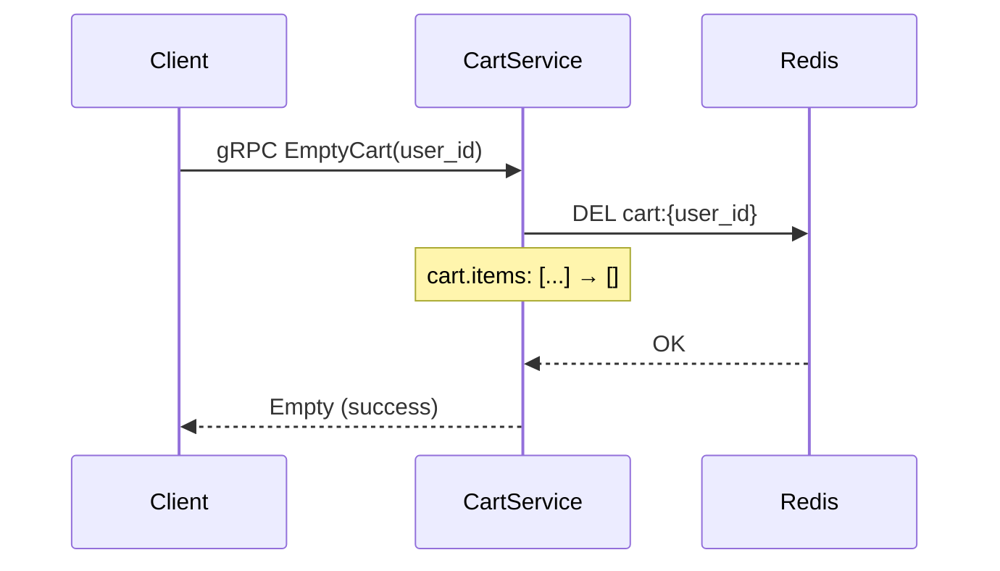
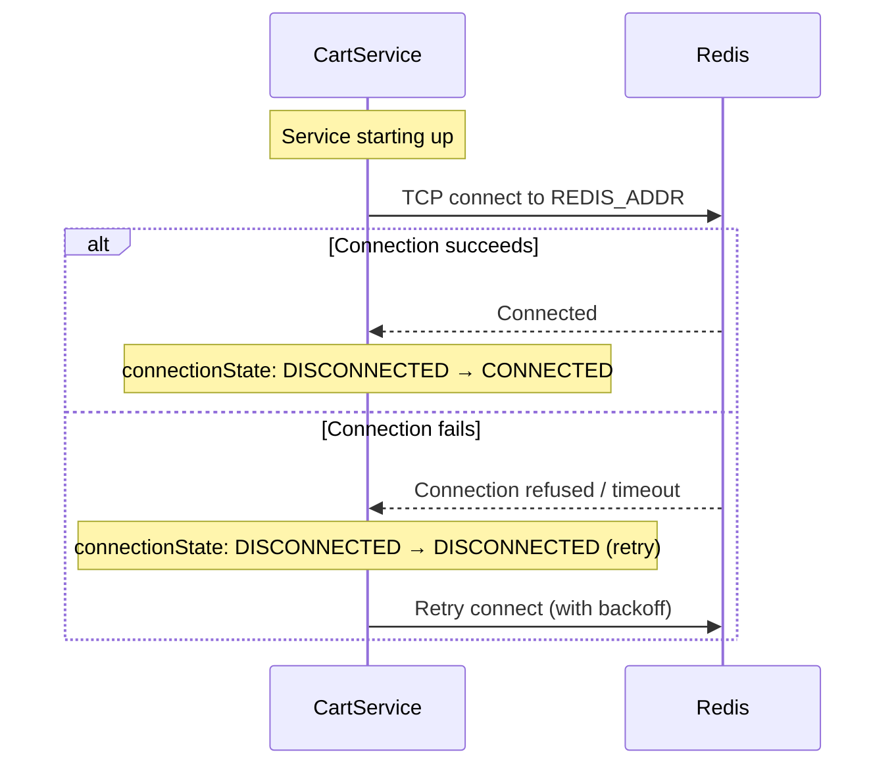
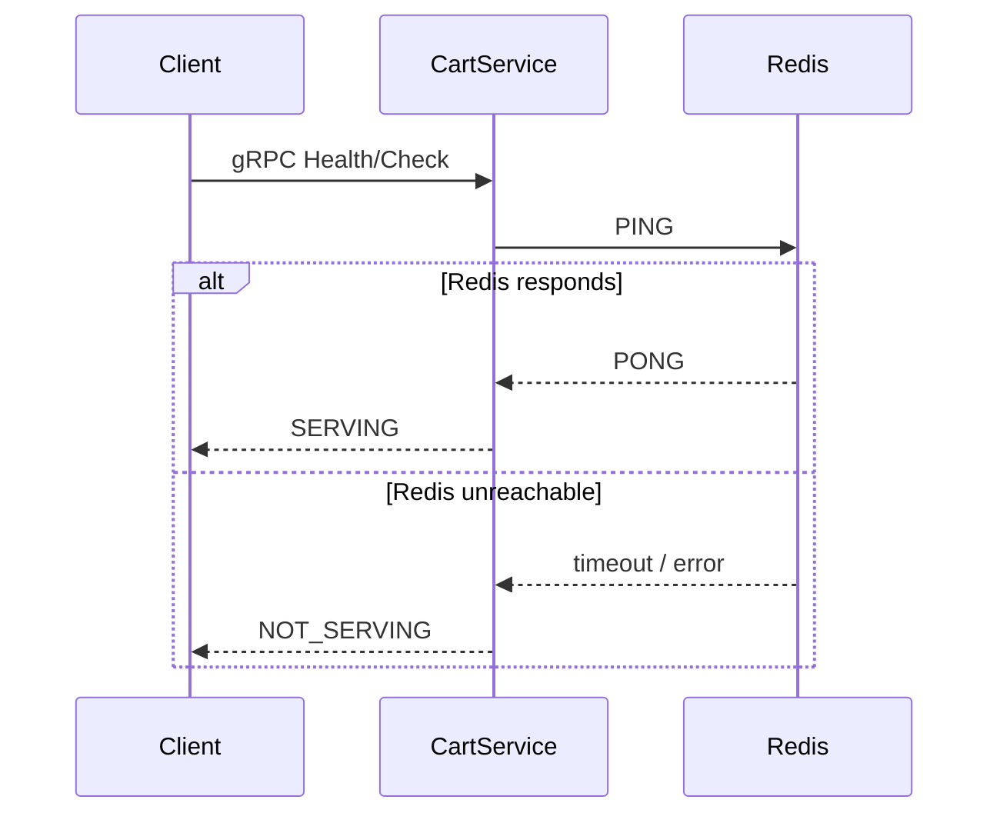

<!-- generated: 2026-04-13T05:05:37.846Z | model: claude-opus-4-6 | sha: c9857ee5 -->

# Scenarios — cartservice

## TL;DR for Agents
- **Total scenarios: 5** — 0 tested, 5 untested (no test references found in extracted data)
- **Most critical scenario:** `AddItem` — core cart mutation that interacts with Redis state and is called by the frontend on every "Add to Cart" action
- **Most common failure mode:** Redis connection failure / timeout — affects all scenarios since every operation depends on the Redis backing store
- **State transitions exist:** Yes — cart state changes on `AddItem`, `EmptyCart`, and quantity updates within `AddItem`
- **Service is a gRPC service** (not REST); all triggers are gRPC method calls defined in the `hipstershop.CartService` protobuf service

## How to Read This Document

Each scenario represents a single gRPC method exposed by the `cartservice`. Scenarios describe the full request lifecycle from the gRPC call entry point through Redis interaction and back. Since `cartservice` is a relatively thin data-access service, most complexity lives in Redis connection management and error handling.

## Scenario Index

| Name | Trigger | Tags | Tested By |
|------|---------|------|-----------|
| [AddItem](#scenario-additem) | `gRPC CartService/AddItem` | `cart`, `write`, `redis`, `state-change` | ⚠️ Not covered |
| [GetCart](#scenario-getcart) | `gRPC CartService/GetCart` | `cart`, `read`, `redis` | ⚠️ Not covered |
| [EmptyCart](#scenario-emptycart) | `gRPC CartService/EmptyCart` | `cart`, `write`, `redis`, `state-change` | ⚠️ Not covered |
| [RedisConnectionInit](#scenario-redisconnectioninit) | Service startup | `infra`, `redis`, `connection` | ⚠️ Not covered |
| [HealthCheck](#scenario-healthcheck) | `gRPC grpc.health.v1.Health/Check` | `health`, `observability` | ⚠️ Not covered |

---

## Scenario: AddItem

- **Trigger** — `gRPC CartService/AddItem` with `AddItemRequest { user_id, item { product_id, quantity } }`
- **Preconditions**
  - Redis is reachable and the connection pool is initialized
  - `user_id` is a non-empty string
  - `item.product_id` is a valid product identifier
  - `item.quantity` is a positive integer
- **Entry Point** — `src/cartservice/cartstore/RedisCartStore.cs:AddItemAsync`

### Sequence Diagram



### Steps

1. **Receive gRPC AddItemRequest and extract user_id and item**
   📍 `src/cartservice/cartstore/RedisCartStore.cs:AddItemAsync`

2. **Fetch existing cart from Redis by user_id key**
   📍 `src/cartservice/cartstore/RedisCartStore.cs:AddItemAsync`
   ```csharp
   var value = await db.HashGetAsync(userId, "cart");
   ```

3. **Deserialize existing cart or create new empty cart**
   📍 `src/cartservice/cartstore/RedisCartStore.cs:AddItemAsync`
   _"when: cart exists in Redis"_ — deserialize from byte array
   _"when: cart does not exist"_ — create new `Hipstershop.Cart`

4. **Check if product_id already exists in cart items**
   📍 `src/cartservice/cartstore/RedisCartStore.cs:AddItemAsync`
   _"when: item with same product_id exists"_
   > **State change:** `cart.item.quantity: N → N + request.quantity`

5. **Append new item if product_id not found in existing items**
   📍 `src/cartservice/cartstore/RedisCartStore.cs:AddItemAsync`
   _"when: item with product_id not found in cart"_
   > **State change:** `cart.items: [existing] → [existing + new_item]`

6. **Serialize updated cart and write back to Redis**
   📍 `src/cartservice/cartstore/RedisCartStore.cs:AddItemAsync`
   ```csharp
   await db.HashSetAsync(userId, new[] { new HashEntry("cart", cart.ToByteArray()) });
   ```

### Success Outcome

```protobuf
// gRPC response: google.protobuf.Empty
// Status: OK (code 0)
{}
```

### Failure Modes

| Condition | Outcome | Error Code | Retryable |
|-----------|---------|------------|-----------|
| Redis connection unavailable | gRPC UNAVAILABLE returned to client | `gRPC 14 (UNAVAILABLE)` | ✅ Yes |
| Redis timeout | gRPC DEADLINE_EXCEEDED or UNAVAILABLE | `gRPC 4 / 14` | ✅ Yes |
| Empty `user_id` | gRPC INVALID_ARGUMENT | `gRPC 3 (INVALID_ARGUMENT)` | ❌ No |
| Redis OOM (max memory reached) | gRPC INTERNAL | `gRPC 13 (INTERNAL)` | ⚠️ Depends on eviction policy |
| Deserialization failure (corrupt data) | gRPC INTERNAL | `gRPC 13 (INTERNAL)` | ❌ No |

### Side Effects
- Cart state in Redis is mutated (item added or quantity incremented)
- Redis key expiration may be reset depending on configuration

### Test Coverage
⚠️ **Not covered by tests**

---

## Scenario: GetCart

- **Trigger** — `gRPC CartService/GetCart` with `GetCartRequest { user_id }`
- **Preconditions**
  - Redis is reachable and the connection pool is initialized
  - `user_id` is a non-empty string
- **Entry Point** — `src/cartservice/cartstore/RedisCartStore.cs:GetCartAsync`

### Sequence Diagram



### Steps

1. **Receive gRPC GetCartRequest and extract user_id**
   📍 `src/cartservice/cartstore/RedisCartStore.cs:GetCartAsync`

2. **Fetch cart data from Redis using user_id as key**
   📍 `src/cartservice/cartstore/RedisCartStore.cs:GetCartAsync`
   ```csharp
   var value = await db.HashGetAsync(userId, "cart");
   ```

3. **Deserialize cart if data exists, otherwise return empty cart**
   📍 `src/cartservice/cartstore/RedisCartStore.cs:GetCartAsync`
   _"when: value is not empty"_ — deserialize protobuf bytes into `Hipstershop.Cart`
   _"when: value is empty or null"_ — return new empty `Cart` with the given `user_id`

### Success Outcome

```protobuf
// gRPC response: hipstershop.Cart
{
  "user_id": "user-123",
  "items": [
    {
      "product_id": "OLJCESPC7Z",
      "quantity": 2
    }
  ]
}
```

### Failure Modes

| Condition | Outcome | Error Code | Retryable |
|-----------|---------|------------|-----------|
| Redis connection unavailable | gRPC UNAVAILABLE | `gRPC 14 (UNAVAILABLE)` | ✅ Yes |
| Redis timeout | gRPC DEADLINE_EXCEEDED or UNAVAILABLE | `gRPC 4 / 14` | ✅ Yes |
| Empty `user_id` | gRPC INVALID_ARGUMENT | `gRPC 3 (INVALID_ARGUMENT)` | ❌ No |
| Deserialization failure (corrupt data in Redis) | gRPC INTERNAL | `gRPC 13 (INTERNAL)` | ❌ No |

### Side Effects
- None — this is a read-only operation

### Test Coverage
⚠️ **Not covered by tests**

---

## Scenario: EmptyCart

- **Trigger** — `gRPC CartService/EmptyCart` with `EmptyCartRequest { user_id }`
- **Preconditions**
  - Redis is reachable and the connection pool is initialized
  - `user_id` is a non-empty string
- **Entry Point** — `src/cartservice/cartstore/RedisCartStore.cs:EmptyCartAsync`

### Sequence Diagram



### Steps

1. **Receive gRPC EmptyCartRequest and extract user_id**
   📍 `src/cartservice/cartstore/RedisCartStore.cs:EmptyCartAsync`

2. **Delete the cart entry from Redis**
   📍 `src/cartservice/cartstore/RedisCartStore.cs:EmptyCartAsync`
   ```csharp
   await db.KeyDeleteAsync(userId);
   ```
   > **State change:** `cart.items: [existing items] → [] (key deleted)`

### Success Outcome

```protobuf
// gRPC response: google.protobuf.Empty
// Status: OK (code 0)
{}
```

### Failure Modes

| Condition | Outcome | Error Code | Retryable |
|-----------|---------|------------|-----------|
| Redis connection unavailable | gRPC UNAVAILABLE | `gRPC 14 (UNAVAILABLE)` | ✅ Yes |
| Redis timeout | gRPC DEADLINE_EXCEEDED or UNAVAILABLE | `gRPC 4 / 14` | ✅ Yes |
| Empty `user_id` | gRPC INVALID_ARGUMENT | `gRPC 3 (INVALID_ARGUMENT)` | ❌ No |
| Cart does not exist (no-op) | Still returns success | `gRPC 0 (OK)` | N/A |

### Side Effects
- Redis key for the user's cart is deleted
- If the cart did not exist, this is a no-op with no side effects

### Test Coverage
⚠️ **Not covered by tests**

---

## Scenario: RedisConnectionInit

- **Trigger** — Service startup / first request (lazy connection initialization)
- **Preconditions**
  - `REDIS_ADDR` environment variable is set (e.g., `redis-cart:6379`)
  - Redis instance is network-reachable from the cartservice pod
- **Entry Point** — `src/cartservice/cartstore/RedisCartStore.cs:EnsureRedisConnected`

### Sequence Diagram



### Steps

1. **Read Redis address from environment variable**
   📍 `src/cartservice/cartstore/RedisCartStore.cs:RedisCartStore` (constructor)
   ```csharp
   string redisAddress = Environment.GetEnvironmentVariable("REDIS_ADDR");
   ```

2. **Attempt to establish connection to Redis using StackExchange.Redis**
   📍 `src/cartservice/cartstore/RedisCartStore.cs:EnsureRedisConnected`
   _"when: no existing connection or connection is broken"_
   ```csharp
   var options = ConfigurationOptions.Parse(redisAddress);
   redis = ConnectionMultiplexer.Connect(options);
   ```
   > **State change:** `redis.connection: DISCONNECTED → CONNECTED`

3. **Handle connection failure with retry logic**
   📍 `src/cartservice/cartstore/RedisCartStore.cs:EnsureRedisConnected`
   _"when: ConnectionMultiplexer.Connect throws"_

### Success Outcome

```text
# Log output on successful connection
Connected to Redis at redis-cart:6379
```

### Failure Modes

| Condition | Outcome | Error Code | Retryable |
|-----------|---------|------------|-----------|
| `REDIS_ADDR` not set | Service fails to start or uses default | N/A | ❌ No (config fix required) |
| Redis not reachable (DNS failure) | Connection exception, all gRPC calls fail | `gRPC 14 (UNAVAILABLE)` | ✅ Yes (once Redis is up) |
| Redis requires auth but no password provided | Authentication failure | `gRPC 14 (UNAVAILABLE)` | ❌ No (config fix required) |
| Redis TLS mismatch | Connection refused | `gRPC 14 (UNAVAILABLE)` | ❌ No (config fix required) |

### Side Effects
- A persistent TCP connection (multiplexed) is established to Redis
- StackExchange.Redis internally manages reconnection on transient failures

### Test Coverage
⚠️ **Not covered by tests**

---

## Scenario: HealthCheck

- **Trigger** — `gRPC grpc.health.v1.Health/Check`
- **Preconditions**
  - The gRPC server is running and accepting connections
- **Entry Point** — `src/cartservice/services/HealthCheckService.cs:Check`

### Sequence Diagram



### Steps

1. **Receive health check request**
   📍 `src/cartservice/services/HealthCheckService.cs:Check`

2. **Ping Redis to verify backend connectivity**
   📍 `src/cartservice/services/HealthCheckService.cs:Check`
   _"when: Redis connection is alive"_ — return `SERVING`
   _"when: Redis connection is broken or times out"_ — return `NOT_SERVING`

### Success Outcome

```protobuf
// gRPC response: grpc.health.v1.HealthCheckResponse
{
  "status": "SERVING"
}
```

### Failure Modes

| Condition | Outcome | Error Code | Retryable |
|-----------|---------|------------|-----------|
| Redis unreachable | Returns NOT_SERVING status | `gRPC 0 (OK)` with `NOT_SERVING` payload | ✅ Yes |
| gRPC server itself is down | Connection refused at transport level | N/A (TCP RST) | ✅ Yes |

### Side Effects
- None — read-only diagnostic operation
- Kubernetes uses this for liveness/readiness probes; returning `NOT_SERVING` may trigger pod restart

### Test Coverage
⚠️ **Not covered by tests**

---

## See Also

- [microservices-demo repository](https://github.com/GoogleCloudPlatform/microservices-demo) — full source and deployment manifests
- [src/cartservice/](https://github.com/GoogleCloudPlatform/microservices-demo/tree/main/src/cartservice) — cartservice source code
- [protos/demo.proto](https://github.com/GoogleCloudPlatform/microservices-demo/blob/main/protos/demo.proto) — protobuf service definitions for `CartService`
- [kubernetes-manifests/](https://github.com/GoogleCloudPlatform/microservices-demo/tree/main/kubernetes-manifests) — Kubernetes deployment specs including Redis and cartservice