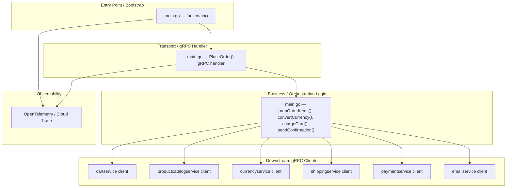
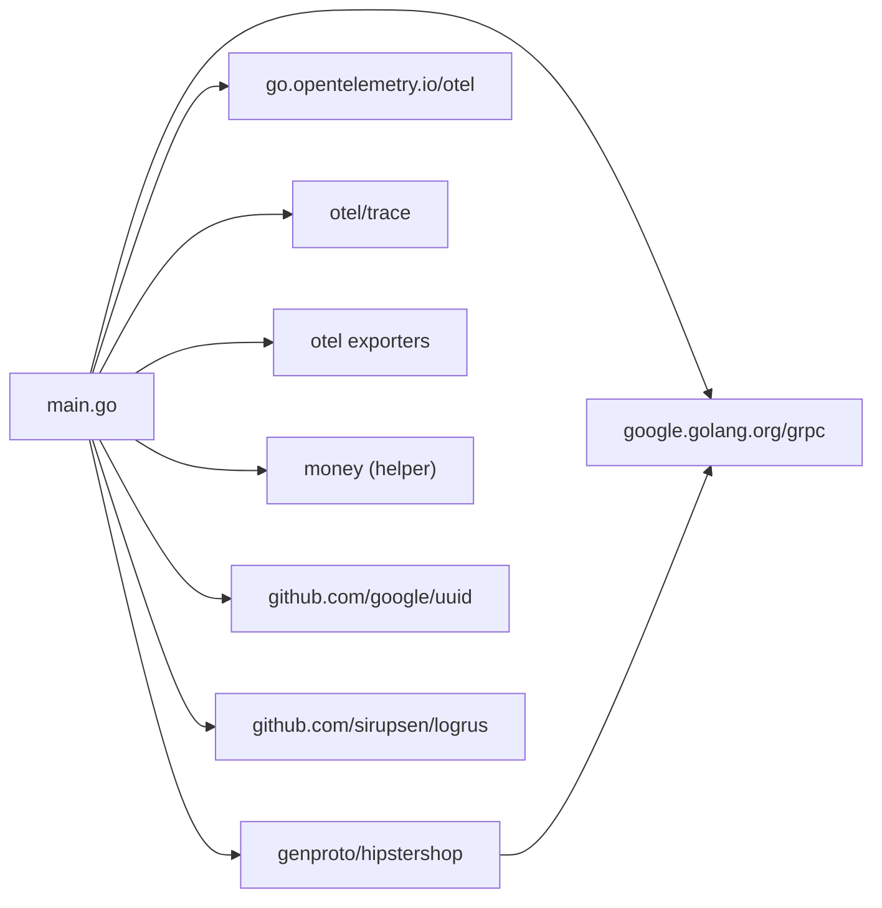

<!-- generated: 2026-04-13T05:16:25.810Z | model: claude-opus-4-6 | sha: c9857ee5 -->

# Architecture — checkoutservice

## TL;DR for Agents

- **Monolithic single-package gRPC service** written in Go — no layered/hexagonal separation; all logic resides in `package main` within a single directory.
- **Entry point is `main.go`** which bootstraps the gRPC server, initializes tracing, and registers the `CheckoutService` handler.
- **Key modules**: `main.go` (server bootstrap + gRPC handler implementations), plus downstream gRPC client calls to `cartservice`, `productcatalogservice`, `currencyservice`, `shippingservice`, `paymentservice`, and `emailservice`.
- **No circular dependencies detected** — the service is a flat, single-package Go application with no internal import cycles.
- **For code changes**, start at `main.go` — all transport, business logic, and downstream client orchestration live in that single file.

## Layer Architecture

Because `checkoutservice` is a single-package Go microservice, the "layers" are logical sections within the same file rather than separate packages. The diagram below represents the logical flow:

## Module Dependency Graph

Since the service is a single Go file orchestrating calls to six downstream services, the dependency graph reflects **external gRPC stubs** (generated protobuf packages) rather than internal modules:

> **No architectural violations detected.** All dependency arrows flow in one direction — from the application entry point outward to libraries and generated code. There are no reverse or circular imports.

## Layer Descriptions

| Layer | Directories / Files | Responsibility | May Import From |
|---|---|---|---|
| **Entry Point / Bootstrap** | `main.go` — `func main()` | Parse env vars, init tracing, create gRPC server, register handler, listen on port | All layers below |
| **Transport (gRPC Handler)** | `main.go` — `PlaceOrder()` | Accept inbound gRPC request, validate input, delegate to orchestration helpers, return `OrderResult` | Orchestration, Observability |
| **Business / Orchestration** | `main.go` — `prepOrderItems()`, `convertCurrency()`, `chargeCard()`, `sendConfirmation()`, `shipOrder()` | Coordinate calls across downstream services, aggregate results, compute totals | Downstream clients, `money` helper, Observability |
| **Downstream gRPC Clients** | Generated stubs in `genproto/hipstershop` | Typed client interfaces for cart, catalog, currency, shipping, payment, email services | `google.golang.org/grpc` |
| **Observability** | OpenTelemetry SDK + exporters | Distributed tracing spans for each downstream call and the overall checkout flow | External OTel libraries |

## Circular Dependencies

**No circular dependencies detected.**

The service consists of a single Go package (`package main`) with no internal sub-packages. All imports point outward to third-party libraries and generated protobuf code, making import cycles structurally impossible.

## Key Design Patterns

### Orchestrator / Saga-like Coordination

The `checkoutservice` implements the **Orchestrator pattern**: a single service that drives a multi-step business transaction by calling downstream services in sequence. The `PlaceOrder` handler coordinates six distinct steps — fetching the cart, looking up product details, converting currency, calculating shipping, charging the card, shipping the order, sending a confirmation email, and finally emptying the cart. This is a simplified form of the Saga pattern where failure at any step causes the entire request to return an error (no compensating transactions are implemented; idempotency is expected from downstream services).

### Service Mesh / gRPC Client Factory

Each downstream dependency is accessed through a **gRPC client connection** established at startup via helper functions (e.g., `mustConnGrpc`). Connection addresses are read from environment variables, making the service fully configurable for different deployment topologies (Kubernetes service DNS, service mesh sidecars, etc.). This pattern keeps client creation centralized and avoids scattering connection logic across handler methods.

### Context Propagation for Distributed Tracing

Every downstream gRPC call receives the incoming `context.Context`, which carries **OpenTelemetry trace spans**. The service creates child spans for each orchestration step (`prepOrderItems`, `chargeCard`, etc.), enabling end-to-end distributed tracing across the entire checkout flow. The gRPC interceptors (`otelgrpc` stats handler) automatically inject and extract trace context on both the server and client sides.

### Flat Package / Simplicity-First Design

Rather than introducing abstractions like interfaces, repositories, or dependency injection containers, the service opts for **Go's idiomatic simplicity**: a single `main.go` file with plain functions. For a service whose sole responsibility is orchestration (no local state, no database), this avoids over-engineering. The trade-off is reduced testability — mocking downstream services requires integration-level tests or refactoring to accept interfaces — but for a reference/demo application this is an intentional design choice.

## See Also

- [microservices-demo repository](https://github.com/GoogleCloudPlatform/microservices-demo) — root repository with all services and deployment manifests
- [src/checkoutservice/main.go](https://github.com/GoogleCloudPlatform/microservices-demo/blob/main/src/checkoutservice/main.go) — the single source file for this service
- [proto definitions (hipstershop.proto)](https://github.com/GoogleCloudPlatform/microservices-demo/blob/main/protos/demo.proto) — gRPC service and message definitions shared across all services
- [Kubernetes manifests](https://github.com/GoogleCloudPlatform/microservices-demo/tree/main/kubernetes-manifests) — deployment configuration showing how `checkoutservice` connects to downstream services