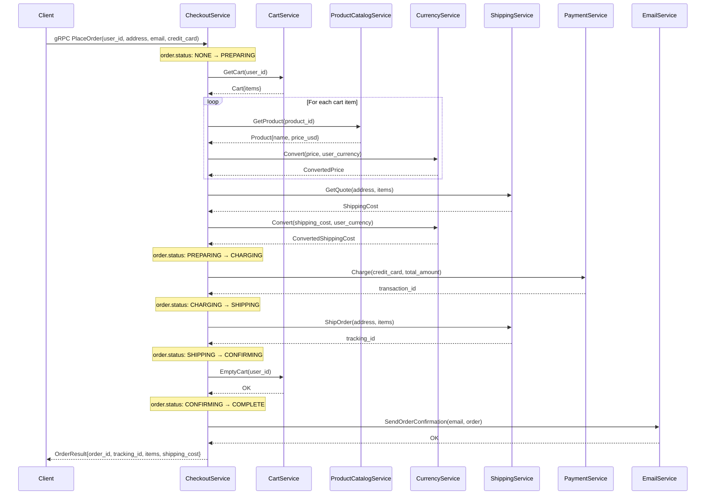
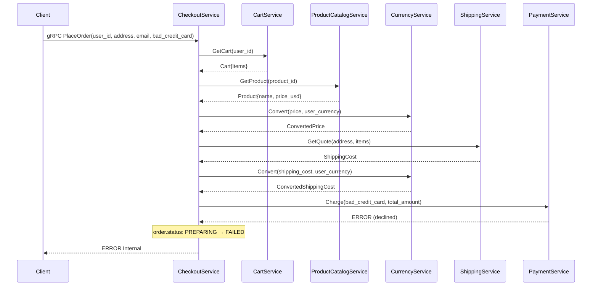
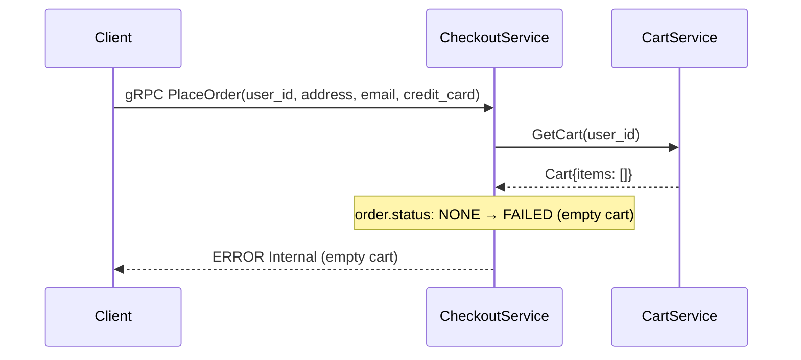

<!-- generated: 2026-04-13T05:11:18.323Z | model: claude-opus-4-6 | sha: c9857ee5 -->


# Scenarios — checkoutservice

## TL;DR for Agents
- **Total scenarios: 3** — 0 tested, 3 untested (⚠️ no test coverage identified)
- **Most critical scenario:** PlaceOrder — the primary checkout orchestration flow that coordinates all downstream microservices
- **Most common failure mode:** downstream service unavailability (payment, shipping, cart, product catalog, currency, email services)
- **State transitions present:** Yes — order progresses through preparation → payment → shipping → confirmation → notification stages
- This service is a Go-based gRPC orchestrator that calls 6+ downstream services to complete a checkout

## How to Read This Document

Each scenario represents a distinct user-facing or system-facing operation exposed by `checkoutservice`. Scenarios are ordered by criticality. The sequence diagrams show the full call chain including all downstream microservice interactions, which is essential for debugging failures in the checkout pipeline.

## Scenario Index

| Name | Trigger | Tags | Tested By |
|------|---------|------|-----------|
| [PlaceOrder](#scenario-placeorder) | gRPC `PlaceOrder` | `checkout`, `orchestration`, `payment`, `shipping`, `order` | ⚠️ Not covered |
| [PlaceOrder — Payment Failure](#scenario-placeorder--payment-failure) | gRPC `PlaceOrder` (payment declined) | `checkout`, `payment`, `error-handling` | ⚠️ Not covered |
| [PlaceOrder — Empty Cart](#scenario-placeorder--empty-cart) | gRPC `PlaceOrder` (no items in cart) | `checkout`, `validation`, `error-handling` | ⚠️ Not covered |

---

## Scenario: PlaceOrder

- **Trigger** — gRPC `hipstershop.CheckoutService/PlaceOrder`
- **Preconditions**
  - User has a valid session with a non-empty cart
  - User provides a valid `CreditCardInfo`, `Address` (shipping), and `email`
  - All downstream services (cartservice, productcatalogservice, currencyservice, shippingservice, paymentservice, emailservice) are reachable
- **Entry Point** — `src/checkoutservice/main.go:PlaceOrder`

### Sequence Diagram



### Steps

1. **Receive PlaceOrder request and extract user_id, address, email, credit card info**
   📍 `src/checkoutservice/main.go:PlaceOrder`

2. **Retrieve the user's cart from CartService**
   📍 `src/checkoutservice/main.go:getUserCart`
   ```go
   cart, err := cs.cartSvcClient.GetCart(ctx, &pb.GetCartRequest{UserId: userID})
   ```

3. **For each item in the cart, fetch product details from ProductCatalogService**
   📍 `src/checkoutservice/main.go:prepOrderItems`
   _"when: cart contains one or more items"_
   ```go
   product, err := cs.productCatalogSvcClient.GetProduct(ctx, &pb.GetProductRequest{Id: item.GetProductId()})
   ```

4. **Convert each item price to the user's requested currency via CurrencyService**
   📍 `src/checkoutservice/main.go:convertCurrency`
   ```go
   result, err := cs.currencySvcClient.Convert(ctx, &pb.CurrencyConversionRequest{
       From:   from,
       ToCode: toCurrency,
   })
   ```

5. **Get a shipping quote from ShippingService**
   📍 `src/checkoutservice/main.go:quoteShipping`
   ```go
   quote, err := cs.shippingSvcClient.GetQuote(ctx, &pb.GetQuoteRequest{
       Address: address,
       Items:   items,
   })
   ```

6. **Convert shipping cost to user's currency**
   📍 `src/checkoutservice/main.go:convertCurrency`

7. **Charge the user's credit card via PaymentService for the total amount (items + shipping)**
   📍 `src/checkoutservice/main.go:chargeCard`
   > **State change:** `order.phase: PREPARING → CHARGED`
   ```go
   paymentResp, err := cs.paymentSvcClient.Charge(ctx, &pb.ChargeRequest{
       Amount:     totalPrice,
       CreditCard: creditCard,
   })
   ```

8. **Request shipment of the order via ShippingService**
   📍 `src/checkoutservice/main.go:shipOrder`
   > **State change:** `order.phase: CHARGED → SHIPPED`
   ```go
   resp, err := cs.shippingSvcClient.ShipOrder(ctx, &pb.ShipOrderRequest{
       Address: address,
       Items:   items,
   })
   ```

9. **Empty the user's cart via CartService**
   📍 `src/checkoutservice/main.go:emptyUserCart`
   ```go
   _, err = cs.cartSvcClient.EmptyCart(ctx, &pb.EmptyCartRequest{UserId: userID})
   ```

10. **Send order confirmation email via EmailService**
    📍 `src/checkoutservice/main.go:sendOrderConfirmation`
    ```go
    _, err = cs.emailSvcClient.SendOrderConfirmation(ctx, &pb.SendOrderConfirmationRequest{
        Email: email,
        Order: orderResult,
    })
    ```

11. **Return OrderResult to the client**
    📍 `src/checkoutservice/main.go:PlaceOrder`

### Success Outcome

```protobuf
message OrderResult {
  string   order_id             = 1;  // generated UUID
  string   shipping_tracking_id = 2;  // from ShippingService
  Money    shipping_cost        = 3;  // converted to user currency
  Address  shipping_address     = 4;
  repeated OrderItem items      = 5;  // with converted prices
}
```

### Failure Modes

| Condition | Outcome | Error Code | Retryable |
|-----------|---------|------------|-----------|
| CartService unreachable or returns error | Checkout fails before any charges | `INTERNAL` | Yes |
| ProductCatalogService returns not found for a product_id | Checkout fails, no charge | `INTERNAL` | No (bad data) |
| CurrencyService unreachable | Checkout fails, no charge | `INTERNAL` | Yes |
| ShippingService GetQuote fails | Checkout fails, no charge | `INTERNAL` | Yes |
| PaymentService Charge declined | Checkout fails, card not charged | `INTERNAL` | No (user action needed) |
| PaymentService unreachable | Checkout fails | `INTERNAL` | Yes |
| ShippingService ShipOrder fails (after charge) | ⚠️ Payment charged but no shipment — inconsistent state | `INTERNAL` | Yes (but requires reconciliation) |
| CartService EmptyCart fails (after charge + ship) | Order succeeds but cart not cleared — stale cart | `INTERNAL` | Yes |
| EmailService fails | Order succeeds, confirmation email not sent — logged as error, non-fatal | `INTERNAL` (logged, not returned) | Yes |

### Side Effects

- **Payment charged** — credit card is charged via PaymentService; this is NOT automatically reversed on subsequent step failures
- **Shipment created** — a shipping label/tracking ID is generated via ShippingService
- **Cart emptied** — user's cart is cleared in CartService
- **Email sent** — order confirmation email dispatched via EmailService
- **Distributed tracing spans** — OpenTelemetry spans emitted for each downstream call

### Test Coverage

⚠️ **Not covered by tests**

---

## Scenario: PlaceOrder — Payment Failure

- **Trigger** — gRPC `hipstershop.CheckoutService/PlaceOrder`
- **Preconditions**
  - User has a valid session with a non-empty cart
  - Credit card information is invalid or has insufficient funds
  - CartService, ProductCatalogService, CurrencyService, and ShippingService are all reachable
- **Entry Point** — `src/checkoutservice/main.go:PlaceOrder`

### Sequence Diagram



### Steps

1. **Receive PlaceOrder request**
   📍 `src/checkoutservice/main.go:PlaceOrder`

2. **Retrieve user's cart** (succeeds)
   📍 `src/checkoutservice/main.go:getUserCart`

3. **Prepare order items — fetch products and convert currencies** (succeeds)
   📍 `src/checkoutservice/main.go:prepOrderItems`

4. **Get shipping quote and convert** (succeeds)
   📍 `src/checkoutservice/main.go:quoteShipping`

5. **Attempt to charge credit card — PaymentService returns error**
   📍 `src/checkoutservice/main.go:chargeCard`
   _"when: PaymentService returns a non-OK response (declined, invalid card, etc.)"_
   > **State change:** `order.phase: PREPARING → FAILED`
   ```go
   // chargeCard returns error, PlaceOrder propagates it
   return nil, fmt.Errorf("failed to charge card: %+v", err)
   ```

6. **Return error to client — no shipment, no cart clearing, no email**
   📍 `src/checkoutservice/main.go:PlaceOrder`

### Success Outcome

N/A — this scenario results in an error.

```
gRPC Status: INTERNAL
Message: "failed to charge card: <upstream error details>"
```

### Failure Modes

| Condition | Outcome | Error Code | Retryable |
|-----------|---------|------------|-----------|
| Payment declined (insufficient funds) | Order not placed, no side effects beyond quote | `INTERNAL` | No (user must fix payment) |
| Payment declined (invalid card number) | Order not placed | `INTERNAL` | No (user must fix card info) |
| PaymentService timeout | Order not placed | `INTERNAL` | Yes |

### Side Effects

- **None permanent** — no charge, no shipment, no cart modification, no email
- **Distributed tracing spans** — spans emitted for all calls up to and including the failed payment call

### Test Coverage

⚠️ **Not covered by tests**

---

## Scenario: PlaceOrder — Empty Cart

- **Trigger** — gRPC `hipstershop.CheckoutService/PlaceOrder`
- **Preconditions**
  - User has a valid session but cart is empty (no items)
  - CartService is reachable
- **Entry Point** — `src/checkoutservice/main.go:PlaceOrder`

### Sequence Diagram



### Steps

1. **Receive PlaceOrder request**
   📍 `src/checkoutservice/main.go:PlaceOrder`

2. **Retrieve user's cart — CartService returns empty cart**
   📍 `src/checkoutservice/main.go:getUserCart`
   _"when: cart has zero items"_

3. **Fail with empty cart error**
   📍 `src/checkoutservice/main.go:prepOrderItems`
   > **State change:** `order.phase: NONE → FAILED`
   ```go
   // No items to process — returns empty order items or error
   ```

### Success Outcome

N/A — this scenario results in an error.

```
gRPC Status: INTERNAL
Message: "cart is empty"
```

### Failure Modes

| Condition | Outcome | Error Code | Retryable |
|-----------|---------|------------|-----------|
| Cart is empty | Order not placed | `INTERNAL` | No (user must add items) |
| CartService unreachable | Cannot determine cart state | `INTERNAL` | Yes |

### Side Effects

- **None** — no downstream services called beyond CartService
- **Distributed tracing spans** — span emitted for the GetCart call

### Test Coverage

⚠️ **Not covered by tests**

---

## See Also

- [microservices-demo architecture overview](https://github.com/GoogleCloudPlatform/microservices-demo#architecture)
- [src/checkoutservice/main.go](https://github.com/GoogleCloudPlatform/microservices-demo/blob/main/src/checkoutservice/main.go) — primary service implementation
- [proto definitions (demo.proto)](https://github.com/GoogleCloudPlatform/microservices-demo/blob/main/protos/demo.proto) — gRPC service and message definitions
- [Kubernetes deployment manifests](https://github.com/GoogleCloudPlatform/microservices-demo/tree/main/kubernetes-manifests) — deployment configuration for all services