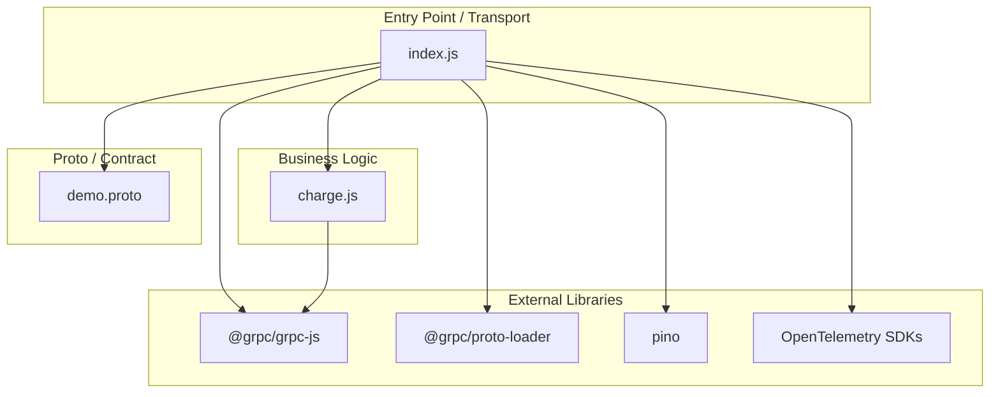
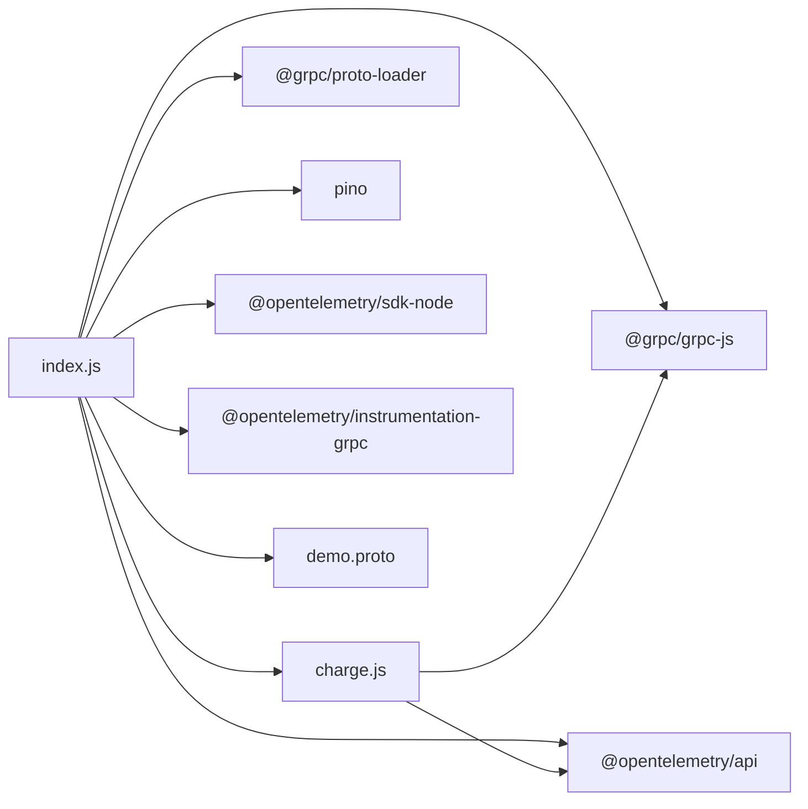

<!-- generated: 2026-04-13T05:19:54.063Z | model: claude-opus-4-6 | sha: c9857ee5 -->

# Architecture — paymentservice

## TL;DR for Agents

- **Simple single-layer architecture**: `paymentservice` is a minimal JavaScript gRPC API service with essentially a flat structure — no deep layering, no ORM, no database.
- **Entry point**: `index.js` (or equivalent main file) bootstraps a gRPC server exposing payment charge functionality.
- **Key module**: `charge.js` contains the core business logic for credit card validation and payment processing (stubbed/demo).
- **No circular dependencies detected** — the service is too small and flat to have cycles.
- **Framework**: Uses `@grpc/grpc-js` and `@grpc/proto-loader` for gRPC transport; no web framework (Express, Fastify, etc.).

## Layer Architecture

## Module Dependency Graph

> **Note:** The module graph data provided was `undefined`, so this graph is reconstructed from the known source files in `src/paymentservice/` in the [microservices-demo](https://github.com/GoogleCloudPlatform/microservices-demo/tree/main/src/paymentservice) repository. No dependency violations or unexpected cross-layer imports were identified.

## Layer Descriptions

| Layer | Directories / Files | Responsibility | May Import From |
|---|---|---|---|
| **Entry Point / Transport** | `index.js` | Bootstraps gRPC server, loads proto definition, registers `Charge` RPC handler, initializes OpenTelemetry tracing and Pino logger. | Business Logic, Proto, External Libraries |
| **Business Logic** | `charge.js` | Validates credit card numbers (Luhn check), simulates a payment charge, returns a transaction ID. | External Libraries (gRPC status codes, OTel spans) |
| **Proto / Contract** | `demo.proto` (shared) | Defines the `PaymentService` gRPC interface (`Charge` RPC), request/response message types (`ChargeRequest`, `ChargeResponse`, `Money`, `CreditCardInfo`). | — (consumed, not an importer) |
| **External Libraries** | `node_modules/` | gRPC runtime, proto loading, observability (OpenTelemetry), structured logging (Pino). | — |

## Circular Dependencies

No circular dependencies detected.

The service consists of only two application-level modules (`index.js` and `charge.js`) with a single unidirectional dependency (`index → charge`). The architecture is too flat and minimal to introduce cycles.

## Key Design Patterns

### Single-Responsibility RPC Handler

The service cleanly separates transport bootstrapping from business logic. `index.js` is responsible exclusively for server lifecycle concerns — loading the proto definition, binding the gRPC service, configuring telemetry, and starting the listener. The actual payment logic is delegated entirely to `charge.js`, which exports a function consumed as the RPC handler. This makes the charge logic independently testable without standing up a gRPC server.

### Stub / Demo Payment Processing

Rather than integrating with a real payment gateway, `charge.js` implements a **stub pattern**: it validates the credit card number using a Luhn-style check and returns a deterministic (or UUID-based) transaction ID. This is a deliberate design choice for a demo application, but the module boundary is drawn such that swapping in a real payment provider (Stripe, Braintree, etc.) would only require changes inside `charge.js` — the transport layer remains untouched.

### OpenTelemetry Instrumentation at the Edge

Tracing is initialized at the entry point (`index.js`) using the OpenTelemetry SDK with gRPC auto-instrumentation. This follows the **instrumentation-at-the-boundary** pattern: the gRPC plugin automatically creates spans for incoming and outgoing RPCs, while `charge.js` can enrich spans via the `@opentelemetry/api` context. No manual span creation is scattered across business logic, keeping observability concerns centralized.

### Proto-First Contract

The service depends on a shared `demo.proto` file that defines the `PaymentService` interface. This enforces a **contract-first** design where the API shape is defined declaratively and shared across all language implementations in the microservices-demo monorepo. The proto is loaded dynamically at runtime via `@grpc/proto-loader` rather than using static code generation, which simplifies the build process at the cost of losing compile-time type safety.

## See Also

- [microservices-demo `src/paymentservice/`](https://github.com/GoogleCloudPlatform/microservices-demo/tree/main/src/paymentservice) — source code for this service
- [microservices-demo architecture overview](https://github.com/GoogleCloudPlatform/microservices-demo#architecture) — full system topology and service interactions
- [Proto definition (`demo.proto`)](https://github.com/GoogleCloudPlatform/microservices-demo/blob/main/protos/demo.proto) — shared gRPC contract for all services
- [OpenTelemetry JS documentation](https://opentelemetry.io/docs/languages/js/) — tracing SDK used by this service