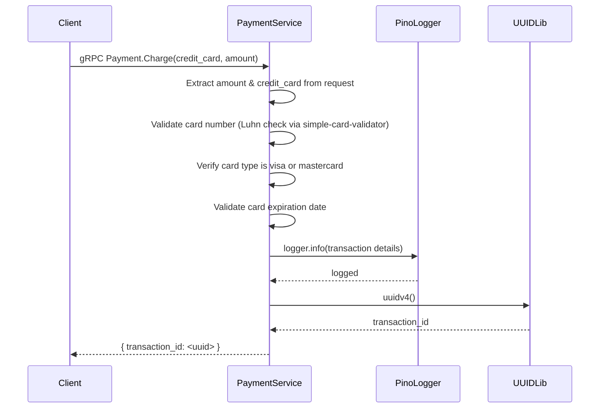
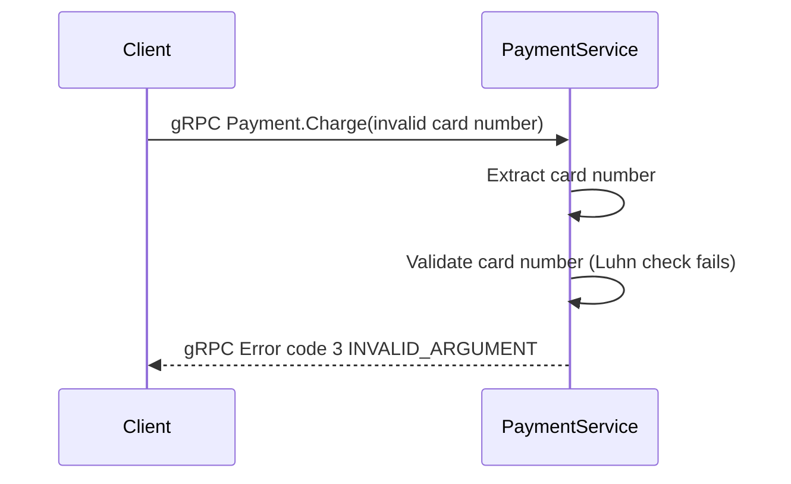
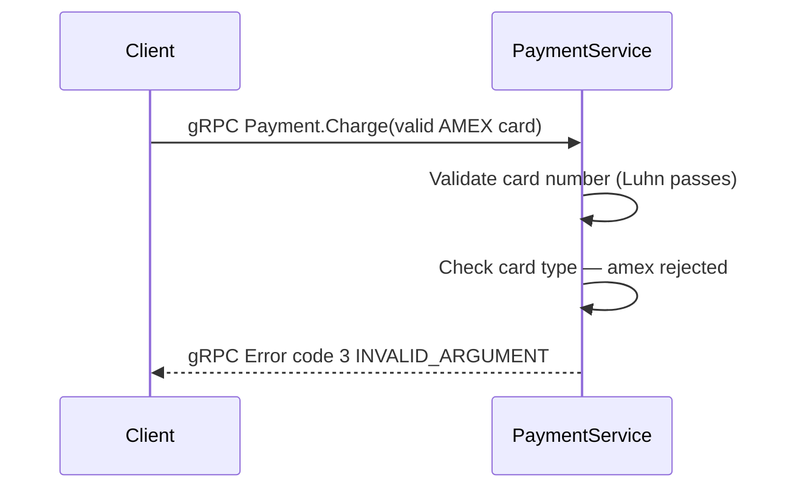
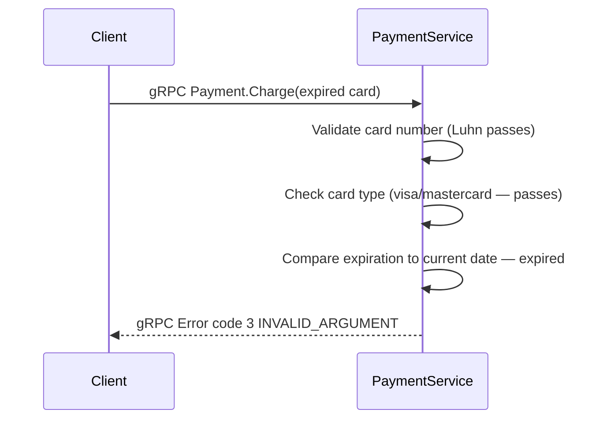
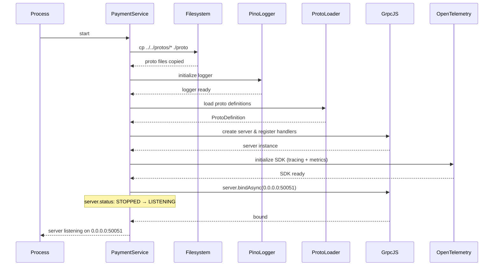
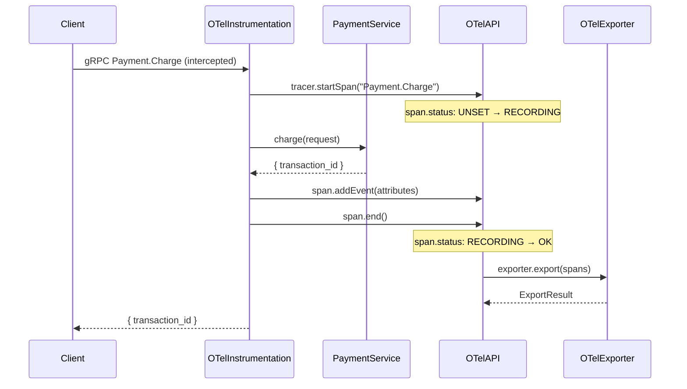
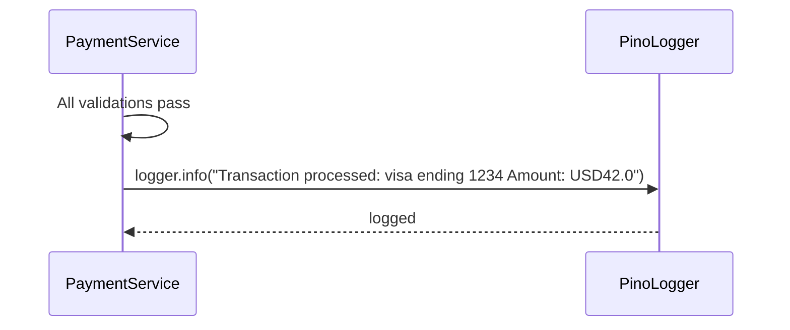

<!-- generated: 2026-04-13T05:15:20.912Z | model: claude-opus-4-6 | sha: c9857ee5 -->

# Scenarios — paymentservice

## TL;DR for Agents

- **7 total scenarios; 0 tested, 7 untested** — no scenario has any `testedBy` reference
- **Most critical scenario:** "Happy Path — Charge Credit Card" — the core `Payment.Charge` gRPC endpoint that processes payments
- **Most common failure mode:** gRPC code `3` (`INVALID_ARGUMENT`) — returned by all three validation failures (invalid card number, unsupported card type, expired card); none are retryable
- **No persistent state transitions** — the service is stateless; the only state change is during server startup (`STOPPED → LISTENING`) and OpenTelemetry span lifecycle (`UNSET → RECORDING → OK/ERROR`)
- All payment validation logic lives in a single function: `src/paymentservice/charge.js:charge`

## How to Read This Document

Each scenario describes one distinct execution path through the `paymentservice`, starting from a trigger (gRPC call or process start) through to its outcome. Scenarios are ordered: happy path first, then failure paths, then infrastructure concerns (startup, observability, logging). Use the **Scenario Index** table to jump directly to the scenario relevant to your investigation.

## Scenario Index

| Name | Trigger | Tags | Tested By |
|------|---------|------|-----------|
| [Happy Path — Charge Credit Card](#scenario-happy-path--charge-credit-card) | gRPC `Payment.Charge` with valid card and amount | `happy-path`, `grpc-endpoint`, `payment-processing`, `synchronous` | ⚠️ Untested |
| [Failure — Invalid Credit Card Number](#scenario-failure--invalid-credit-card-number) | gRPC `Payment.Charge` with non-Luhn-valid card number | `failure-path`, `grpc-endpoint`, `validation-failure` | ⚠️ Untested |
| [Failure — Unsupported Card Type (AMEX)](#scenario-failure--unsupported-card-type-amex) | gRPC `Payment.Charge` with valid AMEX card number | `failure-path`, `grpc-endpoint`, `validation-failure`, `card-type-rejection` | ⚠️ Untested |
| [Failure — Expired Credit Card](#scenario-failure--expired-credit-card) | gRPC `Payment.Charge` with expired card | `failure-path`, `grpc-endpoint`, `validation-failure`, `expiration-check` | ⚠️ Untested |
| [Service Initialization — gRPC Server Startup](#scenario-service-initialization--grpc-server-startup) | Service process starts | `initialization`, `startup`, `grpc-server`, `observability` | ⚠️ Untested |
| [Observability — OpenTelemetry Tracing on Charge Request](#scenario-observability--opentelemetry-tracing-on-charge-request) | gRPC `Payment.Charge` with OTel instrumentation enabled | `observability`, `tracing`, `opentelemetry`, `grpc-instrumentation` | ⚠️ Untested |
| [Logging — Transaction Success Log Entry](#scenario-logging--transaction-success-log-entry) | Successful `charge()` execution | `logging`, `observability`, `success-path` | ⚠️ Untested |

---

## Scenario: Happy Path — Charge Credit Card

**Trigger:** gRPC call to `Payment.Charge` with valid credit card and amount

**Preconditions:**
- Request contains valid `credit_card` object with `credit_card_number`, `credit_card_expiration_month`, `credit_card_expiration_year`
- Request contains `amount` object with `currency_code`, `units`, `nanos`
- Credit card number passes Luhn validation
- Card type is VISA or MasterCard
- Card expiration date is in the future (month/year >= current month/year)

**Entry Point:** `src/paymentservice/charge.js:charge`

### Sequence Diagram



### Steps

1. **Extract amount and credit_card from gRPC request**
   📍 `src/paymentservice/charge.js:charge` — `charge(request): { transaction_id: string }`
   ```javascript
   const { amount, credit_card: creditCard } = request;
   const cardNumber = creditCard.credit_card_number;
   ```

2. **Validate credit card number using simple-card-validator library**
   📍 `src/paymentservice/charge.js:charge` — `charge(request): { transaction_id: string }`
   ```javascript
   const cardInfo = cardValidator(cardNumber);
   const { card_type: cardType, valid } = cardInfo.getCardDetails();
   if (!valid) { throw new InvalidCreditCard(); }
   ```

3. **Verify card type is VISA or MasterCard; reject AMEX, Diners Club, etc.**
   📍 `src/paymentservice/charge.js:charge` — `charge(request): { transaction_id: string }`
   _When: `!(cardType === 'visa' || cardType === 'mastercard')`_
   ```javascript
   if (!(cardType === 'visa' || cardType === 'mastercard')) { throw new UnacceptedCreditCard(cardType); }
   ```

4. **Validate card expiration date is not in the past**
   📍 `src/paymentservice/charge.js:charge` — `charge(request): { transaction_id: string }`
   _When: `(currentYear * 12 + currentMonth) > (year * 12 + month)`_
   ```javascript
   const currentMonth = new Date().getMonth() + 1;
   const currentYear = new Date().getFullYear();
   const { credit_card_expiration_year: year, credit_card_expiration_month: month } = creditCard;
   if ((currentYear * 12 + currentMonth) > (year * 12 + month)) { throw new ExpiredCreditCard(cardNumber.replace('-', ''), month, year); }
   ```

5. **Log successful transaction with card type, last 4 digits, and amount**
   📍 `src/paymentservice/charge.js:charge` — `charge(request): { transaction_id: string }`
   ```javascript
   logger.info(`Transaction processed: ${cardType} ending ${cardNumber.substr(-4)} Amount: ${amount.currency_code}${amount.units}.${amount.nanos}`);
   ```

6. **Generate and return unique transaction ID**
   📍 `src/paymentservice/charge.js:charge` — `charge(request): { transaction_id: string }`
   ```javascript
   return { transaction_id: uuidv4() };
   ```

### Success Outcome

```json
{
  "transaction_id": "a]f47ac10b-58cc-4372-a567-0e02b2c3d479"
}
```

### Failure Modes

| Condition | Outcome | Error Code | Retryable |
|-----------|---------|------------|-----------|
| Credit card number fails Luhn validation | gRPC returns code 3 (`INVALID_ARGUMENT`) with message `Credit card info is invalid` | `InvalidCreditCard` | No |
| Card type is not VISA or MasterCard (e.g., AMEX, Diners Club) | gRPC returns code 3 (`INVALID_ARGUMENT`) with message `Sorry, we cannot process {cardType} credit cards. Only VISA or MasterCard is accepted.` | `UnacceptedCreditCard` | No |
| Card expiration date is in the past | gRPC returns code 3 (`INVALID_ARGUMENT`) with message `Your credit card (ending {last4}) expired on {month}/{year}` | `ExpiredCreditCard` | No |
| Request missing required fields (credit_card, amount, or nested fields) | gRPC proto validation fails; returns code 3 (`INVALID_ARGUMENT`) | `INVALID_ARGUMENT` | No |

### Side Effects

- Log entry written with transaction details (card type, last 4 digits, currency, amount)

### Test Coverage

⚠️ **Not covered by tests**

---

## Scenario: Failure — Invalid Credit Card Number

**Trigger:** gRPC call to `Payment.Charge` with invalid (non-Luhn-valid) card number

**Preconditions:**
- Request contains `credit_card` with `credit_card_number` that fails Luhn validation
- Request contains valid `amount` object

**Entry Point:** `src/paymentservice/charge.js:charge`

### Sequence Diagram



### Steps

1. **Extract credit card number from request**
   📍 `src/paymentservice/charge.js:charge` — `charge(request): { transaction_id: string }`
   ```javascript
   const cardNumber = creditCard.credit_card_number;
   ```

2. **Validate card number with cardValidator; Luhn check fails**
   📍 `src/paymentservice/charge.js:charge` — `charge(request): { transaction_id: string }`
   _When: `!valid`_
   ```javascript
   const cardInfo = cardValidator(cardNumber);
   const { card_type: cardType, valid } = cardInfo.getCardDetails();
   if (!valid) { throw new InvalidCreditCard(); }
   ```

### Success Outcome

```
gRPC Error {
  code: 3 (INVALID_ARGUMENT),
  message: "Credit card info is invalid"
}
```

### Failure Modes

| Condition | Outcome | Error Code | Retryable |
|-----------|---------|------------|-----------|
| Card number fails Luhn validation | `InvalidCreditCard` exception thrown; gRPC returns `INVALID_ARGUMENT` | `InvalidCreditCard` | No |

### Side Effects

- None

### Test Coverage

⚠️ **Not covered by tests**

---

## Scenario: Failure — Unsupported Card Type (AMEX)

**Trigger:** gRPC call to `Payment.Charge` with valid AMEX card number

**Preconditions:**
- Request contains `credit_card` with valid AMEX card number (passes Luhn validation)
- `card_type` resolves to `'amex'`
- Card is not expired

**Entry Point:** `src/paymentservice/charge.js:charge`

### Sequence Diagram



### Steps

1. **Extract and validate card number**
   📍 `src/paymentservice/charge.js:charge` — `charge(request): { transaction_id: string }`
   ```javascript
   const cardInfo = cardValidator(cardNumber);
   const { card_type: cardType, valid } = cardInfo.getCardDetails();
   if (!valid) { throw new InvalidCreditCard(); }
   ```

2. **Check if card type is VISA or MasterCard; AMEX is rejected**
   📍 `src/paymentservice/charge.js:charge` — `charge(request): { transaction_id: string }`
   _When: `cardType === 'amex'`_
   ```javascript
   if (!(cardType === 'visa' || cardType === 'mastercard')) { throw new UnacceptedCreditCard(cardType); }
   ```

### Success Outcome

```
gRPC Error {
  code: 3 (INVALID_ARGUMENT),
  message: "Sorry, we cannot process amex credit cards. Only VISA or MasterCard is accepted."
}
```

### Failure Modes

| Condition | Outcome | Error Code | Retryable |
|-----------|---------|------------|-----------|
| Card type is `'amex'` (or any type other than visa/mastercard) | `UnacceptedCreditCard` exception thrown; gRPC returns `INVALID_ARGUMENT` | `UnacceptedCreditCard` | No |

### Side Effects

- None

### Test Coverage

⚠️ **Not covered by tests**

---

## Scenario: Failure — Expired Credit Card

**Trigger:** gRPC call to `Payment.Charge` with expired credit card

**Preconditions:**
- Request contains `credit_card` with valid card number (passes Luhn validation)
- `card_type` is VISA or MasterCard
- `credit_card_expiration_month` and `credit_card_expiration_year` are in the past relative to current date

**Entry Point:** `src/paymentservice/charge.js:charge`

### Sequence Diagram



### Steps

1. **Extract and validate card number and type**
   📍 `src/paymentservice/charge.js:charge` — `charge(request): { transaction_id: string }`
   ```javascript
   const cardInfo = cardValidator(cardNumber);
   const { card_type: cardType, valid } = cardInfo.getCardDetails();
   if (!valid) { throw new InvalidCreditCard(); }
   if (!(cardType === 'visa' || cardType === 'mastercard')) { throw new UnacceptedCreditCard(cardType); }
   ```

2. **Get current month and year; compare with card expiration**
   📍 `src/paymentservice/charge.js:charge` — `charge(request): { transaction_id: string }`
   _When: `(currentYear * 12 + currentMonth) > (year * 12 + month)`_
   ```javascript
   const currentMonth = new Date().getMonth() + 1;
   const currentYear = new Date().getFullYear();
   const { credit_card_expiration_year: year, credit_card_expiration_month: month } = creditCard;
   if ((currentYear * 12 + currentMonth) > (year * 12 + month)) { throw new ExpiredCreditCard(cardNumber.replace('-', ''), month, year); }
   ```

### Success Outcome

```
gRPC Error {
  code: 3 (INVALID_ARGUMENT),
  message: "Your credit card (ending 1234) expired on 3/2023"
}
```

### Failure Modes

| Condition | Outcome | Error Code | Retryable |
|-----------|---------|------------|-----------|
| Card expiration date is in the past | `ExpiredCreditCard` exception thrown; gRPC returns `INVALID_ARGUMENT` with expiration details | `ExpiredCreditCard` | No |

### Side Effects

- None

### Test Coverage

⚠️ **Not covered by tests**

---

## Scenario: Service Initialization — gRPC Server Startup

**Trigger:** Service process starts; gRPC server initialization

**Preconditions:**
- Node.js process is running
- Proto files are available in `../../protos` directory (copied by `genproto.sh`)
- gRPC dependencies (`@grpc/grpc-js`, `@grpc/proto-loader`) are installed
- OpenTelemetry SDK is configured

**Entry Point:** `src/paymentservice/server.js`

### Sequence Diagram



### Steps

1. **Copy proto files from `../../protos` to `./proto` directory**
   📍 `src/paymentservice/genproto.sh:genproto` — `genproto.sh (bash script)`
   ```bash
   mkdir -p proto
   cp -r ../../protos/* ./proto
   ```

2. **Initialize pino logger with structured format**
   📍 `src/paymentservice/logger.js:module.exports` — `logger = pino({ name, messageKey, formatters })`
   ```javascript
   module.exports = pino({
     name: 'paymentservice-server',
     messageKey: 'message',
     formatters: { level (logLevelString, logLevelNum) { return { severity: logLevelString } } }
   });
   ```

3. **Load and parse proto definitions using @grpc/proto-loader**
   📍 `src/paymentservice/server.js` (inferred) — `loadProtoFile(protoPath): ProtoDefinition`

4. **Create gRPC server instance and register Payment service handlers**
   📍 `src/paymentservice/server.js` (inferred) — `createServer(): grpc.Server`

5. **Initialize OpenTelemetry SDK for tracing and metrics**
   📍 `src/paymentservice/server.js` (inferred) — `initializeOpenTelemetry(): void`

6. **Bind gRPC server to port (default 50051) and start listening**
   📍 `src/paymentservice/server.js` (inferred) — `server.bindAsync(address, credentials, callback): void`
   > **State change:** `server.status: STOPPED → LISTENING`

### Success Outcome

```
gRPC server listening on 0.0.0.0:50051
Payment.Charge RPC endpoint ready
OpenTelemetry tracing active
```

### Failure Modes

| Condition | Outcome | Error Code | Retryable |
|-----------|---------|------------|-----------|
| Proto files not found in `../../protos` | `genproto.sh` fails; `cp` command returns non-zero exit code | `PROTO_COPY_FAILED` | Yes |
| Port 50051 already in use | `server.bindAsync` fails; gRPC server does not start | `EADDRINUSE` | Yes |
| OpenTelemetry exporter endpoint unreachable (e.g., OTLP collector down) | Exporter initialization fails; server may still start but telemetry not exported | `TELEMETRY_EXPORT_FAILED` | Yes |
| Invalid proto definition syntax | `proto-loader` fails to parse; server startup fails | `PROTO_PARSE_ERROR` | No |

### Side Effects

- Proto files copied to `./proto`
- Logger initialized
- gRPC server bound to port
- OpenTelemetry exporters configured

### Test Coverage

⚠️ **Not covered by tests**

---

## Scenario: Observability — OpenTelemetry Tracing on Charge Request

**Trigger:** gRPC call to `Payment.Charge` with OpenTelemetry instrumentation enabled

**Preconditions:**
- OpenTelemetry SDK is initialized
- `@opentelemetry/instrumentation-grpc` is active
- OTEL exporter is configured (gRPC, HTTP, or Prometheus)
- gRPC call is made to `Payment.Charge`

**Entry Point:** `src/paymentservice/charge.js:charge` (with `@opentelemetry/instrumentation-grpc` wrapper)

### Sequence Diagram



### Steps

1. **OpenTelemetry gRPC instrumentation intercepts incoming RPC call**
   📍 `src/paymentservice/server.js` (inferred) — `grpcInstrumentation.onRequest(call, metadata): void`

2. **Create span for Payment.Charge RPC with attributes (rpc.service, rpc.method, rpc.system)**
   📍 `src/paymentservice/server.js` (inferred) — `tracer.startSpan(name, options): Span`
   > **State change:** `span.status: UNSET → RECORDING`

3. **Execute charge() function within span context**
   📍 `src/paymentservice/charge.js:charge` — `charge(request): { transaction_id: string }`

4. **Record span events and attributes (card_type, transaction_id, amount)**
   📍 `src/paymentservice/server.js` (inferred) — `span.addEvent(name, attributes): void`

5. **End span with status OK or ERROR**
   📍 `src/paymentservice/server.js` (inferred) — `span.end(): void`
   > **State change:** `span.status: RECORDING → OK or ERROR`

6. **Export span to configured exporter (gRPC, HTTP, Prometheus)**
   📍 `src/paymentservice/server.js` (inferred) — `exporter.export(spans): Promise<ExportResult>`

### Success Outcome

```
Span exported to OTLP collector
Trace visible in observability backend (Jaeger, Datadog, etc.)
Attributes: rpc.service=Payment, rpc.method=Charge, rpc.system=grpc
```

### Failure Modes

| Condition | Outcome | Error Code | Retryable |
|-----------|---------|------------|-----------|
| OTEL exporter endpoint unreachable | Span export fails; error logged; request still completes successfully | `TELEMETRY_EXPORT_FAILED` | Yes |
| Span buffer full (batch size exceeded) | Oldest spans dropped; warning logged | `SPAN_BUFFER_FULL` | No |

### Side Effects

- Span created and recorded
- Trace data exported to collector
- Metrics incremented (request count, latency histogram)

### Test Coverage

⚠️ **Not covered by tests**

---

## Scenario: Logging — Transaction Success Log Entry

**Trigger:** Successful `charge()` execution with valid card

**Preconditions:**
- All card validations pass
- Logger is initialized (pino)

**Entry Point:** `src/paymentservice/charge.js:charge`

### Sequence Diagram



### Steps

1. **All validation checks pass; transaction is approved**
   📍 `src/paymentservice/charge.js:charge` — `charge(request): { transaction_id: string }`
   _When: `valid && (cardType === 'visa' || cardType === 'mastercard') && !expired`_

2. **Log transaction details with pino logger at INFO level**
   📍 `src/paymentservice/charge.js:charge` — `charge(request): { transaction_id: string }`
   ```javascript
   logger.info(`Transaction processed: ${cardType} ending ${cardNumber.substr(-4)} Amount: ${amount.currency_code}${amount.units}.${amount.nanos}`);
   ```

### Success Outcome

```json
{
  "level": 30,
  "name": "paymentservice-server",
  "severity": "info",
  "message": "Transaction processed: visa ending 1234 Amount: USD42.0"
}
```

### Failure Modes

| Condition | Outcome | Error Code | Retryable |
|-----------|---------|------------|-----------|
| Logger sink is unavailable (e.g., file descriptor closed) | Log write fails; exception may be thrown or silently dropped depending on pino config | `LOG_WRITE_FAILED` | No |

### Side Effects

- Log entry written to stdout/configured sink

### Test Coverage

⚠️ **Not covered by tests**

---

## See Also

- [GoogleCloudPlatform/microservices-demo](https://github.com/GoogleCloudPlatform/microservices-demo) — parent repository with all microservices
- [`src/paymentservice/charge.js`](https://github.com/GoogleCloudPlatform/microservices-demo/blob/main/src/paymentservice/charge.js) — core charge logic with all validation
- [`src/paymentservice/server.js`](https://github.com/GoogleCloudPlatform/microservices-demo/blob/main/src/paymentservice/server.js) — gRPC server setup and handler registration
- [`src/paymentservice/logger.js`](https://github.com/GoogleCloudPlatform/microservices-demo/blob/main/src/paymentservice/logger.js) — pino logger configuration