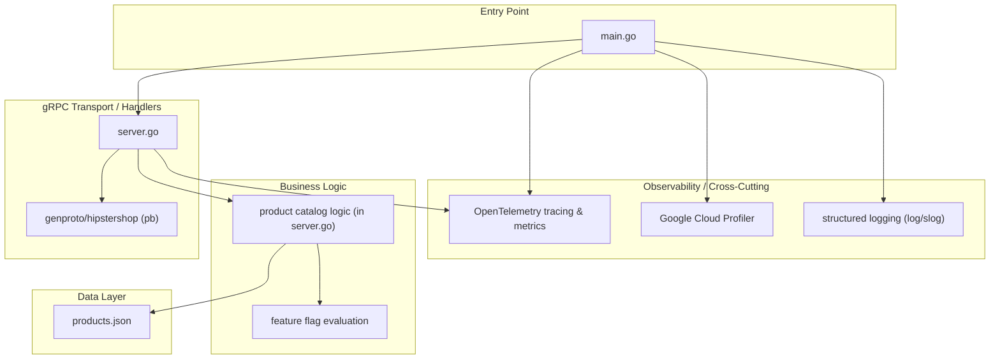
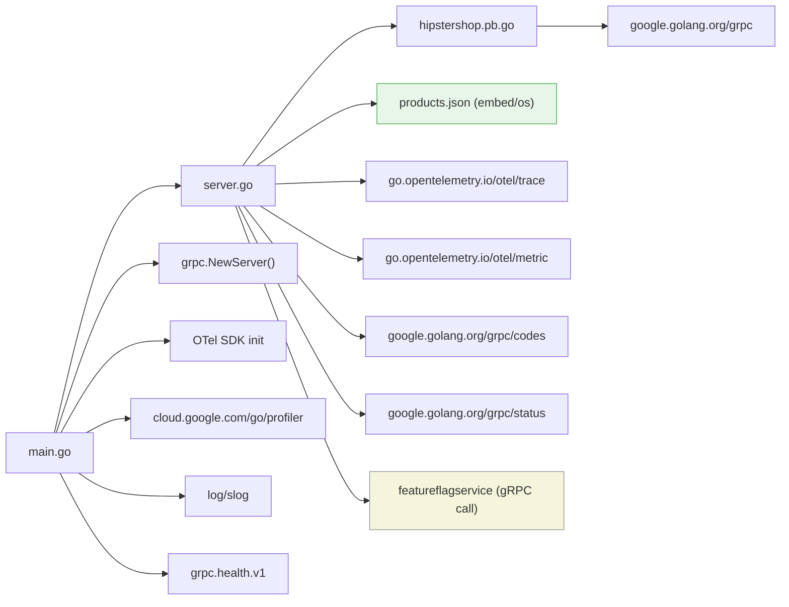

<!-- generated: 2026-04-13T05:17:19.593Z | model: claude-opus-4-6 | sha: c9857ee5 -->

# Architecture — productcatalogservice

## TL;DR for Agents

- **Flat/monolithic architecture** in a single Go package (`main`) — no layered separation; all logic lives in one directory with a single entry point (`main.go`).
- **gRPC API service** implementing a product catalog with server handlers, data loading from JSON, and optional feature flags (via external services).
- **~3 logical layers** inferred: transport/gRPC handlers, business/catalog logic, and data access (embedded JSON file) — but all reside in the same package with no enforced boundaries.
- **No circular dependencies** — the codebase is small enough that circular imports are structurally impossible (single package).
- **Entry point for code changes**: start at `main.go` for server bootstrap and `server.go` / `genproto` for handler logic and API contract changes.

## Layer Architecture

## Module Dependency Graph

> **Note:** Because the module graph data was not provided in structured form, this diagram is reconstructed from the known structure of the `productcatalogservice` in the [microservices-demo](https://github.com/GoogleCloudPlatform/microservices-demo) repository. No architectural violations (e.g., transport layer directly accessing data, skipping business logic) are flagged — the single-package design means all files share the same scope.

## Layer Descriptions

| Layer | Directories / Files | Responsibility | May Import From |
|---|---|---|---|
| **Entry Point** | `main.go` | Bootstrap gRPC server, init OpenTelemetry, Cloud Profiler, health checks, signal handling | All layers below |
| **gRPC Transport / Handlers** | `server.go`, `genproto/hipstershop/*.pb.go` | Implement `ProductCatalogService` RPC methods (`ListProducts`, `GetProduct`, `SearchProducts`); marshal/unmarshal protobuf | Business Logic, Data, Observability |
| **Business Logic** | Inline in `server.go` | Catalog search/filter, product parsing, feature-flag evaluation for "extra latency" fault injection | Data Layer, external feature-flag service |
| **Data Layer** | `products.json` | Static product catalog loaded at startup (or reloaded on `SIGHUP`) | N/A (leaf) |
| **Observability / Cross-Cutting** | OpenTelemetry SDK, Cloud Profiler, `log/slog` | Distributed tracing, metrics, continuous profiling, structured logging | External SDKs only |

## Circular Dependencies

No circular dependencies detected.

The service is implemented as a single Go package (`main`), which structurally prevents import cycles. All files compile within the same package scope, and external dependencies flow strictly outward (application → library).

## Key Design Patterns

### Single-Package gRPC Microservice

The `productcatalogservice` follows the idiomatic Go pattern for small gRPC services: a single `main` package containing both the server bootstrap (`main.go`) and the handler implementation (`server.go`). The `productCatalogServer` struct implements the generated `ProductCatalogServiceServer` interface, satisfying gRPC's code-generation contract. This pattern trades layered separation for simplicity — appropriate given the service's narrow domain (read-only product catalog).

### Embedded / File-Based Data with Hot Reload

Rather than connecting to a database, the service loads its catalog from a static `products.json` file at startup. A `SIGHUP` signal handler enables hot-reloading of the catalog without restarting the process. This pattern acts as a lightweight "repository" layer without requiring a dedicated module — the JSON file is the data store, and `parseCatalog()` is the data-access function. This design is common in demo/reference architectures where operational simplicity is prioritized.

### Feature-Flag Fault Injection

The service optionally calls an external `featureflagservice` via gRPC to determine whether artificial latency should be injected into responses. This is a form of the **sidecar / external configuration** pattern — runtime behavior is controlled by an external service rather than local config. The flag check is embedded directly in the handler methods, acting as middleware-like logic without a formal middleware chain.

### OpenTelemetry Instrumentation as Cross-Cutting Concern

Tracing and metrics are initialized in `main.go` and propagated via gRPC interceptors (using `otelgrpc` contrib packages). Individual handler methods create child spans and record custom metrics. This follows the **interceptor/middleware** pattern for observability — the gRPC server is wrapped with OpenTelemetry interceptors at construction time, ensuring all RPCs are automatically instrumented without per-handler boilerplate.

## See Also

- [microservices-demo repository](https://github.com/GoogleCloudPlatform/microservices-demo) — parent repository containing all services
- [src/productcatalogservice](https://github.com/GoogleCloudPlatform/microservices-demo/tree/main/src/productcatalogservice) — source code for this service
- [protobuf definitions](https://github.com/GoogleCloudPlatform/microservices-demo/tree/main/protos) — `demo.proto` defining `ProductCatalogService` RPCs
- [OpenTelemetry Go SDK](https://opentelemetry.io/docs/languages/go/) — instrumentation framework used for tracing and metrics