<!-- generated: 2026-04-13T05:12:43.239Z | model: claude-opus-4-6 | sha: c9857ee5 -->

# Scenarios — productcatalogservice

## TL;DR for Agents

- **12 total scenarios**: 5 tested, 7 untested — significant gaps in startup/initialization and health check coverage
- **Most critical scenario**: "Startup — Load Catalog from AlloyDB" — involves Secret Manager, AlloyDB connector, pgx pool, and has 7 distinct failure modes
- **Most common failure mode**: catalog loading failures (missing `products.json`, invalid JSON, empty catalog) propagate silently as empty results across all gRPC endpoints
- **No persistent state transitions** — all data is read-only from either `products.json` or AlloyDB into an in-memory cache; the only mutable state is the `reloadCatalog` flag and `catalog.Products` slice
- **Catalog source is determined by a single env var**: `ALLOYDB_CLUSTER_NAME` — if set, AlloyDB path is used; otherwise, local `products.json` file is read

## How to Read This Document

Each scenario documents one discrete execution path through the `productcatalogservice`, from trigger to outcome. Scenarios are ordered: startup/initialization first, then gRPC endpoints (happy paths, then failure paths), then infrastructure (health checks, caching). Use the Scenario Index table to jump directly to the scenario relevant to your investigation.

## Scenario Index

| Name | Trigger | Tags | Tested By |
|------|---------|------|-----------|
| [Startup — Load Catalog from Local File](#scenario-startup--load-catalog-from-local-file) | Service init; `ALLOYDB_CLUSTER_NAME` unset | `startup`, `initialization`, `local-file-source` | ⚠️ Not covered |
| [Startup — Load Catalog from AlloyDB](#scenario-startup--load-catalog-from-alloydb) | Service init; `ALLOYDB_CLUSTER_NAME` set | `startup`, `initialization`, `alloydb-source`, `secret-manager`, `database` | ⚠️ Not covered |
| [gRPC Endpoint — ListProducts (Happy Path)](#scenario-grpc-endpoint--listproducts-happy-path) | gRPC `ListProducts` with `Empty` request | `grpc-endpoint`, `happy-path`, `read-only`, `cached` | `TestListProducts` |
| [gRPC Endpoint — GetProduct (Happy Path)](#scenario-grpc-endpoint--getproduct-happy-path) | gRPC `GetProduct` with valid product ID | `grpc-endpoint`, `happy-path`, `read-only`, `cached`, `lookup` | `TestGetProductExists` |
| [Failure Path — GetProduct with non-existent ID](#scenario-failure-path--grpc-getproduct-with-non-existent-id) | gRPC `GetProduct` with invalid product ID | `failure-path`, `grpc`, `not-found`, `validation` | `TestGetProductNotFound` |
| [gRPC Endpoint — SearchProducts (Happy Path)](#scenario-grpc-endpoint--searchproducts-happy-path) | gRPC `SearchProducts` with query string | `grpc-endpoint`, `happy-path`, `read-only`, `cached`, `search` | `TestSearchProducts` |
| [Happy Path — SearchProducts with no matches](#scenario-happy-path--grpc-searchproducts-with-no-matches) | gRPC `SearchProducts` with non-matching query | `happy-path`, `grpc`, `search`, `empty-result` | `TestSearchProducts` |
| [Health Check — gRPC Check](#scenario-health-check--grpc-check-liveness-probe) | gRPC `/grpc.health.v1.Health/Check` | `health-check`, `grpc`, `liveness`, `infrastructure` | ⚠️ Not covered |
| [Health Check — gRPC Watch (Unimplemented)](#scenario-health-check--grpc-watch-streaming-health-check--unimplemented) | gRPC `/grpc.health.v1.Health/Watch` | `health-check`, `grpc`, `streaming`, `unimplemented` | ⚠️ Not covered |
| [Initialization — gRPC Server Registration](#scenario-initialization--grpc-server-registration-and-startup) | `main()` execution | `initialization`, `grpc`, `startup`, `infrastructure` | ⚠️ Not covered |
| [Catalog Loading — Initial Load from JSON File](#scenario-catalog-loading--initial-load-from-json-file) | First gRPC call when catalog empty | `initialization`, `file-io`, `caching`, `data-loading` | ⚠️ Not covered |
| [Catalog Caching — Subsequent Requests](#scenario-catalog-caching--subsequent-requests-use-in-memory-cache) | Subsequent gRPC calls after initial load | `caching`, `performance`, `read-only` | ⚠️ Not covered |

---

## Scenario: Startup — Load Catalog from Local File

**Trigger** — Service initialization; `ALLOYDB_CLUSTER_NAME` environment variable not set

**Preconditions**
- `ALLOYDB_CLUSTER_NAME` environment variable is empty or unset
- `products.json` file exists in service working directory
- `products.json` contains valid JSON matching `ListProductsResponse` protobuf schema

**Entry Point** — `src/productcatalogservice/catalog_loader.go:loadCatalog`

### Sequence Diagram

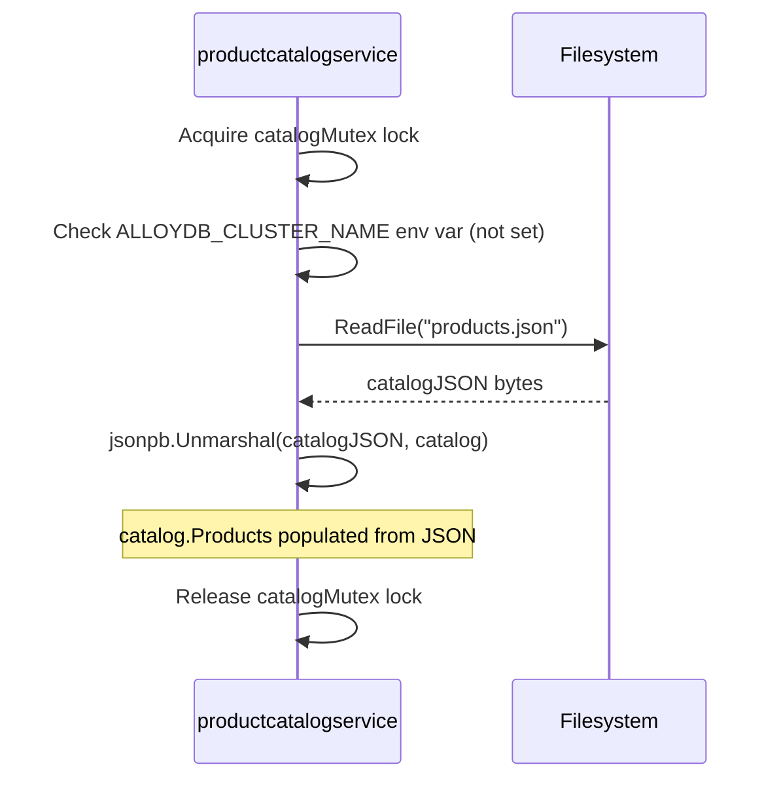

### Steps

1. **Acquire catalogMutex lock to ensure thread-safe catalog loading**
   📍 `src/productcatalogservice/catalog_loader.go:loadCatalog` — `loadCatalog(catalog *pb.ListProductsResponse) error`
   ```go
   catalogMutex.Lock()
   defer catalogMutex.Unlock()
   ```

2. **Check if ALLOYDB_CLUSTER_NAME environment variable is set; route to AlloyDB or local file loader**
   📍 `src/productcatalogservice/catalog_loader.go:loadCatalog` — `loadCatalog(catalog *pb.ListProductsResponse) error`
   _when: `if os.Getenv("ALLOYDB_CLUSTER_NAME") != ""`_
   ```go
   if os.Getenv("ALLOYDB_CLUSTER_NAME") != "" {
     return loadCatalogFromAlloyDB(catalog)
   }
   return loadCatalogFromLocalFile(catalog)
   ```

3. **Read products.json file from disk**
   📍 `src/productcatalogservice/catalog_loader.go:loadCatalogFromLocalFile` — `loadCatalogFromLocalFile(catalog *pb.ListProductsResponse) error`
   ```go
   catalogJSON, err := os.ReadFile("products.json")
   if err != nil {
     log.Warnf("failed to open product catalog json file: %v", err)
     return err
   }
   ```

4. **Unmarshal JSON into ListProductsResponse protobuf message**
   📍 `src/productcatalogservice/catalog_loader.go:loadCatalogFromLocalFile` — `loadCatalogFromLocalFile(catalog *pb.ListProductsResponse) error`
   ```go
   if err := jsonpb.Unmarshal(bytes.NewReader(catalogJSON), catalog); err != nil {
     log.Warnf("failed to parse the catalog JSON: %v", err)
     return err
   }
   ```
   > **State change:** `catalog.Products: empty → populated with products from JSON`

### Success Outcome

```
Catalog loaded into memory; service ready to serve ListProducts, GetProduct, SearchProducts gRPC calls
```

### Failure Modes

| Condition | Outcome | Error Code | Retryable |
|-----------|---------|------------|-----------|
| `products.json` file does not exist or is not readable | Returns error; service fails to start or serves empty catalog | `ERR_FILE_NOT_FOUND` | No |
| `products.json` contains invalid JSON or does not match protobuf schema | Returns error from `jsonpb.Unmarshal`; service fails to start | `ERR_INVALID_JSON` | No |

### Side Effects

- In-memory catalog populated with Product messages
- `catalogMutex` released

### Test Coverage

⚠️ **Not covered by tests**

---

## Scenario: Startup — Load Catalog from AlloyDB

**Trigger** — Service initialization; `ALLOYDB_CLUSTER_NAME` environment variable is set

**Preconditions**
- `ALLOYDB_CLUSTER_NAME` environment variable is set and non-empty
- `PROJECT_ID`, `REGION`, `ALLOYDB_INSTANCE_NAME`, `ALLOYDB_DATABASE_NAME`, `ALLOYDB_TABLE_NAME`, `ALLOYDB_SECRET_NAME` environment variables are all set
- Google Cloud Secret Manager contains the database password at `projects/{PROJECT_ID}/secrets/{ALLOYDB_SECRET_NAME}/versions/latest`
- AlloyDB cluster and instance are accessible and running
- Database table exists with columns: `id`, `name`, `description`, `picture`, `price_usd_currency_code`, `price_usd_units`, `price_usd_nanos`, `categories`

**Entry Point** — `src/productcatalogservice/catalog_loader.go:loadCatalog`

### Sequence Diagram

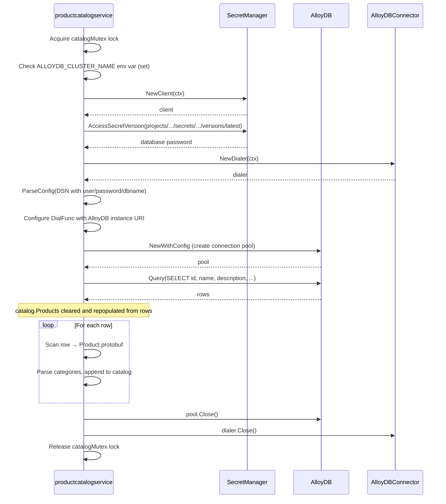

### Steps

1. **Acquire catalogMutex lock**
   📍 `src/productcatalogservice/catalog_loader.go:loadCatalog` — `loadCatalog(catalog *pb.ListProductsResponse) error`
   ```go
   catalogMutex.Lock()
   defer catalogMutex.Unlock()
   ```

2. **Route to AlloyDB loader based on ALLOYDB_CLUSTER_NAME environment variable**
   📍 `src/productcatalogservice/catalog_loader.go:loadCatalog` — `loadCatalog(catalog *pb.ListProductsResponse) error`
   _when: `if os.Getenv("ALLOYDB_CLUSTER_NAME") != ""`_
   ```go
   if os.Getenv("ALLOYDB_CLUSTER_NAME") != "" {
     return loadCatalogFromAlloyDB(catalog)
   }
   ```

3. **Read database password from Google Cloud Secret Manager**
   📍 `src/productcatalogservice/catalog_loader.go:getSecretPayload` — `getSecretPayload(project, secret, version string) (string, error)`
   ```go
   ctx := context.Background()
   client, err := secretmanager.NewClient(ctx)
   if err != nil {
     log.Warnf("failed to create SecretManager client: %v", err)
     return "", err
   }
   defer client.Close()
   req := &secretmanagerpb.AccessSecretVersionRequest{
     Name: fmt.Sprintf("projects/%s/secrets/%s/versions/%s", project, secret, version),
   }
   result, err := client.AccessSecretVersion(ctx, req)
   ```

4. **Create AlloyDB dialer for secure connection to database instance**
   📍 `src/productcatalogservice/catalog_loader.go:loadCatalogFromAlloyDB` — `loadCatalogFromAlloyDB(catalog *pb.ListProductsResponse) error`
   ```go
   dialer, err := alloydbconn.NewDialer(context.Background())
   if err != nil {
     log.Warnf("failed to set-up dialer connection: %v", err)
     return err
   }
   cleanup := func() error { return dialer.Close() }
   defer cleanup()
   ```

5. **Parse PostgreSQL DSN with username, password, and database name**
   📍 `src/productcatalogservice/catalog_loader.go:loadCatalogFromAlloyDB` — `loadCatalogFromAlloyDB(catalog *pb.ListProductsResponse) error`
   ```go
   dsn := fmt.Sprintf(
     "user=%s password=%s dbname=%s sslmode=disable",
     "postgres", pgPassword, pgDatabaseName,
   )
   config, err := pgxpool.ParseConfig(dsn)
   if err != nil {
     log.Warnf("failed to parse DSN config: %v", err)
     return err
   }
   ```

6. **Configure pgx connection pool with AlloyDB dialer for secure IAM-based authentication**
   📍 `src/productcatalogservice/catalog_loader.go:loadCatalogFromAlloyDB` — `loadCatalogFromAlloyDB(catalog *pb.ListProductsResponse) error`
   ```go
   pgInstanceURI := fmt.Sprintf("projects/%s/locations/%s/clusters/%s/instances/%s", projectID, region, pgClusterName, pgInstanceName)
   config.ConnConfig.DialFunc = func(ctx context.Context, _ string, _ string) (net.Conn, error) {
     return dialer.Dial(ctx, pgInstanceURI)
   }
   ```

7. **Create pgx connection pool to AlloyDB instance**
   📍 `src/productcatalogservice/catalog_loader.go:loadCatalogFromAlloyDB` — `loadCatalogFromAlloyDB(catalog *pb.ListProductsResponse) error`
   ```go
   pool, err := pgxpool.NewWithConfig(context.Background(), config)
   if err != nil {
     log.Warnf("failed to set-up pgx pool: %v", err)
     return err
   }
   defer pool.Close()
   ```

8. **Execute SELECT query to fetch all products from database table**
   📍 `src/productcatalogservice/catalog_loader.go:loadCatalogFromAlloyDB` — `loadCatalogFromAlloyDB(catalog *pb.ListProductsResponse) error`
   ```go
   query := "SELECT id, name, description, picture, price_usd_currency_code, price_usd_units, price_usd_nanos, categories FROM " + pgTableName
   rows, err := pool.Query(context.Background(), query)
   if err != nil {
     log.Warnf("failed to query database: %v", err)
     return err
   }
   defer rows.Close()
   ```

9. **Clear existing catalog and iterate through result rows**
   📍 `src/productcatalogservice/catalog_loader.go:loadCatalogFromAlloyDB` — `loadCatalogFromAlloyDB(catalog *pb.ListProductsResponse) error`
   ```go
   catalog.Products = catalog.Products[:0]
   for rows.Next() {
     product := &pb.Product{}
     product.PriceUsd = &pb.Money{}
     var categories string
     err = rows.Scan(&product.Id, &product.Name, &product.Description,
       &product.Picture, &product.PriceUsd.CurrencyCode, &product.PriceUsd.Units,
       &product.PriceUsd.Nanos, &categories)
   ```
   > **State change:** `catalog.Products: previous contents → cleared and repopulated`

10. **Parse categories string (comma-separated) and append product to catalog**
    📍 `src/productcatalogservice/catalog_loader.go:loadCatalogFromAlloyDB` — `loadCatalogFromAlloyDB(catalog *pb.ListProductsResponse) error`
    ```go
    categories = strings.ToLower(categories)
    product.Categories = strings.Split(categories, ",")
    catalog.Products = append(catalog.Products, product)
    ```
    > **State change:** `catalog.Products: N products → N+1 products`

### Success Outcome

```
Catalog loaded from AlloyDB into memory; all products available for gRPC queries; connection pool closed
```

### Failure Modes

| Condition | Outcome | Error Code | Retryable |
|-----------|---------|------------|-----------|
| Secret Manager client creation fails (authentication, permissions, network) | Returns error; service fails to start | `ERR_SECRET_MANAGER_INIT` | No |
| `AccessSecretVersion` call fails (secret not found, version not found, permission denied) | Returns error; service fails to start | `ERR_SECRET_ACCESS` | No |
| AlloyDB dialer creation fails (network, GCP SDK initialization) | Returns error; service fails to start | `ERR_DIALER_INIT` | No |
| DSN parsing fails (invalid format, missing fields) | Returns error; service fails to start | `ERR_DSN_PARSE` | No |
| pgx pool creation fails (connection refused, auth failure, network timeout) | Returns error; service fails to start | `ERR_POOL_INIT` | No |
| Database query fails (table not found, column mismatch, query timeout) | Returns error; service fails to start | `ERR_QUERY_FAILED` | No |
| Row scan fails (type mismatch, NULL in non-nullable field) | Returns error; catalog partially loaded or empty | `ERR_SCAN_FAILED` | No |

### Side Effects

- In-memory catalog populated with Product messages from database
- AlloyDB connection pool created and destroyed
- Secret Manager client created and destroyed
- AlloyDB dialer created and destroyed

### Test Coverage

⚠️ **Not covered by tests**

---

## Scenario: gRPC Endpoint — ListProducts (Happy Path)

**Trigger** — gRPC call to `ProductCatalogService.ListProducts` with `Empty` request

**Preconditions**
- Service has successfully loaded catalog (either from local file or AlloyDB)
- `catalog.Products` slice is populated with at least one Product
- gRPC server is listening and accepting connections

**Entry Point** — `src/productcatalogservice/product_catalog.go:ListProducts`

### Sequence Diagram

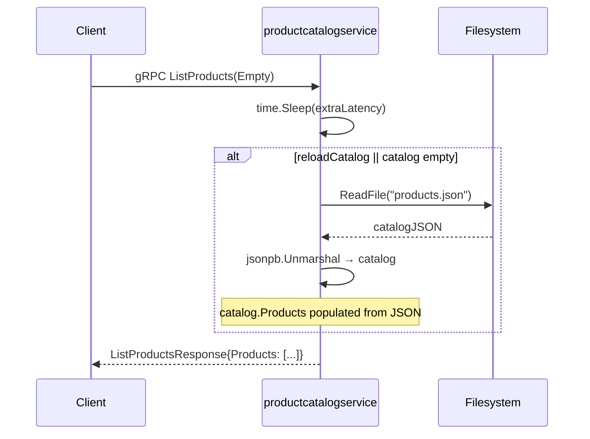

### Steps

1. **Sleep for extraLatency duration (simulated latency)**
   📍 `src/productcatalogservice/product_catalog.go:ListProducts` — `ListProducts(context.Context, *pb.Empty) (*pb.ListProductsResponse, error)`
   ```go
   time.Sleep(extraLatency)
   ```

2. **Parse catalog from in-memory cache or reload from JSON file**
   📍 `src/productcatalogservice/product_catalog.go:parseCatalog` — `parseCatalog() []*pb.Product`
   _when: `if reloadCatalog || len(p.catalog.Products) == 0`_
   ```go
   if reloadCatalog || len(p.catalog.Products) == 0 {
     err := loadCatalog(&p.catalog)
     if err != nil {
       return []*pb.Product{}
     }
   }
   return p.catalog.Products
   ```
   > **State change:** `p.catalog.Products: empty or stale → populated from JSON or cached`

3. **Return ListProductsResponse containing all products from in-memory catalog**
   📍 `src/productcatalogservice/product_catalog.go:ListProducts` — `ListProducts(context.Context, *pb.Empty) (*pb.ListProductsResponse, error)`
   ```go
   return &pb.ListProductsResponse{Products: p.parseCatalog()}, nil
   ```

### Success Outcome

```json
{
  "products": [
    {
      "id": "OLJCESPC7Z",
      "name": "Sunglasses",
      "description": "...",
      "picture": "/static/img/products/sunglasses.jpg",
      "priceUsd": { "currencyCode": "USD", "units": 19, "nanos": 990000000 },
      "categories": ["accessories"]
    }
  ]
}
```
gRPC status: `OK`

### Failure Modes

| Condition | Outcome | Error Code | Retryable |
|-----------|---------|------------|-----------|
| Catalog not yet loaded (service still initializing) | Returns empty `ListProductsResponse` or error | `UNAVAILABLE` | Yes |
| `products.json` file not found or unreadable | `parseCatalog` returns empty `[]*pb.Product{}`; empty response | `NONE` (graceful degradation) | No |
| `products.json` contains invalid JSON | `loadCatalog` fails; empty response | `NONE` (graceful degradation) | No |
| Context cancelled before response sent | gRPC returns Cancelled error | `CANCELLED` | Yes |

### Side Effects

- In-memory catalog read (no mutations)
- Catalog loaded into memory (if not already cached)
- `extraLatency` milliseconds added to response time

### Test Coverage

Tested by `src/productcatalogservice/product_catalog_test.go → TestListProducts`

---

## Scenario: gRPC Endpoint — GetProduct (Happy Path)

**Trigger** — gRPC call to `ProductCatalogService.GetProduct` with `GetProductRequest` containing a valid product ID

**Preconditions**
- Service has successfully loaded catalog
- Requested product ID exists in `catalog.Products`
- gRPC server is listening

**Entry Point** — `src/productcatalogservice/product_catalog.go:GetProduct`

### Sequence Diagram

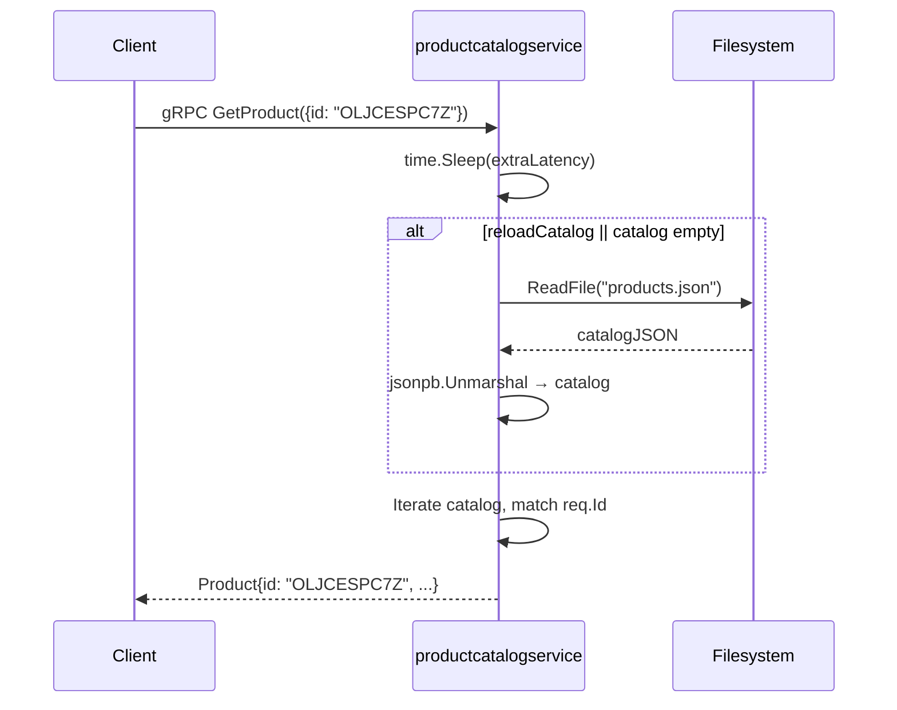

### Steps

1. **Sleep for extraLatency duration (simulated latency)**
   📍 `src/productcatalogservice/product_catalog.go:GetProduct` — `GetProduct(ctx context.Context, req *pb.GetProductRequest) (*pb.Product, error)`
   ```go
   time.Sleep(extraLatency)
   ```

2. **Parse catalog from cache or reload from JSON**
   📍 `src/productcatalogservice/product_catalog.go:parseCatalog` — `parseCatalog() []*pb.Product`
   _when: `if reloadCatalog || len(p.catalog.Products) == 0`_
   ```go
   catalog := p.parseCatalog()
   ```

3. **Iterate through catalog to find product matching req.Id**
   📍 `src/productcatalogservice/product_catalog.go:GetProduct` — `GetProduct(ctx context.Context, req *pb.GetProductRequest) (*pb.Product, error)`
   _when: `if req.Id == product.Id`_
   ```go
   for _, product := range catalog {
     if req.Id == product.Id {
       return product, nil
     }
   }
   ```

### Success Outcome

```json
{
  "id": "OLJCESPC7Z",
  "name": "Sunglasses",
  "description": "Add a modern touch to your outfits with these sleek aviator sunglasses.",
  "picture": "/static/img/products/sunglasses.jpg",
  "priceUsd": { "currencyCode": "USD", "units": 19, "nanos": 990000000 },
  "categories": ["accessories"]
}
```
gRPC status: `OK`

### Failure Modes

| Condition | Outcome | Error Code | Retryable |
|-----------|---------|------------|-----------|
| Product ID not found in catalog | Returns gRPC error: `no product with ID {id}` | `NOT_FOUND` | No |
| `products.json` file not found or unreadable | `parseCatalog` returns empty list; GetProduct returns NotFound | `NOT_FOUND` | No |
| Catalog not yet loaded | Returns error | `UNAVAILABLE` | Yes |
| Context cancelled before response sent | gRPC returns Cancelled error | `CANCELLED` | Yes |

### Side Effects

- In-memory catalog read (no mutations)
- Catalog loaded into memory (if not already cached)
- `extraLatency` milliseconds added to response time

### Test Coverage

Tested by `src/productcatalogservice/product_catalog_test.go → TestGetProductExists`

---

## Scenario: Failure Path — gRPC GetProduct with non-existent ID

**Trigger** — gRPC call to `/hipstershop.ProductCatalogService/GetProduct` with `GetProductRequest` containing a non-existent product ID (e.g., `'INVALID_ID'`)

**Preconditions**
- gRPC server is running and registered
- `products.json` file is accessible and valid
- Requested product ID does NOT exist in catalog

**Entry Point** — `src/productcatalogservice/product_catalog.go:GetProduct`

### Sequence Diagram

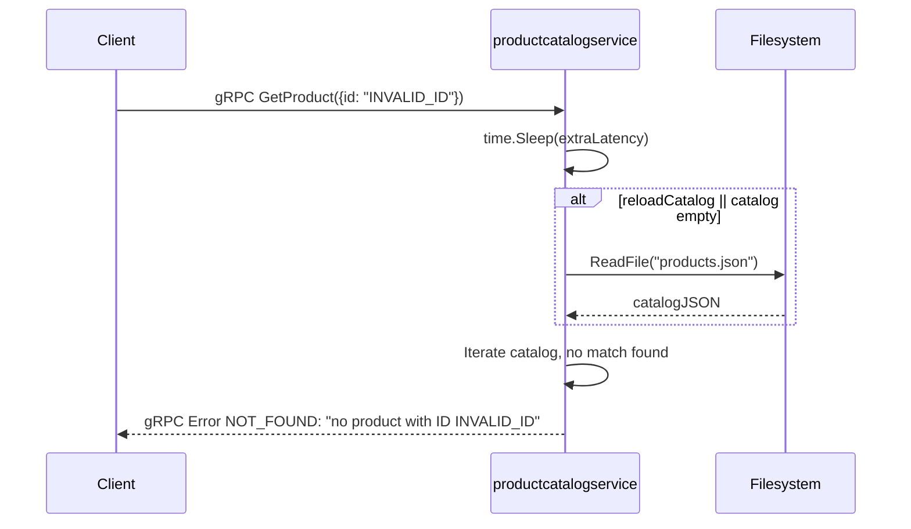

### Steps

1. **Sleep for extraLatency duration**
   📍 `src/productcatalogservice/product_catalog.go:GetProduct` — `GetProduct(ctx context.Context, req *pb.GetProductRequest) (*pb.Product, error)`
   ```go
   time.Sleep(extraLatency)
   ```

2. **Parse catalog from cache or reload from JSON**
   📍 `src/productcatalogservice/product_catalog.go:parseCatalog` — `parseCatalog() []*pb.Product`
   ```go
   catalog := p.parseCatalog()
   ```

3. **Iterate through catalog; no match found for req.Id**
   📍 `src/productcatalogservice/product_catalog.go:GetProduct` — `GetProduct(ctx context.Context, req *pb.GetProductRequest) (*pb.Product, error)`
   _when: `if req.Id == product.Id` (condition never true)_
   ```go
   for _, product := range catalog {
     if req.Id == product.Id {
       return product, nil
     }
   }
   return nil, status.Errorf(codes.NotFound, "no product with ID %s", req.Id)
   ```

### Success Outcome

```
gRPC error response:
  Code: NOT_FOUND (5)
  Message: "no product with ID INVALID_ID"
```

### Failure Modes

| Condition | Outcome | Error Code | Retryable |
|-----------|---------|------------|-----------|
| Product ID not found in catalog (expected failure) | Returns gRPC error with code NotFound (5) | `NOT_FOUND` | No |

### Side Effects

- Catalog loaded into memory (if not already cached)
- `extraLatency` milliseconds added to response time

### Test Coverage

Tested by `src/productcatalogservice/product_catalog_test.go → TestGetProductNotFound`

---

## Scenario: gRPC Endpoint — SearchProducts (Happy Path)

**Trigger** — gRPC call to `ProductCatalogService.SearchProducts` with `SearchProductsRequest` containing a query string

**Preconditions**
- Service has successfully loaded catalog
- Query string is non-empty
- gRPC server is listening

**Entry Point** — `src/productcatalogservice/product_catalog.go:SearchProducts`

### Sequence Diagram

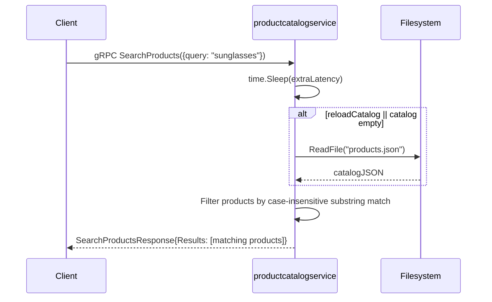

### Steps

1. **Sleep for extraLatency duration (simulated latency)**
   📍 `src/productcatalogservice/product_catalog.go:SearchProducts` — `SearchProducts(ctx context.Context, req *pb.SearchProductsRequest) (*pb.SearchProductsResponse, error)`
   ```go
   time.Sleep(extraLatency)
   ```

2. **Parse catalog from cache or reload from JSON**
   📍 `src/productcatalogservice/product_catalog.go:parseCatalog` — `parseCatalog() []*pb.Product`
   ```go
   for _, product := range p.parseCatalog()
   ```

3. **Filter products by case-insensitive substring match on name or description**
   📍 `src/productcatalogservice/product_catalog.go:SearchProducts` — `SearchProducts(ctx context.Context, req *pb.SearchProductsRequest) (*pb.SearchProductsResponse, error)`
   _when: `if strings.Contains(strings.ToLower(product.Name), strings.ToLower(req.Query)) || strings.Contains(strings.ToLower(product.Description), strings.ToLower(req.Query))`_
   ```go
   var ps []*pb.Product
   for _, product := range p.parseCatalog() {
     if strings.Contains(strings.ToLower(product.Name), strings.ToLower(req.Query)) ||
       strings.Contains(strings.ToLower(product.Description), strings.ToLower(req.Query)) {
       ps = append(ps, product)
     }
   }
   ```

4. **Return SearchProductsResponse with filtered results**
   📍 `src/productcatalogservice/product_catalog.go:SearchProducts` — `SearchProducts(ctx context.Context, req *pb.SearchProductsRequest) (*pb.SearchProductsResponse, error)`
   ```go
   return &pb.SearchProductsResponse{Results: ps}, nil
   ```

### Success Outcome

```json
{
  "results": [
    {
      "id": "OLJCESPC7Z",
      "name": "Sunglasses",
      "description": "Add a modern touch to your outfits with these sleek aviator sunglasses.",
      "picture": "/static/img/products/sunglasses.jpg",
      "priceUsd": { "currencyCode": "USD", "units": 19, "nanos": 990000000 },
      "categories": ["accessories"]
    }
  ]
}
```
gRPC status: `OK`

### Failure Modes

| Condition | Outcome | Error Code | Retryable |
|-----------|---------|------------|-----------|
| No products match query string | Returns `SearchProductsResponse` with empty `Results` array | `NONE` | No |
| `products.json` file not found or unreadable | `parseCatalog` returns empty list; empty Results | `NONE` | No |
| Catalog not yet loaded | Returns error | `UNAVAILABLE` | Yes |
| Context cancelled before response sent | gRPC returns Cancelled error | `CANCELLED` | Yes |

### Side Effects

- In-memory catalog read (no mutations)
- Catalog loaded into memory (if not already cached)
- `extraLatency` milliseconds added to response time

### Test Coverage

Tested by `src/productcatalogservice/product_catalog_test.go → TestSearchProducts`

---

## Scenario: Happy Path — gRPC SearchProducts with no matches

**Trigger** — gRPC call to `/hipstershop.ProductCatalogService/SearchProducts` with `SearchProductsRequest` containing a query string that matches no products

**Preconditions**
- gRPC server is running and registered
- `products.json` file is accessible and valid
- Query string does NOT match any product names or descriptions

**Entry Point** — `src/productcatalogservice/product_catalog.go:SearchProducts`

### Sequence Diagram

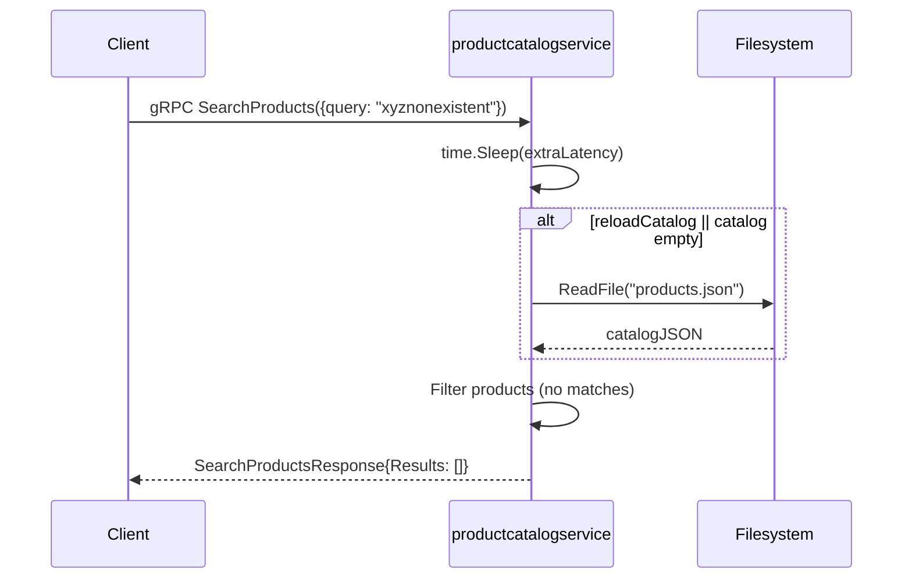

### Steps

1. **Sleep for extraLatency duration**
   📍 `src/productcatalogservice/product_catalog.go:SearchProducts` — `SearchProducts(ctx context.Context, req *pb.SearchProductsRequest) (*pb.SearchProductsResponse, error)`
   ```go
   time.Sleep(extraLatency)
   ```

2. **Parse catalog from cache or reload from JSON**
   📍 `src/productcatalogservice/product_catalog.go:parseCatalog` — `parseCatalog() []*pb.Product`
   ```go
   for _, product := range p.parseCatalog()
   ```

3. **Iterate through catalog; no products match query**
   📍 `src/productcatalogservice/product_catalog.go:SearchProducts` — `SearchProducts(ctx context.Context, req *pb.SearchProductsRequest) (*pb.SearchProductsResponse, error)`
   _when: `if strings.Contains(...)` (condition never true)_
   ```go
   var ps []*pb.Product
   for _, product := range p.parseCatalog() {
     if strings.Contains(strings.ToLower(product.Name), strings.ToLower(req.Query)) ||
       strings.Contains(strings.ToLower(product.Description), strings.ToLower(req.Query)) {
       ps = append(ps, product)
     }
   }
   ```

4. **Return SearchProductsResponse with empty Results array**
   📍 `src/productcatalogservice/product_catalog.go:SearchProducts` — `SearchProducts(ctx context.Context, req *pb.SearchProductsRequest) (*pb.SearchProductsResponse, error)`
   ```go
   return &pb.SearchProductsResponse{Results: ps}, nil
   ```

### Success Outcome

```json
{
  "results": []
}
```
gRPC status: `OK`

### Failure Modes

| Condition | Outcome | Error Code | Retryable |
|-----------|---------|------------|-----------|
| _(none — this is the expected empty-result path)_ | — | — | — |

### Side Effects

- Catalog loaded into memory (if not already cached)
- `extraLatency` milliseconds added to response time

### Test Coverage

Tested by `src/productcatalogservice/product_catalog_test.go → TestSearchProducts`

---

## Scenario: Health Check — gRPC Check (liveness probe)

**Trigger** — gRPC call to `/grpc.health.v1.Health/Check` with `HealthCheckRequest`

**Preconditions**
- gRPC server is running and registered
- Health check service is enabled

**Entry Point** — `src/productcatalogservice/product_catalog.go:Check`

### Sequence Diagram

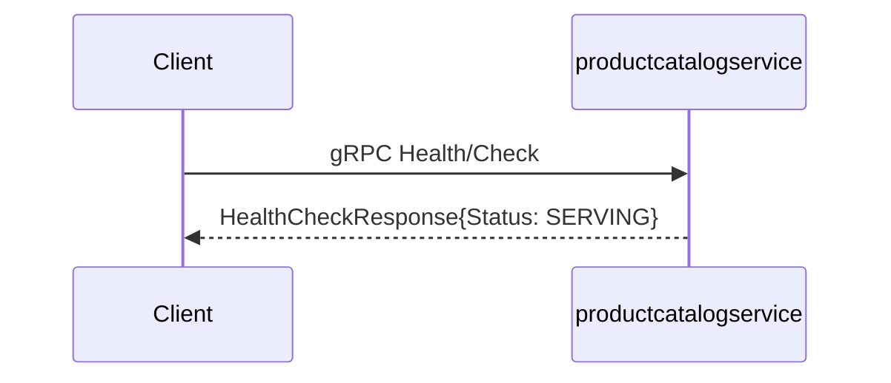

### Steps

1. **Return HealthCheckResponse with SERVING status**
   📍 `src/productcatalogservice/product_catalog.go:Check` — `Check(ctx context.Context, req *healthpb.HealthCheckRequest) (*healthpb.HealthCheckResponse, error)`
   ```go
   return &healthpb.HealthCheckResponse{Status: healthpb.HealthCheckResponse_SERVING}, nil
   ```

### Success Outcome

```
gRPC response:
  Code: OK (0)
  Body: HealthCheckResponse{Status: SERVING}
```

### Failure Modes

| Condition | Outcome | Error Code | Retryable |
|-----------|---------|------------|-----------|
| Context cancelled before response sent | gRPC returns Cancelled error | `CANCELLED` | Yes |

### Side Effects

_(none)_

### Test Coverage

⚠️ **Not covered by tests**

---

## Scenario: Health Check — gRPC Watch (streaming health check) — Unimplemented

**Trigger** — gRPC call to `/grpc.health.v1.Health/Watch` with `HealthCheckRequest`

**Preconditions**
- gRPC server is running and registered
- Health check service is enabled

**Entry Point** — `src/productcatalogservice/product_catalog.go:Watch`

### Sequence Diagram

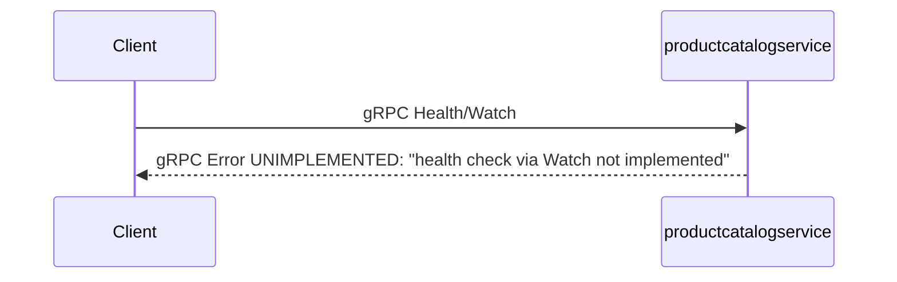

### Steps

1. **Return Unimplemented error**
   📍 `src/productcatalogservice/product_catalog.go:Watch` — `Watch(req *healthpb.HealthCheckRequest, ws healthpb.Health_WatchServer) error`
   ```go
   return status.Errorf(codes.Unimplemented, "health check via Watch not implemented")
   ```

### Success Outcome

```
gRPC error response:
  Code: UNIMPLEMENTED (12)
  Message: "health check via Watch not implemented"
```

### Failure Modes

| Condition | Outcome | Error Code | Retryable |
|-----------|---------|------------|-----------|
| Watch streaming RPC invoked (expected failure) | gRPC returns Unimplemented error (code 12) | `UNIMPLEMENTED` | No |

### Side Effects

_(none)_

### Test Coverage

⚠️ **Not covered by tests**

---

## Scenario: Initialization — gRPC Server Registration and Startup

**Trigger** — Service startup; `main()` function execution

**Preconditions**
- gRPC server instance created
- `ProductCatalogService` implementation available
- gRPC service descriptor available

**Entry Point** — `src/productcatalogservice/genproto/demo_grpc.pb.go:RegisterProductCatalogServiceServer`

### Sequence Diagram

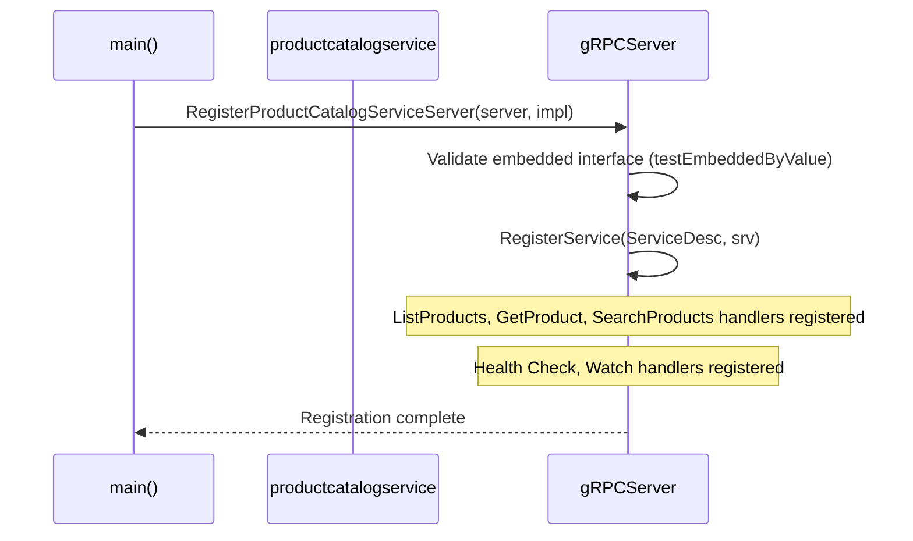

### Steps

1. **Register ProductCatalogService with gRPC server**
   📍 `src/productcatalogservice/genproto/demo_grpc.pb.go:RegisterProductCatalogServiceServer` — `RegisterProductCatalogServiceServer(s grpc.ServiceRegistrar, srv ProductCatalogServiceServer)`
   ```go
   if t, ok := srv.(interface{ testEmbeddedByValue() }); ok {
     t.testEmbeddedByValue()
   }
   s.RegisterService(&ProductCatalogService_ServiceDesc, srv)
   ```
   > **State change:** `gRPC server: no handlers → ProductCatalogService registered`

2. **Register health check service**
   📍 `src/productcatalogservice/genproto/demo_grpc.pb.go:RegisterProductCatalogServiceServer` — `RegisterProductCatalogServiceServer(s grpc.ServiceRegistrar, srv ProductCatalogServiceServer)`
   ```go
   s.RegisterService(&ProductCatalogService_ServiceDesc, srv)
   ```
   > **State change:** `gRPC server: Health check service registered`

### Success Outcome

```
ProductCatalogService and health check service registered with gRPC server; server ready to accept requests on configured port.
```

### Failure Modes

| Condition | Outcome | Error Code | Retryable |
|-----------|---------|------------|-----------|
| `ProductCatalogServiceServer` implementation not embedded by value (`testEmbeddedByValue` panics) | Panic at initialization time; server fails to start | `PANIC` | No |
| gRPC server registration fails (e.g., port already in use) | Server startup fails; service unavailable | `UNAVAILABLE` | No |

### Side Effects

- gRPC service descriptors registered
- Method handlers registered for `ListProducts`, `GetProduct`, `SearchProducts`
- Health check handlers registered for `Check` and `Watch`

### Test Coverage

⚠️ **Not covered by tests**

---

## Scenario: Catalog Loading — Initial Load from JSON File

**Trigger** — First call to `ListProducts`, `GetProduct`, or `SearchProducts`; `reloadCatalog` flag set or catalog empty

**Preconditions**
- `products.json` file exists and is readable
- `products.json` contains valid JSON with products array
- Catalog is empty or `reloadCatalog` flag is true

**Entry Point** — `src/productcatalogservice/product_catalog.go:parseCatalog`

### Sequence Diagram

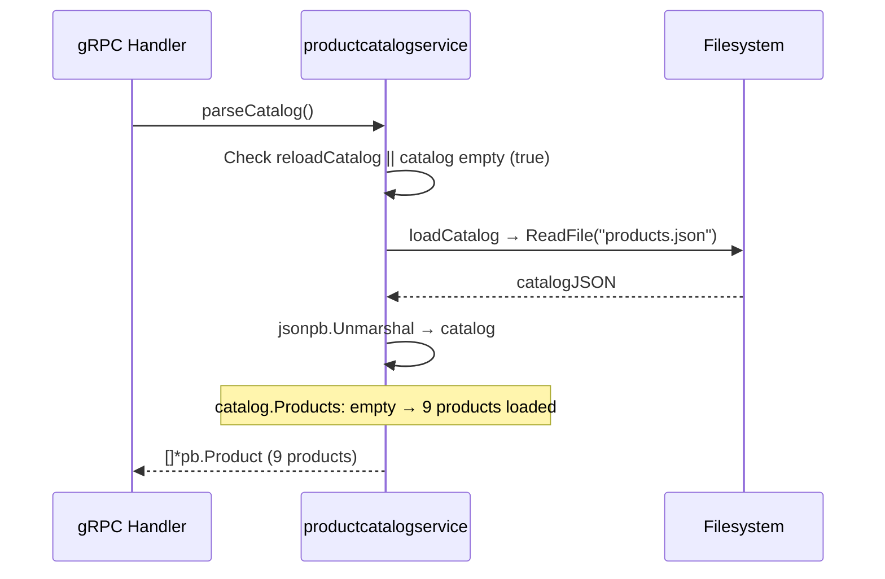

### Steps

1. **Check if catalog needs reload**
   📍 `src/productcatalogservice/product_catalog.go:parseCatalog` — `parseCatalog() []*pb.Product`
   _when: `if reloadCatalog || len(p.catalog.Products) == 0`_
   ```go
   if reloadCatalog || len(p.catalog.Products) == 0 {
     err := loadCatalog(&p.catalog)
     if err != nil {
       return []*pb.Product{}
     }
   }
   ```

2. **Load products.json from file system**
   📍 `src/productcatalogservice/product_catalog.go:parseCatalog` — `parseCatalog() []*pb.Product`
   ```go
   err := loadCatalog(&p.catalog)
   ```
   > **State change:** `p.catalog.Products: empty → populated with 9 products from products.json`

3. **Return parsed products from catalog**
   📍 `src/productcatalogservice/product_catalog.go:parseCatalog` — `parseCatalog() []*pb.Product`
   ```go
   return p.catalog.Products
   ```

### Success Outcome

```
Catalog loaded into memory with 9 products; subsequent calls use cached catalog until reloadCatalog flag is set again.
```

### Failure Modes

| Condition | Outcome | Error Code | Retryable |
|-----------|---------|------------|-----------|
| `products.json` file not found | `loadCatalog` returns error; `parseCatalog` returns empty `[]*pb.Product{}` | `FILE_NOT_FOUND` | No |
| `products.json` contains invalid JSON | `loadCatalog` returns JSON parsing error; empty result | `INVALID_JSON` | No |
| `products.json` file permission denied | `loadCatalog` returns permission error; empty result | `PERMISSION_DENIED` | No |

### Side Effects

- `products.json` file read from disk
- `p.catalog.Products` populated with Product messages
- In-memory cache established for subsequent requests

### Test Coverage

⚠️ **Not covered by tests**

---

## Scenario: Catalog Caching — Subsequent Requests Use In-Memory Cache

**Trigger** — Second and subsequent calls to `ListProducts`, `GetProduct`, or `SearchProducts` after initial load

**Preconditions**
- Catalog has been loaded from `products.json`
- `reloadCatalog` flag is false
- `p.catalog.Products` is not empty

**Entry Point** — `src/productcatalogservice/product_catalog.go:parseCatalog`

### Sequence Diagram

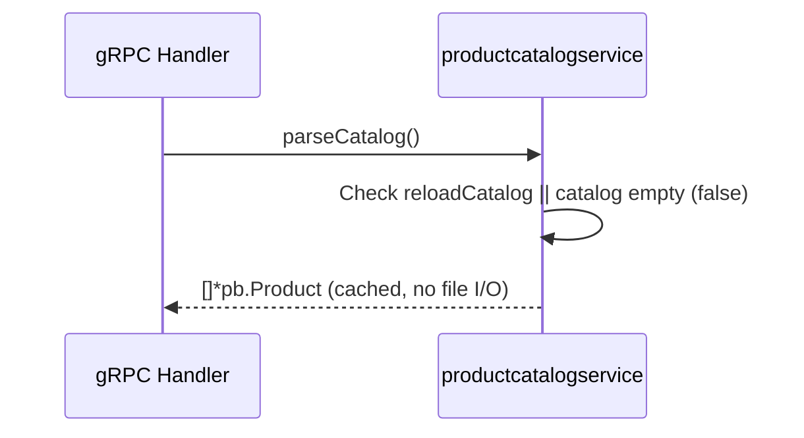

### Steps

1. **Check if catalog needs reload**
   📍 `src/productcatalogservice/product_catalog.go:parseCatalog` — `parseCatalog() []*pb.Product`
   _when: `if reloadCatalog || len(p.catalog.Products) == 0` (condition false)_
   ```go
   if reloadCatalog || len(p.catalog.Products) == 0 {
     // skipped
   }
   return p.catalog.Products
   ```

2. **Return cached products directly**
   📍 `src/productcatalogservice/product_catalog.go:parseCatalog` — `parseCatalog() []*pb.Product`
   ```go
   return p.catalog.Products
   ```

### Success Outcome

```
Cached catalog returned immediately without file I/O; response time reduced compared to initial load.
```

### Failure Modes

| Condition | Outcome | Error Code | Retryable |
|-----------|---------|------------|-----------|
| _(none — cache hit path has no failure modes)_ | — | — | — |

### Side Effects

- No file system access
- In-memory cache reused

### Test Coverage

⚠️ **Not covered by tests**

---

## See Also

- [GoogleCloudPlatform/microservices-demo](https://github.com/GoogleCloudPlatform/microservices-demo) — Source repository
- `src/productcatalogservice/product_catalog_test.go` — Unit tests for ListProducts, GetProduct, SearchProducts
- `src/productcatalogservice/products.json` — Default product catalog data file
- `src/productcatalogservice/catalog_loader.go` — Catalog loading logic (local file and AlloyDB paths)