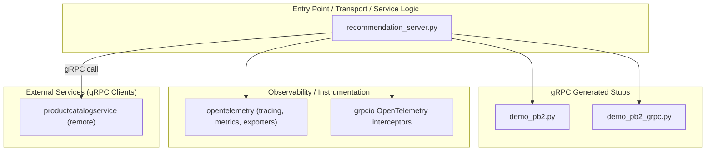
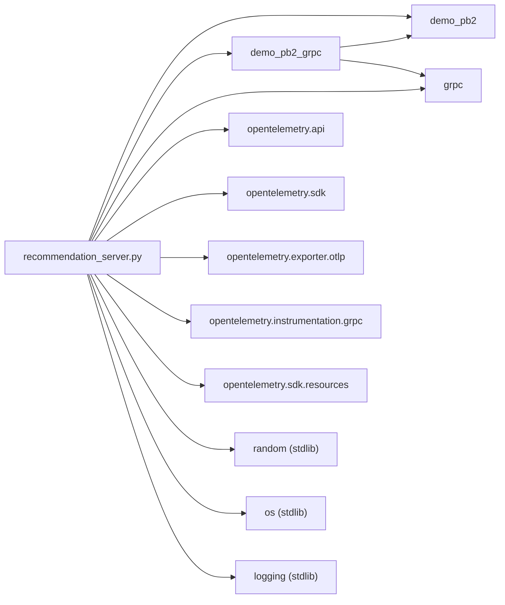

<!-- generated: 2026-04-13T05:26:08.487Z | model: claude-opus-4-6 | sha: c9857ee5 -->

# Architecture — recommendationservice

## TL;DR for Agents

- **Simple single-file gRPC service** written in Python — the entire service logic lives in one main entry point (`recommendation_server.py`) with minimal layering.
- **Architectural pattern**: Flat/monolithic single-module design; no formal layered or hexagonal architecture — all concerns (transport, business logic, telemetry) coexist in one file.
- **Key modules**: `recommendation_server.py` (entry point + service logic), `demo_pb2` / `demo_pb2_grpc` (generated gRPC stubs), OpenTelemetry instrumentation modules.
- **No circular dependencies** detected — the dependency graph is too shallow to produce cycles.
- **Entry point for code changes**: Start at `recommendation_server.py`; for proto contract changes, regenerate from the shared `.proto` definitions.

## Layer Architecture

## Module Dependency Graph

> **Note**: No dependency violations are present. All arrows flow from the single application module outward to libraries and generated code. There are no reverse or lateral imports that would constitute architectural violations.

## Layer Descriptions

| Layer | Directories / Files | Responsibility | May Import From |
|---|---|---|---|
| **Entry Point / Transport / Service Logic** | `recommendation_server.py` | Starts gRPC server, implements `ListRecommendations` RPC handler, calls `ProductCatalogService`, filters and samples product IDs, configures OpenTelemetry tracing | gRPC stubs, Observability, stdlib |
| **gRPC Generated Stubs** | `demo_pb2.py`, `demo_pb2_grpc.py` | Auto-generated Protobuf message classes and gRPC service/client stubs from `demo.proto` | `grpc`, `protobuf` runtime |
| **Observability / Instrumentation** | OpenTelemetry SDK, OTLP exporter, gRPC interceptors | Distributed tracing, metrics export, automatic gRPC span creation | OpenTelemetry core, gRPC |
| **External Services** | `productcatalogservice` (remote gRPC) | Provides the full product catalog; recommendation service calls `ListProducts` to get candidates | N/A (network boundary) |

## Circular Dependencies

No circular dependencies detected.

The service's dependency graph is a shallow tree rooted at `recommendation_server.py`. All imports flow strictly outward to generated stubs, third-party libraries, and the standard library. The single-file design inherently prevents intra-service circular imports.

## Key Design Patterns

### Single-Responsibility Server File

The `recommendationservice` follows a minimalist pattern common in microservices demos: a single Python file acts as the gRPC server entry point, service implementation, and client caller. The `ListRecommendations` RPC handler creates a gRPC channel to `productcatalogservice`, retrieves the full product catalog, filters out products already in the user's cart, and returns a random sample. This keeps operational complexity low at the cost of separation of concerns — acceptable for a service with exactly one RPC method and no persistent state.

### gRPC Client-Server Composition

The service demonstrates the **sidecar client** pattern within a gRPC mesh. Rather than accessing a database, `recommendationservice` acts as a pure compute node that composes its response by calling another service (`productcatalogservice`) over gRPC. The generated `demo_pb2_grpc` stubs provide both the server base class (which `recommendation_server.py` extends) and the client stub (used to call `ProductCatalogService.ListProducts`). This dual use of the same proto package is a standard gRPC pattern for service-to-service communication.

### OpenTelemetry Instrumentation at the Transport Layer

Tracing is wired in at server startup via OpenTelemetry's gRPC interceptor (`opentelemetry.instrumentation.grpc`). This follows the **middleware/interceptor pattern**: every inbound and outbound gRPC call is automatically wrapped in a span without polluting business logic. The OTLP exporter is configured via environment variables (`OTEL_EXPORTER_OTLP_ENDPOINT`, `OTEL_SERVICE_NAME`), adhering to the **externalized configuration** pattern expected in Kubernetes-deployed services.

### Stateless Random Sampling

The recommendation algorithm itself is intentionally trivial — `random.sample()` over filtered product IDs. This is a **strategy placeholder** pattern: the service's architecture (gRPC contract, telemetry, deployment) is production-grade, while the core algorithm is designed to be swapped out. Any future enhancement (collaborative filtering, ML model serving) would replace the body of the `ListRecommendations` handler without changing the service's external contract or infrastructure wiring.

## See Also

- [microservices-demo root README](../../README.md) — overall architecture and service mesh topology
- [proto definitions](../../protos/demo.proto) — shared Protobuf/gRPC contract for all services including `RecommendationService`
- [productcatalogservice](../productcatalogservice/ARCHITECTURE.md) — upstream dependency called by this service
- [Kubernetes manifests](../../kubernetes-manifests/) — deployment configuration and environment variable injection