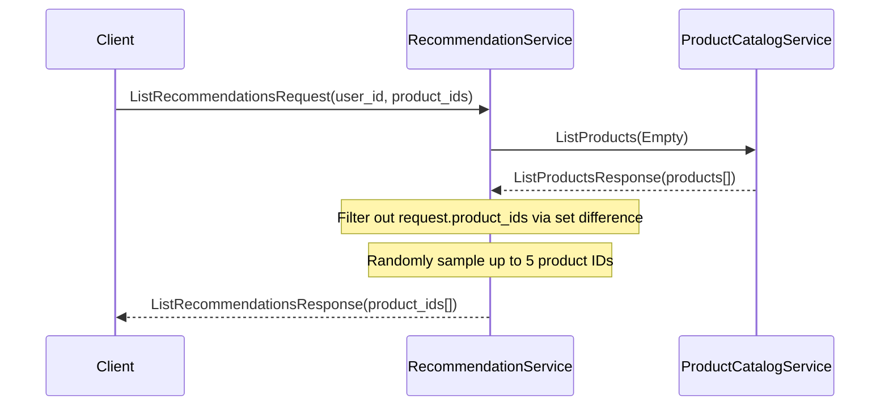
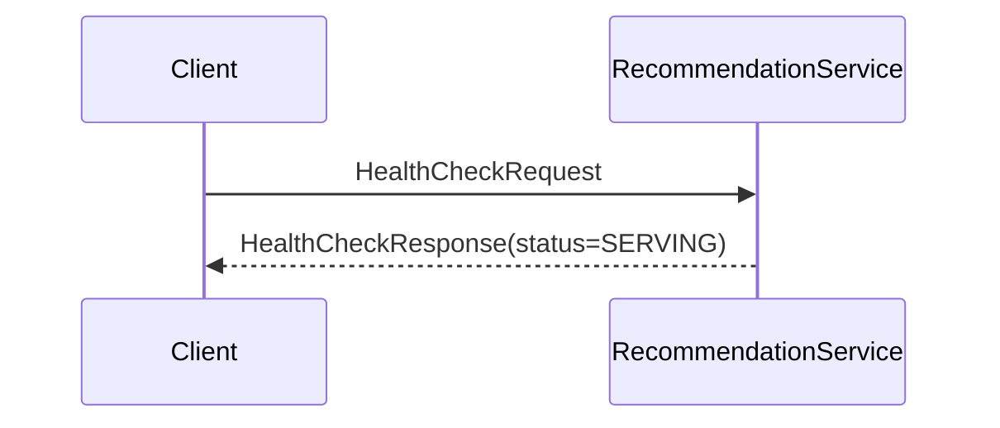
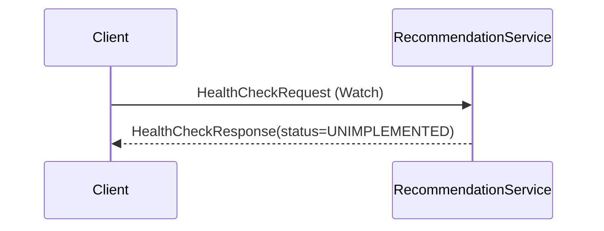
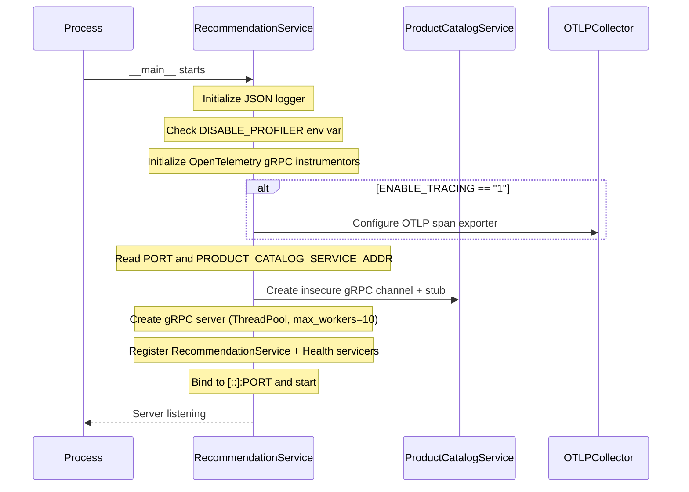
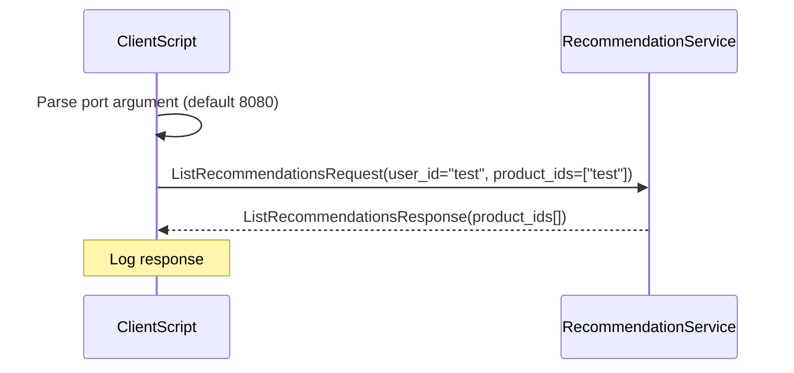
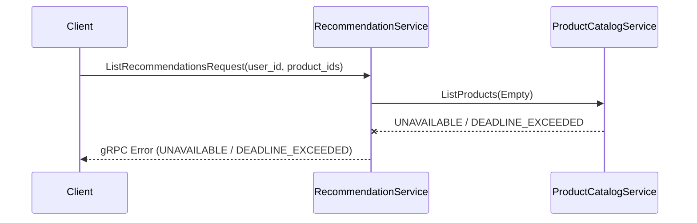

<!-- generated: 2026-04-13T05:21:41.391Z | model: claude-opus-4-6 | sha: c9857ee5 -->

# Scenarios — RecommendationService

## TL;DR for Agents

- **8 total scenarios; 0 tested, 8 untested** — no test coverage exists for any scenario
- **Most critical scenario:** "Happy Path — ListRecommendations gRPC call" — the core business logic that fetches products from ProductCatalogService, filters, and returns random recommendations
- **Most common failure mode:** `UNAVAILABLE` / `DEADLINE_EXCEEDED` when ProductCatalogService is unreachable (appears in 3 scenarios, always retryable)
- **No state transitions** — the service is stateless; it holds no mutable state and performs no database writes
- Key env var to watch: `PRODUCT_CATALOG_SERVICE_ADDR` — if unset, the server crashes on startup immediately

## How to Read This Document

Each scenario describes one discrete execution path through the RecommendationService, from trigger to outcome. Start with the **Scenario Index** table to find the scenario relevant to your investigation, then jump to its section for the full sequence diagram, step-by-step code references, failure modes, and side effects. Code references point into `src/recommendationservice/`.

## Scenario Index

| Name | Trigger | Tags | Tested By |
|------|---------|------|-----------|
| [Happy Path — ListRecommendations](#scenario-happy-path--recommendationservice-listrecommendations-grpc-call) | `gRPC /hipstershop.RecommendationService/ListRecommendations` | `happy-path`, `grpc-endpoint`, `unary-call` | ⚠️ None |
| [gRPC Health Check](#scenario-grpc-health-check--recommendationservice-check) | `gRPC /grpc.health.v1.Health/Check` | `health-check`, `grpc-endpoint`, `liveness-probe` | ⚠️ None |
| [gRPC Health Watch (unimplemented)](#scenario-grpc-health-watch--recommendationservice-watch-unimplemented) | `gRPC /grpc.health.v1.Health/Watch` | `health-check`, `grpc-endpoint`, `unimplemented` | ⚠️ None |
| [Server Startup](#scenario-server-startup--recommendationservice-initialization) | Process start (`__main__`) | `startup`, `initialization`, `server-bootstrap` | ⚠️ None |
| [Client Test](#scenario-client-test--recommendationservice-listrecommendations-via-grpc-client) | Direct script execution (`client.py`) | `client-test`, `grpc-call`, `integration-test` | ⚠️ None |
| [Profiler Initialization Failure](#scenario-profiler-initialization-failure--stackdriver-profiler-unavailable) | Startup with profiler enabled | `startup`, `profiler`, `optional-service` | ⚠️ None |
| [Tracing Initialization Failure](#scenario-tracing-initialization-failure--otlp-collector-unreachable) | Startup with `ENABLE_TRACING=1` | `startup`, `tracing`, `optional-service`, `error-handling` | ⚠️ None |
| [ProductCatalogService Unreachable](#scenario-productcatalogservice-unreachable--listrecommendations-fails-upstream) | `gRPC /hipstershop.RecommendationService/ListRecommendations` (upstream down) | `upstream-failure`, `grpc-endpoint`, `error-handling` | ⚠️ None |

---

## Scenario: Happy Path — RecommendationService ListRecommendations gRPC call

**Trigger:** gRPC unary call to `/hipstershop.RecommendationService/ListRecommendations`

**Preconditions:**
- RecommendationService gRPC server is running on `PORT` (default `8080`)
- ProductCatalogService is reachable at `PRODUCT_CATALOG_SERVICE_ADDR`
- `request.user_id` is a non-empty string
- `request.product_ids` is a list (may be empty)

**Entry Point:** `src/recommendationservice/recommendation_server.py:RecommendationService.ListRecommendations`

### Sequence Diagram



### Steps

1. **Server receives ListRecommendationsRequest with user_id and product_ids**
   📍 `recommendation_server.py:RecommendationService.ListRecommendations` — `ListRecommendations(self, request: demo_pb2.ListRecommendationsRequest, context: grpc.ServicerContext) -> demo_pb2.ListRecommendationsResponse`

2. **Call ProductCatalogService.ListProducts to fetch all available products**
   📍 `recommendation_server.py:RecommendationService.ListRecommendations` — `ListRecommendations(self, request: demo_pb2.ListRecommendationsRequest, context: grpc.ServicerContext) -> demo_pb2.ListRecommendationsResponse`
   ```python
   cat_response = product_catalog_stub.ListProducts(demo_pb2.Empty())
   product_ids = [x.id for x in cat_response.products]
   ```

3. **Filter out products already in user's request.product_ids; compute set difference**
   📍 `recommendation_server.py:RecommendationService.ListRecommendations` — `ListRecommendations(self, request: demo_pb2.ListRecommendationsRequest, context: grpc.ServicerContext) -> demo_pb2.ListRecommendationsResponse`
   ```python
   filtered_products = list(set(product_ids)-set(request.product_ids))
   num_products = len(filtered_products)
   num_return = min(max_responses, num_products)
   ```

4. **Randomly sample up to max_responses (5) product IDs from filtered list**
   📍 `recommendation_server.py:RecommendationService.ListRecommendations` — `ListRecommendations(self, request: demo_pb2.ListRecommendationsRequest, context: grpc.ServicerContext) -> demo_pb2.ListRecommendationsResponse`
   ```python
   indices = random.sample(range(num_products), num_return)
   prod_list = [filtered_products[i] for i in indices]
   ```

5. **Log recommendation request with selected product IDs**
   📍 `recommendation_server.py:RecommendationService.ListRecommendations` — `ListRecommendations(self, request: demo_pb2.ListRecommendationsRequest, context: grpc.ServicerContext) -> demo_pb2.ListRecommendationsResponse`
   ```python
   logger.info("[Recv ListRecommendations] product_ids={}".format(prod_list))
   ```

6. **Build and return ListRecommendationsResponse with sampled product_ids**
   📍 `recommendation_server.py:RecommendationService.ListRecommendations` — `ListRecommendations(self, request: demo_pb2.ListRecommendationsRequest, context: grpc.ServicerContext) -> demo_pb2.ListRecommendationsResponse`
   ```python
   response = demo_pb2.ListRecommendationsResponse()
   response.product_ids.extend(prod_list)
   return response
   ```

### Success Outcome

```protobuf
ListRecommendationsResponse {
  product_ids: ["OLJCESPC7Z", "66VCHSJNUP", "1YMWWN1N4O"]  // 0–5 IDs, randomly sampled
}
```

### Failure Modes

| Condition | Outcome | Error Code | Retryable |
|-----------|---------|------------|-----------|
| ProductCatalogService is unreachable or times out | gRPC error propagates to caller | `UNAVAILABLE` / `DEADLINE_EXCEEDED` | ✅ Yes |
| ProductCatalogService returns malformed response (missing `products` field) | `AttributeError` or protobuf deserialization error | `INTERNAL` | ❌ No |
| `request.product_ids` contains all available products (filtered list is empty) | Returns `ListRecommendationsResponse` with empty `product_ids` list | N/A | ❌ No |

### Side Effects

- gRPC call to `ProductCatalogService.ListProducts`
- JSON log entry with selected product IDs

### Test Coverage

⚠️ **Not covered by tests**

---

## Scenario: gRPC Health Check — RecommendationService Check

**Trigger:** gRPC unary call to `/grpc.health.v1.Health/Check`

**Preconditions:**
- RecommendationService gRPC server is running
- Health service is registered on server

**Entry Point:** `src/recommendationservice/recommendation_server.py:RecommendationService.Check`

### Sequence Diagram



### Steps

1. **Receive gRPC Health Check request**
   📍 `recommendation_server.py:RecommendationService.Check` — `Check(self, request: health_pb2.HealthCheckRequest, context: grpc.ServicerContext) -> health_pb2.HealthCheckResponse`

2. **Return SERVING status immediately**
   📍 `recommendation_server.py:RecommendationService.Check` — `Check(self, request: health_pb2.HealthCheckRequest, context: grpc.ServicerContext) -> health_pb2.HealthCheckResponse`
   ```python
   return health_pb2.HealthCheckResponse(status=health_pb2.HealthCheckResponse.SERVING)
   ```

### Success Outcome

```protobuf
HealthCheckResponse {
  status: SERVING
}
```

### Failure Modes

| Condition | Outcome | Error Code | Retryable |
|-----------|---------|------------|-----------|
| _(none defined)_ | — | — | — |

### Side Effects

- _(none)_

### Test Coverage

⚠️ **Not covered by tests**

---

## Scenario: gRPC Health Watch — RecommendationService Watch (unimplemented)

**Trigger:** gRPC server streaming call to `/grpc.health.v1.Health/Watch`

**Preconditions:**
- RecommendationService gRPC server is running
- Health service is registered on server

**Entry Point:** `src/recommendationservice/recommendation_server.py:RecommendationService.Watch`

### Sequence Diagram



### Steps

1. **Receive gRPC Health Watch request**
   📍 `recommendation_server.py:RecommendationService.Watch` — `Watch(self, request: health_pb2.HealthCheckRequest, context: grpc.ServicerContext) -> health_pb2.HealthCheckResponse`

2. **Return UNIMPLEMENTED status**
   📍 `recommendation_server.py:RecommendationService.Watch` — `Watch(self, request: health_pb2.HealthCheckRequest, context: grpc.ServicerContext) -> health_pb2.HealthCheckResponse`
   ```python
   return health_pb2.HealthCheckResponse(status=health_pb2.HealthCheckResponse.UNIMPLEMENTED)
   ```

### Success Outcome

```protobuf
HealthCheckResponse {
  status: UNIMPLEMENTED
}
```

### Failure Modes

| Condition | Outcome | Error Code | Retryable |
|-----------|---------|------------|-----------|
| _(none defined)_ | — | — | — |

### Side Effects

- _(none)_

### Test Coverage

⚠️ **Not covered by tests**

---

## Scenario: Server Startup — RecommendationService initialization

**Trigger:** Process start; `__main__` block execution

**Preconditions:**
- Python process is launched
- Environment variable `PRODUCT_CATALOG_SERVICE_ADDR` is set (or exception raised)
- Optional: `DISABLE_PROFILER`, `ENABLE_TRACING`, `COLLECTOR_SERVICE_ADDR`, `GCP_PROJECT_ID` env vars may be set

**Entry Point:** `src/recommendationservice/recommendation_server.py:__main__`

### Sequence Diagram



### Steps

1. **Initialize JSON logger for recommendationservice-server**
   📍 `recommendation_server.py:__main__` — `getJSONLogger(name: str) -> logging.Logger`
   ```python
   logger = getJSONLogger('recommendationservice-server')
   ```

2. **Log initialization message**
   📍 `recommendation_server.py:__main__`
   ```python
   logger.info("initializing recommendationservice")
   ```

3. **Check DISABLE_PROFILER env var; if not set, attempt Stackdriver Profiler initialization**
   📍 `recommendation_server.py:__main__`
   _"when: `if "DISABLE_PROFILER" in os.environ: raise KeyError()`"_
   ```python
   if "DISABLE_PROFILER" in os.environ:
     raise KeyError()
   else:
     logger.info("Profiler enabled.")
     initStackdriverProfiling()
   ```

4. **Initialize gRPC client and server instrumentation for OpenTelemetry**
   📍 `recommendation_server.py:__main__`
   ```python
   grpc_client_instrumentor = GrpcInstrumentorClient()
   grpc_client_instrumentor.instrument()
   grpc_server_instrumentor = GrpcInstrumentorServer()
   grpc_server_instrumentor.instrument()
   ```

5. **Check ENABLE_TRACING env var; if set to '1', configure OTLP span exporter**
   📍 `recommendation_server.py:__main__`
   _"when: `if os.environ["ENABLE_TRACING"] == "1"`"_
   ```python
   if os.environ["ENABLE_TRACING"] == "1":
     trace.set_tracer_provider(TracerProvider())
     otel_endpoint = os.getenv("COLLECTOR_SERVICE_ADDR", "localhost:4317")
     trace.get_tracer_provider().add_span_processor(
       BatchSpanProcessor(OTLPSpanExporter(endpoint=otel_endpoint, insecure=True))
     )
   ```

6. **Read PORT env var (default 8080) and PRODUCT_CATALOG_SERVICE_ADDR (required)**
   📍 `recommendation_server.py:__main__`
   _"when: `if catalog_addr == ""`"_
   ```python
   port = os.environ.get('PORT', "8080")
   catalog_addr = os.environ.get('PRODUCT_CATALOG_SERVICE_ADDR', '')
   if catalog_addr == "":
     raise Exception('PRODUCT_CATALOG_SERVICE_ADDR environment variable not set')
   ```

7. **Create insecure gRPC channel to ProductCatalogService and instantiate stub**
   📍 `recommendation_server.py:__main__`
   ```python
   channel = grpc.insecure_channel(catalog_addr)
   product_catalog_stub = demo_pb2_grpc.ProductCatalogServiceStub(channel)
   ```

8. **Create gRPC server with ThreadPoolExecutor (max_workers=10)**
   📍 `recommendation_server.py:__main__`
   ```python
   server = grpc.server(futures.ThreadPoolExecutor(max_workers=10))
   ```

9. **Instantiate RecommendationService and register it with gRPC server**
   📍 `recommendation_server.py:__main__`
   ```python
   service = RecommendationService()
   demo_pb2_grpc.add_RecommendationServiceServicer_to_server(service, server)
   health_pb2_grpc.add_HealthServicer_to_server(service, server)
   ```

10. **Bind server to insecure port and start listening**
    📍 `recommendation_server.py:__main__`
    ```python
    server.add_insecure_port('[::]:'+port)
    server.start()
    ```

11. **Log listening port and enter infinite loop to keep server alive**
    📍 `recommendation_server.py:__main__`
    ```python
    logger.info("listening on port: " + port)
    while True:
      time.sleep(10000)
    ```

### Success Outcome

```
Server is running and listening on [::]:8080; ready to accept gRPC requests.
```

### Failure Modes

| Condition | Outcome | Error Code | Retryable |
|-----------|---------|------------|-----------|
| `PRODUCT_CATALOG_SERVICE_ADDR` env var is not set | Exception raised; process exits | `MISSING_ENV_VAR` | ❌ No |
| Port is already in use or binding fails | `grpc.server.add_insecure_port()` raises exception; process exits | `PORT_BIND_FAILED` | ❌ No |
| `ENABLE_TRACING=1` but `COLLECTOR_SERVICE_ADDR` is unreachable | Tracing init may fail; logged as warning but server continues | `TRACING_INIT_FAILED` | ❌ No |
| `KeyboardInterrupt` (SIGINT) received during sleep loop | Caught; `server.stop(0)` called; process exits gracefully | N/A | ❌ No |

### Side Effects

- gRPC server created and bound to port
- ProductCatalogService stub initialized (channel created but not yet used)
- OpenTelemetry instrumentation registered
- JSON logging configured

### Test Coverage

⚠️ **Not covered by tests**

---

## Scenario: Client Test — RecommendationService ListRecommendations via gRPC client

**Trigger:** Direct Python script execution; `client.py` main block

**Preconditions:**
- RecommendationService server is running on `localhost:PORT` (default `8080`)
- `client.py` is executed with optional port argument

**Entry Point:** `src/recommendationservice/client.py:__main__`

### Sequence Diagram



### Steps

1. **Parse command-line argument for port; default to 8080**
   📍 `client.py:__main__`
   _"when: `if len(sys.argv) > 1`"_
   ```python
   if len(sys.argv) > 1:
     port = sys.argv[1]
   else:
     port = "8080"
   ```

2. **Initialize JSON logger for recommendationservice-server**
   📍 `client.py:__main__` — `getJSONLogger(name: str) -> logging.Logger`
   ```python
   logger = getJSONLogger('recommendationservice-server')
   ```

3. **Create insecure gRPC channel to localhost:PORT**
   📍 `client.py:__main__`
   ```python
   channel = grpc.insecure_channel('localhost:'+port)
   ```

4. **Instantiate RecommendationServiceStub**
   📍 `client.py:__main__`
   ```python
   stub = demo_pb2_grpc.RecommendationServiceStub(channel)
   ```

5. **Form ListRecommendationsRequest with hardcoded test values**
   📍 `client.py:__main__`
   ```python
   request = demo_pb2.ListRecommendationsRequest(user_id="test", product_ids=["test"])
   ```

6. **Make synchronous gRPC call to ListRecommendations**
   📍 `client.py:__main__`
   ```python
   response = stub.ListRecommendations(request)
   ```

7. **Log response to stdout**
   📍 `client.py:__main__`
   ```python
   logger.info(response)
   ```

### Success Outcome

```
Client receives ListRecommendationsResponse and logs it; process exits with code 0.
```

### Failure Modes

| Condition | Outcome | Error Code | Retryable |
|-----------|---------|------------|-----------|
| RecommendationService server is not running or unreachable at `localhost:PORT` | `grpc.RpcError` with code `UNAVAILABLE`; process exits non-zero | `UNAVAILABLE` | ✅ Yes |
| Server returns error (e.g., ProductCatalogService unreachable) | `grpc.RpcError` with code `INTERNAL` or `UNAVAILABLE`; exception propagates | `INTERNAL` / `UNAVAILABLE` | ✅ Yes |

### Side Effects

- gRPC call to `RecommendationService.ListRecommendations`
- JSON log entry with response

### Test Coverage

⚠️ **Not covered by tests**

---

## Scenario: Profiler Initialization Failure — Stackdriver Profiler unavailable

**Trigger:** Server startup with `DISABLE_PROFILER` not set and profiler initialization fails

**Preconditions:**
- `DISABLE_PROFILER` environment variable is **NOT** set
- Stackdriver Profiler agent is not available or GCP credentials are missing
- Server is starting up

**Entry Point:** `src/recommendationservice/recommendation_server.py:initStackdriverProfiling`

### Sequence Diagram

```mermaid
sequenceDiagram
    participant RecommendationService

    Note over RecommendationService: Attempt to read GCP_PROJECT_ID
    alt GCP_PROJECT_ID set
        Note over RecommendationService: project_id = os.environ["GCP_PROJECT_ID"]
    else GCP_PROJECT_ID not set
        Note over RecommendationService: KeyError caught; pass
    end
    Note over RecommendationService: Profiler init code is commented out; return
```

### Steps

1. **Attempt to read GCP_PROJECT_ID environment variable**
   📍 `recommendation_server.py:initStackdriverProfiling` — `initStackdriverProfiling() -> None`
   _"when: `try: project_id = os.environ["GCP_PROJECT_ID"]`"_
   ```python
   try:
     project_id = os.environ["GCP_PROJECT_ID"]
   except KeyError:
     pass
   ```

2. **Log that profiler initialization is disabled (code is commented out)**
   📍 `recommendation_server.py:initStackdriverProfiling` — `initStackdriverProfiling() -> None`
   ```python
   # Profiler initialization code is commented out in current version
   ```

### Success Outcome

```
Function returns without error; profiler is not initialized but server continues startup.
```

### Failure Modes

| Condition | Outcome | Error Code | Retryable |
|-----------|---------|------------|-----------|
| Profiler initialization code were uncommented and agent unavailable | Exception caught; logged as warning; server continues startup | `PROFILER_INIT_FAILED` | ❌ No |

### Side Effects

- No profiler agent started

### Test Coverage

⚠️ **Not covered by tests**

---

## Scenario: Tracing Initialization Failure — OTLP collector unreachable

**Trigger:** Server startup with `ENABLE_TRACING=1` but `COLLECTOR_SERVICE_ADDR` is unreachable

**Preconditions:**
- `ENABLE_TRACING` environment variable is set to `'1'`
- `COLLECTOR_SERVICE_ADDR` is set or defaults to `localhost:4317`
- OTLP collector is not reachable at that address

**Entry Point:** `src/recommendationservice/recommendation_server.py:__main__`

### Sequence Diagram

```mermaid
sequenceDiagram
    participant RecommendationService
    participant OTLPCollector

    Note over RecommendationService: ENABLE_TRACING == "1"
    RecommendationService->>OTLPCollector: Configure OTLPSpanExporter (insecure)
    OTLPCollector--xRecommendationService: Connection failed
    Note over RecommendationService: Exception caught; log warning; tracing disabled
    Note over RecommendationService: Server continues startup
```

### Steps

1. **Check ENABLE_TRACING environment variable**
   📍 `recommendation_server.py:__main__`
   _"when: `if os.environ["ENABLE_TRACING"] == "1"`"_
   ```python
   if os.environ["ENABLE_TRACING"] == "1":
   ```

2. **Set up TracerProvider and OTLP exporter with collector endpoint**
   📍 `recommendation_server.py:__main__`
   ```python
   trace.set_tracer_provider(TracerProvider())
   otel_endpoint = os.getenv("COLLECTOR_SERVICE_ADDR", "localhost:4317")
   trace.get_tracer_provider().add_span_processor(
     BatchSpanProcessor(OTLPSpanExporter(endpoint=otel_endpoint, insecure=True))
   )
   ```

3. **Catch exception during tracing setup and log warning**
   📍 `recommendation_server.py:__main__`
   _"when: `except Exception as e`"_
   ```python
   except Exception as e:
     logger.warn(f"Exception on Cloud Trace setup: {traceback.format_exc()}, tracing disabled.")
   ```

### Success Outcome

```
Exception is caught and logged as warning; server continues startup without tracing.
```

### Failure Modes

| Condition | Outcome | Error Code | Retryable |
|-----------|---------|------------|-----------|
| OTLP collector is unreachable or returns error | Exception raised during `OTLPSpanExporter` init or span processor setup; caught and logged; server continues | `TRACING_INIT_FAILED` | ❌ No |

### Side Effects

- Warning log entry with exception traceback

### Test Coverage

⚠️ **Not covered by tests**

---

## Scenario: ProductCatalogService Unreachable — ListRecommendations fails upstream

**Trigger:** gRPC unary call to `/hipstershop.RecommendationService/ListRecommendations` when ProductCatalogService is down

**Preconditions:**
- RecommendationService is running
- ProductCatalogService is **NOT** reachable at `PRODUCT_CATALOG_SERVICE_ADDR`
- gRPC channel to ProductCatalogService was created at startup but service is now down

**Entry Point:** `src/recommendationservice/recommendation_server.py:RecommendationService.ListRecommendations`

### Sequence Diagram



### Steps

1. **Receive ListRecommendationsRequest**
   📍 `recommendation_server.py:RecommendationService.ListRecommendations` — `ListRecommendations(self, request: demo_pb2.ListRecommendationsRequest, context: grpc.ServicerContext) -> demo_pb2.ListRecommendationsResponse`

2. **Attempt to call ProductCatalogService.ListProducts**
   📍 `recommendation_server.py:RecommendationService.ListRecommendations` — `ListRecommendations(self, request: demo_pb2.ListRecommendationsRequest, context: grpc.ServicerContext) -> demo_pb2.ListRecommendationsResponse`
   ```python
   cat_response = product_catalog_stub.ListProducts(demo_pb2.Empty())
   ```

3. **gRPC call raises RpcError (UNAVAILABLE or DEADLINE_EXCEEDED)**
   📍 `recommendation_server.py:RecommendationService.ListRecommendations` — `ListRecommendations(self, request: demo_pb2.ListRecommendationsRequest, context: grpc.ServicerContext) -> demo_pb2.ListRecommendationsResponse`

### Success Outcome

```
Exception propagates to gRPC framework; caller receives gRPC error with code UNAVAILABLE or DEADLINE_EXCEEDED.
```

### Failure Modes

| Condition | Outcome | Error Code | Retryable |
|-----------|---------|------------|-----------|
| ProductCatalogService is unreachable (connection refused, DNS failure, timeout) | `grpc.RpcError` with code `UNAVAILABLE` or `DEADLINE_EXCEEDED`; exception propagates to caller | `UNAVAILABLE` / `DEADLINE_EXCEEDED` | ✅ Yes |

### Side Effects

- No response returned; exception logged by gRPC framework

### Test Coverage

⚠️ **Not covered by tests**

---

## See Also

- [GoogleCloudPlatform/microservices-demo](https://github.com/GoogleCloudPlatform/microservices-demo) — parent repository with all microservices
- [`src/recommendationservice/recommendation_server.py`](https://github.com/GoogleCloudPlatform/microservices-demo/blob/main/src/recommendationservice/recommendation_server.py) — primary source file for all scenarios
- [`src/recommendationservice/client.py`](https://github.com/GoogleCloudPlatform/microservices-demo/blob/main/src/recommendationservice/client.py) — test client source
- [protos/demo.proto](https://github.com/GoogleCloudPlatform/microservices-demo/blob/main/protos/demo.proto) — protobuf definitions for `ListRecommendationsRequest` / `ListRecommendationsResponse`