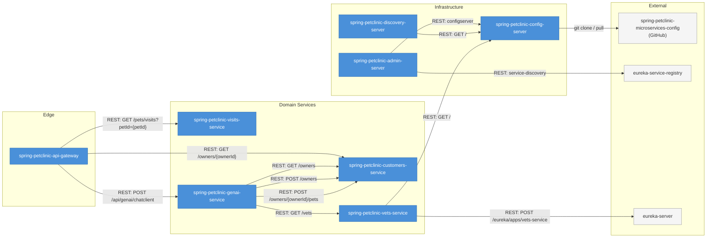
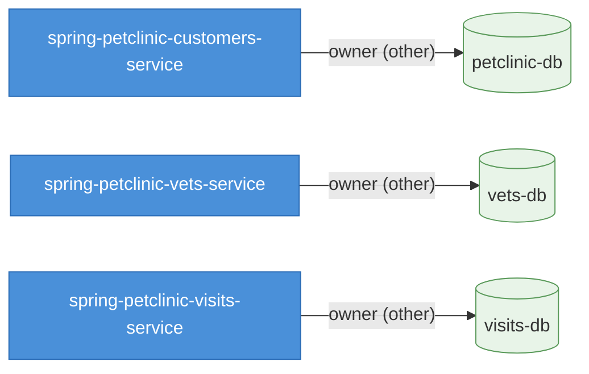

# Data Flow — spring-petclinic-microservices

## TL;DR for Agents

- **12 internal service-to-service REST calls** across 8 services; no asynchronous event/message flows detected.
- **3 databases** (`petclinic-db`, `vets-db`, `visits-db`), each privately owned by a single service — no shared databases.
- **1 external integration**: the Config Server pulls configuration from the GitHub-hosted `spring-petclinic-microservices-config` repository.
- **Key third-party dependencies** include OpenAI / Azure OpenAI (GenAI service), Netflix Eureka (service discovery), and Zipkin / Prometheus (observability).
- **Most critical data path**: Client → API Gateway → Customers Service (+ Visits Service) → databases — this is the primary read path for owner and visit data.

---

## Service Call Graph

### Call Inventory

| # | Source | Target | Method / Endpoint | Protocol |
|---|--------|--------|-------------------|----------|
| 1 | admin-server | config-server | `configserver` | REST |
| 2 | admin-server | eureka-service-registry | `service-discovery` | REST |
| 3 | api-gateway | customers-service | `GET /owners/{ownerId}` | REST |
| 4 | api-gateway | visits-service | `GET /pets/visits?petId={petId}` | REST |
| 5 | api-gateway | genai-service | `POST /api/genai/chatclient` | REST |
| 6 | discovery-server | config-server | `GET /` | REST |
| 7 | genai-service | vets-service | `GET /vets` | REST |
| 8 | genai-service | customers-service | `GET /owners` | REST |
| 9 | genai-service | customers-service | `POST /owners` | REST |
| 10 | genai-service | customers-service | `POST /owners/{ownerId}/pets` | REST |
| 11 | vets-service | config-server | `GET /` | REST |
| 12 | vets-service | eureka-server | `POST /eureka/apps/vets-service` | REST |

---

## Event & Message Flows

**No event or message flows detected.** All inter-service communication in this system is synchronous REST. There are no message brokers, Kafka topics, RabbitMQ queues, or other asynchronous channels present in the provided data.

---

## Data Ownership

| Database | Type | Owner Service | Shared? | Purpose |
|----------|------|---------------|---------|---------|
| `petclinic-db` | other | `spring-petclinic-customers-service` | No | Stores owner and pet data |
| `vets-db` | other | `spring-petclinic-vets-service` | No | Stores veterinarian and specialty data |
| `visits-db` | other | `spring-petclinic-visits-service` | No | Stores visit records for pets |

> **✅ No shared-database risk detected.** Each database is privately owned by exactly one service, following the database-per-service microservices pattern. Data access across bounded contexts is performed via REST calls through the owning service's API.

---

## External Integrations

| Integration | Category | Used by Service(s) | Purpose |
|-------------|----------|---------------------|---------|
| [spring-petclinic-microservices-config](https://github.com/spring-petclinic/spring-petclinic-microservices-config) | Configuration (Git) | `spring-petclinic-config-server` | Centralized externalized configuration repository for all services |
| OpenAI | LLM | `spring-petclinic-genai-service` | AI-powered chat / natural-language interactions |
| Azure OpenAI | LLM | `spring-petclinic-genai-service` | AI-powered chat / natural-language interactions (Azure-hosted variant) |
| Spring Boot Admin / Jolokia | Monitoring | `spring-petclinic-admin-server` | Application monitoring and JMX management |
| Zipkin / OpenTelemetry | Distributed Tracing | `api-gateway`, `customers-service`, `vets-service`, `visits-service` | End-to-end request tracing across services |
| Prometheus / Micrometer | Monitoring | `api-gateway`, `customers-service`, `vets-service`, `visits-service` | Metrics collection and export |
| Netflix Eureka | Service Discovery | `discovery-server`, `api-gateway`, `customers-service`, `visits-service`, `vets-service` | Runtime service registration and lookup |
| Resilience4j / Spring Cloud Circuit Breaker | Resilience | `spring-petclinic-api-gateway` | Circuit-breaking for downstream service calls |
| Chaos Monkey | Chaos Engineering | `spring-petclinic-visits-service` | Fault injection for resilience testing |
| Caffeine | Caching | `spring-petclinic-admin-server` | In-memory caching |

---

## Critical Data Paths

1. **Owner & Pet Lookup (primary read path)**
   `Client` → `api-gateway` → `customers-service` (`GET /owners/{ownerId}`) → `petclinic-db`
   This is the most frequently exercised path. A failure in `customers-service` or `petclinic-db` blocks the core UI from rendering owner/pet details. The API Gateway uses Resilience4j circuit breakers to protect against cascading failures here.

2. **Visit History Retrieval**
   `Client` → `api-gateway` → `visits-service` (`GET /pets/visits?petId={petId}`) → `visits-db`
   Typically called in conjunction with the owner lookup to display a pet's visit history. This path is independent of the customers-service database, so a `visits-db` outage does not affect owner data.

3. **AI Chat Interaction (GenAI path)**
   `Client` → `api-gateway` (`POST /api/genai/chatclient`) → `genai-service` → `OpenAI / Azure OpenAI` (external LLM)
   The GenAI service also fans out to `customers-service` (`GET /owners`, `POST /owners`, `POST /owners/{ownerId}/pets`) and `vets-service` (`GET /vets`) to fulfill tool-calling requests from the LLM. This is the most complex fan-out path and the only one with an external AI dependency.

4. **Centralized Configuration Bootstrap**
   `All services` → `config-server` (`GET /`) → `spring-petclinic-microservices-config` (GitHub)
   Every service fetches its configuration from the Config Server at startup. The Config Server in turn pulls from the external GitHub repository. If GitHub is unreachable or the Config Server is down during a rolling deployment, services may fail to start.

5. **Service Registration & Discovery**
   `vets-service` (and other services) → `eureka-server` (`POST /eureka/apps/{service}`) ; `api-gateway` → Eureka (lookup)
   All runtime routing through the API Gateway depends on Eureka's service registry being accurate. A stale or unavailable registry causes the gateway to lose routing targets.

---

## See Also

- [`PRODUCT.md`](./PRODUCT.md) — Product overview and architecture context
- [`spring-petclinic-admin-server/DEPENDENCIES.md`](./spring-petclinic-admin-server/DEPENDENCIES.md)
- [`spring-petclinic-api-gateway/DEPENDENCIES.md`](./spring-petclinic-api-gateway/DEPENDENCIES.md)
- [`spring-petclinic-config-server/DEPENDENCIES.md`](./spring-petclinic-config-server/DEPENDENCIES.md)
- [`spring-petclinic-customers-service/DEPENDENCIES.md`](./spring-petclinic-customers-service/DEPENDENCIES.md)
- [`spring-petclinic-discovery-server/DEPENDENCIES.md`](./spring-petclinic-discovery-server/DEPENDENCIES.md)
- [`spring-petclinic-genai-service/DEPENDENCIES.md`](./spring-petclinic-genai-service/DEPENDENCIES.md)
- [`spring-petclinic-vets-service/DEPENDENCIES.md`](./spring-petclinic-vets-service/DEPENDENCIES.md)
- [`spring-petclinic-visits-service/DEPENDENCIES.md`](./spring-petclinic-visits-service/DEPENDENCIES.md)