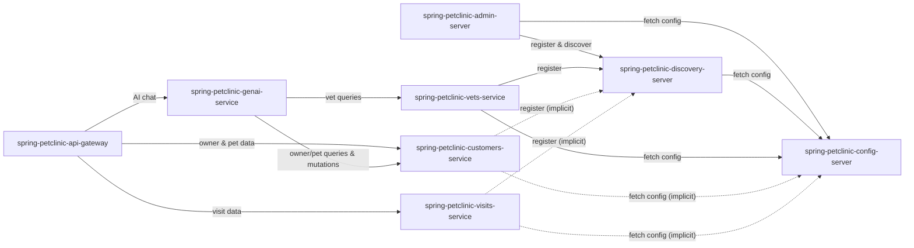

# spring-petclinic-microservices

> A microservices-based veterinary clinic management system built with Spring Boot and Spring Cloud, featuring AI-powered chat capabilities.

---

## TL;DR for Agents

- **What it does**: A pet clinic management platform decomposed into 8 Spring Boot microservices — handles owners, pets, veterinarians, and visit records with a web UI, centralized configuration, service discovery, and a generative AI chat interface.
- **Service count & language**: 8 services, all Java / Spring Boot, with an AngularJS frontend embedded in the API Gateway.
- **Most critical service**: `spring-petclinic-api-gateway` — it is the single entry point for all client traffic and routes requests to backend services; if it's down, the entire application is unreachable.
- **Where most bugs will originate**: `spring-petclinic-customers-service` — it owns the core domain (owners and pets) and is depended upon by both the API Gateway and the GenAI service (called 3 times for different functions).
- **Auth/identity**: No dedicated auth/identity service exists in this architecture. There is no authentication or authorization layer described in the current service set.
- **Infrastructure backbone**: `spring-petclinic-config-server` and `spring-petclinic-discovery-server` are foundational — all other services depend on them for configuration and service registration/discovery.

---

## What This Product Does

Spring PetClinic Microservices is a reference microservices architecture that models a veterinary clinic's day-to-day operations. It allows clinic staff to manage pet owners, register pets, schedule and track veterinary visits, and look up veterinarian information including their specialties. The system is designed as a teaching and demonstration platform for Spring Cloud patterns but is structured as a fully functional product.

Users interact with the system through a web-based UI served by the API Gateway, which provides screens for searching owners, adding pets, recording visits, and viewing the veterinarian roster. A generative AI chat interface powered by the GenAI service allows users to ask natural-language questions about clinic data — such as querying owners, pets, vets, and visits — using LLM function calling to retrieve live data from backend services.

The platform is built on Spring Cloud infrastructure: a centralized Config Server externalizes configuration for all services, a Eureka-based Discovery Server enables dynamic service registration and lookup, and a Spring Boot Admin Server provides operational monitoring including health checks, metrics, and log management. This infrastructure layer ensures that the business services (customers, visits, vets) can scale, be deployed independently, and be observed centrally.

---

## Service Map

| Service | Type | Language / Framework | Purpose | Start here when... |
|---|---|---|---|---|
| `spring-petclinic-api-gateway` | API | Java / Spring Boot | Single entry point for all client requests; serves AngularJS web UI; routes to backend services | UI not loading, pages blank, routing errors, or any user-facing issue |
| `spring-petclinic-customers-service` | API | Java / Spring Boot | CRUD operations for owners and pets | Owner/pet data missing, incorrect, or failing to save |
| `spring-petclinic-visits-service` | API | Java / Spring Boot | Create and retrieve visit records for pets | Visit records not appearing, visit creation failing |
| `spring-petclinic-vets-service` | API | Java / Spring Boot | Query veterinarian data with caching | Vet list not loading, stale vet data, cache issues |
| `spring-petclinic-genai-service` | API | Java / Spring Boot | AI chat interface using OpenAI/Azure OpenAI for natural-language queries | Chat not responding, AI answers incorrect or missing data |
| `spring-petclinic-config-server` | API | Java / Spring Boot | Centralized configuration management for all services | Services failing to start, configuration values wrong or missing |
| `spring-petclinic-discovery-server` | API | Java / Spring Boot | Eureka service registry for dynamic discovery | Services can't find each other, "service unavailable" errors |
| `spring-petclinic-admin-server` | API | Java / Spring Boot | Monitoring and administration dashboard for all microservices | Need to check health, metrics, or logs across services |

---

## Service Dependency Graph

> **Note**: Dashed arrows represent implicit dependencies — all business services register with Eureka and fetch configuration from the Config Server, even where not explicitly declared in outbound dependencies.

---

## Technology Stack

| Language | Framework | Services Using It |
|---|---|---|
| Java | Spring Boot, Spring Cloud Config Server | `spring-petclinic-config-server` |
| Java | Spring Boot, Spring Cloud Netflix Eureka | `spring-petclinic-discovery-server` |
| Java | Spring Boot, Spring Cloud Gateway | `spring-petclinic-api-gateway` |
| Java | Spring Boot, Spring Boot Admin | `spring-petclinic-admin-server` |
| Java | Spring Boot, Spring Data JPA | `spring-petclinic-customers-service`, `spring-petclinic-visits-service`, `spring-petclinic-vets-service` |
| Java | Spring Boot, Spring AI (OpenAI/Azure OpenAI) | `spring-petclinic-genai-service` |
| JavaScript | AngularJS (embedded in API Gateway) | `spring-petclinic-api-gateway` |

---

## Debugging Entry Points

| Symptom | First Service to Check | Why |
|---|---|---|
| Entire UI is unreachable / blank page | `spring-petclinic-api-gateway` | It serves the frontend and is the single entry point for all traffic |
| All services failing to start or returning wrong config | `spring-petclinic-config-server` | Every service pulls its configuration from the Config Server at startup |
| Services can't communicate / "service unavailable" errors | `spring-petclinic-discovery-server` | Eureka handles service registration and discovery; if it's down, inter-service routing breaks |
| Owner or pet data not loading / save failures | `spring-petclinic-customers-service` | Owns all owner and pet domain data and database operations |
| Visit records missing or creation failing | `spring-petclinic-visits-service` | Sole owner of visit data; check its database connectivity and API health |
| Vet list empty or showing stale data | `spring-petclinic-vets-service` | Manages vet data with caching — may be a cache invalidation issue or DB problem |
| AI chat returning errors or nonsensical answers | `spring-petclinic-genai-service` | Orchestrates LLM calls and function calling to backend services; check API keys, LLM connectivity, and downstream service availability |
| AI chat returns incomplete data (e.g., missing owners) | `spring-petclinic-customers-service` | The GenAI service calls customers-service multiple times for different data; if it's degraded, AI responses will be incomplete |
| Admin dashboard not showing service instances | `spring-petclinic-admin-server` | Check its connectivity to Eureka; it discovers services through the registry |

---

## How the Services Fit Together

A typical user interaction begins at the **API Gateway**, which serves the AngularJS single-page application to the browser. When a user navigates to the owners list, searches for an owner, or views pet details, the frontend makes REST calls to the Gateway, which routes them to the **Customers Service**. When viewing or creating visit records for a pet, the Gateway routes those requests to the **Visits Service**. The veterinarian listing page is served through the Gateway, which retrieves data from the **Vets Service**. All routing relies on service discovery — the Gateway looks up service locations from the **Discovery Server** (Eureka) rather than using hardcoded URLs.

The **GenAI Service** provides an alternative interaction model: users can ask natural-language questions through a chat interface (accessed via the API Gateway at `/api/genai/chatclient`). The GenAI service sends the user's message to an OpenAI or Azure OpenAI LLM, which uses function calling to determine what data is needed. The service then makes REST calls to the **Customers Service** (for owner and pet data) and the **Vets Service** (for veterinarian data), assembles the results, and returns a conversational response. This makes the GenAI service a high-fan-out consumer that depends on multiple backend services being healthy.

Underpinning everything are two infrastructure services on the critical path for startup: the **Config Server** must be available first since all services fetch their externalized configuration from it, and the **Discovery Server** must be running for services to register and find each other. The **Admin Server** sits alongside as an operational tool — it connects to Eureka to discover all running instances and provides a dashboard for health monitoring, log viewing, and metrics inspection. While not on the critical request path, it is essential for operations and debugging in production.

---

## See Also

- [Product Index](INDEX.md)
- [spring-petclinic-admin-server](services/spring-petclinic-admin-server/OVERVIEW.md)
- [spring-petclinic-api-gateway](services/spring-petclinic-api-gateway/OVERVIEW.md)
- [spring-petclinic-config-server](services/spring-petclinic-config-server/OVERVIEW.md)
- [spring-petclinic-customers-service](services/spring-petclinic-customers-service/OVERVIEW.md)
- [spring-petclinic-discovery-server](services/spring-petclinic-discovery-server/OVERVIEW.md)
- [spring-petclinic-genai-service](services/spring-petclinic-genai-service/OVERVIEW.md)
- [spring-petclinic-vets-service](services/spring-petclinic-vets-service/OVERVIEW.md)
- [spring-petclinic-visits-service](services/spring-petclinic-visits-service/OVERVIEW.md)