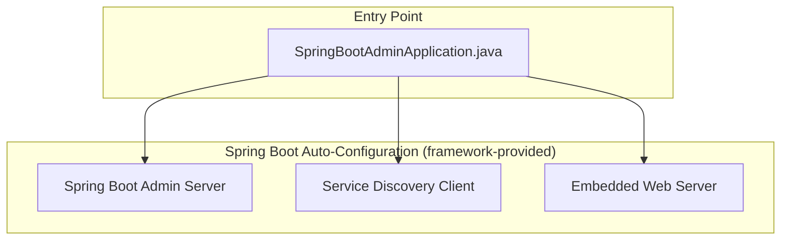
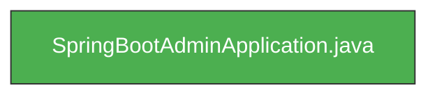

<!-- generated: 2026-04-13T04:11:27.695Z | model: claude-opus-4-6 | sha: 597ad1fb -->

# Architecture — spring-petclinic-admin-server

## TL;DR for Agents

- **Minimal single-layer architecture**: This service consists of a single entry-point class (`SpringBootAdminApplication.java`) with no additional custom layers, controllers, or repositories.
- **Framework**: Spring Boot application serving as a Spring Boot Admin Server for monitoring other microservices in the `spring-petclinic-microservices` ecosystem.
- **No circular dependencies** detected.
- **No internal module imports**: The application relies entirely on Spring Boot auto-configuration and Spring Boot Admin Server starters — there is no custom business logic to navigate.
- **Entry point for all code changes**: `spring-petclinic-admin-server/src/main/java/org/springframework/samples/petclinic/admin/SpringBootAdminApplication.java`

## Layer Architecture

This service has an extremely flat architecture — a single entry-point layer that bootstraps the Spring Boot Admin Server via auto-configuration.

> **Note:** The `Spring Boot Auto-Configuration` subgraph represents framework-provided modules activated via annotations and starter dependencies — they are not custom code in this repository.

## Module Dependency Graph

There is only a single module in this service. `SpringBootAdminApplication` has **zero internal imports** — all functionality is delegated to Spring Boot Admin Server auto-configuration via classpath starters and annotations (e.g., `@EnableAdminServer`, `@EnableDiscoveryClient`).

## Layer Descriptions

| Layer | Directories / Files | Responsibility | May Import From |
|---|---|---|---|
| **Entry Point** | `spring-petclinic-admin-server/src/main/java/org/springframework/samples/petclinic/admin/SpringBootAdminApplication.java` | Bootstraps the Spring Boot application, enables Spring Boot Admin Server and service discovery client via annotations. | Framework libraries only (no custom layers exist) |

## Circular Dependencies

No circular dependencies detected.

## Key Design Patterns

### Convention Over Configuration (Spring Boot Auto-Configuration)

The entire service is a textbook example of Spring Boot's "convention over configuration" philosophy. Rather than implementing custom controllers, health-check aggregators, or monitoring dashboards, the service relies on the `spring-boot-admin-starter-server` dependency to auto-configure all admin UI and monitoring endpoints. The single application class uses `@EnableAdminServer` to activate the full admin server feature set without any explicit wiring.

### Infrastructure as a Microservice

This service exemplifies the pattern of extracting cross-cutting infrastructure concerns — in this case, service monitoring and administration — into a dedicated microservice. By running as its own deployable unit within the `spring-petclinic-microservices` system, it can be independently scaled, deployed, and configured. It discovers other services (e.g., `petclinic-vets-service`, `petclinic-visits-service`) via a service discovery client (typically Eureka), automatically registering them for health and metrics monitoring.

### Annotation-Driven Bootstrapping

The application class serves purely as a composition root. All behavior is activated declaratively through annotations (`@SpringBootApplication`, `@EnableAdminServer`, `@EnableDiscoveryClient`). This pattern keeps the codebase minimal and shifts complexity into well-tested framework modules, reducing the surface area for bugs in custom code.

## See Also

- [Spring Boot Admin Reference Documentation](https://docs.spring-boot-admin.com/)
- [spring-petclinic-microservices repository](https://github.com/spring-petclinic/spring-petclinic-microservices)
- `spring-petclinic-discovery-server` — the Eureka service registry that this admin server connects to for service discovery
- `spring-petclinic-config-server` — the centralized configuration server that provides externalized configuration to this service