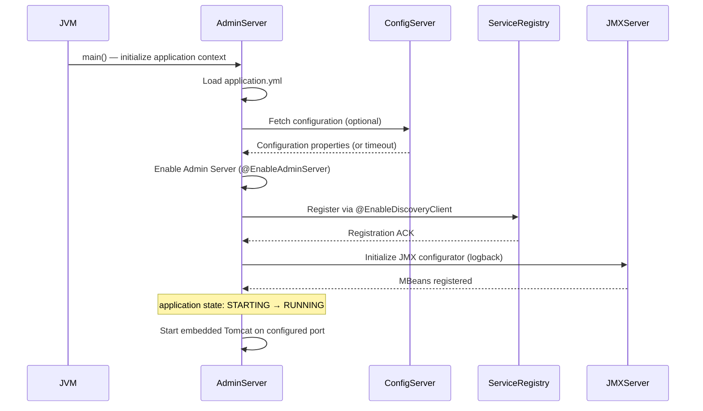
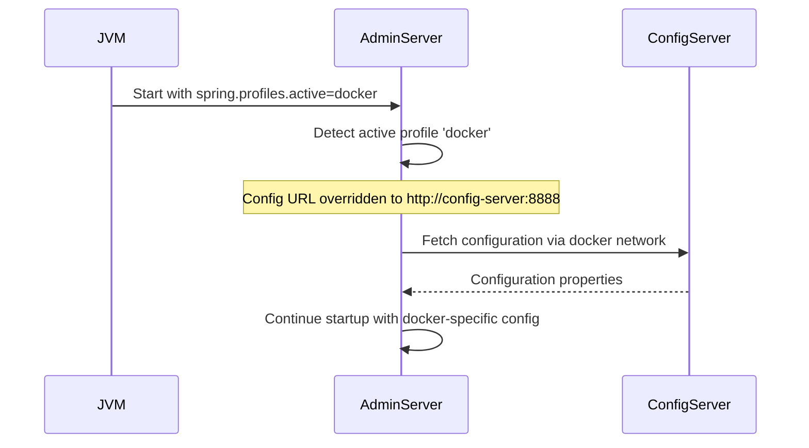
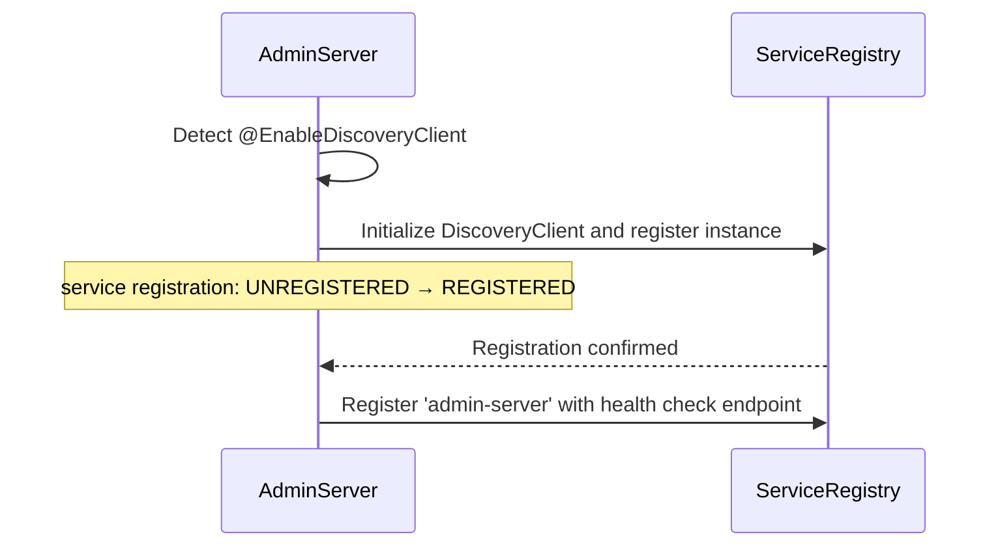
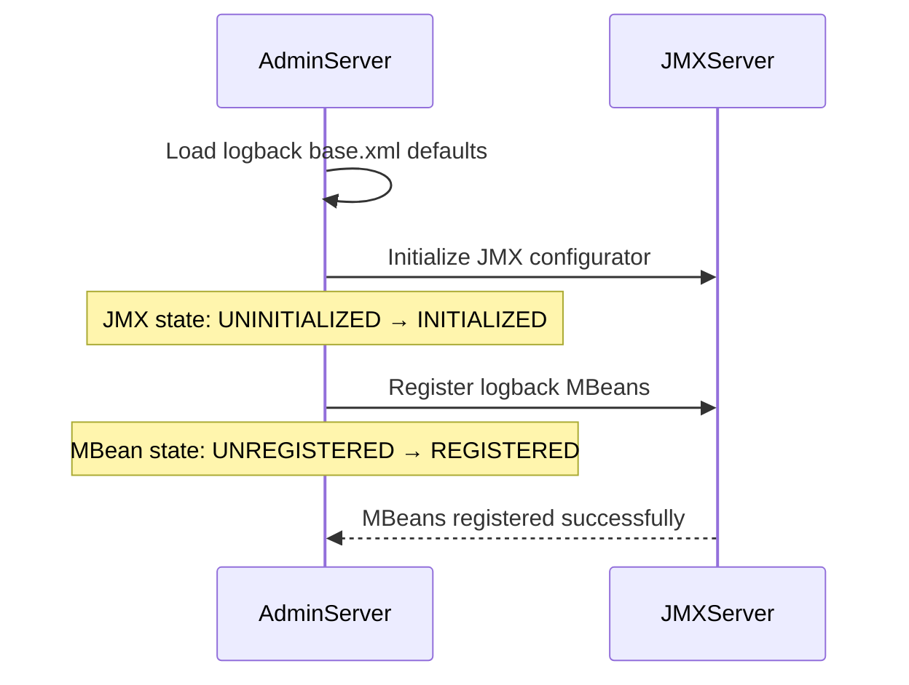
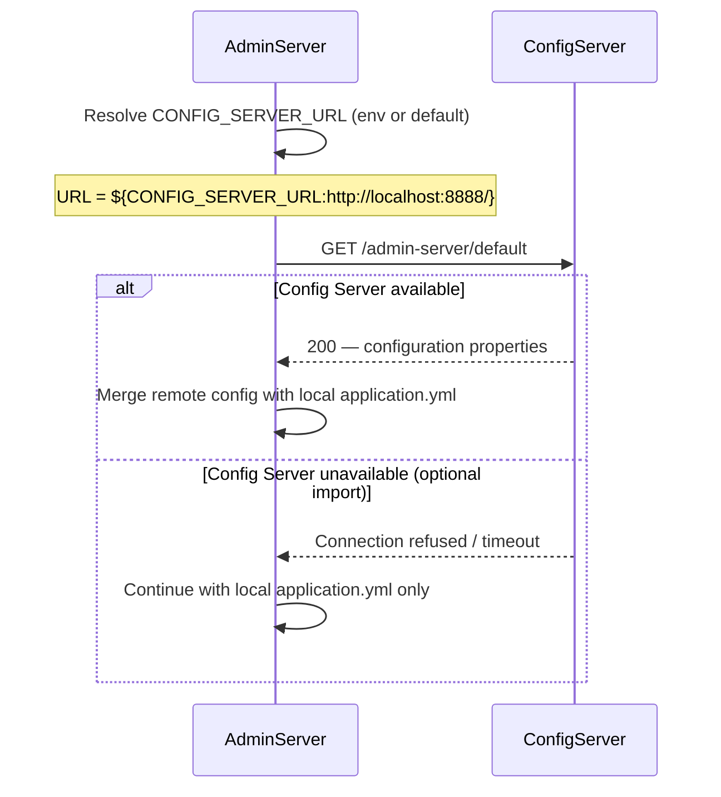

<!-- generated: 2026-04-13T04:08:07.112Z | model: claude-opus-4-6 | sha: 597ad1fb -->

# Scenarios — spring-petclinic-admin-server

## TL;DR for Agents

- **5 total scenarios, 0 tested / 5 untested** — no scenario has any test coverage.
- Most critical scenario: **Application Startup — Admin Server Initialization** — if this fails, the entire admin server is down.
- Most common failure mode: `CONFIG_SERVER_UNAVAILABLE` — appears in 3 of 5 scenarios.
- All scenarios are **startup-time only**; there are no runtime HTTP request/response scenarios.
- State transitions exist in: Admin Server Initialization (`STARTING → RUNNING`), Service Discovery Registration (`UNREGISTERED → REGISTERED`), and JMX Log Level Management (`UNINITIALIZED → INITIALIZED`, `UNREGISTERED → REGISTERED`).

## How to Read This Document

Each scenario describes a discrete operational flow of the `spring-petclinic-admin-server` service, from trigger through completion or failure. Scenarios are ordered from the broadest (full application startup) to the most specific (individual subsystem initialization). Use the Scenario Index table to jump directly to the scenario relevant to the bug or feature you are investigating.

## Scenario Index

| Name | Trigger | Tags | Tested By |
|---|---|---|---|
| [Application Startup — Admin Server Initialization](#scenario-application-startup--admin-server-initialization) | `SpringBootAdminApplication.main()` | `startup`, `initialization`, `spring-boot-admin`, `service-discovery` | ⚠️ None |
| [Application Startup — Docker Profile Activation](#scenario-application-startup--docker-profile-activation) | `spring.profiles.active=docker` | `startup`, `docker`, `profile-activation`, `config-server` | ⚠️ None |
| [Admin Server — Service Discovery Registration](#scenario-admin-server--service-discovery-registration) | `@EnableDiscoveryClient` on startup | `startup`, `service-discovery`, `registration` | ⚠️ None |
| [Admin Server — JMX Log Level Management Initialization](#scenario-admin-server--jmx-log-level-management-initialization) | `logback-spring.xml` loaded on startup | `startup`, `logging`, `jmx`, `management` | ⚠️ None |
| [Admin Server — Configuration Loading from Config Server (Optional)](#scenario-admin-server--configuration-loading-from-config-server-optional) | Optional config server import on startup | `startup`, `config-server`, `optional-dependency` | ⚠️ None |

---

## Scenario: Application Startup — Admin Server Initialization

**Trigger** — JVM process start with `SpringBootAdminApplication.main()`

**Preconditions**
- JVM is available
- Spring classpath contains `spring-boot-admin-server`, `spring-cloud-discovery`, `spring-boot-starter-web`
- `CONFIG_SERVER_URL` environment variable is set or defaults to `http://localhost:8888/`
- `application.yml` is present and readable

**Entry Point** — `spring-petclinic-admin-server/src/main/java/org/springframework/samples/petclinic/admin/SpringBootAdminApplication.java:main`

### Sequence Diagram



### Steps

1. **Spring Boot initializes application context with `@SpringBootApplication`**
   📍 `SpringBootAdminApplication.java`: `class SpringBootAdminApplication`
   ```java
   @SpringBootApplication
   @EnableAdminServer
   @EnableDiscoveryClient
   public class SpringBootAdminApplication {
       public static void main(String[] args) {
           SpringApplication.run(SpringBootAdminApplication.class, args);
       }
   }
   ```

2. **Load `application.yml` configuration; resolve `CONFIG_SERVER_URL` from environment or use default `http://localhost:8888/`**
   📍 `application.yml`: `application.yml configuration file`
   ```yaml
   spring:
     application:
       name: admin-server
     config:
       import: optional:configserver:${CONFIG_SERVER_URL:http://localhost:8888/}
   ```

3. **Enable Spring Boot Admin Server via `@EnableAdminServer` annotation**
   📍 `SpringBootAdminApplication.java`: `@EnableAdminServer annotation`
   ```java
   @EnableAdminServer
   ```

4. **Enable service discovery client via `@EnableDiscoveryClient` annotation**
   📍 `SpringBootAdminApplication.java`: `@EnableDiscoveryClient annotation`
   ```java
   @EnableDiscoveryClient
   ```

5. **Initialize logback configuration with JMX configurator for log level management**
   📍 `logback-spring.xml`: `logback-spring.xml configuration`
   ```xml
   <?xml version="1.0" encoding="UTF-8"?>
   <configuration>
       <include resource="org/springframework/boot/logging/logback/base.xml"/>
       <jmxConfigurator/>
   </configuration>
   ```

6. **Start embedded Tomcat server on configured port (default 8080)**
   📍 `SpringBootAdminApplication.java`: `SpringApplication.run(Class<?> primarySource, String... args): ConfigurableApplicationContext`
   > **State change:** `application state: STARTING → RUNNING`

### Success Outcome

```
Admin Server is running and listening on configured port;
service discovery client registered;
Admin UI accessible at /
```

### Failure Modes

| Condition | Outcome | Error Code | Retryable |
|---|---|---|---|
| Config Server is unreachable and `config.import` is not marked `optional` | Application startup fails with `ConfigServerException` | `CONFIG_SERVER_UNAVAILABLE` | ✅ Yes |
| Port is already in use (default 8080) | Application startup fails with `PortInUseException` | `PORT_IN_USE` | ❌ No |
| Service discovery service (Eureka/Consul) is unreachable | Application starts but service registration fails; Admin Server remains isolated | `DISCOVERY_SERVICE_UNAVAILABLE` | ✅ Yes |
| Required Spring Boot Admin Server dependencies are missing from classpath | Application startup fails with `ClassNotFoundException` | `MISSING_DEPENDENCY` | ❌ No |

### Side Effects

- Embedded Tomcat server started
- Service registered with discovery service
- JMX MBean server initialized for log level management
- Configuration loaded from Config Server (if available)

### Test Coverage

⚠️ **Not covered by tests**

---

## Scenario: Application Startup — Docker Profile Activation

**Trigger** — JVM process start with `spring.profiles.active=docker`

**Preconditions**
- `spring.profiles.active` environment variable or system property is set to `docker`
- `application.yml` contains docker profile configuration
- Config Server is accessible at `http://config-server:8888` (docker network)

**Entry Point** — `spring-petclinic-admin-server/src/main/resources/application.yml`

### Sequence Diagram



### Steps

1. **Spring Boot detects active profile 'docker' and activates corresponding configuration section**
   📍 `application.yml`: `application.yml docker profile configuration`
   _"when: `spring.config.activate.on-profile == 'docker'`"_
   ```yaml
   ---
   spring:
     config:
       activate:
         on-profile: docker
       import: configserver:http://config-server:8888
   ```

2. **Override config server URL to use docker internal hostname `config-server` instead of localhost**
   📍 `application.yml`: `application.yml docker profile import`
   _"when: `spring.config.activate.on-profile == 'docker'`"_
   ```yaml
   import: configserver:http://config-server:8888
   ```

3. **Fetch configuration from Config Server using docker network hostname**
   📍 `application.yml`: `Spring Cloud Config Client bootstrap`

### Success Outcome

```
Admin Server starts with docker-specific configuration;
connects to config-server via docker network at http://config-server:8888
```

### Failure Modes

| Condition | Outcome | Error Code | Retryable |
|---|---|---|---|
| Config Server is unreachable at `http://config-server:8888` (docker network DNS failure or service down) | Application startup fails with `ConfigServerException` | `CONFIG_SERVER_UNAVAILABLE` | ✅ Yes |
| Docker network is not properly configured or container cannot resolve `config-server` hostname | Application startup fails with `UnknownHostException` | `DOCKER_NETWORK_ERROR` | ❌ No |

> ⚠️ **Note:** Unlike the default profile, the docker profile does **not** use the `optional:` prefix on the config import. This means Config Server is **required** when running with the `docker` profile — failure to reach it will prevent startup.

### Side Effects

- Configuration loaded from `http://config-server:8888`
- Service registered with discovery service using docker network hostname

### Test Coverage

⚠️ **Not covered by tests**

---

## Scenario: Admin Server — Service Discovery Registration

**Trigger** — Application startup with `@EnableDiscoveryClient` annotation

**Preconditions**
- Application has started successfully
- `@EnableDiscoveryClient` annotation is present
- Service discovery service (Eureka/Consul/etc) is configured and accessible
- `spring.application.name` is set to `admin-server`

**Entry Point** — `spring-petclinic-admin-server/src/main/java/org/springframework/samples/petclinic/admin/SpringBootAdminApplication.java:SpringBootAdminApplication`

### Sequence Diagram



### Steps

1. **Spring Cloud Discovery Client detects `@EnableDiscoveryClient` annotation**
   📍 `SpringBootAdminApplication.java`: `@EnableDiscoveryClient annotation`
   ```java
   @EnableDiscoveryClient
   ```

2. **Initialize `DiscoveryClient` bean and register service instance with service registry**
   📍 `SpringBootAdminApplication.java`: `Spring Cloud DiscoveryClient initialization`
   > **State change:** `service registration state: UNREGISTERED → REGISTERED`

3. **Register service with name `admin-server` and health check endpoint**
   📍 `application.yml`: `spring.application.name configuration`
   ```yaml
   spring:
     application:
       name: admin-server
   ```

### Success Outcome

```
Service 'admin-server' is registered in service discovery;
other services can discover and communicate with Admin Server.
```

### Failure Modes

| Condition | Outcome | Error Code | Retryable |
|---|---|---|---|
| Service discovery service is unreachable or not configured | Service registration fails; Admin Server starts but is not discoverable | `DISCOVERY_SERVICE_UNAVAILABLE` | ✅ Yes |
| Service name `admin-server` is already registered by another instance | Registration succeeds but may cause routing issues; both instances compete for requests | `DUPLICATE_SERVICE_REGISTRATION` | ❌ No |

### Side Effects

- Service instance registered in Eureka/Consul/etc
- Health check endpoint registered
- Service metadata published to registry

### Test Coverage

⚠️ **Not covered by tests**

---

## Scenario: Admin Server — JMX Log Level Management Initialization

**Trigger** — Application startup with `logback-spring.xml` configuration

**Preconditions**
- Application has started successfully
- `logback-spring.xml` is present in classpath
- JMX is enabled (default in Spring Boot)

**Entry Point** — `spring-petclinic-admin-server/src/main/resources/logback-spring.xml`

### Sequence Diagram



### Steps

1. **Logback loads base configuration from Spring Boot logging defaults**
   📍 `logback-spring.xml`: `logback-spring.xml configuration`
   ```xml
   <include resource="org/springframework/boot/logging/logback/base.xml"/>
   ```

2. **Initialize JMX configurator to expose log level management via JMX MBeans**
   📍 `logback-spring.xml`: `jmxConfigurator element`
   ```xml
   <jmxConfigurator/>
   ```
   > **State change:** `JMX state: UNINITIALIZED → INITIALIZED`

3. **Register logback MBeans with JMX server for remote log level management**
   📍 `logback-spring.xml`: `JMX MBean registration`
   > **State change:** `MBean state: UNREGISTERED → REGISTERED`

### Success Outcome

```
JMX configurator is initialized;
log levels can be managed remotely via JMX console or Admin Server UI.
```

### Failure Modes

| Condition | Outcome | Error Code | Retryable |
|---|---|---|---|
| JMX is disabled or not available | JMX configurator initialization fails silently; log level management via JMX unavailable | `JMX_UNAVAILABLE` | ❌ No |
| `logback-spring.xml` is malformed or contains invalid XML | Application startup fails with `LogbackConfigurationException` | `LOGBACK_CONFIG_ERROR` | ❌ No |

### Side Effects

- Logback MBeans registered with JMX server
- Log level management available via JMX
- Admin Server can modify log levels of registered services

### Test Coverage

⚠️ **Not covered by tests**

---

## Scenario: Admin Server — Configuration Loading from Config Server (Optional)

**Trigger** — Optional config server import on application startup

**Preconditions**
- Application is starting
- `CONFIG_SERVER_URL` environment variable may or may not be set
- Config Server may or may not be available

**Entry Point** — `spring-petclinic-admin-server/src/main/resources/application.yml`

### Sequence Diagram



### Steps

1. **Spring Cloud Config Client attempts to load configuration from Config Server**
   📍 `application.yml`: `application.yml config import`
   ```yaml
   spring:
     config:
       import: optional:configserver:${CONFIG_SERVER_URL:http://localhost:8888/}
   ```

2. **Resolve `CONFIG_SERVER_URL` from environment variable or use default `http://localhost:8888/`**
   📍 `application.yml`: `application.yml environment variable resolution`
   ```yaml
   ${CONFIG_SERVER_URL:http://localhost:8888/}
   ```

3. **Attempt to connect to Config Server at resolved URL**
   📍 `application.yml`: `Spring Cloud Config Client bootstrap`

### Success Outcome

```
Configuration is loaded from Config Server;
application starts with remote configuration merged over local application.yml.
```

### Failure Modes

| Condition | Outcome | Error Code | Retryable |
|---|---|---|---|
| Config Server is unreachable and import is marked `optional` | Configuration loading fails gracefully; application starts with local `application.yml` only | `CONFIG_SERVER_UNAVAILABLE` | ❌ No |
| Config Server returns 404 for application configuration | Configuration loading fails gracefully; application starts with local `application.yml` only | `CONFIG_NOT_FOUND` | ❌ No |
| Config Server returns invalid or malformed configuration | Application startup fails with `ConfigurationException` | `INVALID_CONFIG` | ❌ No |

### Side Effects

- Configuration properties loaded from Config Server
- Local `application.yml` properties merged with remote configuration

### Test Coverage

⚠️ **Not covered by tests**

---

## See Also

- [Spring Boot Admin Server documentation](https://docs.spring-boot-admin.com/)
- [Spring Cloud Config — Client-side usage](https://docs.spring.io/spring-cloud-config/docs/current/reference/html/#_client_side_usage)
- [spring-petclinic-microservices repository](https://github.com/spring-petclinic/spring-petclinic-microservices)
- [Docker Compose configuration](../../docker-compose.yml) for understanding the `docker` profile networking