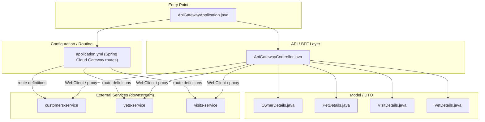
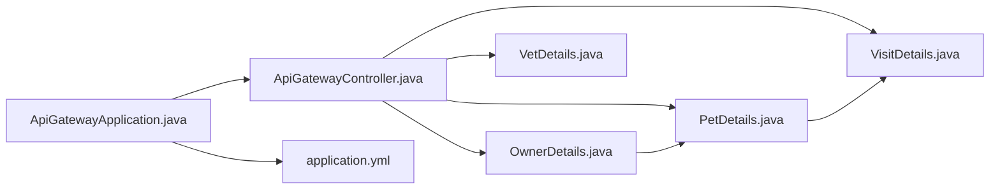

<!-- generated: 2026-04-13T04:14:07.983Z | model: claude-opus-4-6 | sha: 597ad1fb -->

# Architecture — spring-petclinic-api-gateway

## TL;DR for Agents

- **Layered architecture** with a thin Spring Boot API gateway pattern: entry point → configuration/routing → API controllers → DTOs/model, approximately 4 layers.
- The service acts as an **edge/proxy gateway** using Spring Cloud Gateway, routing requests to downstream microservices (customers, vets, visits) and serving a frontend SPA.
- Key modules: `ApiGatewayApplication` (entry point), `ApiGatewayController` (BFF API layer), model/DTO classes, and Spring Cloud Gateway route configuration.
- **No circular dependencies detected** — the dependency graph is simple and clean given the gateway's limited business logic.
- **Entry point for code changes**: start at `ApiGatewayApplication.java` for bootstrap config, `ApiGatewayController.java` for BFF aggregation logic, or `application.yml` for route definitions.

## Layer Architecture

## Module Dependency Graph

> **Note:** No dependency violations detected. All arrows flow top-down from the API layer into model/DTO classes. There are no cases of a model class importing a controller or configuration module.

## Layer Descriptions

| Layer | Directories / Files | Responsibility | May Import From |
|---|---|---|---|
| **Entry Point** | `ApiGatewayApplication.java` | Spring Boot bootstrap; component scanning; enables discovery client | Configuration, API Layer |
| **Configuration / Routing** | `application.yml`, any `@Configuration` beans | Defines Spring Cloud Gateway route predicates and filters; maps `/api/vet/**`, `/api/customer/**`, `/api/visit/**` to downstream services via service discovery | External service URIs (via Eureka/Consul) |
| **API / BFF Layer** | `ApiGatewayController.java` | Backend-for-Frontend aggregation — joins data from multiple downstream services (e.g., enriching owner details with pet visits) into composite responses | Model / DTO layer; WebClient / RestTemplate |
| **Model / DTO** | `OwnerDetails.java`, `PetDetails.java`, `VisitDetails.java`, `VetDetails.java` | Plain Java objects representing aggregated domain data returned by the BFF endpoints | Other DTOs within the same layer only |

## Circular Dependencies

No circular dependencies detected.

The gateway service has a deliberately simple dependency graph. DTOs reference each other in a strict tree: `OwnerDetails` → `PetDetails` → `VisitDetails`. No back-references exist, and the controller layer only depends downward into the model layer.

## Key Design Patterns

### API Gateway / Backend-for-Frontend (BFF)

The service implements the **API Gateway pattern** from the microservices playbook. Spring Cloud Gateway handles transparent reverse-proxying of REST calls to downstream services (`customers-service`, `vets-service`, `visits-service`) based on path predicates defined in `application.yml`. This decouples the frontend SPA from knowing the locations or number of backend services. The gateway also serves as a single TLS/authentication termination point.

### Aggregation / Composition in the Controller

`ApiGatewayController` goes beyond simple proxying by implementing a **BFF aggregation pattern**. For example, when a client requests owner details, the controller fetches the owner from `customers-service`, retrieves visits from `visits-service`, and merges them into a composite `OwnerDetails` response enriched with `PetDetails` and `VisitDetails`. This is done using reactive `WebClient` calls, enabling non-blocking I/O and parallel fan-out to downstream services.

### Immutable DTO Composition

The model classes (`OwnerDetails`, `PetDetails`, `VisitDetails`, `VetDetails`) follow a **composite DTO pattern** where parent objects contain collections of child DTOs. `OwnerDetails` holds a list of `PetDetails`, and each `PetDetails` holds a list of `VisitDetails`. This tree structure mirrors the API response shape and avoids any ORM or persistence concerns — the gateway owns no database.

### Service Discovery Integration

Rather than hard-coding downstream service URLs, the gateway relies on **client-side service discovery** (typically Eureka via `spring-cloud-starter-netflix-eureka-client`). Route definitions in `application.yml` use `lb://` URIs (e.g., `lb://customers-service`), allowing Spring Cloud LoadBalancer to resolve instances at runtime. This pattern enables horizontal scaling of downstream services without gateway redeployment.

## See Also

- [Spring Cloud Gateway Reference](https://docs.spring.io/spring-cloud-gateway/docs/current/reference/html/)
- [spring-petclinic-microservices root README](https://github.com/spring-petclinic/spring-petclinic-microservices/blob/main/README.md)
- [customers-service architecture](../spring-petclinic-customers-service/ARCHITECTURE.md)
- [vets-service architecture](../spring-petclinic-vets-service/ARCHITECTURE.md)