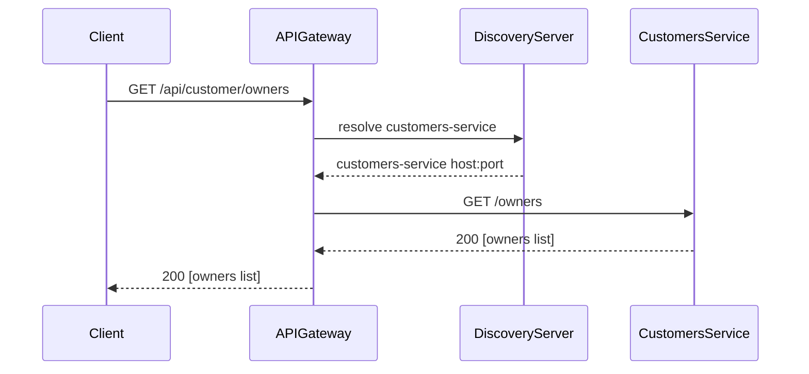

<!-- generated: 2026-04-13T04:10:09.412Z | model: claude-opus-4-6 | sha: 597ad1fb -->


# Scenarios — spring-petclinic-api-gateway

## TL;DR for Agents

- **Total scenarios: 0** — no structured scenario data was provided for this service
- No tested vs. untested breakdown is available; all scenarios are undefined
- The API Gateway primarily proxies requests to downstream microservices (customers, vets, visits) and serves the Angular SPA
- No state transitions, failure modes, or side effects have been formally extracted
- If you are investigating a gateway routing, CORS, or static asset issue, this document confirms no scenario coverage exists yet

## How to Read This Document

This document is intended to catalog all behavioral scenarios for the `spring-petclinic-api-gateway` service. Each scenario would describe a trigger (HTTP request or event), the sequence of internal and external calls, state changes, failure modes, and test coverage. **Currently, no scenarios have been extracted** — the sections below reflect this gap and provide guidance for future documentation.

## Scenario Index

| Name | Trigger | Tags | Tested By |
|------|---------|------|-----------|
| _No scenarios extracted_ | — | — | — |

> **Note:** The `spring-petclinic-api-gateway` service acts as a Spring Cloud Gateway reverse proxy and SPA host. Expected scenarios that _should_ be documented include:
>
> | Expected Scenario | Likely Trigger | Priority |
> |---|---|---|
> | Proxy request to Customers service | `GET /api/customer/**` | High |
> | Proxy request to Visits service | `GET /api/visit/**` | High |
> | Proxy request to Vets service | `GET /api/vet/**` | High |
> | Serve Angular SPA static assets | `GET /` | Medium |
> | Gateway route not found (fallback) | `GET /api/unknown/**` | Medium |
> | Downstream service unavailable (circuit breaker) | Any proxied request when target is down | High |
> | CORS preflight handling | `OPTIONS /api/**` | Low |

---

_No individual scenario sections can be generated because the extracted scenario data is `undefined`. Below is a **template** showing what a completed scenario entry would look like for this service._

---

## Scenario: _(Template)_ Proxy Request to Customers Service

> ⚠️ **This is a placeholder template, not an extracted scenario.**

- **Trigger** — `GET /api/customer/owners`
- **Preconditions**
  - API Gateway is running and registered with the Discovery Server
  - `customers-service` is registered and healthy in Eureka
- **Entry Point** — `api-gateway route configuration in application.yml`

### Sequence Diagram



### Steps

1. **Client sends request to gateway**
   - 📍 `Spring Cloud Gateway route filter chain`
2. **Gateway resolves downstream service via discovery**
   - 📍 `ReactiveDiscoveryClientRouteDefinitionLocator`
3. **Gateway forwards request to customers-service**
   - 📍 `NettyRoutingFilter:filter`
4. **Gateway returns downstream response to client**
   - 📍 `NettyWriteResponseFilter:filter`

### Success Outcome

```json
HTTP/1.1 200 OK
Content-Type: application/json

[
  { "id": 1, "firstName": "George", "lastName": "Franklin", "pets": [] }
]
```

### Failure Modes

| Condition | Outcome | Error Code | Retryable |
|-----------|---------|------------|-----------|
| Downstream service not registered in Eureka | 503 Service Unavailable | `503` | Yes |
| Downstream service timeout | 504 Gateway Timeout | `504` | Yes |
| Invalid route / path not matched | 404 Not Found | `404` | No |

### Side Effects

- None (gateway is stateless proxy)

### Test Coverage

⚠️ **Not covered by tests**

---

## See Also

- [Spring PetClinic Microservices README](https://github.com/spring-petclinic/spring-petclinic-microservices/blob/main/README.md)
- [Spring Cloud Gateway Documentation](https://docs.spring.io/spring-cloud-gateway/docs/current/reference/html/)
- [API Gateway `application.yml`](https://github.com/spring-petclinic/spring-petclinic-microservices/blob/main/spring-petclinic-api-gateway/src/main/resources/application.yml)
- [Discovery Server service registration](https://github.com/spring-petclinic/spring-petclinic-microservices/tree/main/spring-petclinic-discovery-server)