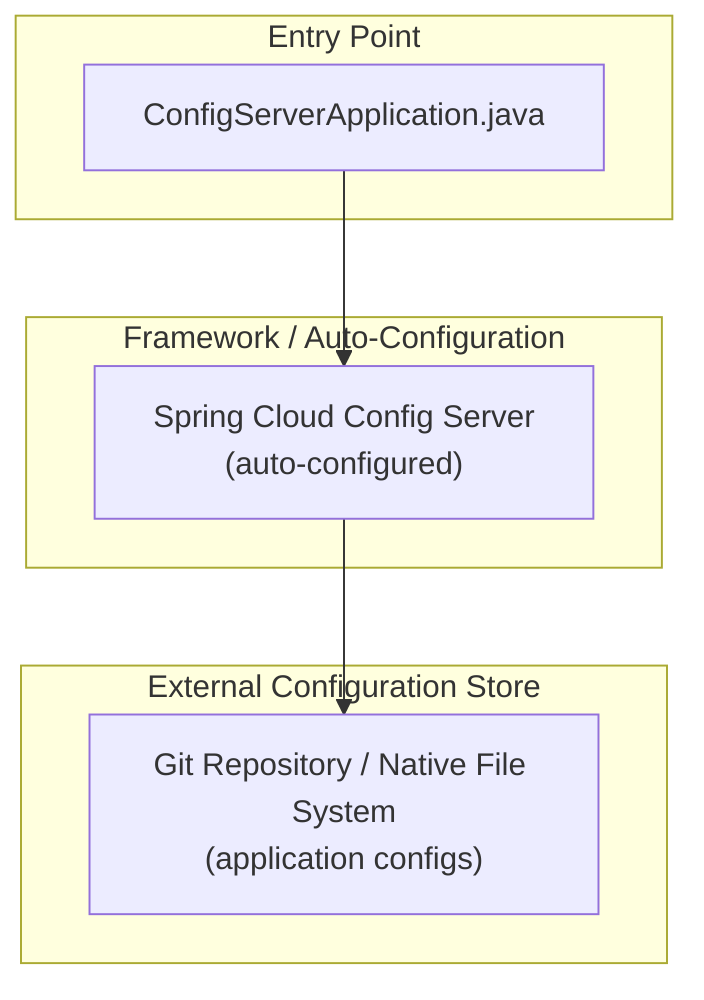
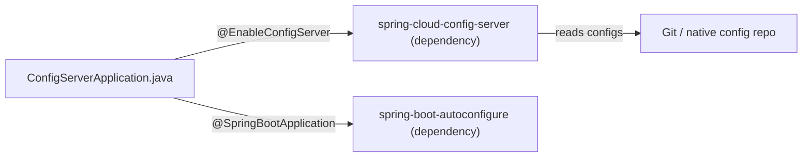

<!-- generated: 2026-04-13T04:10:35.064Z | model: claude-opus-4-6 | sha: 597ad1fb -->

# Architecture — spring-petclinic-config-server

## TL;DR for Agents

- **Minimal single-purpose Spring Boot application** serving as a Spring Cloud Config Server — there is essentially one layer (entry point/bootstrap) with no custom business logic modules.
- **No internal module graph detected** — the service is a thin infrastructure wrapper; all behavior is provided by Spring Cloud Config Server auto-configuration.
- **No circular dependencies** detected.
- **Entry point for code changes**: `ConfigServerApplication.java` (the sole application class annotated with `@EnableConfigServer`).
- **If your task involves business logic, API endpoints, or data layers, this document is NOT relevant** — look at other microservices in the `spring-petclinic-microservices` repo instead.

## Layer Architecture

Because the config server is a thin bootstrap application with no custom layers, the architecture collapses to a single entry-point layer that delegates entirely to Spring Cloud Config Server auto-configuration and the external Git/native configuration repository.

## Module Dependency Graph

The extracted module graph contains **zero application-level nodes**, which is expected for a config server that has no custom source files beyond the bootstrap class.

> No violation edges exist — there are no custom modules to violate layering rules.

## Layer Descriptions

| Layer | Directories / Files | Responsibility | May Import From |
|---|---|---|---|
| **Entry Point** | `src/main/java/**/ConfigServerApplication.java` | Bootstraps the Spring Boot application and enables Config Server via `@EnableConfigServer` | Spring Boot & Spring Cloud starters |
| **Framework (auto-configured)** | `spring-cloud-config-server` (Maven/Gradle dependency) | Exposes REST endpoints (`/{application}/{profile}`, etc.) that serve configuration to client microservices | External configuration store |
| **Configuration** | `src/main/resources/application.yml` (or `bootstrap.yml`) | Defines server port, Git URI, search paths, encryption settings | N/A |
| **External Config Store** | Remote Git repository or local file system | Stores `*.yml` / `*.properties` files for all downstream microservices | N/A (external) |

## Circular Dependencies

No circular dependencies detected.

## Key Design Patterns

### Infrastructure-as-a-Service Pattern

The config server follows the **infrastructure-as-a-service** pattern common in Spring Cloud architectures. Rather than containing domain logic, it exists solely to externalize configuration for the entire microservice fleet. The single `@EnableConfigServer` annotation activates a full REST API and Git-backed configuration resolution engine provided by the framework. This means the codebase is intentionally minimal — any "logic" lives in the Spring Cloud Config Server library itself.

### Convention-over-Configuration Bootstrap

The application relies heavily on **Spring Boot's convention-over-configuration** approach. The `@SpringBootApplication` annotation triggers component scanning, auto-configuration, and property resolution. Combined with `@EnableConfigServer`, this two-annotation bootstrap class is sufficient to stand up a fully functional configuration server. All behavioral customization (Git URI, search paths, encryption keys, refresh intervals) is driven through `application.yml` properties rather than Java code.

### Centralized Configuration Pattern

Within the broader `spring-petclinic-microservices` system, this service implements the **Centralized Configuration** pattern from the Twelve-Factor App methodology. Every other microservice (`customers-service`, `vets-service`, `visits-service`, `api-gateway`) points its `spring.cloud.config.uri` to this server, ensuring a single source of truth for environment-specific configuration. This decouples deployment configuration from application code across the entire system.

## See Also

- [spring-petclinic-microservices root README](https://github.com/spring-petclinic/spring-petclinic-microservices/blob/main/README.md)
- [Spring Cloud Config Server reference documentation](https://docs.spring.io/spring-cloud-config/docs/current/reference/html/#_spring_cloud_config_server)
- [spring-petclinic-config (external config repository)](https://github.com/spring-petclinic/spring-petclinic-microservices-config)
- [SCENARIOS.md](SCENARIOS.md) — operational runbooks and common change scenarios