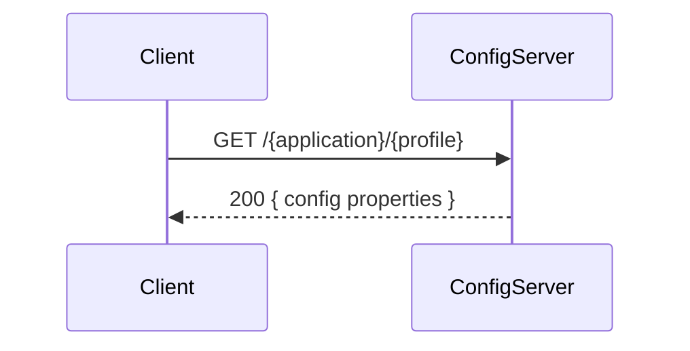

<!-- generated: 2026-04-13T04:00:21.562Z | model: claude-opus-4-6 | sha: 597ad1fb -->

# Scenarios — spring-petclinic-config-server

## TL;DR for Agents

- **Total scenarios: 0** — no scenarios were extracted for this service
- There are **0 tested** and **0 untested** scenarios; no critical scenario identified
- The config server is an infrastructure service (Spring Cloud Config Server) that serves externalized configuration to other microservices — it has no business-domain scenarios
- No state transitions, failure modes, or side effects have been documented
- If you are investigating a bug related to **configuration loading, property resolution, or service bootstrap failures**, this service is relevant even though no explicit scenarios are cataloged here

## How to Read This Document

This document catalogs the behavioral scenarios for the `spring-petclinic-config-server` service. Each scenario (when present) includes its trigger, sequence diagram, step-by-step flow, failure modes, and test coverage. Since no scenarios were extracted for this infrastructure service, the sections below are empty but preserved for structural consistency.

## Scenario Index

| Name | Trigger | Tags | Tested By |
|------|---------|------|-----------|
| _(none extracted)_ | — | — | — |

> **Note:** The `spring-petclinic-config-server` is a Spring Cloud Config Server whose primary responsibility is serving configuration files (from a Git repository or local classpath) to downstream microservices (`customers-service`, `vets-service`, `visits-service`, `api-gateway`). Its behavior is largely defined by the Spring Cloud Config framework rather than custom application-level scenarios. Typical interactions include:
>
> | Interaction | HTTP Method + Path | Description |
> |---|---|---|
> | Fetch config for a service | `GET /{application}/{profile}` | Returns configuration properties for the named application and profile |
> | Fetch specific label | `GET /{application}/{profile}/{label}` | Returns configuration for a specific Git branch/tag/label |
> | Health check | `GET /actuator/health` | Standard Spring Boot health endpoint |
>
> These are framework-provided endpoints with no custom code paths to document as scenarios. If custom scenarios are added to this service in the future, they should be documented following the section template below.

---

_No scenarios to render. The per-scenario section template is preserved here for future use:_

<!--
## Scenario: {Name}

**Trigger** — `METHOD /path` or event name

**Preconditions**
- Required pre-state item

**Entry Point** — `file:functionName`

### Sequence Diagram


### Steps
1. **Step description**
   📍 `file:functionName`

### Success Outcome
```json
{}
```

### Failure Modes
| Condition | Outcome | Error Code | Retryable |
|-----------|---------|------------|-----------|

### Side Effects
- None

### Test Coverage
⚠️ **Not covered by tests**
-->

## See Also

- [Spring Cloud Config Server documentation](https://docs.spring.io/spring-cloud-config/docs/current/reference/html/#_spring_cloud_config_server)
- [spring-petclinic-microservices repository](https://github.com/spring-petclinic/spring-petclinic-microservices)
- [Spring Boot Actuator endpoints](https://docs.spring.io/spring-boot/docs/current/reference/html/actuator.html)
- [ARCHITECTURE.md](ARCHITECTURE.md) — overall system architecture and service interactions