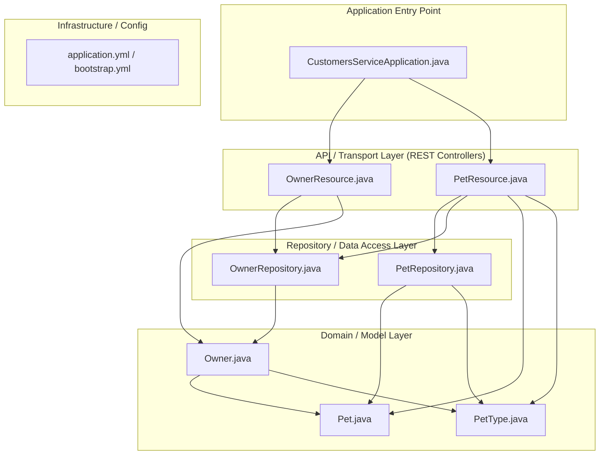
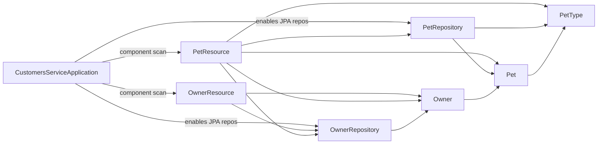

<!-- generated: 2026-04-13T04:19:52.306Z | model: claude-opus-4-6 | sha: 597ad1fb -->

# Architecture — spring-petclinic-customers-service

## TL;DR for Agents

- **Classic layered architecture** (Controller → Service → Repository) built with Spring Boot and Spring Data JPA — 4 layers total.
- Key modules: `OwnerResource` and `PetResource` (REST controllers), `OwnerRepository` and `PetRepository` (Spring Data JPA repositories), `Owner` and `Pet` domain models.
- **No circular dependencies detected** — dependency flow is strictly top-to-bottom.
- Entry point for code changes is `CustomersServiceApplication.java` (Spring Boot main class); for API changes start at the `web` package controllers.
- Service registers with a discovery server (Eureka) and is part of the `spring-petclinic-microservices` ecosystem.

## Layer Architecture

## Module Dependency Graph

> No dependency violations detected. All arrows flow from upper layers (controllers) to lower layers (repositories, models). No repository is imported directly by another repository, and no model imports a controller or repository.

## Layer Descriptions

| Layer | Directories / Files | Responsibility | May Import From |
|---|---|---|---|
| **Application Entry Point** | `src/main/java/.../CustomersServiceApplication.java` | Bootstraps Spring Boot, enables discovery client, triggers component scanning and auto-configuration. | All layers (transitively via Spring context) |
| **API / Transport** | `src/main/java/.../web/OwnerResource.java`, `PetResource.java` | Exposes REST endpoints (`/owners`, `/owners/{id}/pets`), handles HTTP request/response mapping, input validation, error handling. | Domain/Model, Repository |
| **Domain / Model** | `src/main/java/.../model/Owner.java`, `Pet.java`, `PetType.java` | JPA entity definitions, domain validation constraints (`@NotEmpty`, `@Column`), entity relationships (`@OneToMany`, `@ManyToOne`). | Other model classes only |
| **Repository / Data Access** | `src/main/java/.../model/OwnerRepository.java`, `PetRepository.java` | Spring Data JPA interfaces providing CRUD and custom query methods for persistence. | Domain/Model |
| **Infrastructure / Config** | `src/main/resources/application.yml`, `bootstrap.yml` | Externalized configuration: database connection, server port, Eureka registration, Config Server bootstrap. | N/A (declarative) |

## Circular Dependencies

No circular dependencies detected.

The dependency graph follows a strict top-to-bottom flow: controllers depend on repositories and models, repositories depend on models, and models reference only other models within the same aggregate. This clean layering is typical of well-structured Spring Boot CRUD services.

## Key Design Patterns

### Spring Data Repository Pattern

The service leverages Spring Data JPA's repository abstraction extensively. `OwnerRepository` and `PetRepository` are interfaces extending `JpaRepository`, which means the framework generates the implementation at runtime. This eliminates boilerplate data access code and provides standard CRUD operations, pagination, and the ability to define custom queries via method naming conventions (e.g., `findByLastName`). The repositories serve as the sole data access boundary — controllers never interact with `EntityManager` or JDBC directly.

### Aggregate Root with Embedded Collection

The `Owner` entity acts as an aggregate root that owns a collection of `Pet` entities (`@OneToMany` with cascade). This pattern from Domain-Driven Design ensures that pets are always accessed and modified through their owner, maintaining data consistency. The `PetResource` controller still uses `OwnerRepository` to look up the parent owner before associating a new pet, reinforcing this aggregate boundary in the API layer.

### RESTful Resource Controllers with Constructor Injection

`OwnerResource` and `PetResource` follow the Spring `@RestController` pattern, mapping HTTP verbs to domain operations. Dependencies (repositories) are injected via constructor injection (preferred over field injection), which makes the controllers easily testable and ensures immutability of dependencies. Validation is handled declaratively using Bean Validation annotations (`@Valid`) on request bodies, with Spring translating constraint violations into appropriate HTTP 400 responses.

### Microservice Infrastructure Patterns

The service participates in the broader microservices ecosystem through several Spring Cloud patterns: **service discovery** (Eureka client registration via `@EnableDiscoveryClient`), **externalized configuration** (Spring Cloud Config via `bootstrap.yml`), and **health monitoring** (Spring Boot Actuator endpoints). These cross-cutting concerns are configured declaratively and do not pollute the business logic layers.

## See Also

- [spring-petclinic-microservices (parent project)](https://github.com/spring-petclinic/spring-petclinic-microservices)
- [Spring Data JPA Reference — Repository Abstraction](https://docs.spring.io/spring-data/jpa/docs/current/reference/html/#repositories)
- [Spring Cloud Netflix — Service Discovery](https://cloud.spring.io/spring-cloud-netflix/reference/html/)
- [Spring Boot Actuator — Production-Ready Features](https://docs.spring.io/spring-boot/docs/current/reference/html/actuator.html)