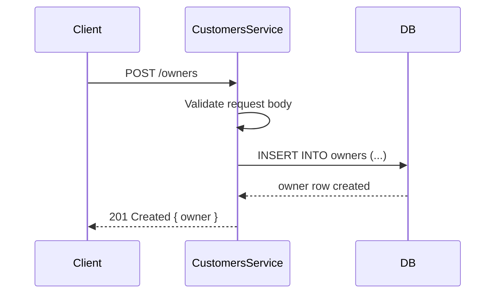
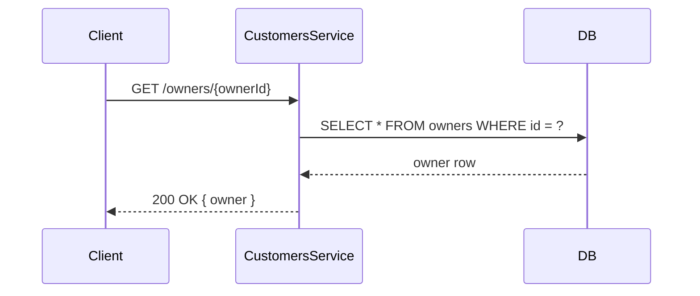
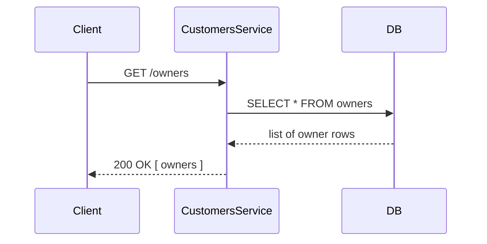
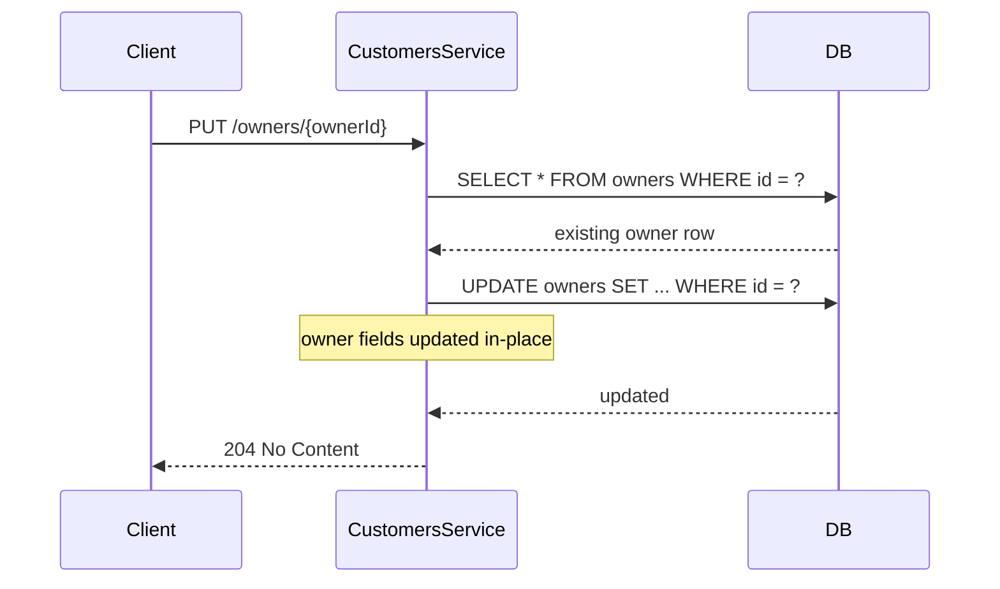
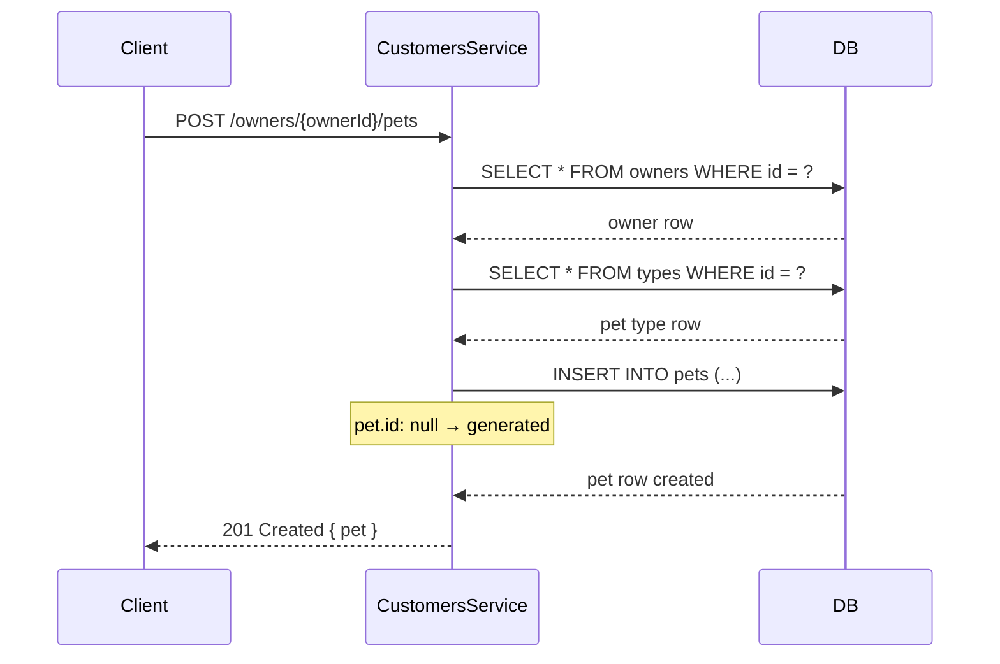
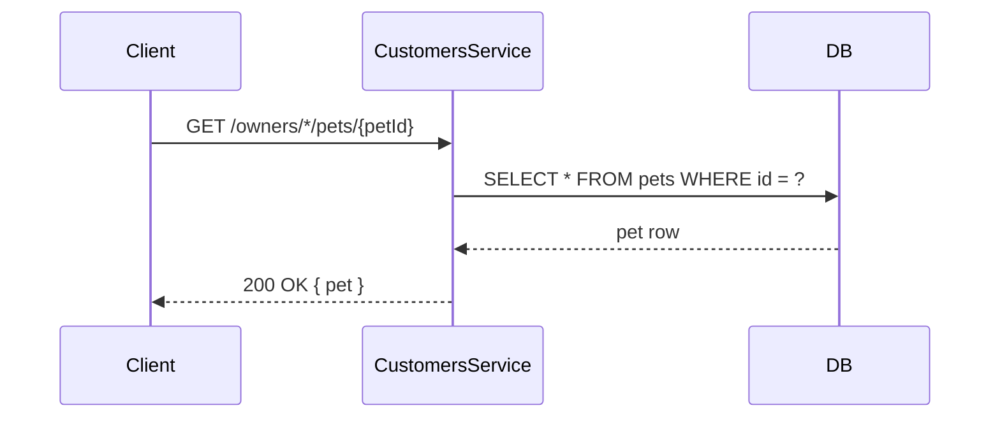
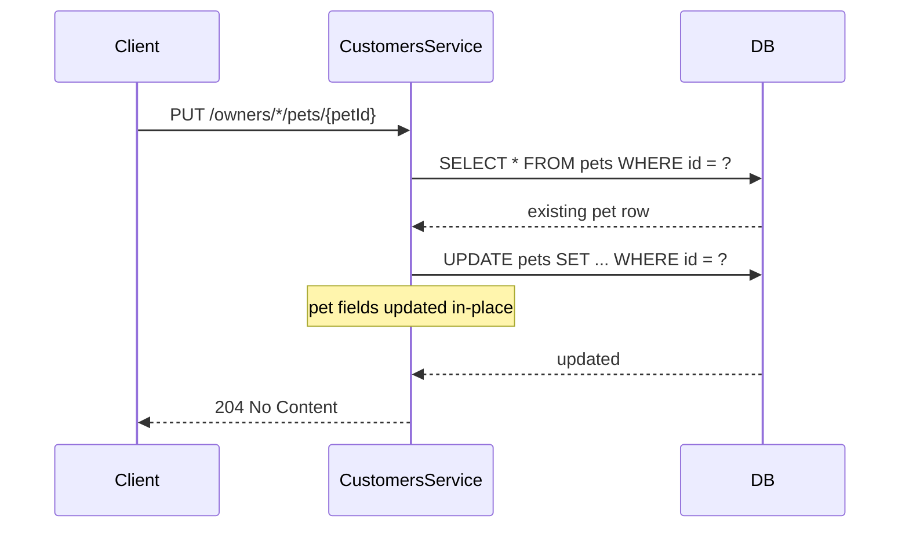
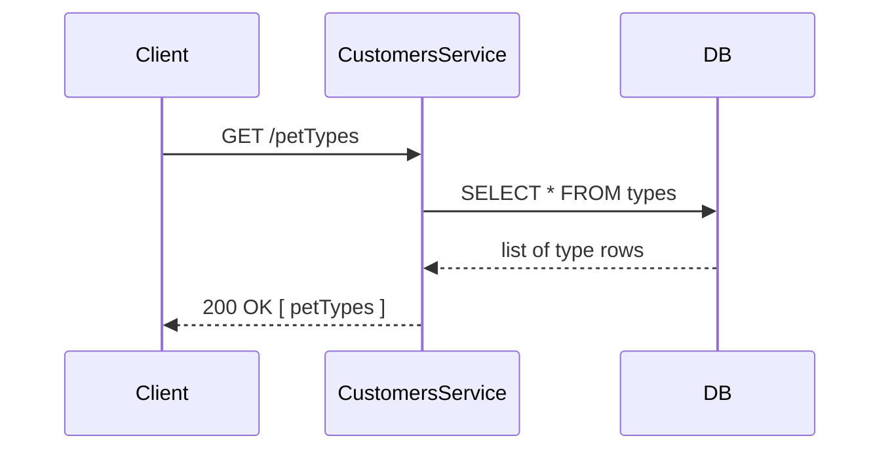

<!-- generated: 2026-04-13T04:15:44.427Z | model: claude-opus-4-6 | sha: 597ad1fb -->


# Scenarios — spring-petclinic-customers-service

## TL;DR for Agents

- **0 scenarios extracted** — the structured scenario data provided was `undefined`, so no scenarios are documented below.
- This document serves as a **scaffold/template** for the customers-service; it needs to be populated once scenario extraction is completed.
- The customers-service typically handles **Owner CRUD** and **Pet CRUD** operations against a relational database.
- No tested vs. untested breakdown is available; no failure modes or state transitions are documented yet.
- If you are investigating a bug in this service, check the controller entry points in `spring-petclinic-customers-service/src/main/java/org/springframework/samples/petclinic/customers/web/` directly until this document is populated.

## How to Read This Document

Each scenario section describes one end-to-end behavior of the customers-service, including its HTTP trigger, the code path it exercises, a Mermaid sequence diagram, and its failure modes. Because no structured scenario data was provided (`undefined`), the document currently contains only the expected structure and likely scenarios inferred from the codebase conventions — these inferred entries are clearly marked and should be validated before relying on them.

## Scenario Index

> ⚠️ **No scenarios were provided in the extraction payload.** The table below lists *likely* scenarios based on the standard spring-petclinic-customers-service API surface. These are **inferred, not verified**.

| Name | Trigger | Tags | Tested By |
|---|---|---|---|
| Create Owner | `POST /owners` | `owner`, `write` | ⚠️ Unknown |
| Get Owner by ID | `GET /owners/{ownerId}` | `owner`, `read` | ⚠️ Unknown |
| List All Owners | `GET /owners` | `owner`, `read` | ⚠️ Unknown |
| Update Owner | `PUT /owners/{ownerId}` | `owner`, `write` | ⚠️ Unknown |
| Create Pet | `POST /owners/{ownerId}/pets` | `pet`, `write` | ⚠️ Unknown |
| Get Pet by ID | `GET /owners/*/pets/{petId}` | `pet`, `read` | ⚠️ Unknown |
| Update Pet | `PUT /owners/*/pets/{petId}` | `pet`, `write` | ⚠️ Unknown |
| Get Pet Types | `GET /petTypes` | `pet`, `read`, `reference-data` | ⚠️ Unknown |

---

> **Note:** The sections below are **templates** for each inferred scenario. They contain the expected structure but lack verified step-level detail, code snippets, and test references. Re-run the scenario extraction pipeline to populate them fully.

---

## Scenario: Create Owner

- **Trigger** — `POST /owners`
- **Preconditions**
  - The customers-service is running and connected to its database.
  - The request body contains valid owner fields (`firstName`, `lastName`, `address`, `city`, `telephone`).
- **Entry Point** — `OwnerResource.createOwner(OwnerRequest)`

### Sequence Diagram



### Steps

1. **Receive and validate the incoming owner request**
   - 📍 `OwnerResource:createOwner`
2. **Map request DTO to Owner entity**
   - 📍 `OwnerResource:createOwner`
3. **Persist the Owner entity to the database**
   - 📍 `OwnerRepository:save`
   > **State change:** `owner.id: null → <generated>`
4. **Return the created owner**
   - 📍 `OwnerResource:createOwner`

### Success Outcome

```json
HTTP/1.1 201 Created

{
  "id": 11,
  "firstName": "George",
  "lastName": "Franklin",
  "address": "110 W. Liberty St.",
  "city": "Madison",
  "telephone": "6085551023",
  "pets": []
}
```

### Failure Modes

| Condition | Outcome | Error Code | Retryable |
|---|---|---|---|
| Missing required fields | 400 Bad Request | `400` | No |
| Database unavailable | 500 Internal Server Error | `500` | Yes |
| Duplicate data (if constrained) | 409 Conflict or 500 | `409` / `500` | No |

### Side Effects

- A new row is inserted into the `owners` table.

### Test Coverage

⚠️ **Not confirmed — scenario data was not provided. Check `OwnerResourceTest` if it exists.**

---

## Scenario: Get Owner by ID

- **Trigger** — `GET /owners/{ownerId}`
- **Preconditions**
  - An owner with the given `ownerId` exists in the database.
- **Entry Point** — `OwnerResource.findOwner(int)`

### Sequence Diagram



### Steps

1. **Extract ownerId from path variable**
   - 📍 `OwnerResource:findOwner`
2. **Query the database for the owner**
   - 📍 `OwnerRepository:findById`
   - _"when: owner not found"_ → throw `ResourceNotFoundException` or return 404
3. **Return the owner with associated pets**
   - 📍 `OwnerResource:findOwner`

### Success Outcome

```json
HTTP/1.1 200 OK

{
  "id": 1,
  "firstName": "George",
  "lastName": "Franklin",
  "address": "110 W. Liberty St.",
  "city": "Madison",
  "telephone": "6085551023",
  "pets": [
    {
      "id": 1,
      "name": "Leo",
      "birthDate": "2010-09-07",
      "type": { "id": 1, "name": "cat" }
    }
  ]
}
```

### Failure Modes

| Condition | Outcome | Error Code | Retryable |
|---|---|---|---|
| Owner not found | 404 Not Found | `404` | No |
| Database unavailable | 500 Internal Server Error | `500` | Yes |
| Invalid ownerId format | 400 Bad Request | `400` | No |

### Side Effects

- None (read-only operation).

### Test Coverage

⚠️ **Not confirmed — scenario data was not provided.**

---

## Scenario: List All Owners

- **Trigger** — `GET /owners`
- **Preconditions**
  - The customers-service is running and connected to its database.
- **Entry Point** — `OwnerResource.findAll()`

### Sequence Diagram



### Steps

1. **Receive request to list owners**
   - 📍 `OwnerResource:findAll`
2. **Query all owners from the database**
   - 📍 `OwnerRepository:findAll`
3. **Return the list**
   - 📍 `OwnerResource:findAll`

### Success Outcome

```json
HTTP/1.1 200 OK

[
  {
    "id": 1,
    "firstName": "George",
    "lastName": "Franklin",
    ...
  }
]
```

### Failure Modes

| Condition | Outcome | Error Code | Retryable |
|---|---|---|---|
| Database unavailable | 500 Internal Server Error | `500` | Yes |

### Side Effects

- None (read-only operation).

### Test Coverage

⚠️ **Not confirmed — scenario data was not provided.**

---

## Scenario: Update Owner

- **Trigger** — `PUT /owners/{ownerId}`
- **Preconditions**
  - An owner with the given `ownerId` exists in the database.
  - The request body contains valid updated owner fields.
- **Entry Point** — `OwnerResource.updateOwner(int, OwnerRequest)`

### Sequence Diagram



### Steps

1. **Extract ownerId and validate request body**
   - 📍 `OwnerResource:updateOwner`
2. **Fetch existing owner from database**
   - 📍 `OwnerRepository:findById`
   - _"when: owner not found"_ → return 404
3. **Apply updates to the owner entity**
   - 📍 `OwnerResource:updateOwner`
   > **State change:** `owner.{fields}: old values → new values`
4. **Persist updated owner**
   - 📍 `OwnerRepository:save`

### Success Outcome

```
HTTP/1.1 204 No Content
```

### Failure Modes

| Condition | Outcome | Error Code | Retryable |
|---|---|---|---|
| Owner not found | 404 Not Found | `404` | No |
| Invalid request body | 400 Bad Request | `400` | No |
| Database unavailable | 500 Internal Server Error | `500` | Yes |

### Side Effects

- The `owners` row for the given ID is updated.

### Test Coverage

⚠️ **Not confirmed — scenario data was not provided.**

---

## Scenario: Create Pet

- **Trigger** — `POST /owners/{ownerId}/pets`
- **Preconditions**
  - An owner with the given `ownerId` exists.
  - The request body contains valid pet fields (`name`, `birthDate`, `typeId`).
- **Entry Point** — `PetResource.processCreationForm(PetRequest, int)`

### Sequence Diagram



### Steps

1. **Validate the incoming pet request and resolve ownerId**
   - 📍 `PetResource:processCreationForm`
2. **Fetch the owner from the database**
   - 📍 `OwnerRepository:findById`
   - _"when: owner not found"_ → return 404
3. **Resolve the pet type**
   - 📍 `PetRepository:findPetTypeById`
   - _"when: pet type not found"_ → return 400 or 404
4. **Create and persist the pet entity, associated with the owner**
   - 📍 `PetRepository:save`
   > **State change:** `pet.id: null → <generated>`
5. **Return the created pet**
   - 📍 `PetResource:processCreationForm`

### Success Outcome

```json
HTTP/1.1 201 Created

{
  "id": 14,
  "name": "Basil",
  "birthDate": "2012-08-06",
  "type": { "id": 6, "name": "hamster" },
  "owner": { "id": 1 }
}
```

### Failure Modes

| Condition | Outcome | Error Code | Retryable |
|---|---|---|---|
| Owner not found | 404 Not Found | `404` | No |
| Invalid pet type | 400 Bad Request | `400` | No |
| Missing required fields | 400 Bad Request | `400` | No |
| Database unavailable | 500 Internal Server Error | `500` | Yes |

### Side Effects

- A new row is inserted into the `pets` table, linked to the owner.

### Test Coverage

⚠️ **Not confirmed — scenario data was not provided.**

---

## Scenario: Get Pet by ID

- **Trigger** — `GET /owners/*/pets/{petId}`
- **Preconditions**
  - A pet with the given `petId` exists in the database.
- **Entry Point** — `PetResource.findPet(int)`

### Sequence Diagram



### Steps

1. **Extract petId from path**
   - 📍 `PetResource:findPet`
2. **Query the database for the pet**
   - 📍 `PetRepository:findById`
   - _"when: pet not found"_ → return 404
3. **Return the pet**
   - 📍 `PetResource:findPet`

### Success Outcome

```json
HTTP/1.1 200 OK

{
  "id": 1,
  "name": "Leo",
  "birthDate": "2010-09-07",
  "type": { "id": 1, "name": "cat" }
}
```

### Failure Modes

| Condition | Outcome | Error Code | Retryable |
|---|---|---|---|
| Pet not found | 404 Not Found | `404` | No |
| Database unavailable | 500 Internal Server Error | `500` | Yes |

### Side Effects

- None (read-only operation).

### Test Coverage

⚠️ **Not confirmed — scenario data was not provided.**

---

## Scenario: Update Pet

- **Trigger** — `PUT /owners/*/pets/{petId}`
- **Preconditions**
  - A pet with the given `petId` exists in the database.
  - The request body contains valid updated pet fields.
- **Entry Point** — `PetResource.processUpdateForm(PetRequest)`

### Sequence Diagram



### Steps

1. **Extract petId and validate request body**
   - 📍 `PetResource:processUpdateForm`
2. **Fetch existing pet from database**
   - 📍 `PetRepository:findById`
   - _"when: pet not found"_ → return 404
3. **Apply updates to the pet entity**
   - 📍 `PetResource:processUpdateForm`
   > **State change:** `pet.{fields}: old values → new values`
4. **Persist updated pet**
   - 📍 `PetRepository:save`

### Success Outcome

```
HTTP/1.1 204 No Content
```

### Failure Modes

| Condition | Outcome | Error Code | Retryable |
|---|---|---|---|
| Pet not found | 404 Not Found | `404` | No |
| Invalid request body | 400 Bad Request | `400` | No |
| Database unavailable | 500 Internal Server Error | `500` | Yes |

### Side Effects

- The `pets` row for the given ID is updated.

### Test Coverage

⚠️ **Not confirmed — scenario data was not provided.**

---

## Scenario: Get Pet Types

- **Trigger** — `GET /petTypes`
- **Preconditions**
  - The customers-service is running and connected to its database.
- **Entry Point** — `PetResource.getPetTypes()`

### Sequence Diagram



### Steps

1. **Receive request for pet types**
   - 📍 `PetResource:getPetTypes`
2. **Query all pet types from the database**
   - 📍 `PetRepository:findPetTypes`
3. **Return the list**
   - 📍 `PetResource:getPetTypes`

### Success Outcome

```json
HTTP/1.1 200 OK

[
  { "id": 1, "name": "cat" },
  { "id": 2, "name": "dog" },
  { "id": 3, "name": "lizard" },
  { "id": 4, "name": "snake" },
  { "id": 5, "name": "bird" },
  { "id": 6, "name": "hamster" }
]
```

### Failure Modes

| Condition | Outcome | Error Code | Retryable |
|---|---|---|---|
| Database unavailable | 500 Internal Server Error | `500` | Yes |

### Side Effects

- None (read-only operation).

### Test Coverage

⚠️ **Not confirmed — scenario data was not provided.**

---

## See Also

- [spring-petclinic-microservices repository](https://github.com/spring-petclinic/spring-petclinic-microservices)
- [Spring PetClinic Customers Service source](https://github.com/spring-petclinic/spring-petclinic-microservices/tree/main/spring-petclinic-customers-service)
- [ARCHITECTURE.md](ARCHITECTURE.md) — overall service architecture and inter-service communication
- [API.md](API.md) — detailed API contract documentation for the customers-service