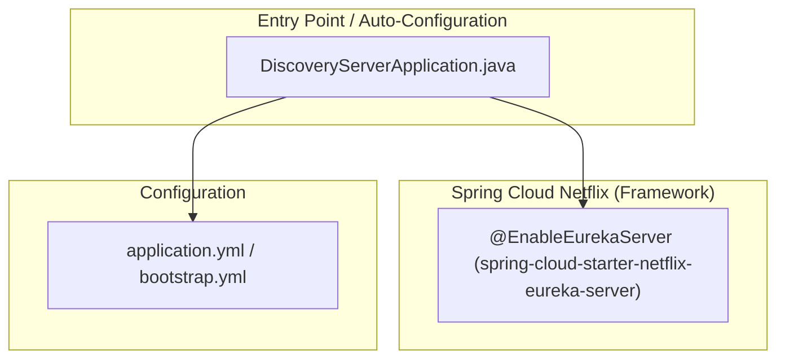
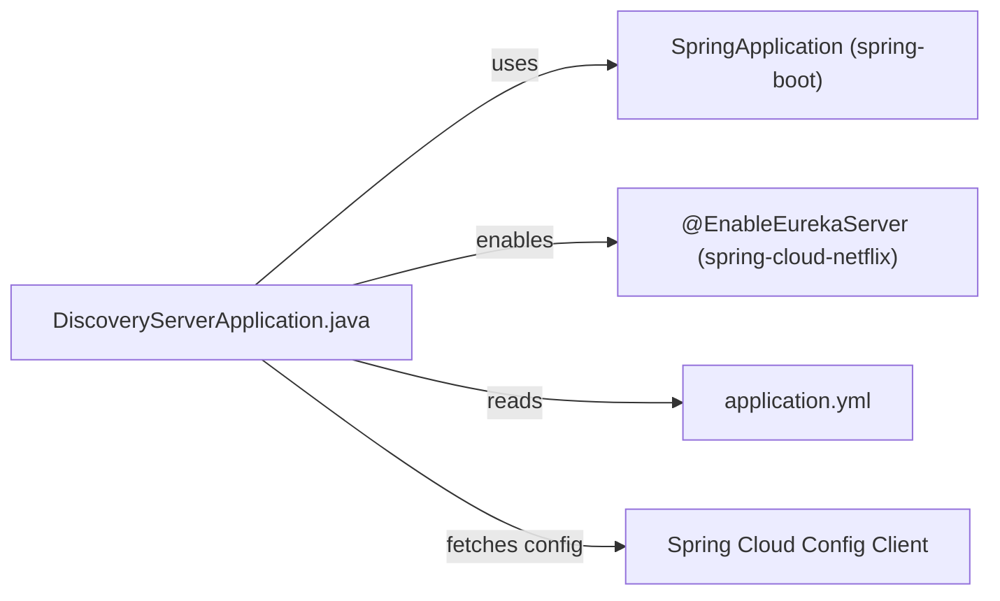

<!-- generated: 2026-04-13T04:18:25.424Z | model: claude-opus-4-6 | sha: 597ad1fb -->

# Architecture — spring-petclinic-discovery-server

## TL;DR for Agents

- **Minimal single-class Spring Boot application** acting as a Netflix Eureka Server for service discovery — there is essentially one architectural layer (entry point/configuration).
- **No custom business logic, repository, or service layers** — the entire module is a thin wrapper that enables `@EnableEurekaServer` on a Spring Boot application.
- **No circular dependencies** — the module graph is trivially simple with only one source file.
- **Framework: Spring Boot + Spring Cloud Netflix Eureka** — all heavy lifting is done by auto-configuration from dependencies declared in `pom.xml`.
- **Entry point for any code change:** `src/main/java/org/springframework/samples/petclinic/discovery/DiscoveryServerApplication.java`

## Layer Architecture

> **Note:** Because this service is a pure infrastructure wrapper, there are no service, domain, or repository layers. The Eureka Server functionality is entirely provided by the Spring Cloud Netflix library activated via the `@EnableEurekaServer` annotation.

## Module Dependency Graph

There are no internal module-to-module import edges beyond the single application class because the service contains **only one Java source file**. All other behavior is injected by Spring Boot auto-configuration from classpath dependencies.

## Layer Descriptions

| Layer | Directories / Files | Responsibility | May Import From |
|---|---|---|---|
| **Entry Point** | `src/main/java/.../discovery/DiscoveryServerApplication.java` | Bootstraps the Spring Boot application and activates the Eureka Server via `@EnableEurekaServer` | Spring Boot, Spring Cloud Netflix |
| **Configuration** | `src/main/resources/application.yml` | Declares Eureka server settings (port, peer awareness, registry fetch behavior), Spring Cloud Config connection | N/A (consumed by framework) |
| **Framework / Auto-Configuration** | `spring-cloud-starter-netflix-eureka-server`, `spring-boot-starter` (Maven dependencies) | Provides the full Eureka Server runtime, dashboard UI, REST API for service registration/heartbeat | Internal Spring libraries |

## Circular Dependencies

No circular dependencies detected.

With only a single application class and no custom inter-module imports, circular dependencies are structurally impossible in this service.

## Key Design Patterns

### Convention-over-Configuration (Spring Boot Auto-Configuration)

The discovery server is a textbook example of Spring Boot's convention-over-configuration philosophy. By adding `spring-cloud-starter-netflix-eureka-server` to the classpath and annotating the main class with `@EnableEurekaServer`, the entire Eureka Server — including its REST registration API, heartbeat management, peer replication, and web dashboard — is activated without a single line of custom infrastructure code. The `application.yml` file provides the minimal overrides needed (e.g., disabling self-registration with `eureka.client.register-with-eureka: false`).

### Infrastructure-as-a-Service Pattern

This module follows the pattern of wrapping a complex infrastructure concern (service discovery) into a standalone, independently deployable microservice. It has no domain logic of its own; its sole purpose is to provide a registry that other services (`petclinic-vets-service`, `petclinic-visits-service`, `petclinic-customers-service`, `petclinic-api-gateway`) register with and query. This clean separation means the discovery server can be versioned, scaled, and deployed independently of any business service.

### Externalized Configuration via Spring Cloud Config

Rather than hardcoding configuration, the discovery server is designed to fetch its configuration from the `spring-petclinic-config-server` at startup (via `spring-cloud-starter-config`). This enables centralized management of Eureka tuning parameters (lease durations, eviction intervals, peer URLs) across environments without rebuilding the artifact.

## See Also

- [spring-petclinic-microservices (root repo)](https://github.com/spring-petclinic/spring-petclinic-microservices)
- [Spring Cloud Netflix Eureka documentation](https://cloud.spring.io/spring-cloud-netflix/reference/html/)
- [spring-petclinic-config-server](../spring-petclinic-config-server/) — centralized configuration source for this and all other services
- [spring-petclinic-api-gateway](../spring-petclinic-api-gateway/) — primary consumer of the discovery registry for routing