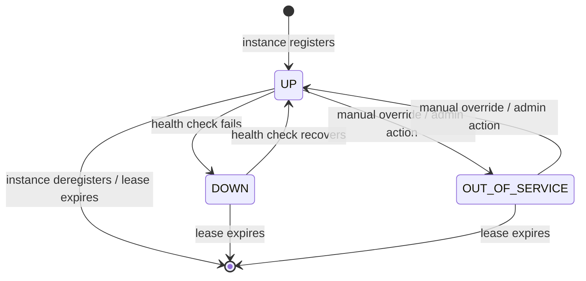

<!-- generated: 2026-04-13T04:19:08.761Z | model: claude-opus-4-6 | sha: 597ad1fb -->


# Business Rules — spring-petclinic-discovery-server

## TL;DR for Agents

- **Zero custom state machines, zero business rules, zero permission matrices** — this service is pure infrastructure.
- The discovery server is a **Netflix Eureka Server** whose sole purpose is service registration and discovery for the Spring PetClinic microservices ecosystem.
- There are **no domain entities, no business calculations, and no custom authorization rules** in this service.
- The most critical constraint: **the discovery server must be running and reachable before other microservices can register or discover each other**.
- Configuration-level settings (e.g., Eureka self-preservation, lease intervals) are the only "rules" governing behavior — all inherited from Spring Cloud Netflix defaults.

---

## State Machines

No custom state machines were detected in this service.

The discovery server does not manage domain entities with lifecycle states. It delegates all service-registry state management to the embedded **Netflix Eureka Server**, which internally tracks service instance states:



> **Note:** These states are managed by the Eureka framework itself, not by custom application code in this service. They are documented here for completeness since agents interacting with the microservices ecosystem need to understand instance lifecycle.

### Transitions Reference (Eureka-internal)

| From | To | Trigger | Guards | Side Effects | Code Ref |
|---|---|---|---|---|---|
| `(none)` | `UP` | Service instance sends registration request | Valid instance info payload | Instance added to registry; replicated to peers | Eureka framework internal |
| `UP` | `DOWN` | Heartbeat / health check failure | Missed heartbeats exceed threshold | Instance marked unhealthy; clients stop routing | Eureka framework internal |
| `DOWN` | `UP` | Health check recovery | Heartbeat resumes within lease window | Instance marked healthy again | Eureka framework internal |
| `UP` | `OUT_OF_SERVICE` | Admin status override | Explicit API call | Instance excluded from discovery results | Eureka framework internal |
| `OUT_OF_SERVICE` | `UP` | Admin status override | Explicit API call | Instance re-included in discovery results | Eureka framework internal |
| `UP` / `DOWN` / `OUT_OF_SERVICE` | `(removed)` | Lease expiration or explicit deregistration | Lease duration exceeded without renewal | Instance evicted from registry | Eureka framework internal |

### Terminal States

- **Evicted / Deregistered**: The instance is removed from the registry. Clients will no longer discover it. The instance must re-register to become available again.

---

## Business Rules

No custom business rules were extracted from this service's codebase. The discovery server's behavior is entirely governed by **framework-level configuration**.

### Eureka Self-Preservation Mode

| Category | Condition | Outcome | Error Code | Code Ref |
|---|---|---|---|---|
| business-constraint | Renewal rate drops below expected threshold (default: 85%) | Eureka stops evicting instances to prevent mass deregistration during network partitions | N/A (Eureka dashboard warning) | `spring-cloud-netflix` framework; configured via `eureka.server.enable-self-preservation` |

### Eureka Server Self-Registration

| Category | Condition | Outcome | Error Code | Code Ref |
|---|---|---|---|---|
| configuration | `eureka.client.register-with-eureka` and `eureka.client.fetch-registry` settings | Determines whether the server registers itself and fetches registry from peers | N/A | `application.yml` / bootstrap config |

### Quick Reference

| Name | Category | Condition | Code Ref |
|---|---|---|---|
| Self-Preservation Mode | business-constraint | Renewal rate < 85% threshold | Eureka framework default |
| Self-Registration Config | configuration | `eureka.client.register-with-eureka` flag | `application.yml` |
| Lease Expiration | business-constraint | No heartbeat within `lease-expiration-duration-in-seconds` (default 90s) | Eureka framework default |

---

## Permission Matrix

| Resource | Action | Allowed Roles | Additional Conditions | Denial Behavior |
|---|---|---|---|---|
| Eureka Dashboard (`/`) | View | Any (unauthenticated by default) | Network access to discovery server port | Connection refused if server is down |
| Eureka REST API (`/eureka/apps/**`) | Register / Renew / Deregister | Any microservice client | Must provide valid `InstanceInfo` payload | `400 Bad Request` or registration rejected |
| Eureka REST API (`/eureka/apps/**`) | Query registry | Any microservice client | None by default | Empty registry returned if no instances |

### Auth Model Summary

The `spring-petclinic-discovery-server` **does not implement custom authentication or authorization**. In the default PetClinic microservices configuration, the Eureka endpoints are open and unauthenticated. In production deployments, access control would typically be enforced at the network layer (e.g., VPC, security groups) or by adding Spring Security configuration. There is no JWT, RBAC, ABAC, or ownership-based permission model in this service.

---

## Calculations & Formulas

No custom calculations or formulas exist in this service.

The only relevant numeric behavior is Eureka's internal lease management:

### Lease Expiration Calculation

```
is_expired = (current_time - last_renewal_time) > lease_expiration_duration_in_seconds
```

| Input | Description | Default |
|---|---|---|
| `current_time` | Server wall-clock time | N/A |
| `last_renewal_time` | Timestamp of last heartbeat received from instance | N/A |
| `lease_expiration_duration_in_seconds` | Configurable lease TTL | `90` seconds |

| Output | Description |
|---|---|
| `is_expired` | Boolean — if `true`, instance is eligible for eviction |

---

## What an Agent Must Know

- **This service contains no domain logic.** If your task involves business rules, validations, or entity state transitions for pets, owners, visits, or vets — this is the wrong service. Look at `spring-petclinic-customers-service`, `spring-petclinic-visits-service`, or `spring-petclinic-vets-service` instead.
- **The discovery server must be started before all other microservices.** If it is unavailable, no service can register or discover peers, causing cascading failures across the system.
- **Do not add business logic to this service.** It is an infrastructure component. Adding domain rules here violates the architectural separation of the microservices design.
- **Eureka self-preservation can mask failures.** If instances go down but self-preservation is active, stale entries remain in the registry. Agents generating health-check or resilience logic must account for this.
- **Port and hostname configuration matters.** The discovery server's address (typically `localhost:8761`) is hardcoded or configured in every other microservice's `eureka.client.service-url.defaultZone`. Changing it requires updating all clients.
- **No authentication is enforced by default.** Any agent generating code that calls Eureka REST APIs does not need to include auth headers in the default PetClinic setup, but should be aware this is a security gap in production.
- **The `@EnableEurekaServer` annotation is the single critical annotation.** Removing or misconfiguring it will break the entire service mesh.

---

## See Also

- [SCENARIOS.md](SCENARIOS.md) — Integration scenarios exercising service registration and discovery flows
- [ERRORS.md](ERRORS.md) — Error codes and failure modes for the discovery server
- [DATA_MODEL.md](DATA_MODEL.md) — Data model reference (minimal for this infrastructure service)
- [Spring Cloud Netflix Eureka Documentation](https://docs.spring.io/spring-cloud-netflix/docs/current/reference/html/) — Authoritative reference for Eureka server configuration and behavior