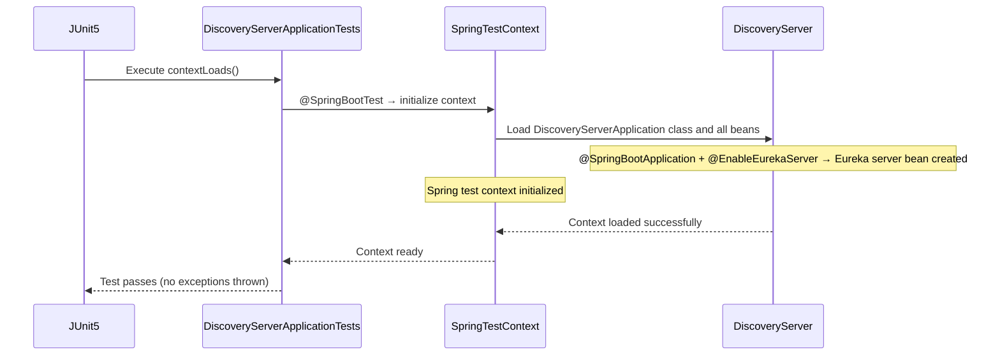

<!-- generated: 2026-04-13T04:14:33.028Z | model: claude-opus-4-6 | sha: 597ad1fb -->

# Scenarios — spring-petclinic-discovery-server

## TL;DR for Agents

- **3 total scenarios**: 2 tested (shared test), 1 untested (Docker profile startup)
- **Most critical scenario**: "Discovery Server Application Startup — Docker Profile" — config-server import is **mandatory** (not optional), so an unreachable config-server causes a hard startup failure
- **Most common failure mode**: `PORT_BIND_FAILURE` (port 8761 already in use) — appears in all 3 scenarios
- **Key state transition**: Eureka server goes from uninitialized → `RUNNING` and listening for service registrations on port 8761
- **External dependency**: Config Server (`http://localhost:8888` default, `http://config-server:8888` in Docker) — optional in default profile, **mandatory** in `docker` profile

## How to Read This Document

Each scenario describes one end-to-end execution path through the discovery server, from trigger to outcome. Scenarios include a Mermaid sequence diagram, numbered steps with code references, and a failure-mode table. Use the Scenario Index to jump directly to the scenario relevant to your investigation.

## Scenario Index

| Name | Trigger | Tags | Tested By |
|------|---------|------|-----------|
| [Discovery Server Application Startup — Success](#scenario-discovery-server-application-startup--success) | JVM process start with `SpringApplication.run()` | `startup`, `initialization`, `eureka-server`, `spring-boot` | `DiscoveryServerApplicationTests.java:contextLoads` |
| [Discovery Server Application Startup — Docker Profile](#scenario-discovery-server-application-startup--docker-profile) | JVM process start with `SPRING_PROFILES_ACTIVE=docker` | `startup`, `initialization`, `docker-profile`, `eureka-server`, `config-server-integration` | ⚠️ Not covered |
| [Discovery Server Context Load Test](#scenario-discovery-server-context-load-test) | `@SpringBootTest` annotation on test class | `test`, `unit-test`, `context-load`, `spring-boot-test` | `DiscoveryServerApplicationTests.java:contextLoads` |

---

## Scenario: Discovery Server Application Startup — Success

**Trigger** — JVM process start with `SpringApplication.run()`

**Preconditions**
- JVM is available
- Spring classpath contains `spring-boot`, `spring-cloud-netflix-eureka-server` dependencies
- `application.yml` is present and readable
- `CONFIG_SERVER_URL` environment variable is set OR defaults to `http://localhost:8888/`

**Entry Point** — `spring-petclinic-discovery-server/src/main/java/org/springframework/samples/petclinic/discovery/DiscoveryServerApplication.java:main`

### Sequence Diagram

```mermaid
sequenceDiagram
    participant JVM
    participant DiscoveryServer
    participant ConfigServer

    JVM->>DiscoveryServer: main(args) → SpringApplication.run()
    Note over DiscoveryServer: @SpringBootApplication + @EnableEurekaServer triggers auto-configuration
    DiscoveryServer->>DiscoveryServer: Load application.yml (spring.application.name = discovery-server)
    DiscoveryServer->>ConfigServer: optional:configserver:${CONFIG_SERVER_URL:http://localhost:8888/}
    ConfigServer-->>DiscoveryServer: Config response (or timeout — optional, non-fatal)
    Note over DiscoveryServer: Logging configured (Spring Boot/Web → INFO)
    Note over DiscoveryServer: Eureka server initialized and listening for service registrations
    Note over DiscoveryServer: Application state: → RUNNING; Eureka server listening on port 8761
    DiscoveryServer-->>JVM: Context initialized successfully
```

### Steps

1. **JVM invokes main() method; SpringApplication.run() initializes Spring Boot context**
   📍 `DiscoveryServerApplication.java:main` — `public static void main(String[] args)`
   ```java
   SpringApplication.run(DiscoveryServerApplication.class, args);
   ```

2. **@SpringBootApplication annotation triggers component scanning and auto-configuration**
   📍 `DiscoveryServerApplication.java:DiscoveryServerApplication` — `class DiscoveryServerApplication`
   ```java
   @SpringBootApplication
   @EnableEurekaServer
   public class DiscoveryServerApplication { }
   ```

3. **@EnableEurekaServer annotation enables Netflix Eureka server functionality; registers server as Eureka service registry**
   📍 `DiscoveryServerApplication.java:DiscoveryServerApplication` — `class DiscoveryServerApplication`
   ```java
   @EnableEurekaServer
   ```
   > **State change:** `Eureka server: uninitialized → initialized and listening for service registrations`

4. **Spring loads application.yml configuration; resolves spring.application.name = 'discovery-server'**
   📍 `application.yml` — configuration file
   ```yaml
   spring:
     application:
       name: discovery-server
   ```

5. **Spring attempts to import configuration from config-server via spring.config.import property**
   📍 `application.yml` — configuration file
   _"when: spring.config.import is set to optional:configserver:${CONFIG_SERVER_URL:http://localhost:8888/}"_
   ```yaml
   spring:
     config:
       import: optional:configserver:${CONFIG_SERVER_URL:http://localhost:8888/}
   ```

6. **Logging configuration applied; Spring Boot and Spring Web logging set to INFO level**
   📍 `application.yml` — configuration file
   ```yaml
   logging:
     level:
       org:
         springframework:
           boot: INFO
           web: INFO
   ```

7. **Spring Boot context fully initialized; Eureka server ready to accept service registrations on default port 8761**
   📍 `DiscoveryServerApplication.java:main` — `public static void main(String[] args)`
   > **State change:** `Application state: → RUNNING; Eureka server listening`

### Success Outcome

```
Discovery Server starts successfully.
Eureka server is operational and listening on port 8761.
Ready to accept service registrations.
```

### Failure Modes

| Condition | Outcome | Error Code | Retryable |
|-----------|---------|------------|-----------|
| `CONFIG_SERVER_URL` points to unreachable config-server AND `spring.config.import` is NOT marked `optional` | Application startup fails; Spring context fails to initialize | `CONFIG_IMPORT_FAILURE` | No |
| Port 8761 is already in use by another process | Application startup fails; `BindException` thrown; port binding fails | `PORT_BIND_FAILURE` | No |
| `application.yml` is malformed or missing | Application startup fails; YAML parsing error | `CONFIG_PARSE_ERROR` | No |
| Required `spring-cloud-netflix-eureka-server` dependency is missing from classpath | Application startup fails; `ClassNotFoundException` or `NoClassDefFoundError` | `MISSING_DEPENDENCY` | No |
| `CONFIG_SERVER_URL` is set to `optional:configserver:` but config-server is temporarily unavailable | Application continues startup (optional import); Eureka server starts with default configuration | `CONFIG_SERVER_UNAVAILABLE` | Yes |

### Side Effects

- Eureka server initialized
- HTTP listener bound to port 8761
- Service registry in-memory store created
- Logging framework initialized

### Test Coverage

Tested by `spring-petclinic-discovery-server/src/test/java/org/springframework/samples/petclinic/discovery/DiscoveryServerApplicationTests.java:contextLoads`

---

## Scenario: Discovery Server Application Startup — Docker Profile

**Trigger** — JVM process start with `SPRING_PROFILES_ACTIVE=docker`

**Preconditions**
- JVM is available
- `SPRING_PROFILES_ACTIVE` environment variable is set to `docker`
- `application.yml` is present with docker profile configuration
- Config server is reachable at `http://config-server:8888` (Docker network DNS resolution works)

**Entry Point** — `spring-petclinic-discovery-server/src/main/java/org/springframework/samples/petclinic/discovery/DiscoveryServerApplication.java:main`

### Sequence Diagram

```mermaid
sequenceDiagram
    participant JVM
    participant DiscoveryServer
    participant ConfigServer

    JVM->>DiscoveryServer: main(args) → SpringApplication.run()
    Note over DiscoveryServer: Profile 'docker' active
    DiscoveryServer->>ConfigServer: configserver:http://config-server:8888 (MANDATORY)
    ConfigServer-->>DiscoveryServer: Configuration response
    Note over DiscoveryServer: @EnableEurekaServer → Eureka server initialized
    Note over DiscoveryServer: Application state: → RUNNING; Eureka server listening on port 8761
    DiscoveryServer-->>JVM: Context initialized successfully
```

### Steps

1. **JVM invokes main() method; SpringApplication.run() initializes Spring Boot context**
   📍 `DiscoveryServerApplication.java:main` — `public static void main(String[] args)`
   ```java
   SpringApplication.run(DiscoveryServerApplication.class, args);
   ```

2. **Spring profile 'docker' is active; application.yml docker profile section is loaded**
   📍 `application.yml` — configuration file
   _"when: spring.config.activate.on-profile == 'docker'"_
   ```yaml
   ---
   spring:
     config:
       activate:
         on-profile: docker
       import: configserver:http://config-server:8888
   ```

3. **Spring attempts to import configuration from config-server at http://config-server:8888 (Docker internal DNS)**
   📍 `application.yml` — configuration file
   _"when: spring.config.import is set to configserver:http://config-server:8888 (MANDATORY, not optional)"_
   ```yaml
   spring:
     config:
       import: configserver:http://config-server:8888
   ```

4. **@EnableEurekaServer annotation enables Netflix Eureka server functionality**
   📍 `DiscoveryServerApplication.java:DiscoveryServerApplication` — `class DiscoveryServerApplication`
   ```java
   @EnableEurekaServer
   ```
   > **State change:** `Eureka server: uninitialized → initialized`

5. **Spring Boot context fully initialized; Eureka server ready to accept service registrations**
   📍 `DiscoveryServerApplication.java:main` — `public static void main(String[] args)`
   > **State change:** `Application state: → RUNNING; Eureka server listening`

### Success Outcome

```
Discovery Server starts successfully in Docker environment.
Eureka server operational.
Configuration loaded from Docker-internal config-server at http://config-server:8888.
```

### Failure Modes

| Condition | Outcome | Error Code | Retryable |
|-----------|---------|------------|-----------|
| Config server at `http://config-server:8888` is unreachable (DNS resolution fails or service down) | Application startup fails; `ConfigServerException` thrown; context initialization fails | `CONFIG_SERVER_UNREACHABLE` | No |
| Config server returns HTTP 500 or malformed response | Application startup fails; configuration parsing fails | `CONFIG_SERVER_ERROR` | Yes |
| Port 8761 is already in use in Docker container | Application startup fails; `BindException` thrown | `PORT_BIND_FAILURE` | No |

### Side Effects

- Eureka server initialized
- HTTP listener bound to port 8761
- Configuration fetched from config-server
- Service registry in-memory store created

### Test Coverage

⚠️ **Not covered by tests** — The Docker profile startup path has no dedicated test. In Docker Compose environments, failures here typically manifest as the discovery-server container restarting in a loop because the config-server import is **mandatory** (no `optional:` prefix).

---

## Scenario: Discovery Server Context Load Test

**Trigger** — `@SpringBootTest` annotation on test class

**Preconditions**
- JUnit 5 is available on test classpath
- `@SpringBootTest` annotation is present
- Spring Boot test context can be initialized
- `application.yml` is accessible

**Entry Point** — `spring-petclinic-discovery-server/src/test/java/org/springframework/samples/petclinic/discovery/DiscoveryServerApplicationTests.java:contextLoads`

### Sequence Diagram



### Steps

1. **JUnit 5 discovers and executes test method contextLoads()**
   📍 `DiscoveryServerApplicationTests.java:contextLoads` — `void contextLoads()`
   ```java
   @Test
   void contextLoads() {
   }
   ```

2. **@SpringBootTest annotation triggers Spring Boot test context initialization; loads DiscoveryServerApplication**
   📍 `DiscoveryServerApplicationTests.java:DiscoveryServerApplicationTests` — `class DiscoveryServerApplicationTests`
   ```java
   @SpringBootTest
   class DiscoveryServerApplicationTests { }
   ```
   > **State change:** `Spring test context: → initialized`

3. **Spring Boot test context loads DiscoveryServerApplication class and all beans**
   📍 `DiscoveryServerApplication.java:DiscoveryServerApplication` — `class DiscoveryServerApplication`
   ```java
   @SpringBootApplication
   @EnableEurekaServer
   public class DiscoveryServerApplication { }
   ```
   > **State change:** `Application context loaded; Eureka server bean created`

4. **Test method body executes (empty); test passes if no exceptions thrown**
   📍 `DiscoveryServerApplicationTests.java:contextLoads` — `void contextLoads()`
   ```java
   @Test
   void contextLoads() {
   }
   ```

### Success Outcome

```
Test passes.
Spring context loads successfully.
No exceptions thrown.
```

### Failure Modes

| Condition | Outcome | Error Code | Retryable |
|-----------|---------|------------|-----------|
| Spring context fails to initialize (missing beans, configuration errors) | Test fails with `ContextLoadException` or `BeanCreationException` | `CONTEXT_LOAD_FAILURE` | No |
| Port 8761 is already in use (e.g., from previous test run) | Test fails with `BindException` | `PORT_BIND_FAILURE` | No |
| `application.yml` is missing or malformed | Test fails with `ConfigurationException` or YAML parsing error | `CONFIG_PARSE_ERROR` | No |

### Side Effects

- Spring test context created
- Eureka server bean instantiated
- Application configuration loaded

### Test Coverage

Tested by `spring-petclinic-discovery-server/src/test/java/org/springframework/samples/petclinic/discovery/DiscoveryServerApplicationTests.java:contextLoads`

---

## See Also

- [Spring PetClinic Microservices Repository](https://github.com/spring-petclinic/spring-petclinic-microservices) — parent project with all microservices
- [spring-petclinic-discovery-server/src/main/resources/application.yml](spring-petclinic-discovery-server/src/main/resources/application.yml) — full configuration including default and Docker profiles
- [spring-petclinic-discovery-server/src/main/java/org/springframework/samples/petclinic/discovery/DiscoveryServerApplication.java](spring-petclinic-discovery-server/src/main/java/org/springframework/samples/petclinic/discovery/DiscoveryServerApplication.java) — application entry point
- [Spring Cloud Netflix Eureka Server Documentation](https://docs.spring.io/spring-cloud-netflix/docs/current/reference/html/#spring-cloud-eureka-server) — upstream reference for `@EnableEurekaServer` behavior