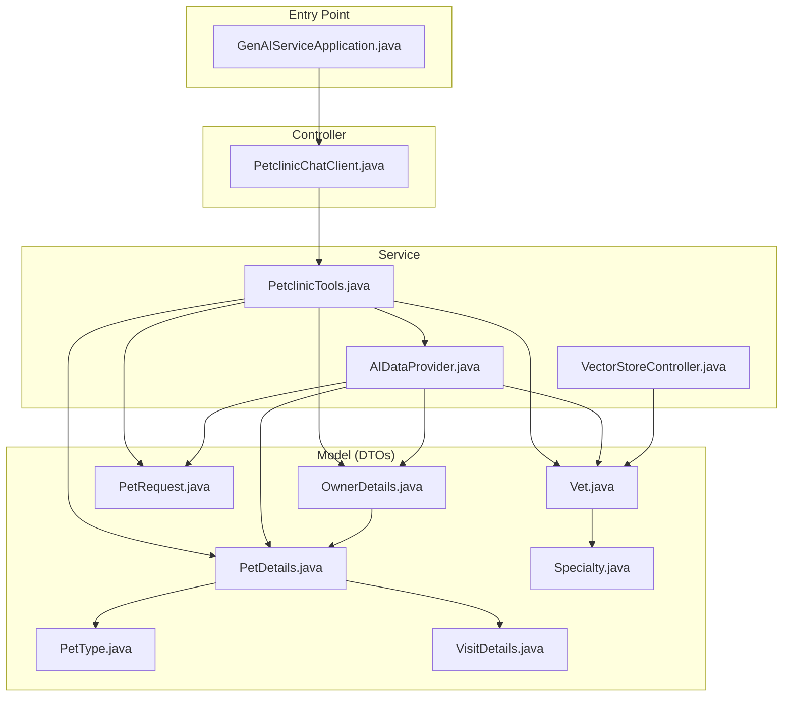
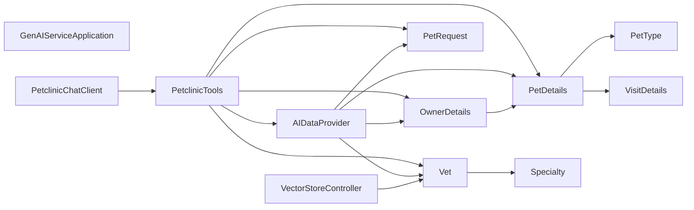

<!-- generated: 2026-04-13T04:25:11.816Z | model: claude-opus-4-6 | sha: 597ad1fb -->

# Architecture — spring-petclinic-genai-service

## TL;DR for Agents

- **Layered architecture** with 4 clean layers: entry-point → controller → service → model, with **no circular dependencies**.
- The service is a **Spring Boot API** that integrates generative AI (LLM chat) capabilities into the PetClinic microservices ecosystem.
- **Key modules**: `PetclinicChatClient` (controller) orchestrates chat interactions, `PetclinicTools` exposes AI-callable tool functions, `AIDataProvider` fetches data from other microservices, and `VectorStoreController` manages vet data embeddings.
- **Entry point for code changes**: start at `PetclinicTools.java` (service layer) for adding new AI tool functions, or `AIDataProvider.java` for modifying how data is fetched from downstream services.
- All dependencies flow strictly top-to-bottom; there are **no architectural violations** in the current graph.

## Layer Architecture

## Module Dependency Graph

## Layer Descriptions

| Layer | Directories / Files | Responsibility | May Import From |
|---|---|---|---|
| **Entry Point** | `GenAIServiceApplication.java` | Spring Boot application bootstrap; component scanning and auto-configuration. | Controller, Service, Model (transitively via Spring context) |
| **Controller** | `PetclinicChatClient.java` | Exposes the chat endpoint; configures the Spring AI `ChatClient` with system prompts and tool bindings. Receives user messages and returns AI-generated responses. | Service, Model |
| **Service** | `PetclinicTools.java`, `AIDataProvider.java`, `VectorStoreController.java` | `PetclinicTools` — declares `@Tool`-annotated methods (list owners, add pet, list vets, etc.) callable by the LLM. `AIDataProvider` — acts as a data-access facade, calling downstream PetClinic microservices (customers, vets, visits) via HTTP. `VectorStoreController` — ingests vet data into a vector store for semantic search / RAG. | Model |
| **Model (DTOs)** | `dto/OwnerDetails.java`, `dto/PetDetails.java`, `dto/PetRequest.java`, `dto/PetType.java`, `dto/Vet.java`, `dto/Specialty.java`, `dto/VisitDetails.java` | Plain data-transfer objects representing domain entities exchanged with other microservices and serialized for the LLM context. | Other Model classes only (within the DTO hierarchy) |

## Circular Dependencies

No circular dependencies detected.

## Key Design Patterns

### Tool-Augmented LLM (Function Calling)

The most distinctive pattern in this service is the **tool-calling / function-calling** pattern for LLM integration. `PetclinicChatClient` configures a Spring AI `ChatClient` and registers `PetclinicTools` as available tools. When the LLM determines it needs real data (e.g., "list all owners"), it invokes a tool function declared in `PetclinicTools`, which delegates to `AIDataProvider` to fetch live data from downstream microservices. This creates a clean separation: the controller manages the conversation lifecycle, the tools define the AI-callable contract, and the data provider handles HTTP communication.

### Facade / Anti-Corruption Layer

`AIDataProvider` acts as a **facade** over the other PetClinic microservices (customers-service, vets-service, visits-service). Rather than letting the AI tools or chat client interact directly with remote APIs, all external HTTP calls are encapsulated in a single class. This serves as an anti-corruption layer — the GenAI service's internal DTO model (`dto/` package) is decoupled from the wire format of downstream services, and any changes to remote APIs only require updates in `AIDataProvider`.

### Retrieval-Augmented Generation (RAG) via Vector Store

`VectorStoreController` implements a **RAG ingestion pattern**. Vet data is loaded into a vector store (likely backed by an embedding model), enabling the chat client to perform semantic similarity searches when answering questions about veterinarians and their specialties. This separates the structured data path (`AIDataProvider` → HTTP calls) from the unstructured/semantic search path (`VectorStoreController` → vector store), giving the LLM two complementary retrieval strategies.

### Strict Layered Dependency Discipline

The module graph exhibits **clean layered architecture** with no skip-layer violations. The controller depends only on the service layer, services depend only on DTOs, and DTOs reference only other DTOs within their own hierarchy. This makes the codebase straightforward to navigate and extend — adding a new AI tool function means adding a method to `PetclinicTools`, potentially a new data-fetching method to `AIDataProvider`, and any required DTOs in the `dto/` package.

## See Also

- [Spring AI Function Calling Documentation](https://docs.spring.io/spring-ai/reference/api/chatclient.html) — upstream framework docs for the tool/function-calling pattern used by `PetclinicChatClient`
- [spring-petclinic-microservices repository](https://github.com/spring-petclinic/spring-petclinic-microservices) — parent repository containing all sibling microservices (`customers-service`, `vets-service`, `visits-service`) that `AIDataProvider` calls
- [Spring AI Vector Store Reference](https://docs.spring.io/spring-ai/reference/api/vectordbs.html) — documentation for the vector store abstraction used by `VectorStoreController`
- [PetClinic Microservices Architecture Overview](https://github.com/spring-petclinic/spring-petclinic-microservices#understanding-the-spring-petclinic-application) — high-level system architecture showing how this GenAI service fits into the broader application