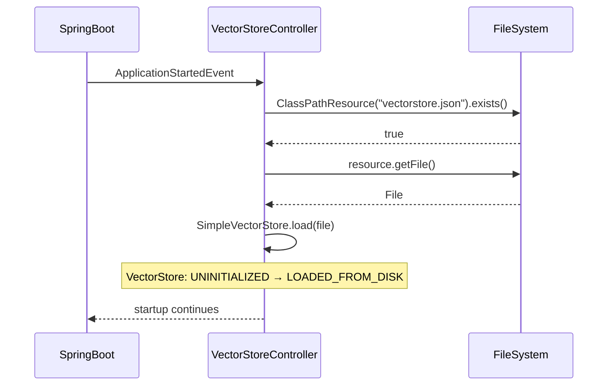
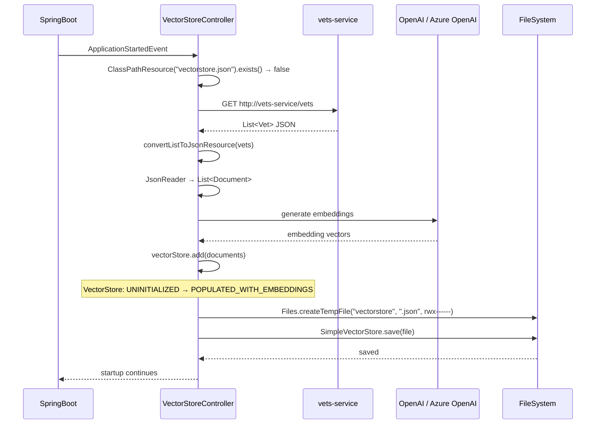
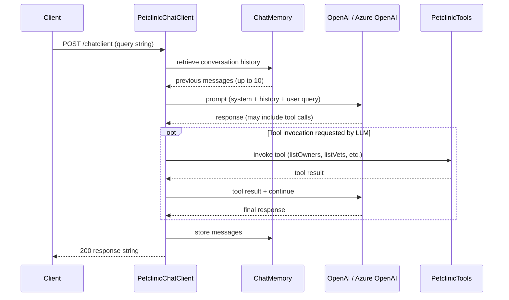
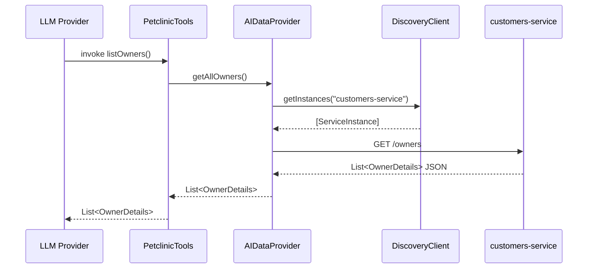
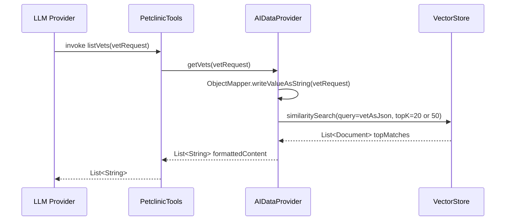
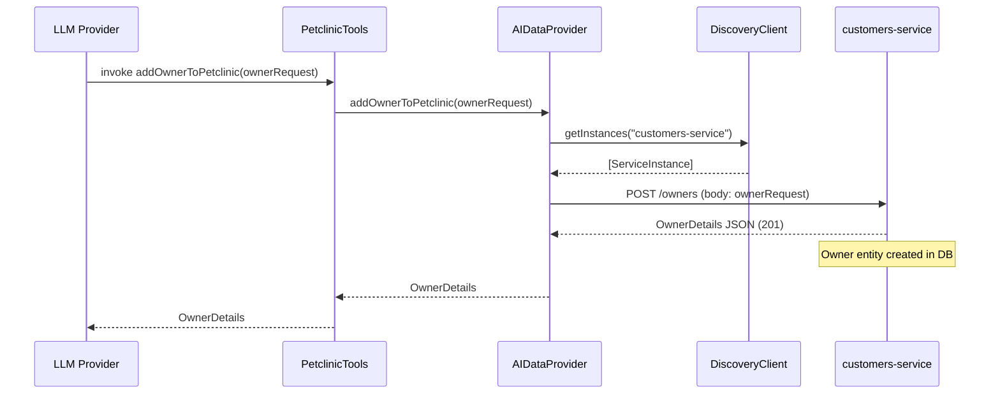
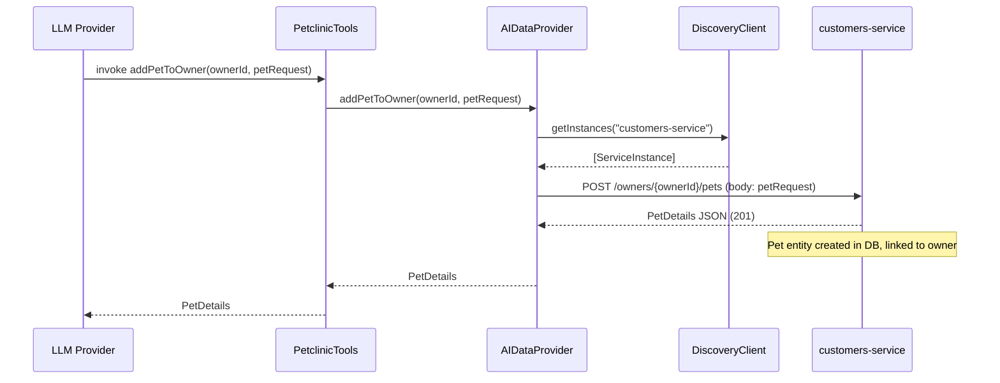

<!-- generated: 2026-04-13T04:20:50.645Z | model: claude-opus-4-6 | sha: 597ad1fb -->

# Scenarios — spring-petclinic-genai-service

## TL;DR for Agents

- **8 total scenarios, 0 tested** — every scenario lacks test coverage (`testedBy: null` across the board)
- **Most critical scenario:** "Application Startup — Fetch Vets and Populate Vector Store (Fallback)" — failure here blocks the entire service from starting and incurs AI provider API costs
- **Most common failure mode:** `RestClientException` / `ServiceDiscoveryException` when downstream services (`customers-service`, `vets-service`) are unreachable or not registered in discovery
- **State transitions exist:** VectorStore transitions from `UNINITIALIZED → LOADED_FROM_DISK` or `UNINITIALIZED → POPULATED_WITH_EMBEDDINGS` during startup
- **All chat errors are swallowed:** The `/chatclient` endpoint catches all exceptions and returns HTTP 200 with a fallback string — never a 5xx

## How to Read This Document

Each scenario describes one end-to-end execution path through the `spring-petclinic-genai-service`, including the trigger, every processing step with code references, failure modes, and side effects. Scenarios are ordered from startup initialization through runtime API calls and tool invocations. Use the Scenario Index table to jump directly to the scenario relevant to your investigation.

## Scenario Index

| Name | Trigger | Tags | Tested By |
|------|---------|------|-----------|
| [Application Startup — Load Vector Store from Classpath](#scenario-application-startup--load-vector-store-from-classpath) | `ApplicationStartedEvent` | `startup`, `initialization`, `vector-store` | ⚠️ None |
| [Application Startup — Fetch Vets and Populate Vector Store (Fallback)](#scenario-application-startup--fetch-vets-and-populate-vector-store-fallback) | `ApplicationStartedEvent` (no `vectorstore.json`) | `startup`, `initialization`, `vector-store`, `fallback`, `ai-integration` | ⚠️ None |
| [Chat Endpoint — User Query to LLM with Tool Invocation](#scenario-chat-endpoint--user-query-to-llm-with-tool-invocation) | `POST /chatclient` | `rest-api`, `chat`, `llm-integration`, `tool-invocation` | ⚠️ None |
| [Tool Invocation — List All Owners](#scenario-tool-invocation--list-all-owners) | LLM invokes `listOwners` | `tool-invocation`, `llm-function`, `service-integration` | ⚠️ None |
| [Tool Invocation — List Veterinarians (Vector Search)](#scenario-tool-invocation--list-veterinarians-vector-search) | LLM invokes `listVets` | `tool-invocation`, `llm-function`, `vector-search`, `rag` | ⚠️ None |
| [Tool Invocation — Add Owner to Petclinic](#scenario-tool-invocation--add-owner-to-petclinic) | LLM invokes `addOwnerToPetclinic` | `tool-invocation`, `llm-function`, `write-operation`, `service-integration` | ⚠️ None |
| [Tool Invocation — Add Pet to Owner](#scenario-tool-invocation--add-pet-to-owner) | LLM invokes `addPetToOwner` | `tool-invocation`, `llm-function`, `write-operation`, `service-integration` | ⚠️ None |
| [Chat Endpoint — Exception Handling and Fallback Response](#scenario-chat-endpoint--exception-handling-and-fallback-response) | `POST /chatclient` (exception path) | `rest-api`, `error-handling`, `fallback` | ⚠️ None |

---

## Scenario: Application Startup — Load Vector Store from Classpath

**Trigger** — `ApplicationStartedEvent` fired during Spring Boot startup

**Preconditions**
- Spring application context is initializing
- `VectorStore` bean is available
- `vectorstore.json` exists in classpath

**Entry Point** — `spring-petclinic-genai-service/src/main/java/org/springframework/samples/petclinic/genai/VectorStoreController.java:loadVetDataToVectorStoreOnStartup`

### Sequence Diagram



### Steps

1. **Check if `vectorstore.json` resource exists in classpath**
   📍 `VectorStoreController.java:loadVetDataToVectorStoreOnStartup` — `void loadVetDataToVectorStoreOnStartup(ApplicationStartedEvent event) throws IOException`
   _"when: `resource.exists()` is true"_
   ```java
   Resource resource = new ClassPathResource("vectorstore.json");
   if (resource.exists()) {
     File file = resource.getFile();
     ((SimpleVectorStore) this.vectorStore).load(file);
     logger.info("vector store loaded from existing vectorstore.json file in the classpath");
     return;
   }
   ```
   > **State change:** `VectorStore: UNINITIALIZED → LOADED_FROM_DISK`

### Success Outcome

```
VectorStore loaded from pre-embedded vectorstore.json.
Log: "vector store loaded from existing vectorstore.json file in the classpath"
Application startup completes normally.
```

### Failure Modes

| Condition | Outcome | Error Code | Retryable |
|-----------|---------|------------|-----------|
| `vectorstore.json` file cannot be read (permissions, corruption) | `IOException` thrown; application startup fails | `IOException` | No |

### Side Effects

- VectorStore in-memory state populated from disk file
- Log entry: `vector store loaded from existing vectorstore.json file in the classpath`

### Test Coverage

⚠️ **Not covered by tests**

---

## Scenario: Application Startup — Fetch Vets and Populate Vector Store (Fallback)

**Trigger** — `ApplicationStartedEvent` fired during Spring Boot startup AND `vectorstore.json` does not exist in classpath

**Preconditions**
- Spring application context is initializing
- `VectorStore` bean is available
- `vectorstore.json` does NOT exist in classpath
- `vets-service` is reachable at `http://vets-service/`
- `WebClient` is configured

**Entry Point** — `spring-petclinic-genai-service/src/main/java/org/springframework/samples/petclinic/genai/VectorStoreController.java:loadVetDataToVectorStoreOnStartup`

### Sequence Diagram



### Steps

1. **Check if `vectorstore.json` exists; proceed to fallback if not**
   📍 `VectorStoreController.java:loadVetDataToVectorStoreOnStartup` — `void loadVetDataToVectorStoreOnStartup(ApplicationStartedEvent event) throws IOException`
   _"when: `!resource.exists()`"_

2. **Fetch all Vet entities from vets-service via WebClient**
   📍 `VectorStoreController.java:loadVetDataToVectorStoreOnStartup` — `void loadVetDataToVectorStoreOnStartup(ApplicationStartedEvent event) throws IOException`
   ```java
   String vetsHostname = "http://vets-service/";
   List<Vet> vets = webClient
       .get()
       .uri(vetsHostname + "vets")
       .retrieve()
       .bodyToMono(new ParameterizedTypeReference<List<Vet>>() {})
       .block();
   ```

3. **Convert `List<Vet>` to JSON resource**
   📍 `VectorStoreController.java:convertListToJsonResource` — `Resource convertListToJsonResource(List<Vet> vets)`
   ```java
   ObjectMapper objectMapper = new ObjectMapper();
   String json = objectMapper.writeValueAsString(vets);
   byte[] jsonBytes = json.getBytes();
   return new ByteArrayResource(jsonBytes);
   ```

4. **Parse JSON resource into Document list using JsonReader**
   📍 `VectorStoreController.java:loadVetDataToVectorStoreOnStartup` — `void loadVetDataToVectorStoreOnStartup(ApplicationStartedEvent event) throws IOException`
   ```java
   DocumentReader reader = new JsonReader(vetsAsJson);
   List<Document> documents = reader.get();
   ```

5. **Add documents to VectorStore (triggers embedding via AI provider)**
   📍 `VectorStoreController.java:loadVetDataToVectorStoreOnStartup` — `void loadVetDataToVectorStoreOnStartup(ApplicationStartedEvent event) throws IOException`
   ```java
   this.vectorStore.add(documents);
   ```
   > **State change:** `VectorStore: UNINITIALIZED → POPULATED_WITH_EMBEDDINGS`

6. **Persist VectorStore to temporary file with restricted permissions**
   📍 `VectorStoreController.java:loadVetDataToVectorStoreOnStartup` — `void loadVetDataToVectorStoreOnStartup(ApplicationStartedEvent event) throws IOException`
   _"when: `vectorStore instanceof SimpleVectorStore store`"_
   ```java
   FileAttribute<Set<PosixFilePermission>> attr = PosixFilePermissions.asFileAttribute(PosixFilePermissions.fromString("rwx------"));
   File file = Files.createTempFile("vectorstore", ".json", attr).toFile();
   store.save(file);
   logger.info("vector store contents written to {}", file.getAbsolutePath());
   ```

### Success Outcome

```
VectorStore populated with embedded vet documents from vets-service.
Persisted to temp file (e.g., /tmp/vectorstore12345.json).
Log: document count and file path.
Application startup completes normally.
```

### Failure Modes

| Condition | Outcome | Error Code | Retryable |
|-----------|---------|------------|-----------|
| `vets-service` unreachable or returns error (timeout, 5xx, 4xx) | `WebClientException` thrown; application startup fails; no vector store populated | `WebClientException` | Yes |
| Vet JSON serialization fails in `convertListToJsonResource` | `JacksonException` caught; `null` returned; `NullPointerException` on `reader.get()` | `JacksonException` | No |
| AI provider API fails or times out during embedding | Exception thrown; application startup fails; vector store not populated | `AIProviderException` | Yes |
| Temp file creation fails (permissions, disk full) | `IOException` thrown; vector store in memory but not persisted | `IOException` | No |

### Side Effects

- HTTP call to `vets-service` (`GET /vets`)
- AI provider API calls for embeddings (costly in terms of credits)
- Temp file created with `rwx------` permissions
- Log entries: fetch completion, document count, file path

### Test Coverage

⚠️ **Not covered by tests**

---

## Scenario: Chat Endpoint — User Query to LLM with Tool Invocation

**Trigger** — `POST /chatclient` with JSON body containing user query string

**Preconditions**
- `ChatClient` is initialized with system prompt and tools
- `ChatMemory` is available for context retention
- LLM provider (Azure OpenAI or OpenAI) is configured and reachable
- `VectorStore` is populated with vet data
- `AIDataProvider` is available

**Entry Point** — `spring-petclinic-genai-service/src/main/java/org/springframework/samples/petclinic/genai/PetclinicChatClient.java:exchange`

### Sequence Diagram



### Steps

1. **Receive POST request with user query string**
   📍 `PetclinicChatClient.java:exchange` — `String exchange(@RequestBody String query)`

2. **Build prompt with user message and invoke ChatClient**
   📍 `PetclinicChatClient.java:exchange` — `String exchange(@RequestBody String query)`
   ```java
   return this.chatClient
       .prompt()
       .user(query)
       .call()
       .content();
   ```

3. **LLM processes query with system prompt context and may invoke tools**
   📍 `PetclinicChatClient.java:PetclinicChatClient` — `PetclinicChatClient(ChatClient.Builder builder, ChatMemory chatMemory, PetclinicTools petclinicTools)`
   ```java
   this.chatClient = builder
       .defaultSystem("You are a friendly AI assistant...")
       .defaultAdvisors(
           MessageChatMemoryAdvisor.builder(chatMemory).order(10).build(),
           new SimpleLoggerAdvisor())
       .defaultTools(petclinicTools)
       .build();
   ```

### Success Outcome

```
HTTP 200
Content-Type: text/plain

"Based on our records, here are the veterinarians who specialize in..."
```

### Failure Modes

| Condition | Outcome | Error Code | Retryable |
|-----------|---------|------------|-----------|
| LLM provider unreachable or returns error | Returns 200 with message: `Chat is currently unavailable. Please try again later.` | `LLMException` | Yes |
| ChatMemory fails to store message | Returns 200 with generic unavailable message | `ChatMemoryException` | Yes |

### Side Effects

- Chat message stored in `ChatMemory` (up to 10 previous messages retained)
- Log entries via `SimpleLoggerAdvisor`
- Possible tool invocations (`listOwners`, `listVets`, `addOwnerToPetclinic`, `addPetToOwner`)

### Test Coverage

⚠️ **Not covered by tests**

---

## Scenario: Tool Invocation — List All Owners

**Trigger** — LLM invokes `listOwners` tool during chat processing

**Preconditions**
- LLM has determined that listing owners is relevant to user query
- `AIDataProvider` is available
- `customers-service` is reachable via `DiscoveryClient`

**Entry Point** — `spring-petclinic-genai-service/src/main/java/org/springframework/samples/petclinic/genai/PetclinicTools.java:listOwners`

### Sequence Diagram



### Steps

1. **LLM invokes `listOwners` tool**
   📍 `PetclinicTools.java:listOwners` — `List<OwnerDetails> listOwners()`
   ```java
   LOG.info("listOwners()");
   return petclinicAiProvider.getAllOwners();
   ```

2. **AIDataProvider calls customers-service to fetch all owners**
   📍 `AIDataProvider.java:getAllOwners` — `List<OwnerDetails> getAllOwners()`
   ```java
   return restClient
       .get()
       .uri(getCustomerServiceUri() + "/owners")
       .retrieve()
       .body(new ParameterizedTypeReference<>() {});
   ```

3. **Resolve customers-service URI via DiscoveryClient**
   📍 `AIDataProvider.java:getCustomerServiceUri` — `URI getCustomerServiceUri()`
   ```java
   return discoveryClient.getInstances("customers-service").get(0).getUri();
   ```

### Success Outcome

```json
[
  {
    "id": 1,
    "firstName": "George",
    "lastName": "Franklin",
    "address": "110 W. Liberty St.",
    "city": "Madison",
    "telephone": "6085551023",
    "pets": [...]
  }
]
```

### Failure Modes

| Condition | Outcome | Error Code | Retryable |
|-----------|---------|------------|-----------|
| `customers-service` unreachable or returns error | `RestClientException` thrown; tool invocation fails; LLM may retry or inform user | `RestClientException` | Yes |
| DiscoveryClient has no instances of `customers-service` | `IndexOutOfBoundsException` on `.get(0)`; tool invocation fails | `ServiceDiscoveryException` | Yes |

### Side Effects

- Log entry: `listOwners()`
- HTTP call to `customers-service` (`GET /owners`)

### Test Coverage

⚠️ **Not covered by tests**

---

## Scenario: Tool Invocation — List Veterinarians (Vector Search)

**Trigger** — LLM invokes `listVets` tool with optional `Vet` filter parameters

**Preconditions**
- LLM has determined that listing vets is relevant to user query
- `VectorStore` is populated with vet embeddings
- `AIDataProvider` is available

**Entry Point** — `spring-petclinic-genai-service/src/main/java/org/springframework/samples/petclinic/genai/PetclinicTools.java:listVets`

### Sequence Diagram



### Steps

1. **LLM invokes `listVets` tool with optional Vet filter**
   📍 `PetclinicTools.java:listVets` — `List<String> listVets(@ToolParam(required = false) Vet vetRequest)`
   ```java
   LOG.info("listVets() vetRequest={}", vetRequest);
   try {
       return petclinicAiProvider.getVets(vetRequest);
   } catch (JacksonException e) {
       LOG.error("Error processing JSON in the listVets function", e);
       return List.of();
   }
   ```

2. **AIDataProvider serializes Vet filter to JSON and performs similarity search**
   📍 `AIDataProvider.java:getVets` — `List<String> getVets(Vet vetRequest) throws JacksonException`
   ```java
   ObjectMapper objectMapper = new ObjectMapper();
   String vetAsJson = objectMapper.writeValueAsString(vetRequest);
   int topK = 20;
   if (vetRequest == null) {
       topK = 50;
   }
   SearchRequest sr = SearchRequest.builder()
       .query(vetAsJson)
       .topK(topK)
       .build();
   List<Document> topMatches = this.vectorStore.similaritySearch(sr);
   return topMatches.stream().map(Document::getFormattedContent).toList();
   ```

### Success Outcome

```json
[
  "Document: {\"id\":1,\"firstName\":\"James\",\"lastName\":\"Carter\",\"specialties\":[{\"name\":\"radiology\"}]}",
  "Document: {\"id\":2,\"firstName\":\"Helen\",\"lastName\":\"Leary\",\"specialties\":[{\"name\":\"radiology\"}]}"
]
```

### Failure Modes

| Condition | Outcome | Error Code | Retryable |
|-----------|---------|------------|-----------|
| Vet filter serialization fails | `JacksonException` caught; returns empty `List`; log error entry | `JacksonException` | No |
| VectorStore is empty or uninitialized | Returns empty list or `NullPointerException` | `VectorStoreException` | No |

### Side Effects

- Log entry: `listVets() vetRequest=...`
- Vector similarity search performed on `VectorStore`

### Test Coverage

⚠️ **Not covered by tests**

---

## Scenario: Tool Invocation — Add Owner to Petclinic

**Trigger** — LLM invokes `addOwnerToPetclinic` tool with `OwnerRequest` parameters

**Preconditions**
- LLM has determined that adding an owner is appropriate
- `OwnerRequest` contains valid `firstName`, `lastName`, `address`, `city`, `telephone` (10–12 digits)
- `AIDataProvider` is available
- `customers-service` is reachable

**Entry Point** — `spring-petclinic-genai-service/src/main/java/org/springframework/samples/petclinic/genai/PetclinicTools.java:addOwnerToPetclinic`

### Sequence Diagram



### Steps

1. **LLM invokes `addOwnerToPetclinic` tool with OwnerRequest**
   📍 `PetclinicTools.java:addOwnerToPetclinic` — `OwnerDetails addOwnerToPetclinic(OwnerRequest ownerRequest)`
   ```java
   LOG.info("addOwnerToPetclinic() ownerRequest={}", ownerRequest);
   return petclinicAiProvider.addOwnerToPetclinic(ownerRequest);
   ```

2. **AIDataProvider POSTs OwnerRequest to customers-service**
   📍 `AIDataProvider.java:addOwnerToPetclinic` — `OwnerDetails addOwnerToPetclinic(OwnerRequest ownerRequest)`
   ```java
   return restClient
       .post()
       .uri(getCustomerServiceUri() + "/owners")
       .body(ownerRequest)
       .retrieve()
       .body(OwnerDetails.class);
   ```
   > **State change:** `Owner entity: ∅ → CREATED in customers-service database`

### Success Outcome

```json
{
  "id": 11,
  "firstName": "John",
  "lastName": "Doe",
  "address": "123 Main St.",
  "city": "Springfield",
  "telephone": "5551234567",
  "pets": []
}
```

### Failure Modes

| Condition | Outcome | Error Code | Retryable |
|-----------|---------|------------|-----------|
| `OwnerRequest` validation fails (missing fields, invalid phone format) | `customers-service` returns 400 Bad Request; `RestClientException` thrown | `ValidationException` | No |
| `customers-service` unreachable or returns error | `RestClientException` thrown; tool invocation fails | `RestClientException` | Yes |
| DiscoveryClient has no instances of `customers-service` | `IndexOutOfBoundsException`; tool invocation fails | `ServiceDiscoveryException` | Yes |

### Side Effects

- Log entry: `addOwnerToPetclinic() ownerRequest=...`
- New owner row inserted in `customers-service` database

### Test Coverage

⚠️ **Not covered by tests**

---

## Scenario: Tool Invocation — Add Pet to Owner

**Trigger** — LLM invokes `addPetToOwner` tool with `ownerId` and `PetRequest` parameters

**Preconditions**
- LLM has determined that adding a pet to an owner is appropriate
- `ownerId` is a valid integer
- `PetRequest` contains valid `petTypeId` (1–6) and pet name
- Owner with given `ownerId` exists in `customers-service`
- `AIDataProvider` is available

**Entry Point** — `spring-petclinic-genai-service/src/main/java/org/springframework/samples/petclinic/genai/PetclinicTools.java:addPetToOwner`

### Sequence Diagram



### Steps

1. **LLM invokes `addPetToOwner` tool with ownerId and PetRequest**
   📍 `PetclinicTools.java:addPetToOwner` — `PetDetails addPetToOwner(@ToolParam(description = "Pet's owner identifier") int ownerId, PetRequest petRequest)`
   ```java
   LOG.info("addPetToOwner() ownerId={} petRequest={}", ownerId, petRequest);
   return petclinicAiProvider.addPetToOwner(ownerId, petRequest);
   ```

2. **AIDataProvider POSTs PetRequest to customers-service for specific owner**
   📍 `AIDataProvider.java:addPetToOwner` — `PetDetails addPetToOwner(int ownerId, PetRequest petRequest)`
   ```java
   return restClient
       .post()
       .uri(getCustomerServiceUri() + "/owners/" + ownerId + "/pets")
       .body(petRequest)
       .retrieve()
       .body(PetDetails.class);
   ```
   > **State change:** `Pet entity: ∅ → CREATED in customers-service database, associated with owner`

### Success Outcome

```json
{
  "id": 14,
  "name": "Buddy",
  "birthDate": "2023-06-15",
  "type": {
    "id": 2,
    "name": "dog"
  }
}
```

### Failure Modes

| Condition | Outcome | Error Code | Retryable |
|-----------|---------|------------|-----------|
| `petTypeId` is not in range 1–6 | `customers-service` returns 400 Bad Request; `RestClientException` thrown | `ValidationException` | No |
| Owner with given `ownerId` does not exist | `customers-service` returns 404 Not Found; `RestClientException` thrown | `OwnerNotFoundException` | No |
| `customers-service` unreachable or returns error | `RestClientException` thrown; tool invocation fails | `RestClientException` | Yes |
| DiscoveryClient has no instances of `customers-service` | `IndexOutOfBoundsException`; tool invocation fails | `ServiceDiscoveryException` | Yes |

### Side Effects

- Log entry: `addPetToOwner() ownerId=... petRequest=...`
- New pet row inserted in `customers-service` database

### Test Coverage

⚠️ **Not covered by tests**

---

## Scenario: Chat Endpoint — Exception Handling and Fallback Response

**Trigger** — `POST /chatclient` with any request body; exception occurs during chat processing

**Preconditions**
- `ChatClient` is initialized
- Any exception occurs during `prompt().user().call().content()`

**Entry Point** — `spring-petclinic-genai-service/src/main/java/org/springframework/samples/petclinic/genai/PetclinicChatClient.java:exchange`

### Sequence Diagram

```mermaid
sequenceDiagram
    participant Client
    participant PetclinicChatClient
    participant LLMProvider as OpenAI / Azure OpenAI

    Client->>PetclinicChatClient: POST /chatclient (query string)
    PetclinicChatClient->>LLMProvider: prompt (system + user query)
    LLMProvider--xPetclinicChatClient: Exception (timeout, network error, etc.)
    Note over PetclinicChatClient: Exception caught; logged at ERROR level
    PetclinicChatClient-->>Client: 200 "Chat is currently unavailable. Please try again later."
```

### Steps

1. **Attempt to process chat message via ChatClient; catch any exception**
   📍 `PetclinicChatClient.java:exchange` — `String exchange(@RequestBody String query)`
   ```java
   try {
       return this.chatClient
           .prompt()
           .user(query)
           .call()
           .content();
   } catch (Exception exception) {
       LOG.error("Error processing chat message", exception);
       return "Chat is currently unavailable. Please try again later.";
   }
   ```

### Success Outcome

```
HTTP 200
Content-Type: text/plain

"Chat is currently unavailable. Please try again later."
```

### Failure Modes

| Condition | Outcome | Error Code | Retryable |
|-----------|---------|------------|-----------|
| Any exception during ChatClient invocation (LLM timeout, network error, tool failure, etc.) | Returns HTTP 200 with fallback message; exception logged at ERROR level | `Exception` (generic) | Yes |

### Side Effects

- Log entry at ERROR level: `Error processing chat message` with full exception stack trace

### Test Coverage

⚠️ **Not covered by tests**

---

## See Also

- [Spring AI Documentation — ChatClient](https://docs.spring.io/spring-ai/reference/)
- [Spring PetClinic Microservices — Repository Root](https://github.com/spring-petclinic/spring-petclinic-microservices)
- [SimpleVectorStore — Spring AI Reference](https://docs.spring.io/spring-ai/reference/api/vectordbs/simple.html)
- [Spring Cloud DiscoveryClient](https://docs.spring.io/spring-cloud-commons/docs/current/reference/html/#discovery-client)