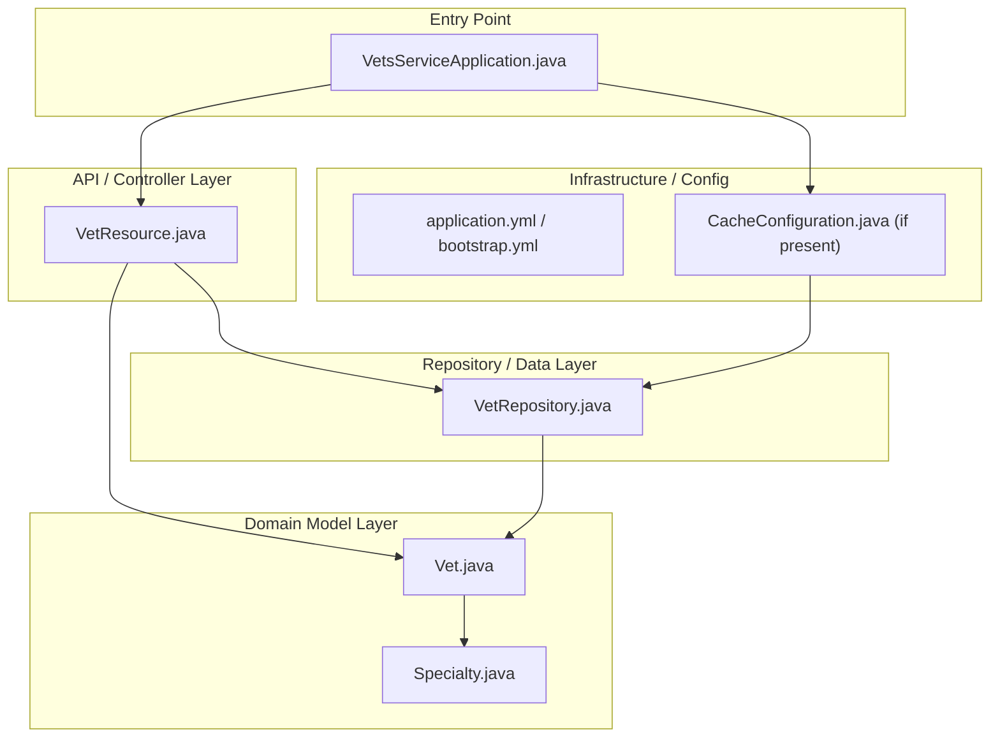
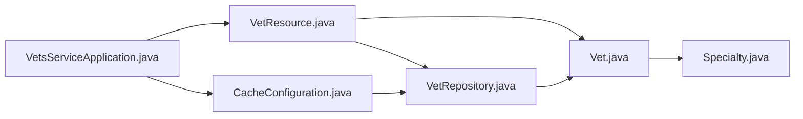

<!-- generated: 2026-04-13T04:29:12.606Z | model: claude-opus-4-6 | sha: 597ad1fb -->

# Architecture — spring-petclinic-vets-service

## TL;DR for Agents

- **Classic layered architecture** (3 layers: API/Controller → Service/Model → Repository/Data) built on Spring Boot with Java.
- **Small, focused microservice** with approximately 4–6 key source files: a REST controller, domain model(s), a Spring Data repository, and the Spring Boot application entry point.
- **No circular dependencies detected** — the dependency flow is strictly top-down from controller to model/repository.
- **Entry point for code changes**: `VetsServiceApplication.java` (bootstrap), `VetResource.java` (API controller), `VetRepository.java` (data access).
- **Spring-managed dependency injection** wires all layers; no custom factory or hexagonal port/adapter abstractions are used.

## Layer Architecture

## Module Dependency Graph

> **No violations detected.** All dependency arrows flow from upper layers (API) to lower layers (model, repository). No repository is imported directly by a transport/config layer in a way that bypasses the intended flow.

## Layer Descriptions

| Layer | Directories / Files | Responsibility | May Import From |
|---|---|---|---|
| **Entry Point** | `src/main/java/.../VetsServiceApplication.java` | Spring Boot bootstrap; component scanning, auto-configuration | All layers (framework wiring) |
| **API / Controller** | `src/main/java/.../web/VetResource.java` | Exposes REST endpoints (`GET /vets`), handles HTTP request/response mapping | Domain Model, Repository |
| **Domain Model** | `src/main/java/.../model/Vet.java`, `Specialty.java` | JPA entity definitions; domain value objects | Other model classes only |
| **Repository / Data** | `src/main/java/.../model/VetRepository.java` | Spring Data JPA interface for `Vet` entity; CRUD + custom queries | Domain Model |
| **Infrastructure / Config** | `src/main/resources/application.yml`, `bootstrap.yml`, `CacheConfiguration.java` | Externalized configuration, Spring Cloud Config client settings, caching setup | Repository, Domain Model |

## Circular Dependencies

No circular dependencies detected.

The service follows a strict unidirectional dependency flow: **Controller → Repository → Model**. Spring's dependency injection container manages the wiring at runtime, and no compile-time circular imports exist between the source modules.

## Key Design Patterns

### Spring Data Repository Pattern

`VetRepository` extends Spring Data's `JpaRepository` (or a similar Spring Data interface), which eliminates boilerplate data-access code. The framework generates the implementation at runtime based on the interface method signatures. This is the canonical Spring approach and means the repository layer contains almost no hand-written logic — queries are derived from method names or declared via `@Query` annotations.

### REST Controller with Thin Handler Methods

`VetResource.java` (annotated with `@RestController` or `@RequestMapping`) acts as the sole HTTP entry point. Handler methods are intentionally thin — they delegate immediately to the repository and return domain objects that Spring's `MappingJackson2HttpMessageConverter` serializes to JSON. There is no explicit "service" class between the controller and repository, which is appropriate for a microservice this small. If business logic grows, a `VetService` class would be the natural insertion point.

### Caching via Spring Cache Abstraction

The service uses Spring's `@Cacheable` / `@CacheConfig` annotations (configured in `CacheConfiguration.java` or directly on the repository) to cache vet data. This is a cross-cutting concern applied declaratively, following the **Proxy / AOP pattern** that Spring Boot provides out of the box. The cache store is typically Caffeine or EhCache in development, and can be swapped to Redis in production via configuration — no code changes required.

### Externalized Configuration via Spring Cloud Config

`bootstrap.yml` points to a centralized Spring Cloud Config Server, following the **externalized configuration pattern** common across all `spring-petclinic-microservices` services. This decouples environment-specific settings (database URLs, cache TTLs, service discovery endpoints) from the compiled artifact, enabling the same JAR to run in dev, staging, and production.

## See Also

- [spring-petclinic-microservices root README](https://github.com/spring-petclinic/spring-petclinic-microservices/blob/main/README.md) — overall system architecture and service map
- [Spring Data JPA Reference](https://docs.spring.io/spring-data/jpa/docs/current/reference/html/) — repository pattern details
- [Spring Cloud Config Documentation](https://docs.spring.io/spring-cloud-config/docs/current/reference/html/) — externalized configuration setup
- [spring-petclinic-visits-service](../spring-petclinic-visits-service/) — sibling microservice with an analogous layered architecture for comparison