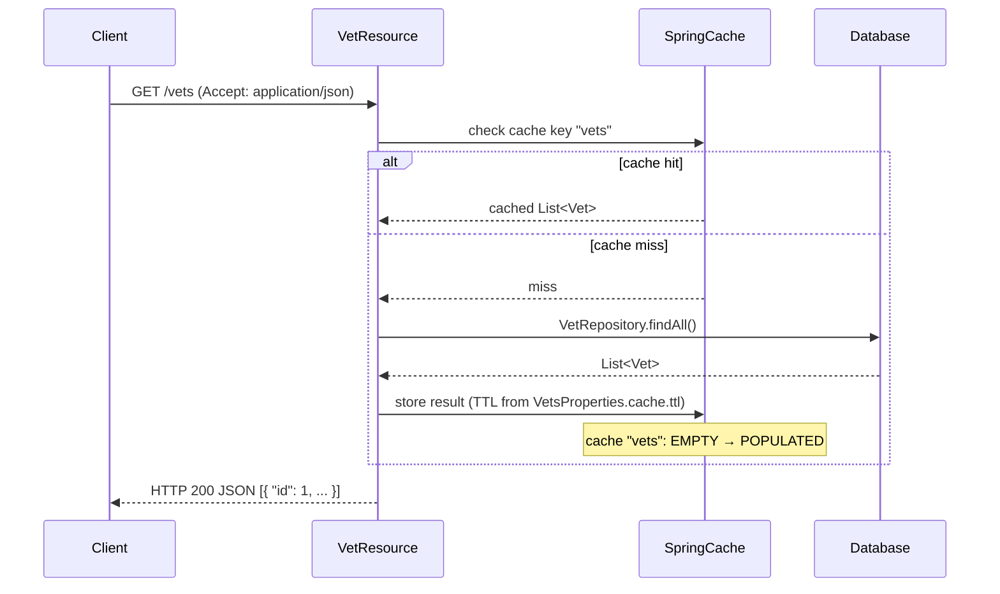
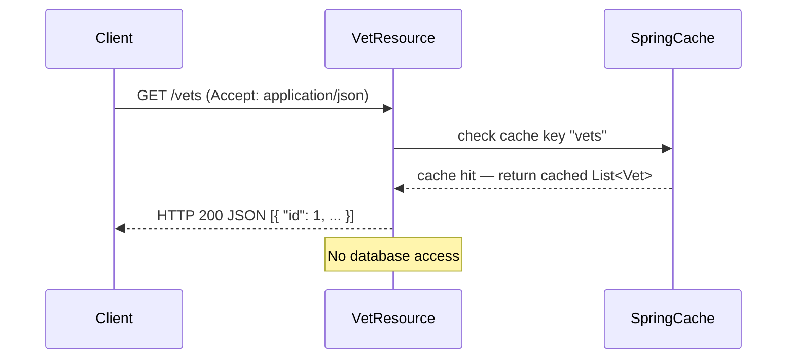
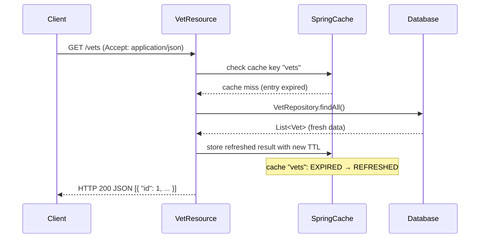
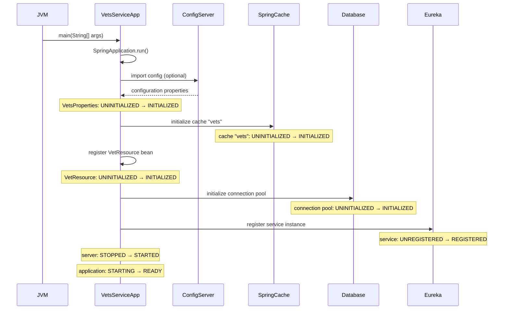
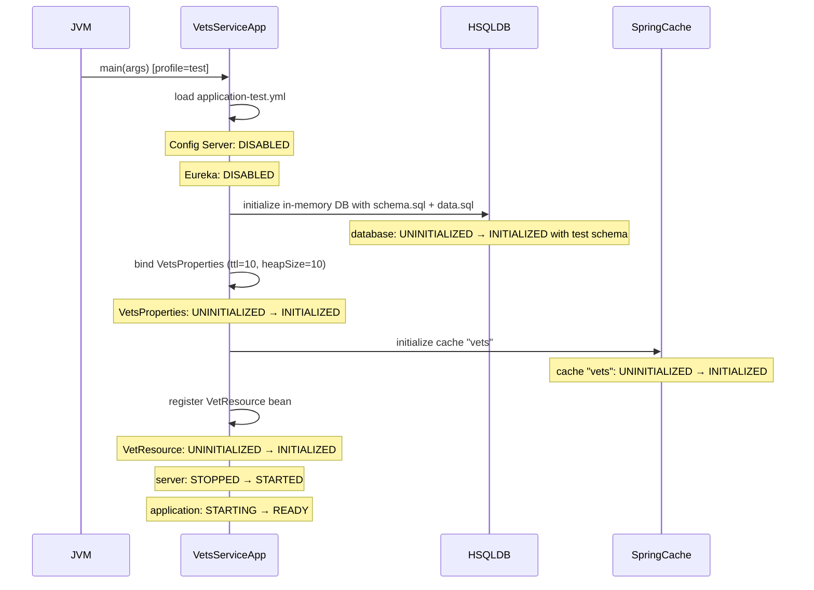
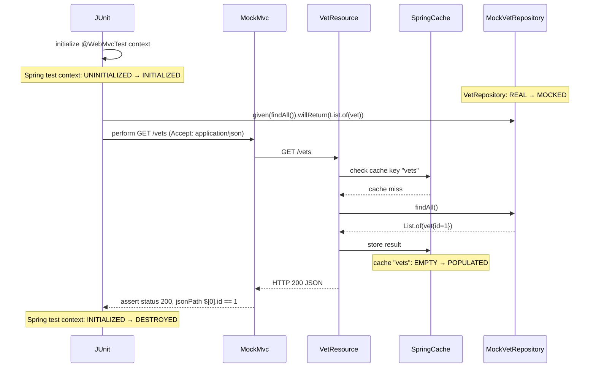
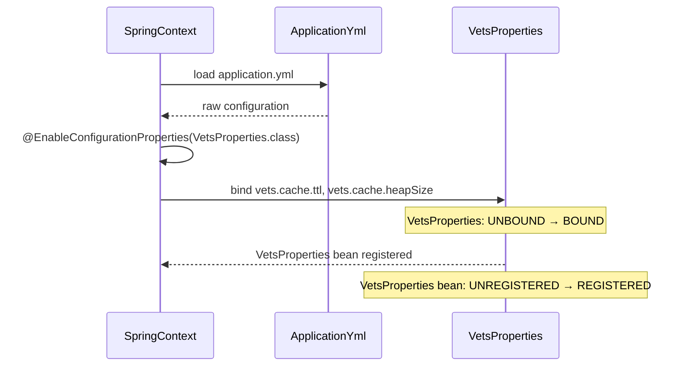
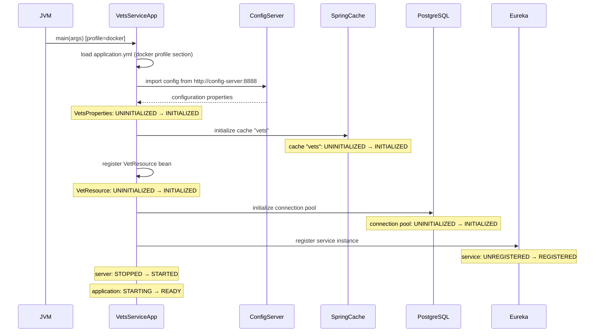

<!-- generated: 2026-04-13T04:24:16.514Z | model: claude-opus-4-6 | sha: 597ad1fb -->

# Scenarios — spring-petclinic-vets-service

## TL;DR for Agents

- **8 total scenarios**: 1 tested (`shouldGetAListOfVets`), 7 untested — significant coverage gaps in cache behavior, startup, and configuration binding
- **Most critical scenario**: "Happy Path — GET /vets List All Veterinarians" — the only API endpoint in this service
- **Most common failure mode**: `ERR_DATABASE_UNAVAILABLE` and `ERR_CONFIG_SERVER_UNAVAILABLE` appear across multiple scenarios
- **State transitions exist**: cache lifecycle (`EMPTY → POPULATED`, `EXPIRED → REFRESHED`), application startup (`STARTING → READY`), service registration (`UNREGISTERED → REGISTERED`)
- **Single endpoint service**: all runtime scenarios revolve around `GET /vets` with `@Cacheable("vets")` caching behavior

## How to Read This Document

Each scenario describes one distinct execution path through the vets-service, from trigger to outcome. Scenarios cover the API happy path, cache hit/miss/expiration behaviors, application startup under different profiles, unit test execution, and configuration binding. Use the Scenario Index table to quickly locate the scenario relevant to your investigation, then drill into the sequence diagram and step-by-step breakdown.

## Scenario Index

| Name | Trigger | Tags | Tested By |
|------|---------|------|-----------|
| [Happy Path — GET /vets List All Veterinarians](#scenario-happy-path--get-vets-list-all-veterinarians) | `GET /vets` | `happy-path`, `rest-api`, `cacheable`, `read-only` | `VetResourceTest → shouldGetAListOfVets` |
| [Cache Hit — GET /vets Returns Cached Vet List](#scenario-cache-hit--get-vets-returns-cached-vet-list) | `GET /vets` (subsequent) | `cache-hit`, `rest-api`, `performance-path` | ⚠️ Not covered |
| [Cache Expiration — GET /vets After TTL Expires](#scenario-cache-expiration--get-vets-after-ttl-expires) | `GET /vets` (after TTL) | `cache-expiration`, `rest-api`, `cache-refresh` | ⚠️ Not covered |
| [Application Startup — VetsServiceApplication Initialization](#scenario-application-startup--vetsserviceapplication-initialization) | Application startup | `startup`, `initialization`, `critical-path` | ⚠️ Not covered |
| [Test Profile Startup — VetsServiceApplication with test Profile](#scenario-test-profile-startup--vetsserviceapplication-with-test-profile) | Startup with `test` profile | `startup`, `test-profile`, `initialization` | ⚠️ Not covered |
| [Unit Test — VetResourceTest.shouldGetAListOfVets](#scenario-unit-test--vetresourcetestshouldgetalistofvets) | JUnit test execution | `unit-test`, `rest-api`, `mocked` | `VetResourceTest → shouldGetAListOfVets` |
| [Configuration Loading — VetsProperties Binding](#scenario-configuration-loading--vetsproperties-binding-from-applicationyml) | Application startup | `configuration`, `startup`, `properties-binding` | ⚠️ Not covered |
| [Docker Profile Startup — VetsServiceApplication with docker Profile](#scenario-docker-profile-startup--vetsserviceapplication-with-docker-profile) | Startup with `docker` profile | `startup`, `docker-profile`, `initialization`, `config-server` | ⚠️ Not covered |

---

## Scenario: Happy Path — GET /vets List All Veterinarians

**Trigger** — `GET /vets` with `Accept: application/json`

**Preconditions**
- VetsServiceApplication has started successfully
- VetRepository is initialized and connected to database
- Cache named `vets` is configured and available
- At least one Vet record exists in the database

**Entry Point** — `spring-petclinic-vets-service/src/main/java/org/springframework/samples/petclinic/vets/web/VetResource.java:showResourcesVetList`

### Sequence Diagram



### Steps

1. **Spring DispatcherServlet routes GET /vets to VetResource.showResourcesVetList()**
   📍 `VetResource.java:showResourcesVetList` — `public List<Vet> showResourcesVetList()`
   ```java
   @GetMapping
   @Cacheable("vets")
   public List<Vet> showResourcesVetList() {
       return vetRepository.findAll();
   }
   ```

2. **Spring Cache abstraction checks if 'vets' cache entry exists; if yes, return cached result**
   📍 `VetResource.java:showResourcesVetList` — `public List<Vet> showResourcesVetList()`
   _when: cache hit on 'vets' key_

3. **If cache miss, invoke VetRepository.findAll() to query database**
   📍 `VetRepository.java:findAll` — `List<Vet> findAll()`
   _when: cache miss on 'vets' key_

4. **Spring Cache stores result in 'vets' cache with TTL from VetsProperties.cache.ttl**
   📍 `VetsProperties.java:Cache` — `public record Cache(int ttl, int heapSize)`

5. **Return List\<Vet\> as JSON response with HTTP 200 OK**
   📍 `VetResource.java:showResourcesVetList` — `public List<Vet> showResourcesVetList()`

### Success Outcome

```json
HTTP/1.1 200 OK
Content-Type: application/json

[
  { "id": 1, "firstName": "James", "lastName": "Carter", "specialties": [] }
]
```

### Failure Modes

| Condition | Outcome | Error Code | Retryable |
|-----------|---------|------------|-----------|
| Database connection unavailable or query fails | HTTP 500 Internal Server Error; exception propagated to client | `ERR_DATABASE_UNAVAILABLE` | ✅ Yes |
| Cache backend (if external) is unavailable | Cache operation fails silently; query proceeds directly to database; returns HTTP 200 | `ERR_CACHE_UNAVAILABLE` | ✅ Yes |
| VetRepository bean not found or injection fails | Application fails to start; HTTP 500 on any request | `ERR_BEAN_INITIALIZATION` | ❌ No |

### Side Effects

- Cache entry `vets` populated (if cache miss)
- Database query executed (if cache miss)

### Test Coverage

Tested by `spring-petclinic-vets-service/src/test/java/org/springframework/samples/petclinic/vets/web/VetResourceTest.java → shouldGetAListOfVets`

---

## Scenario: Cache Hit — GET /vets Returns Cached Vet List

**Trigger** — `GET /vets` (second or subsequent request within cache TTL)

**Preconditions**
- VetsServiceApplication has started successfully
- Cache named `vets` contains a valid entry from a prior request
- Cache entry has not expired (within TTL from `VetsProperties.cache.ttl`)

**Entry Point** — `spring-petclinic-vets-service/src/main/java/org/springframework/samples/petclinic/vets/web/VetResource.java:showResourcesVetList`

### Sequence Diagram



### Steps

1. **Spring DispatcherServlet routes GET /vets to VetResource.showResourcesVetList()**
   📍 `VetResource.java:showResourcesVetList` — `public List<Vet> showResourcesVetList()`
   ```java
   @GetMapping
   @Cacheable("vets")
   public List<Vet> showResourcesVetList() {
       return vetRepository.findAll();
   }
   ```

2. **Spring Cache interceptor checks 'vets' cache key; entry exists and is valid**
   📍 `VetResource.java:showResourcesVetList` — `public List<Vet> showResourcesVetList()`
   _when: cache hit: entry exists and TTL not exceeded_

3. **Return cached List\<Vet\> directly without invoking vetRepository.findAll()**
   📍 `VetResource.java:showResourcesVetList` — `public List<Vet> showResourcesVetList()`

4. **Return cached result as JSON response with HTTP 200 OK**
   📍 `VetResource.java:showResourcesVetList` — `public List<Vet> showResourcesVetList()`

### Success Outcome

```json
HTTP/1.1 200 OK
Content-Type: application/json

[
  { "id": 1, "firstName": "James", "lastName": "Carter", "specialties": [] }
]
```

### Failure Modes

| Condition | Outcome | Error Code | Retryable |
|-----------|---------|------------|-----------|
| Cache backend is unavailable but fallback to database is configured | Cache miss treated as miss; database query executed; returns HTTP 200 | `ERR_CACHE_UNAVAILABLE` | ✅ Yes |

### Side Effects

- No database access
- Cache hit recorded (if monitoring enabled)

### Test Coverage

⚠️ **Not covered by tests**

---

## Scenario: Cache Expiration — GET /vets After TTL Expires

**Trigger** — `GET /vets` after cache TTL (`vets.cache.ttl`) has elapsed

**Preconditions**
- VetsServiceApplication has started successfully
- Cache named `vets` previously contained an entry
- Cache entry has expired (current time > entry creation time + TTL)

**Entry Point** — `spring-petclinic-vets-service/src/main/java/org/springframework/samples/petclinic/vets/web/VetResource.java:showResourcesVetList`

### Sequence Diagram



### Steps

1. **Spring DispatcherServlet routes GET /vets to VetResource.showResourcesVetList()**
   📍 `VetResource.java:showResourcesVetList` — `public List<Vet> showResourcesVetList()`
   ```java
   @GetMapping
   @Cacheable("vets")
   public List<Vet> showResourcesVetList() {
       return vetRepository.findAll();
   }
   ```

2. **Spring Cache interceptor checks 'vets' cache key; entry has expired**
   📍 `VetResource.java:showResourcesVetList` — `public List<Vet> showResourcesVetList()`
   _when: cache miss: entry expired (TTL exceeded)_

3. **Invoke VetRepository.findAll() to query database for fresh data**
   📍 `VetRepository.java:findAll` — `List<Vet> findAll()`

4. **Spring Cache stores refreshed result in 'vets' cache with new TTL**
   📍 `VetsProperties.java:Cache` — `public record Cache(int ttl, int heapSize)`
   > **State change:** `cache entry 'vets': EXPIRED → REFRESHED`

5. **Return refreshed List\<Vet\> as JSON response with HTTP 200 OK**
   📍 `VetResource.java:showResourcesVetList` — `public List<Vet> showResourcesVetList()`

### Success Outcome

```json
HTTP/1.1 200 OK
Content-Type: application/json

[
  { "id": 1, "firstName": "James", "lastName": "Carter", "specialties": [] }
]
```

### Failure Modes

| Condition | Outcome | Error Code | Retryable |
|-----------|---------|------------|-----------|
| Database connection unavailable during refresh | HTTP 500 Internal Server Error; expired cache entry not refreshed | `ERR_DATABASE_UNAVAILABLE` | ✅ Yes |

### Side Effects

- Database query executed
- Cache entry refreshed with new TTL

### Test Coverage

⚠️ **Not covered by tests**

---

## Scenario: Application Startup — VetsServiceApplication Initialization

**Trigger** — Application startup (`java -jar` or Spring Boot run)

**Preconditions**
- JVM is available
- Spring Boot classpath is properly configured
- Configuration server URL is accessible (or optional config import is skipped)

**Entry Point** — `spring-petclinic-vets-service/src/main/java/org/springframework/samples/petclinic/vets/VetsServiceApplication.java:main`

### Sequence Diagram



### Steps

1. **JVM invokes VetsServiceApplication.main(String[] args)**
   📍 `VetsServiceApplication.java:main` — `public static void main(String[] args)`
   ```java
   public static void main(String[] args) {
       SpringApplication.run(VetsServiceApplication.class, args);
   }
   ```

2. **SpringApplication.run() initializes Spring context and loads @SpringBootApplication configuration**
   📍 `VetsServiceApplication.java:VetsServiceApplication` — `@EnableDiscoveryClient @SpringBootApplication @EnableConfigurationProperties(VetsProperties.class) public class VetsServiceApplication`
   ```java
   @EnableDiscoveryClient
   @SpringBootApplication
   @EnableConfigurationProperties(VetsProperties.class)
   public class VetsServiceApplication { }
   ```

3. **Spring loads application.yml configuration; attempts to import config from CONFIG_SERVER_URL (optional)**
   📍 `spring-petclinic-vets-service/src/main/resources/application.yml`
   _when: spring.config.import: optional:configserver:${CONFIG_SERVER_URL:http://localhost:8888/}_
   ```yaml
   spring:
     application:
       name: vets-service
     config:
       import: optional:configserver:${CONFIG_SERVER_URL:http://localhost:8888/}
   ```

4. **Spring binds vets.cache.ttl and vets.cache.heapSize from configuration to VetsProperties record**
   📍 `VetsProperties.java:VetsProperties` — `public record VetsProperties(Cache cache)`
   ```java
   @ConfigurationProperties(prefix = "vets")
   public record VetsProperties(
       Cache cache
   ) {
       public record Cache(
           int ttl,
           int heapSize
       ) { }
   ```
   > **State change:** `VetsProperties bean: UNINITIALIZED → INITIALIZED with cache config`

5. **Spring initializes cache manager with cache name 'vets' from spring.cache.cache-names**
   📍 `spring-petclinic-vets-service/src/main/resources/application.yml`
   ```yaml
   spring:
     cache:
       cache-names: vets
   ```
   > **State change:** `cache 'vets': UNINITIALIZED → INITIALIZED`

6. **Spring registers VetResource bean and injects VetRepository dependency**
   📍 `VetResource.java:VetResource` — `VetResource(VetRepository vetRepository)`
   ```java
   @RequestMapping("/vets")
   @RestController
   class VetResource {
       private final VetRepository vetRepository;
       VetResource(VetRepository vetRepository) {
           this.vetRepository = vetRepository;
       }
   ```
   > **State change:** `VetResource bean: UNINITIALIZED → INITIALIZED`

7. **Spring initializes database connection pool and JPA/Hibernate for VetRepository**
   📍 `VetRepository.java`
   > **State change:** `database connection pool: UNINITIALIZED → INITIALIZED`

8. **Spring enables Eureka discovery client (@EnableDiscoveryClient) and registers service instance**
   📍 `VetsServiceApplication.java:VetsServiceApplication` — `@EnableDiscoveryClient public class VetsServiceApplication`
   _when: eureka.client.enabled != false_
   ```java
   @EnableDiscoveryClient
   @SpringBootApplication
   public class VetsServiceApplication { }
   ```
   > **State change:** `service registration: UNREGISTERED → REGISTERED with Eureka`

9. **Spring Boot starts embedded Tomcat server on configured port (default 8080)**
   📍 `VetsServiceApplication.java:main` — `public static void main(String[] args)`
   > **State change:** `server: STOPPED → STARTED`

10. **Application is ready to accept HTTP requests**
    📍 `VetsServiceApplication.java:main` — `public static void main(String[] args)`
    > **State change:** `application: STARTING → READY`

### Success Outcome

```
Application starts successfully
Tomcat server listening on configured port
Service registered with Eureka
Ready to accept GET /vets requests
```

### Failure Modes

| Condition | Outcome | Error Code | Retryable |
|-----------|---------|------------|-----------|
| Config Server is unavailable and config.import is not optional | Application fails to start; Spring context initialization fails; process exits | `ERR_CONFIG_SERVER_UNAVAILABLE` | ❌ No |
| Database connection fails during pool initialization | Application fails to start; DataSource bean initialization fails; process exits | `ERR_DATABASE_CONNECTION_FAILED` | ❌ No |
| Eureka Server is unavailable (eureka.client.enabled = true) | Application starts but service registration fails; warning logged; unreachable via discovery | `ERR_EUREKA_REGISTRATION_FAILED` | ✅ Yes |
| Port is already in use | Application fails to start; Tomcat fails to bind to port; process exits | `ERR_PORT_ALREADY_IN_USE` | ❌ No |
| VetsProperties configuration is invalid (missing required fields) | Application fails to start; @ConfigurationProperties binding fails; process exits | `ERR_INVALID_CONFIGURATION` | ❌ No |

### Side Effects

- Database connection pool initialized
- Cache manager initialized
- Service instance registered with Eureka
- Tomcat server started

### Test Coverage

⚠️ **Not covered by tests**

---

## Scenario: Test Profile Startup — VetsServiceApplication with test Profile

**Trigger** — Application startup with `spring.profiles.active=test`

**Preconditions**
- JVM is available
- Spring Boot classpath is properly configured
- `application-test.yml` is present on classpath
- HSQLDB or in-memory database is available

**Entry Point** — `spring-petclinic-vets-service/src/main/java/org/springframework/samples/petclinic/vets/VetsServiceApplication.java:main`

### Sequence Diagram



### Steps

1. **JVM invokes VetsServiceApplication.main(String[] args) with test profile**
   📍 `VetsServiceApplication.java:main` — `public static void main(String[] args)`
   _when: spring.profiles.active = test_
   ```java
   public static void main(String[] args) {
       SpringApplication.run(VetsServiceApplication.class, args);
   }
   ```

2. **Spring loads application-test.yml configuration; disables config server and Eureka**
   📍 `spring-petclinic-vets-service/src/test/resources/application-test.yml`
   _when: spring.profiles.active = test_
   ```yaml
   spring:
     cloud:
       config:
         enabled: false
   eureka:
     client:
       enabled: false
   ```

3. **Spring initializes HSQLDB in-memory database and loads schema from classpath**
   📍 `spring-petclinic-vets-service/src/test/resources/application-test.yml`
   ```yaml
   spring:
     sql:
       init:
         schema-locations: classpath*:db/hsqldb/schema.sql
         data-locations: classpath*:db/hsqldb/data.sql
   ```
   > **State change:** `database: UNINITIALIZED → INITIALIZED with test schema`

4. **Spring loads test-specific VetsProperties with cache TTL=10, heapSize=10**
   📍 `spring-petclinic-vets-service/src/test/resources/application-test.yml`
   ```yaml
   vets:
     cache:
       ttl: 10
       heap-size: 10
   ```
   > **State change:** `VetsProperties: UNINITIALIZED → INITIALIZED with test cache config`

5. **Spring initializes cache manager with cache name 'vets'**
   📍 `spring-petclinic-vets-service/src/main/resources/application.yml`
   ```yaml
   spring:
     cache:
       cache-names: vets
   ```
   > **State change:** `cache 'vets': UNINITIALIZED → INITIALIZED`

6. **Spring registers VetResource bean and injects VetRepository (real, not mocked)**
   📍 `VetResource.java:VetResource` — `VetResource(VetRepository vetRepository)`
   ```java
   VetResource(VetRepository vetRepository) {
       this.vetRepository = vetRepository;
   }
   ```
   > **State change:** `VetResource bean: UNINITIALIZED → INITIALIZED`

7. **Spring Boot starts embedded Tomcat server on configured port**
   📍 `VetsServiceApplication.java:main` — `public static void main(String[] args)`
   > **State change:** `server: STOPPED → STARTED`

8. **Application is ready to accept HTTP requests in test environment**
   📍 `VetsServiceApplication.java:main` — `public static void main(String[] args)`
   > **State change:** `application: STARTING → READY`

### Success Outcome

```
Application starts successfully in test mode
HSQLDB initialized with test data
Eureka and Config Server disabled
Ready for integration tests
```

### Failure Modes

| Condition | Outcome | Error Code | Retryable |
|-----------|---------|------------|-----------|
| `application-test.yml` is missing from classpath | Spring falls back to `application.yml`; test profile not properly applied; may attempt to connect to external services | `ERR_TEST_CONFIG_NOT_FOUND` | ❌ No |
| HSQLDB schema file (`db/hsqldb/schema.sql`) is missing | Database initialization fails; application fails to start | `ERR_SCHEMA_NOT_FOUND` | ❌ No |
| HSQLDB data file (`db/hsqldb/data.sql`) is missing | Schema is created but test data is not loaded; application starts but tests may fail due to missing data | `ERR_TEST_DATA_NOT_FOUND` | ❌ No |

### Side Effects

- HSQLDB in-memory database initialized with test schema and data
- Cache manager initialized with test TTL
- Eureka registration skipped
- Config Server import skipped
- Tomcat server started

### Test Coverage

⚠️ **Not covered by tests**

---

## Scenario: Unit Test — VetResourceTest.shouldGetAListOfVets

**Trigger** — JUnit test execution (`mvn test` or IDE test runner)

**Preconditions**
- JUnit 5 is available on classpath
- Spring Test and MockMvc are available
- VetResourceTest class is compiled
- Mockito is available for mocking VetRepository

**Entry Point** — `spring-petclinic-vets-service/src/test/java/org/springframework/samples/petclinic/vets/web/VetResourceTest.java:shouldGetAListOfVets`

### Sequence Diagram



### Steps

1. **JUnit 5 discovers and invokes VetResourceTest.shouldGetAListOfVets() test method**
   📍 `VetResourceTest.java:shouldGetAListOfVets` — `@Test void shouldGetAListOfVets() throws Exception`
   ```java
   @Test
   void shouldGetAListOfVets() throws Exception {
       Vet vet = new Vet();
       vet.setId(1);
       given(vetRepository.findAll()).willReturn(List.of(vet));
       mvc.perform(get("/vets").accept(MediaType.APPLICATION_JSON))
           .andExpect(status().isOk())
           .andExpect(jsonPath("$[0].id").value(1));
   }
   ```

2. **@WebMvcTest annotation initializes Spring test context with only VetResource and MockMvc**
   📍 `VetResourceTest.java:VetResourceTest` — `@WebMvcTest(VetResource.class) @ActiveProfiles("test") class VetResourceTest`
   ```java
   @WebMvcTest(VetResource.class)
   @ActiveProfiles("test")
   class VetResourceTest { }
   ```
   > **State change:** `Spring test context: UNINITIALIZED → INITIALIZED`

3. **@MockitoBean annotation creates a mock VetRepository and injects it into VetResource**
   📍 `VetResourceTest.java:VetResourceTest` — `@MockitoBean VetRepository vetRepository`
   ```java
   @MockitoBean
   VetRepository vetRepository;
   ```
   > **State change:** `VetRepository: REAL → MOCKED`

4. **Test creates a Vet object with id=1 and configures mock to return it**
   📍 `VetResourceTest.java:shouldGetAListOfVets` — `@Test void shouldGetAListOfVets() throws Exception`
   ```java
   Vet vet = new Vet();
   vet.setId(1);
   given(vetRepository.findAll()).willReturn(List.of(vet));
   ```

5. **MockMvc performs GET /vets request with Accept: application/json header**
   📍 `VetResourceTest.java:shouldGetAListOfVets` — `@Test void shouldGetAListOfVets() throws Exception`
   ```java
   mvc.perform(get("/vets").accept(MediaType.APPLICATION_JSON))
   ```

6. **Spring DispatcherServlet routes request to VetResource.showResourcesVetList()**
   📍 `VetResource.java:showResourcesVetList` — `public List<Vet> showResourcesVetList()`
   ```java
   @GetMapping
   @Cacheable("vets")
   public List<Vet> showResourcesVetList() {
       return vetRepository.findAll();
   }
   ```

7. **Spring Cache interceptor checks 'vets' cache; cache miss (test cache is empty)**
   📍 `VetResource.java:showResourcesVetList` — `public List<Vet> showResourcesVetList()`
   _when: cache miss_

8. **VetResource invokes mocked vetRepository.findAll(); returns List.of(vet) as configured**
   📍 `VetResource.java:showResourcesVetList` — `public List<Vet> showResourcesVetList()`
   ```java
   return vetRepository.findAll();
   ```

9. **Spring Cache stores result in 'vets' cache**
   📍 `VetResource.java:showResourcesVetList` — `public List<Vet> showResourcesVetList()`
   > **State change:** `cache 'vets': EMPTY → POPULATED`

10. **Response is serialized to JSON and returned with HTTP 200 OK**
    📍 `VetResource.java:showResourcesVetList` — `public List<Vet> showResourcesVetList()`

11. **Test assertion verifies HTTP status is 200 OK**
    📍 `VetResourceTest.java:shouldGetAListOfVets` — `@Test void shouldGetAListOfVets() throws Exception`
    ```java
    .andExpect(status().isOk())
    ```

12. **Test assertion verifies JSON response contains vet with id=1 at index 0**
    📍 `VetResourceTest.java:shouldGetAListOfVets` — `@Test void shouldGetAListOfVets() throws Exception`
    ```java
    .andExpect(jsonPath("$[0].id").value(1));
    ```

13. **Test passes; Spring test context is torn down**
    📍 `VetResourceTest.java:VetResourceTest` — `@WebMvcTest(VetResource.class) class VetResourceTest`
    > **State change:** `Spring test context: INITIALIZED → DESTROYED`

### Success Outcome

```
Test passes
HTTP 200 response verified
JSON response contains expected vet object with id=1
```

### Failure Modes

| Condition | Outcome | Error Code | Retryable |
|-----------|---------|------------|-----------|
| Mock is not configured (`given()` call missing) | Mock returns null or empty list; test fails with assertion error | `ERR_MOCK_NOT_CONFIGURED` | ❌ No |
| JSON path expression is incorrect | jsonPath assertion fails; test fails with assertion error | `ERR_JSONPATH_MISMATCH` | ❌ No |
| Spring test context fails to initialize | Test fails before execution; Spring initialization error | `ERR_TEST_CONTEXT_INIT` | ❌ No |

### Side Effects

- Mock VetRepository.findAll() invoked once
- Cache `vets` populated with test data
- Spring test context initialized and destroyed

### Test Coverage

Tested by `spring-petclinic-vets-service/src/test/java/org/springframework/samples/petclinic/vets/web/VetResourceTest.java → shouldGetAListOfVets`

---

## Scenario: Configuration Loading — VetsProperties Binding from application.yml

**Trigger** — Application startup; Spring loads configuration properties

**Preconditions**
- VetsServiceApplication has started
- `application.yml` or `application-{profile}.yml` is present on classpath
- `vets.cache.ttl` and `vets.cache.heapSize` are defined in configuration

**Entry Point** — `spring-petclinic-vets-service/src/main/java/org/springframework/samples/petclinic/vets/system/VetsProperties.java:VetsProperties`

### Sequence Diagram



### Steps

1. **Spring loads application.yml from classpath**
   📍 `spring-petclinic-vets-service/src/main/resources/application.yml`
   ```yaml
   spring:
     application:
       name: vets-service
     cache:
       cache-names: vets
   ```

2. **@EnableConfigurationProperties(VetsProperties.class) enables binding of vets.\* properties**
   📍 `VetsServiceApplication.java:VetsServiceApplication` — `@EnableConfigurationProperties(VetsProperties.class) public class VetsServiceApplication`
   ```java
   @EnableConfigurationProperties(VetsProperties.class)
   public class VetsServiceApplication { }
   ```

3. **Spring ConfigurationPropertiesBindingPostProcessor binds vets.cache.ttl and vets.cache.heapSize to VetsProperties.Cache record**
   📍 `VetsProperties.java:VetsProperties` — `public record VetsProperties(Cache cache) { public record Cache(int ttl, int heapSize) { } }`
   ```java
   @ConfigurationProperties(prefix = "vets")
   public record VetsProperties(
       Cache cache
   ) {
       public record Cache(
           int ttl,
           int heapSize
       ) { }
   ```
   > **State change:** `VetsProperties: UNBOUND → BOUND with values from configuration`

4. **VetsProperties bean is registered in Spring context and available for injection**
   📍 `VetsProperties.java:VetsProperties` — `public record VetsProperties(Cache cache)`
   > **State change:** `VetsProperties bean: UNREGISTERED → REGISTERED`

### Success Outcome

```
VetsProperties bean initialized with cache TTL and heapSize from configuration
Available for injection into other beans
```

### Failure Modes

| Condition | Outcome | Error Code | Retryable |
|-----------|---------|------------|-----------|
| `vets.cache.ttl` is missing from configuration | Spring binding fails; application fails to start with ConfigurationPropertiesBindingException | `ERR_MISSING_PROPERTY` | ❌ No |
| `vets.cache.ttl` is not a valid integer | Spring binding fails; application fails to start with type conversion error | `ERR_INVALID_PROPERTY_TYPE` | ❌ No |
| `application.yml` is malformed (invalid YAML syntax) | Spring fails to parse configuration; application fails to start | `ERR_INVALID_YAML` | ❌ No |

### Side Effects

- VetsProperties bean created and registered in Spring context

### Test Coverage

⚠️ **Not covered by tests**

---

## Scenario: Docker Profile Startup — VetsServiceApplication with docker Profile

**Trigger** — Application startup with `spring.profiles.active=docker`

**Preconditions**
- JVM is available
- Spring Boot classpath is properly configured
- `application.yml` is present on classpath
- Config Server is accessible at `http://config-server:8888` (Docker network)

**Entry Point** — `spring-petclinic-vets-service/src/main/java/org/springframework/samples/petclinic/vets/VetsServiceApplication.java:main`

### Sequence Diagram



### Steps

1. **JVM invokes VetsServiceApplication.main(String[] args) with docker profile**
   📍 `VetsServiceApplication.java:main` — `public static void main(String[] args)`
   _when: spring.profiles.active = docker_
   ```java
   public static void main(String[] args) {
       SpringApplication.run(VetsServiceApplication.class, args);
   }
   ```

2. **Spring loads application.yml and activates docker profile configuration**
   📍 `spring-petclinic-vets-service/src/main/resources/application.yml`
   _when: spring.profiles.active = docker_
   ```yaml
   ---
   spring:
     config:
       activate:
         on-profile: docker
       import: configserver:http://config-server:8888
   ```

3. **Spring imports configuration from Config Server at http://config-server:8888 (Docker DNS)**
   📍 `spring-petclinic-vets-service/src/main/resources/application.yml`
   _when: spring.profiles.active = docker_
   ```yaml
   spring:
     config:
       import: configserver:http://config-server:8888
   ```

4. **Spring binds vets.cache.ttl and vets.cache.heapSize from Config Server to VetsProperties**
   📍 `VetsProperties.java:VetsProperties` — `public record VetsProperties(Cache cache)`
   ```java
   @ConfigurationProperties(prefix = "vets")
   public record VetsProperties(
       Cache cache
   ) { }
   ```
   > **State change:** `VetsProperties: UNINITIALIZED → INITIALIZED with config from Config Server`

5. **Spring initializes cache manager with cache name 'vets'**
   📍 `spring-petclinic-vets-service/src/main/resources/application.yml`
   ```yaml
   spring:
     cache:
       cache-names: vets
   ```
   > **State change:** `cache 'vets': UNINITIALIZED → INITIALIZED`

6. **Spring registers VetResource bean and injects VetRepository dependency**
   📍 `VetResource.java:VetResource` — `VetResource(VetRepository vetRepository)`
   ```java
   VetResource(VetRepository vetRepository) {
       this.vetRepository = vetRepository;
   }
   ```
   > **State change:** `VetResource bean: UNINITIALIZED → INITIALIZED`

7. **Spring initializes database connection pool (configured via Config Server)**
   📍 `VetRepository.java`
   > **State change:** `database connection pool: UNINITIALIZED → INITIALIZED`

8. **Spring enables Eureka discovery client and registers service instance**
   📍 `VetsServiceApplication.java:VetsServiceApplication` — `@EnableDiscoveryClient public class VetsServiceApplication`
   _when: eureka.client.enabled != false_
   ```java
   @EnableDiscoveryClient
   @SpringBootApplication
   public class VetsServiceApplication { }
   ```
   > **State change:** `service registration: UNREGISTERED → REGISTERED with Eureka`

9. **Spring Boot starts embedded Tomcat server on configured port**
   📍 `VetsServiceApplication.java:main` — `public static void main(String[] args)`
   > **State change:** `server: STOPPED → STARTED`

10. **Application is ready to accept HTTP requests in Docker environment**
    📍 `VetsServiceApplication.java:main` — `public static void main(String[] args)`
    > **State change:** `application: STARTING → READY`

### Success Outcome

```
Application starts successfully in Docker environment
Configuration loaded from Config Server (http://config-server:8888)
Service registered with Eureka
Ready to accept GET /vets requests
```

### Failure Modes

| Condition | Outcome | Error Code | Retryable |
|-----------|---------|------------|-----------|
| Config Server is unavailable at `http://config-server:8888` | Application fails to start; Spring context initialization fails; process exits | `ERR_CONFIG_SERVER_UNAVAILABLE` | ❌ No |
| Config Server returns invalid configuration | Application fails to start; configuration binding fails; process exits | `ERR_INVALID_CONFIG_FROM_SERVER` | ❌ No |
| Database is unavailable at configured host (Docker network) | Application fails to start; DataSource bean initialization fails; process exits | `ERR_DATABASE_CONNECTION_FAILED` | ❌ No |
| Eureka Server is unavailable in Docker network | Application starts but service registration fails; warning logged; unreachable via discovery | `ERR_EUREKA_REGISTRATION_FAILED` | ✅ Yes |

### Side Effects

- Configuration loaded from Config Server (`http://config-server:8888`)
- Database connection pool initialized
- Cache manager initialized
- Service instance registered with Eureka
- Tomcat server started

### Test Coverage

⚠️ **Not covered by tests**

---

## See Also

- [spring-petclinic-microservices repository](https://github.com/spring-petclinic/spring-petclinic-microservices) — parent project with all microservices
- [VetResource.java](spring-petclinic-vets-service/src/main/java/org/springframework/samples/petclinic/vets/web/VetResource.java) — the single REST controller for this service
- [VetsProperties.java](spring-petclinic-vets-service/src/main/java/org/springframework/samples/petclinic/vets/system/VetsProperties.java) — cache configuration properties binding
- [VetResourceTest.java](spring-petclinic-vets-service/src/test/java/org/springframework/samples/petclinic/vets/web/VetResourceTest.java) — the only test file covering this service's API