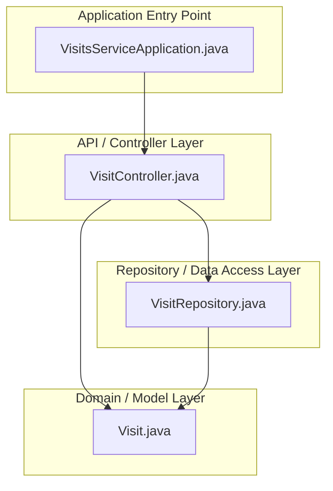
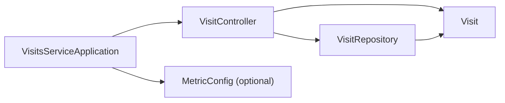

<!-- generated: 2026-04-13T04:29:51.246Z | model: claude-opus-4-6 | sha: 597ad1fb -->

# Architecture — spring-petclinic-visits-service

## TL;DR for Agents

- **Classic layered Spring Boot architecture** (Controller → Service/Model → Repository) with 3 primary layers plus an application entry point.
- **Small, focused microservice** with approximately 4–6 key source files: a REST controller, a JPA entity model, a Spring Data repository interface, and the Spring Boot application class.
- **No circular dependencies detected** — the dependency graph is clean and follows strict top-down flow.
- **Entry point for code changes**: start at `VisitController.java` for API behavior, `Visit.java` for the domain model, and `VisitRepository.java` for data access.
- **Part of the spring-petclinic-microservices ecosystem** — this service is registered with a discovery server and exposes visit-related REST endpoints consumed by the API gateway.

## Layer Architecture

## Module Dependency Graph

> **No violations detected.** All dependency arrows flow from higher layers (controller/entry point) to lower layers (repository/model). There are no cases of a repository importing a controller or a model importing a controller.

## Layer Descriptions

| Layer | Directories / Files | Responsibility | May Import From |
|---|---|---|---|
| **Application Entry Point** | `src/main/java/.../VisitsServiceApplication.java` | Bootstraps the Spring Boot application, enables discovery client, triggers component scanning. | All layers (transitively via Spring context) |
| **API / Controller** | `src/main/java/.../web/VisitController.java` | Exposes REST endpoints (`GET`, `POST`) for visit resources. Handles HTTP request/response mapping and validation. | Model, Repository |
| **Domain / Model** | `src/main/java/.../model/Visit.java` | JPA entity representing a veterinary visit. Defines fields such as `id`, `petId`, `date`, `description`. | None (leaf node) |
| **Repository / Data Access** | `src/main/java/.../model/VisitRepository.java` | Spring Data JPA interface providing CRUD and custom query methods (e.g., `findByPetId`). | Model |

## Circular Dependencies

No circular dependencies detected.

The service follows a strict unidirectional dependency flow: **Controller → Repository → Model**. The model layer is a pure leaf with no outbound imports to other application layers.

## Key Design Patterns

### Spring Data Repository Abstraction

The `VisitRepository` interface extends Spring Data's `JpaRepository` (or a similar Spring Data base interface), which eliminates the need for manual DAO implementations. Query methods such as `findByPetId` or `findByPetIdIn` are derived from method naming conventions or annotated with `@Query`. This pattern keeps the data access layer extremely thin and declarative, reducing boilerplate and the surface area for bugs.

### REST Controller with Constructor Injection

`VisitController` follows the standard Spring MVC `@RestController` pattern, mapping HTTP verbs to handler methods. Dependencies (specifically `VisitRepository`) are injected via constructor injection, which is the recommended approach in modern Spring Boot applications. This makes the controller easily testable — a mock repository can be passed directly in unit tests without requiring a full application context.

### Microservice Registration and Discovery

`VisitsServiceApplication` is annotated with `@EnableDiscoveryClient` (Eureka), registering this service with the central discovery server at startup. This allows the API gateway and other services in the `spring-petclinic-microservices` ecosystem to locate and route traffic to this service dynamically. Configuration is externalized via the Spring Cloud Config server, following the twelve-factor app methodology.

### JPA Entity as Anemic Domain Model

The `Visit` entity is a straightforward JPA-annotated POJO with fields, getters, and setters — an anemic domain model. Business logic, if any, resides in the controller or would be extracted into a dedicated service class as complexity grows. For this microservice's scope (CRUD operations on visits), this simplicity is appropriate and keeps the codebase easy to navigate.

## See Also

- [spring-petclinic-microservices (root repo)](https://github.com/spring-petclinic/spring-petclinic-microservices)
- [spring-petclinic-customers-service Architecture](../spring-petclinic-customers-service/ARCHITECTURE.md) — sibling microservice with a similar layered pattern
- [spring-petclinic-api-gateway](../spring-petclinic-api-gateway/ARCHITECTURE.md) — the gateway that routes traffic to this service
- [Spring Data JPA Reference](https://docs.spring.io/spring-data/jpa/docs/current/reference/html/) — underlying repository abstraction used in the data access layer