<!-- generated: 2026-04-13T04:25:49.569Z | model: claude-opus-4-6 | sha: 597ad1fb -->

# Scenarios — spring-petclinic-visits-service

## TL;DR for Agents

- **11 total scenarios**: 1 tested (`shouldFetchVisits`), 10 untested — significant test coverage gap
- **Most critical scenario**: Application Startup — Service Discovery Registration; failure here prevents all API traffic
- **Most common failure mode**: `DATABASE_ERROR` / `DataAccessException` — appears in 5 scenarios (create and read paths, plus startup)
- **State transitions exist**: Visit creation mutates `visit.petId` (null → value) and persists a new row; startup registers service in Eureka
- **Three REST endpoints**: `POST /owners/*/pets/{petId}/visits`, `GET /owners/*/pets/{petId}/visits`, `GET /pets/visits?petId=...`

## How to Read This Document

Each scenario describes one end-to-end execution path through the visits service, including happy paths, validation failures, and infrastructure failures. Scenarios are ordered from startup through happy-path CRUD to failure modes and finally test infrastructure. Use the Scenario Index table to jump directly to the scenario relevant to your investigation.

## Scenario Index

| Name | Trigger | Tags | Tested By |
|------|---------|------|-----------|
| [Application Startup — Service Discovery Registration](#scenario-application-startup--service-discovery-registration) | `VisitsServiceApplication.main()` | `startup`, `initialization`, `service-discovery`, `configuration` | ⚠️ Not covered |
| [Happy Path — Create Visit for Pet](#scenario-happy-path--create-visit-for-pet) | `POST /owners/*/pets/{petId}/visits` | `happy-path`, `rest-api`, `post`, `create`, `transactional` | ⚠️ Not covered |
| [Happy Path — Fetch Visits by Single Pet ID](#scenario-happy-path--fetch-visits-by-single-pet-id) | `GET /owners/*/pets/{petId}/visits` | `happy-path`, `rest-api`, `get`, `read`, `query` | ⚠️ Not covered |
| [Happy Path — Fetch Visits by Multiple Pet IDs](#scenario-happy-path--fetch-visits-by-multiple-pet-ids) | `GET /pets/visits?petId=111,222` | `happy-path`, `rest-api`, `get`, `read`, `query`, `batch` | `VisitResourceTest.shouldFetchVisits` |
| [Validation Failure — Create Visit with Invalid petId](#scenario-validation-failure--create-visit-with-invalid-petid) | `POST /owners/*/pets/{petId}/visits` (petId < 1) | `validation-failure`, `rest-api`, `post`, `error-handling` | ⚠️ Not covered |
| [Validation Failure — Create Visit with Invalid Request Body](#scenario-validation-failure--create-visit-with-invalid-request-body) | `POST /owners/*/pets/{petId}/visits` (bad body) | `validation-failure`, `rest-api`, `post`, `error-handling` | ⚠️ Not covered |
| [Database Failure — Create Visit with Database Connection Error](#scenario-database-failure--create-visit-with-database-connection-error) | `POST /owners/*/pets/{petId}/visits` (DB down) | `database-failure`, `rest-api`, `post`, `error-handling`, `upstream-failure` | ⚠️ Not covered |
| [Database Failure — Create Visit with Constraint Violation](#scenario-database-failure--create-visit-with-constraint-violation) | `POST /owners/*/pets/{petId}/visits` (DB constraint) | `database-failure`, `rest-api`, `post`, `error-handling`, `constraint-violation` | ⚠️ Not covered |
| [Database Failure — Fetch Visits with Database Connection Error](#scenario-database-failure--fetch-visits-with-database-connection-error) | `GET /owners/*/pets/{petId}/visits` or `GET /pets/visits` (DB down) | `database-failure`, `rest-api`, `get`, `error-handling`, `upstream-failure` | ⚠️ Not covered |
| [Test Initialization — Test Profile Configuration](#scenario-test-initialization--test-profile-configuration) | `@ActiveProfiles("test")` | `test-initialization`, `configuration`, `database-setup` | ⚠️ Not covered |
| [Unit Test — Fetch Visits by Multiple Pet IDs](#scenario-unit-test--fetch-visits-by-multiple-pet-ids) | `VisitResourceTest.shouldFetchVisits()` | `unit-test`, `rest-api`, `get`, `mock`, `happy-path` | `VisitResourceTest.shouldFetchVisits` |

---

## Scenario: Application Startup — Service Discovery Registration

**Trigger** — JVM process start with `VisitsServiceApplication.main()`

**Preconditions**
- JVM classpath contains Spring Boot and Spring Cloud Discovery libraries
- `application.yml` is present and readable
- `CONFIG_SERVER_URL` environment variable may be set (optional)
- Service discovery server (Eureka) is reachable if not in test profile

**Entry Point** — `spring-petclinic-visits-service/src/main/java/org/springframework/samples/petclinic/visits/VisitsServiceApplication.java:main`

### Sequence Diagram

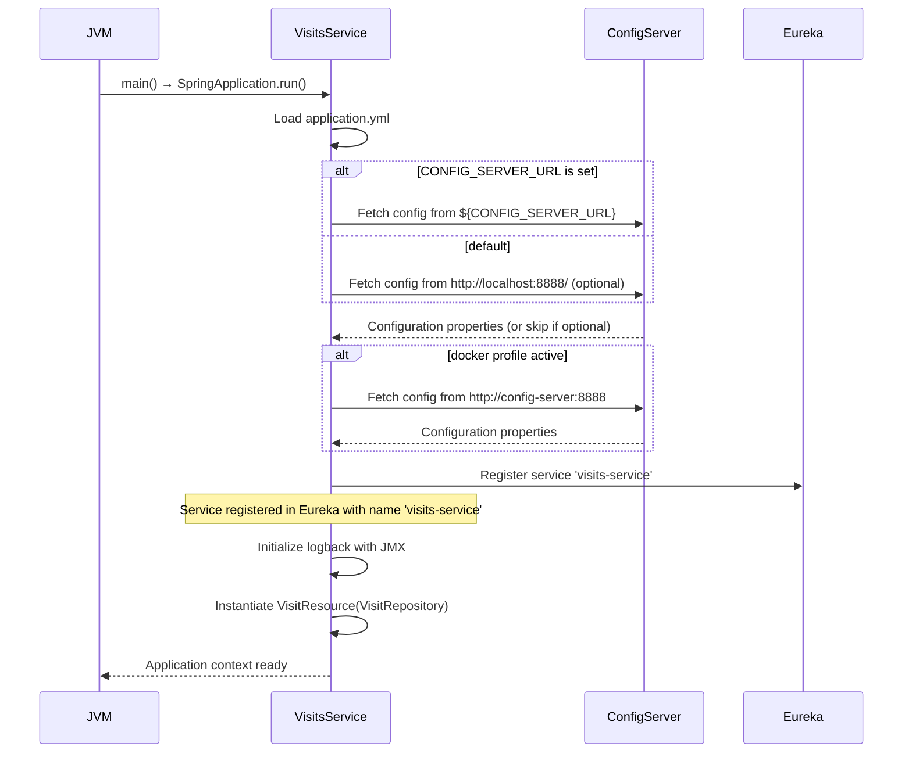

### Steps

1. **Spring Boot initializes application context with @SpringBootApplication**
   📍 `VisitsServiceApplication.java`: `public class VisitsServiceApplication`
   ```java
   @EnableDiscoveryClient
   @SpringBootApplication
   public class VisitsServiceApplication {
       public static void main(String[] args) {
           SpringApplication.run(VisitsServiceApplication.class, args);
       }
   }
   ```

2. **Load application.yml configuration; resolve CONFIG_SERVER_URL from environment or use default http://localhost:8888/**
   📍 `application.yml`: application.yml configuration loading
   _when: if CONFIG_SERVER_URL env var is set, use it; else use http://localhost:8888/_
   ```yaml
   spring:
     application:
       name: visits-service
     config:
       import: optional:configserver:${CONFIG_SERVER_URL:http://localhost:8888/}
   ```

3. **Activate docker profile if running in docker environment; override config server URL to http://config-server:8888**
   📍 `application.yml`: application.yml docker profile configuration
   _when: if spring.config.activate.on-profile == docker_
   ```yaml
   ---
   spring:
     config:
       activate:
         on-profile: docker
       import: configserver:http://config-server:8888
   ```

4. **Register service with Eureka discovery server via @EnableDiscoveryClient**
   📍 `VisitsServiceApplication.java`: `@EnableDiscoveryClient annotation`
   _when: if eureka.client.enabled != false_
   ```java
   @EnableDiscoveryClient
   @SpringBootApplication
   public class VisitsServiceApplication
   ```
   > **State change:** `Eureka registry: — → Service registered with name 'visits-service'`

5. **Initialize logback logging configuration with JMX support**
   📍 `logback-spring.xml`: logback-spring.xml configuration
   ```xml
   <?xml version="1.0" encoding="UTF-8"?>
   <configuration>
       <include resource="org/springframework/boot/logging/logback/base.xml"/>
       <jmxConfigurator/>
   </configuration>
   ```

6. **Instantiate VisitResource REST controller with VisitRepository dependency injection**
   📍 `VisitResource.java`: `VisitResource(VisitRepository visitRepository)`
   ```java
   class VisitResource {
       private final VisitRepository visitRepository;
       VisitResource(VisitRepository visitRepository) {
           this.visitRepository = visitRepository;
       }
   }
   ```

### Success Outcome

```
Service starts successfully:
- Registered with Eureka as 'visits-service'
- REST endpoints available on configured port (default 8080)
- Logging initialized with JMX configurator
```

### Failure Modes

| Condition | Outcome | Error Code | Retryable |
|-----------|---------|------------|-----------|
| Config Server unreachable and import is not optional | Application startup fails with ConfigServerException | `CONFIG_SERVER_UNAVAILABLE` | ✅ Yes |
| Eureka server unreachable and eureka.client.enabled=true | Application starts but registration fails; warning logged; retries scheduled | `EUREKA_REGISTRATION_FAILED` | ✅ Yes |
| Database connection fails during JPA initialization | Application startup fails with DataSourceException | `DATABASE_CONNECTION_FAILED` | ✅ Yes |
| Invalid application.yml syntax | Application startup fails with YamlParseException | `INVALID_CONFIGURATION` | ❌ No |

### Side Effects

- Service registered in Eureka discovery
- HTTP server listening on default port (8080 or configured)
- Logback JMX configurator enabled for log level management

### Test Coverage

⚠️ **Not covered by tests**

---

## Scenario: Happy Path — Create Visit for Pet

**Trigger** — `POST /owners/*/pets/{petId}/visits` with valid JSON body and petId >= 1

**Preconditions**
- petId path parameter is integer >= 1
- Request body contains valid Visit object (passes `@Valid` validation)
- VisitRepository bean is available and database is accessible
- Visit entity has required fields (date, description, etc.) populated

**Entry Point** — `spring-petclinic-visits-service/src/main/java/org/springframework/samples/petclinic/visits/web/VisitResource.java:create`

### Sequence Diagram

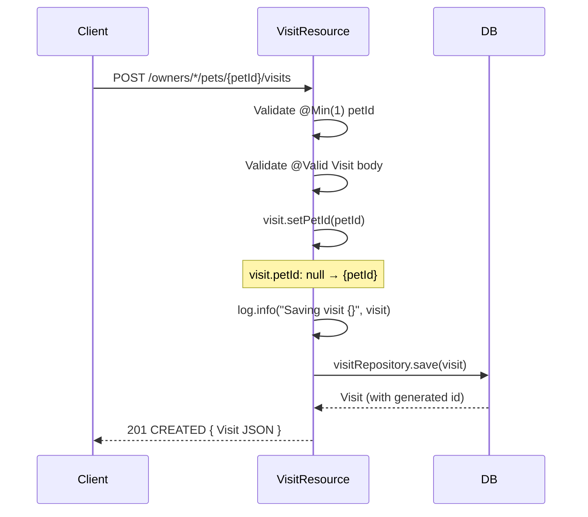

### Steps

1. **Spring MVC extracts and validates petId path parameter; ensures @Min(1) constraint**
   📍 `VisitResource.java`: `public Visit create(@Valid @RequestBody Visit visit, @PathVariable("petId") @Min(1) int petId)`
   _when: if petId < 1, Spring validation fails before method entry_
   ```java
   @PostMapping("owners/*/pets/{petId}/visits")
   @ResponseStatus(HttpStatus.CREATED)
   public Visit create(
       @Valid @RequestBody Visit visit,
       @PathVariable("petId") @Min(1) int petId)
   ```

2. **Spring MVC deserializes and validates request body against Visit entity constraints**
   📍 `VisitResource.java`: `@Valid @RequestBody Visit visit`
   _when: if Visit validation fails (missing required fields, invalid types)_
   ```java
   @PostMapping("owners/*/pets/{petId}/visits")
   @ResponseStatus(HttpStatus.CREATED)
   public Visit create(
       @Valid @RequestBody Visit visit,
       @PathVariable("petId") @Min(1) int petId)
   ```

3. **Set petId on Visit object from path parameter**
   📍 `VisitResource.java`: `public Visit create(@Valid @RequestBody Visit visit, @PathVariable("petId") @Min(1) int petId)`
   ```java
   visit.setPetId(petId);
   ```
   > **State change:** `visit.petId: null → {petId}`

4. **Log visit creation at INFO level**
   📍 `VisitResource.java`: `private static final Logger log = LoggerFactory.getLogger(VisitResource.class)`
   ```java
   log.info("Saving visit {}", visit);
   ```

5. **Persist Visit entity to database via VisitRepository.save()**
   📍 `VisitRepository.java`: `Visit save(Visit visit)`
   ```java
   return visitRepository.save(visit);
   ```
   > **State change:** `Visit entity persisted to database with generated id`

6. **Return persisted Visit object with HTTP 201 CREATED status**
   📍 `VisitResource.java`: `@ResponseStatus(HttpStatus.CREATED)`
   ```java
   @PostMapping("owners/*/pets/{petId}/visits")
   @ResponseStatus(HttpStatus.CREATED)
   public Visit create(...)
   ```

### Success Outcome

```json
HTTP/1.1 201 Created
Content-Type: application/json

{
  "id": 1,
  "petId": 7,
  "date": "2024-01-15",
  "description": "Annual checkup"
}
```

### Failure Modes

| Condition | Outcome | Error Code | Retryable |
|-----------|---------|------------|-----------|
| petId path parameter < 1 or not an integer | HTTP 400 Bad Request with ConstraintViolationException | `CONSTRAINT_VIOLATION` | ❌ No |
| Request body missing required Visit fields or invalid JSON | HTTP 400 Bad Request with validation error details | `VALIDATION_FAILED` | ❌ No |
| Database connection lost during save() | HTTP 500 Internal Server Error with DataAccessException | `DATABASE_ERROR` | ✅ Yes |
| Database constraint violation (e.g., foreign key, unique) | HTTP 409 Conflict or HTTP 500 with DataIntegrityViolationException | `CONSTRAINT_VIOLATION` | ❌ No |

### Side Effects

- INSERT into visits table
- INFO log entry `Saving visit {Visit object}`
- Micrometer metric `petclinic.visit` incremented

### Test Coverage

⚠️ **Not covered by tests**

---

## Scenario: Happy Path — Fetch Visits by Single Pet ID

**Trigger** — `GET /owners/*/pets/{petId}/visits` with valid petId >= 1

**Preconditions**
- petId path parameter is integer >= 1
- VisitRepository bean is available and database is accessible
- Zero or more Visit records exist for the given petId

**Entry Point** — `spring-petclinic-visits-service/src/main/java/org/springframework/samples/petclinic/visits/web/VisitResource.java:read`

### Sequence Diagram

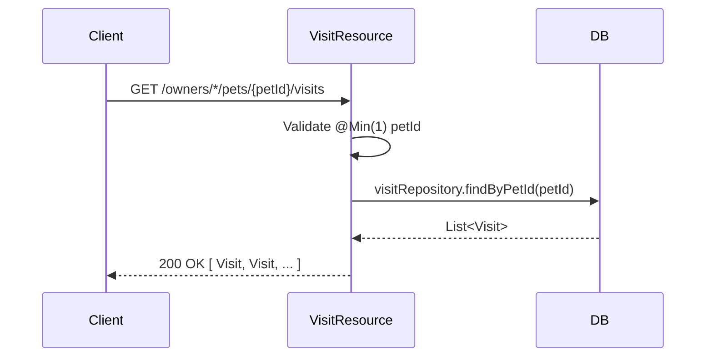

### Steps

1. **Spring MVC extracts and validates petId path parameter; ensures @Min(1) constraint**
   📍 `VisitResource.java`: `public List<Visit> read(@PathVariable("petId") @Min(1) int petId)`
   _when: if petId < 1, Spring validation fails before method entry_
   ```java
   @GetMapping("owners/*/pets/{petId}/visits")
   public List<Visit> read(@PathVariable("petId") @Min(1) int petId) {
   ```

2. **Query database for all Visit records matching petId**
   📍 `VisitRepository.java`: `List<Visit> findByPetId(int petId)`
   ```java
   return visitRepository.findByPetId(petId);
   ```

3. **Return list of Visit objects with HTTP 200 OK status**
   📍 `VisitResource.java`: `public List<Visit> read(@PathVariable("petId") @Min(1) int petId)`
   ```java
   @GetMapping("owners/*/pets/{petId}/visits")
   public List<Visit> read(@PathVariable("petId") @Min(1) int petId) {
       return visitRepository.findByPetId(petId);
   }
   ```

### Success Outcome

```json
HTTP/1.1 200 OK
Content-Type: application/json

[
  { "id": 1, "petId": 7, "date": "2024-01-15", "description": "Annual checkup" },
  { "id": 4, "petId": 7, "date": "2024-06-20", "description": "Vaccination" }
]
```

### Failure Modes

| Condition | Outcome | Error Code | Retryable |
|-----------|---------|------------|-----------|
| petId path parameter < 1 or not an integer | HTTP 400 Bad Request with ConstraintViolationException | `CONSTRAINT_VIOLATION` | ❌ No |
| Database connection lost during query | HTTP 500 Internal Server Error with DataAccessException | `DATABASE_ERROR` | ✅ Yes |
| Database query timeout | HTTP 500 Internal Server Error with QueryTimeoutException | `QUERY_TIMEOUT` | ✅ Yes |

### Side Effects

- SELECT query executed against visits table
- Micrometer metric `petclinic.visit` incremented

### Test Coverage

⚠️ **Not covered by tests**

---

## Scenario: Happy Path — Fetch Visits by Multiple Pet IDs

**Trigger** — `GET /pets/visits?petId=111,222` with comma-separated or repeated petId query parameters

**Preconditions**
- petId query parameter contains one or more integer values (comma-separated or repeated)
- VisitRepository bean is available and database is accessible
- Zero or more Visit records exist for the given petIds

**Entry Point** — `spring-petclinic-visits-service/src/main/java/org/springframework/samples/petclinic/visits/web/VisitResource.java:read`

### Sequence Diagram

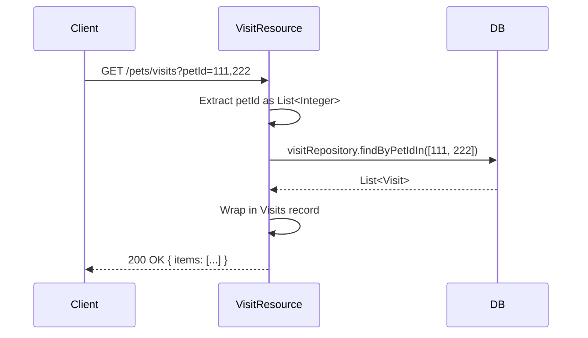

### Steps

1. **Spring MVC extracts petId query parameter as List\<Integer\>**
   📍 `VisitResource.java`: `public Visits read(@RequestParam("petId") List<Integer> petIds)`
   ```java
   @GetMapping("pets/visits")
   public Visits read(@RequestParam("petId") List<Integer> petIds) {
   ```

2. **Query database for all Visit records matching any of the provided petIds**
   📍 `VisitRepository.java`: `List<Visit> findByPetIdIn(List<Integer> petIds)`
   ```java
   final List<Visit> byPetIdIn = visitRepository.findByPetIdIn(petIds);
   ```

3. **Wrap results in Visits record and return with HTTP 200 OK status**
   📍 `VisitResource.java`: `record Visits(List<Visit> items)`
   ```java
   final List<Visit> byPetIdIn = visitRepository.findByPetIdIn(petIds);
   return new Visits(byPetIdIn);
   ```

### Success Outcome

```json
HTTP/1.1 200 OK
Content-Type: application/json

{
  "items": [
    { "id": 1, "petId": 111, "date": "2024-01-15", "description": "Checkup" },
    { "id": 2, "petId": 222, "date": "2024-02-10", "description": "Surgery" },
    { "id": 3, "petId": 222, "date": "2024-03-05", "description": "Follow-up" }
  ]
}
```

### Failure Modes

| Condition | Outcome | Error Code | Retryable |
|-----------|---------|------------|-----------|
| petId query parameter missing or empty list | HTTP 400 Bad Request or HTTP 200 with empty items (depends on config) | `INVALID_PARAMETER` | ❌ No |
| petId query parameter contains non-integer values | HTTP 400 Bad Request with type conversion error | `TYPE_MISMATCH` | ❌ No |
| Database connection lost during query | HTTP 500 Internal Server Error with DataAccessException | `DATABASE_ERROR` | ✅ Yes |
| Database query timeout (large IN clause) | HTTP 500 Internal Server Error with QueryTimeoutException | `QUERY_TIMEOUT` | ✅ Yes |

### Side Effects

- SELECT query with IN clause executed against visits table
- Micrometer metric `petclinic.visit` incremented

### Test Coverage

Tested by `spring-petclinic-visits-service/src/test/java/org/springframework/samples/petclinic/visits/web/VisitResourceTest.java:shouldFetchVisits`

---

## Scenario: Validation Failure — Create Visit with Invalid petId

**Trigger** — `POST /owners/*/pets/{petId}/visits` with petId < 1 or non-integer

**Preconditions**
- petId path parameter is < 1 or cannot be parsed as integer
- Request body is valid JSON

**Entry Point** — `spring-petclinic-visits-service/src/main/java/org/springframework/samples/petclinic/visits/web/VisitResource.java:create`

### Sequence Diagram

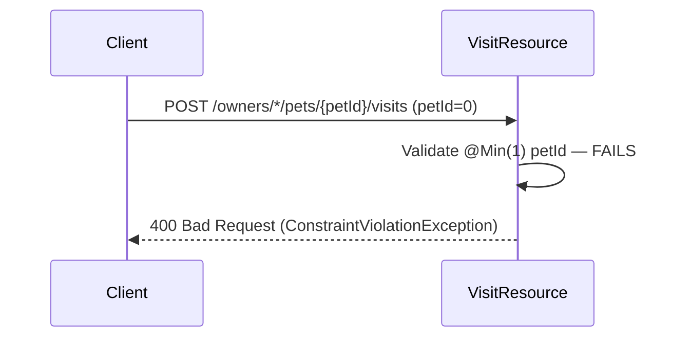

### Steps

1. **Spring MVC attempts to extract and validate petId path parameter against @Min(1) constraint**
   📍 `VisitResource.java`: `@PathVariable("petId") @Min(1) int petId`
   _when: if petId < 1_
   ```java
   @PostMapping("owners/*/pets/{petId}/visits")
   @ResponseStatus(HttpStatus.CREATED)
   public Visit create(
       @Valid @RequestBody Visit visit,
       @PathVariable("petId") @Min(1) int petId)
   ```

2. **Spring validation framework raises ConstraintViolationException; request handler not invoked**
   📍 `VisitResource.java`: Spring ConstraintViolationException handler
   _when: if @Min(1) validation fails_

3. **Spring MVC returns HTTP 400 Bad Request with validation error details**
   📍 `VisitResource.java`: Spring error response handler

### Success Outcome

```json
HTTP/1.1 400 Bad Request
Content-Type: application/json

{
  "status": 400,
  "error": "Bad Request",
  "message": "create.petId: must be greater than or equal to 1"
}
```

### Failure Modes

| Condition | Outcome | Error Code | Retryable |
|-----------|---------|------------|-----------|
| petId < 1 | HTTP 400 Bad Request with ConstraintViolationException | `CONSTRAINT_VIOLATION` | ❌ No |
| petId is non-integer string (e.g., 'abc') | HTTP 400 Bad Request with type conversion error | `TYPE_MISMATCH` | ❌ No |

### Side Effects

- No database operations
- No Visit object created

### Test Coverage

⚠️ **Not covered by tests**

---

## Scenario: Validation Failure — Create Visit with Invalid Request Body

**Trigger** — `POST /owners/*/pets/{petId}/visits` with invalid or incomplete Visit JSON body

**Preconditions**
- petId path parameter is valid (>= 1)
- Request body is missing required Visit fields or contains invalid data types

**Entry Point** — `spring-petclinic-visits-service/src/main/java/org/springframework/samples/petclinic/visits/web/VisitResource.java:create`

### Sequence Diagram

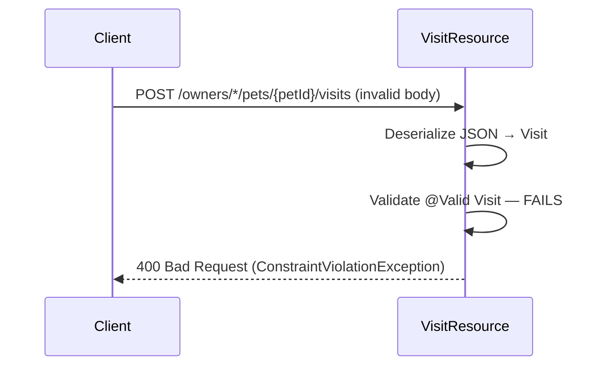

### Steps

1. **Spring MVC deserializes request body JSON into Visit object**
   📍 `VisitResource.java`: `@Valid @RequestBody Visit visit`
   ```java
   @PostMapping("owners/*/pets/{petId}/visits")
   @ResponseStatus(HttpStatus.CREATED)
   public Visit create(
       @Valid @RequestBody Visit visit,
       @PathVariable("petId") @Min(1) int petId)
   ```

2. **Spring validation framework validates Visit object against @Valid constraints**
   📍 `VisitResource.java`: `@Valid annotation triggers validation`
   _when: if Visit validation fails (missing required fields, invalid types, constraint violations)_

3. **Spring validation framework raises ConstraintViolationException; request handler not invoked**
   📍 `VisitResource.java`: Spring ConstraintViolationException handler
   _when: if @Valid validation fails_

4. **Spring MVC returns HTTP 400 Bad Request with validation error details**
   📍 `VisitResource.java`: Spring error response handler

### Success Outcome

```json
HTTP/1.1 400 Bad Request
Content-Type: application/json

{
  "status": 400,
  "error": "Bad Request",
  "errors": [
    { "field": "description", "message": "must not be blank" },
    { "field": "date", "message": "must not be null" }
  ]
}
```

### Failure Modes

| Condition | Outcome | Error Code | Retryable |
|-----------|---------|------------|-----------|
| Request body missing required Visit fields | HTTP 400 Bad Request with ConstraintViolationException | `VALIDATION_FAILED` | ❌ No |
| Request body contains invalid data types | HTTP 400 Bad Request with type conversion error | `TYPE_MISMATCH` | ❌ No |
| Request body is malformed JSON | HTTP 400 Bad Request with JSON parse error | `INVALID_JSON` | ❌ No |

### Side Effects

- No database operations
- No Visit object created

### Test Coverage

⚠️ **Not covered by tests**

---

## Scenario: Database Failure — Create Visit with Database Connection Error

**Trigger** — `POST /owners/*/pets/{petId}/visits` with valid request but database unavailable

**Preconditions**
- petId path parameter is valid (>= 1)
- Request body is valid Visit JSON
- Database connection is lost or database server is unreachable

**Entry Point** — `spring-petclinic-visits-service/src/main/java/org/springframework/samples/petclinic/visits/web/VisitResource.java:create`

### Sequence Diagram

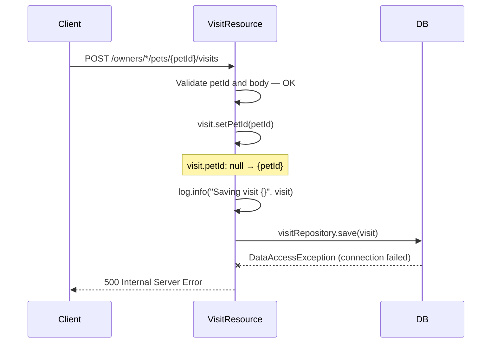

### Steps

1. **Spring MVC extracts and validates petId and Visit body (succeeds)**
   📍 `VisitResource.java`: `public Visit create(@Valid @RequestBody Visit visit, @PathVariable("petId") @Min(1) int petId)`

2. **Set petId on Visit object**
   📍 `VisitResource.java`: `public Visit create(@Valid @RequestBody Visit visit, @PathVariable("petId") @Min(1) int petId)`
   ```java
   visit.setPetId(petId);
   ```

3. **Log visit creation**
   📍 `VisitResource.java`: `private static final Logger log = LoggerFactory.getLogger(VisitResource.class)`
   ```java
   log.info("Saving visit {}", visit);
   ```

4. **Attempt to persist Visit via VisitRepository.save(); database connection fails**
   📍 `VisitRepository.java`: `Visit save(Visit visit)`
   _when: if database connection is unavailable_
   ```java
   return visitRepository.save(visit);
   ```

5. **JPA/Hibernate raises DataAccessException (wrapped SQLException)**
   📍 `VisitResource.java`: Spring DataAccessException handler
   _when: if database operation fails_

6. **Spring MVC returns HTTP 500 Internal Server Error with exception details**
   📍 `VisitResource.java`: Spring error response handler

### Success Outcome

```json
HTTP/1.1 500 Internal Server Error
Content-Type: application/json

{
  "status": 500,
  "error": "Internal Server Error",
  "message": "Could not open JPA EntityManager for transaction"
}
```

### Failure Modes

| Condition | Outcome | Error Code | Retryable |
|-----------|---------|------------|-----------|
| Database connection lost during save() | HTTP 500 Internal Server Error with DataAccessException | `DATABASE_ERROR` | ✅ Yes |
| Database server timeout during save() | HTTP 500 Internal Server Error with QueryTimeoutException | `QUERY_TIMEOUT` | ✅ Yes |

### Side Effects

- ERROR log entry with exception stack trace
- No database INSERT operation completed

### Test Coverage

⚠️ **Not covered by tests**

---

## Scenario: Database Failure — Create Visit with Constraint Violation

**Trigger** — `POST /owners/*/pets/{petId}/visits` with valid request but violates database constraint

**Preconditions**
- petId path parameter is valid (>= 1)
- Request body is valid Visit JSON
- Database is accessible
- Visit data violates a database constraint (e.g., foreign key, unique constraint, check constraint)

**Entry Point** — `spring-petclinic-visits-service/src/main/java/org/springframework/samples/petclinic/visits/web/VisitResource.java:create`

### Sequence Diagram

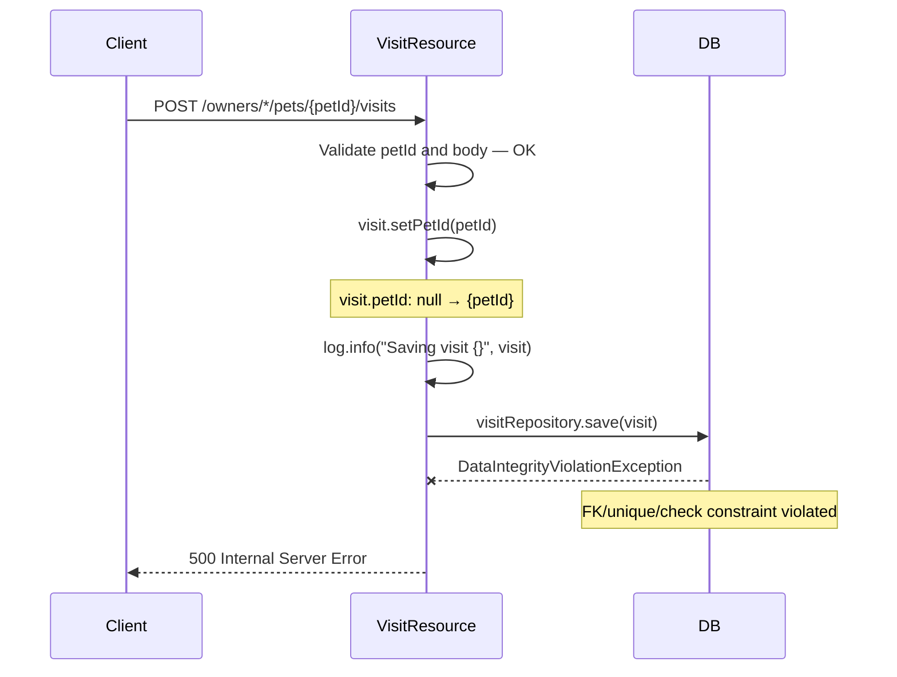

### Steps

1. **Spring MVC extracts and validates petId and Visit body (succeeds)**
   📍 `VisitResource.java`: `public Visit create(@Valid @RequestBody Visit visit, @PathVariable("petId") @Min(1) int petId)`

2. **Set petId on Visit object**
   📍 `VisitResource.java`: `public Visit create(@Valid @RequestBody Visit visit, @PathVariable("petId") @Min(1) int petId)`
   ```java
   visit.setPetId(petId);
   ```

3. **Log visit creation**
   📍 `VisitResource.java`: `private static final Logger log = LoggerFactory.getLogger(VisitResource.class)`
   ```java
   log.info("Saving visit {}", visit);
   ```

4. **Attempt to persist Visit via VisitRepository.save(); database constraint violation detected**
   📍 `VisitRepository.java`: `Visit save(Visit visit)`
   _when: if database constraint is violated (e.g., foreign key, unique, check)_
   ```java
   return visitRepository.save(visit);
   ```

5. **JPA/Hibernate raises DataIntegrityViolationException**
   📍 `VisitResource.java`: Spring DataIntegrityViolationException handler
   _when: if database constraint violation occurs_

6. **Spring MVC returns HTTP 500 Internal Server Error (or HTTP 409 if custom handler configured)**
   📍 `VisitResource.java`: Spring error response handler

### Success Outcome

```json
HTTP/1.1 500 Internal Server Error
Content-Type: application/json

{
  "status": 500,
  "error": "Internal Server Error",
  "message": "could not execute statement; SQL [n/a]; constraint [fk_visits_pets]"
}
```

### Failure Modes

| Condition | Outcome | Error Code | Retryable |
|-----------|---------|------------|-----------|
| Foreign key constraint violation (petId does not exist in pets table) | HTTP 500 with DataIntegrityViolationException | `CONSTRAINT_VIOLATION` | ❌ No |
| Unique constraint violation (duplicate visit record) | HTTP 500 with DataIntegrityViolationException | `CONSTRAINT_VIOLATION` | ❌ No |
| Check constraint violation (invalid visit date, etc.) | HTTP 500 with DataIntegrityViolationException | `CONSTRAINT_VIOLATION` | ❌ No |

### Side Effects

- ERROR log entry with exception stack trace
- No database INSERT operation completed
- Database transaction rolled back

### Test Coverage

⚠️ **Not covered by tests**

---

## Scenario: Database Failure — Fetch Visits with Database Connection Error

**Trigger** — `GET /owners/*/pets/{petId}/visits` or `GET /pets/visits` with database unavailable

**Preconditions**
- petId path/query parameter is valid
- Database connection is lost or database server is unreachable

**Entry Point** — `spring-petclinic-visits-service/src/main/java/org/springframework/samples/petclinic/visits/web/VisitResource.java:read`

### Sequence Diagram

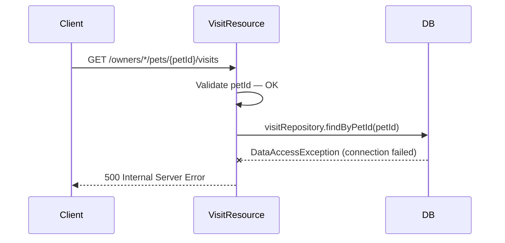

### Steps

1. **Spring MVC extracts and validates petId parameter (succeeds)**
   📍 `VisitResource.java`: `public List<Visit> read(@PathVariable("petId") @Min(1) int petId)` or `public Visits read(@RequestParam("petId") List<Integer> petIds)`

2. **Attempt to query database via VisitRepository.findByPetId() or findByPetIdIn(); database connection fails**
   📍 `VisitRepository.java`: `List<Visit> findByPetId(int petId)` or `List<Visit> findByPetIdIn(List<Integer> petIds)`
   _when: if database connection is unavailable_
   ```java
   return visitRepository.findByPetId(petId);
   ```

3. **JPA/Hibernate raises DataAccessException (wrapped SQLException)**
   📍 `VisitResource.java`: Spring DataAccessException handler
   _when: if database operation fails_

4. **Spring MVC returns HTTP 500 Internal Server Error with exception details**
   📍 `VisitResource.java`: Spring error response handler

### Success Outcome

```json
HTTP/1.1 500 Internal Server Error
Content-Type: application/json

{
  "status": 500,
  "error": "Internal Server Error",
  "message": "Could not open JPA EntityManager for transaction"
}
```

### Failure Modes

| Condition | Outcome | Error Code | Retryable |
|-----------|---------|------------|-----------|
| Database connection lost during query | HTTP 500 Internal Server Error with DataAccessException | `DATABASE_ERROR` | ✅ Yes |
| Database server timeout during query | HTTP 500 Internal Server Error with QueryTimeoutException | `QUERY_TIMEOUT` | ✅ Yes |

### Side Effects

- ERROR log entry with exception stack trace

### Test Coverage

⚠️ **Not covered by tests**

---

## Scenario: Test Initialization — Test Profile Configuration

**Trigger** — Test suite startup with `@ActiveProfiles("test")`

**Preconditions**
- Test class has `@ActiveProfiles("test")` annotation
- `application-test.yml` is present in test resources
- HSQLDB schema and data files are available

**Entry Point** — `spring-petclinic-visits-service/src/test/resources/application-test.yml`

### Sequence Diagram

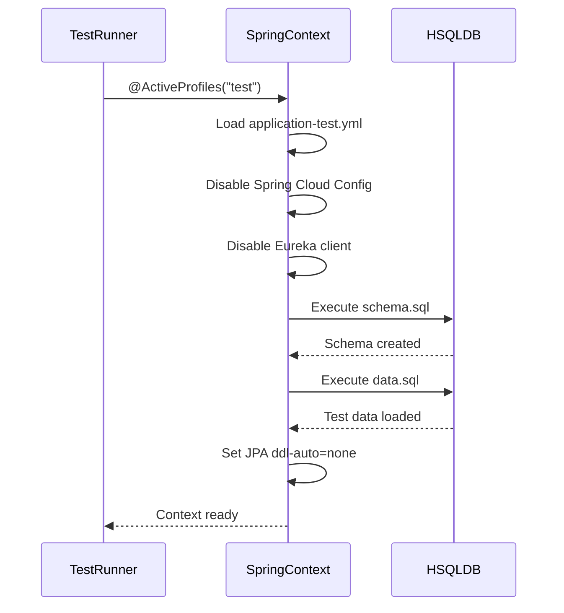

### Steps

1. **Spring Test loads application-test.yml configuration for test profile**
   📍 `application-test.yml`: application-test.yml configuration loading
   _when: if @ActiveProfiles("test") is set_
   ```yaml
   spring:
     cloud:
       config:
         enabled: false
     sql:
       init:
         schema-locations: classpath*:db/hsqldb/schema.sql
         data-locations: classpath*:db/hsqldb/data.sql
   ```

2. **Disable Spring Cloud Config Server for tests**
   📍 `application-test.yml`: `spring.cloud.config.enabled: false`
   ```yaml
   spring:
     cloud:
       config:
         enabled: false
   ```

3. **Initialize HSQLDB in-memory database with schema from schema.sql**
   📍 `application-test.yml`: `spring.sql.init.schema-locations`
   ```yaml
   spring:
     sql:
       init:
         schema-locations: classpath*:db/hsqldb/schema.sql
   ```
   > **State change:** `HSQLDB: empty → schema created`

4. **Populate HSQLDB with test data from data.sql**
   📍 `application-test.yml`: `spring.sql.init.data-locations`
   ```yaml
   spring:
     sql:
       init:
         data-locations: classpath*:db/hsqldb/data.sql
   ```
   > **State change:** `HSQLDB: schema only → populated with test data`

5. **Configure JPA/Hibernate to not auto-generate DDL (use existing schema)**
   📍 `application-test.yml`: `spring.jpa.hibernate.ddl-auto: none`
   ```yaml
   spring:
     jpa:
       hibernate:
         ddl-auto: none
   ```

6. **Disable Eureka client for tests**
   📍 `application-test.yml`: `eureka.client.enabled: false`
   ```yaml
   eureka:
     client:
       enabled: false
   ```

7. **Set Spring logging level to INFO for tests**
   📍 `application-test.yml`: `logging.level.org.springframework: INFO`
   ```yaml
   logging.level.org.springframework: INFO
   ```

### Success Outcome

```
Test environment initialized:
- HSQLDB in-memory database with schema and test data
- Spring Cloud Config: disabled
- Eureka client: disabled
- JPA ddl-auto: none
- Logging: INFO level
```

### Failure Modes

| Condition | Outcome | Error Code | Retryable |
|-----------|---------|------------|-----------|
| schema.sql file not found or invalid SQL | Test startup fails with FileNotFoundException or SQLSyntaxErrorException | `SCHEMA_INIT_FAILED` | ❌ No |
| data.sql file not found or invalid SQL | Test startup fails with FileNotFoundException or SQLSyntaxErrorException | `DATA_INIT_FAILED` | ❌ No |
| HSQLDB driver not available | Test startup fails with ClassNotFoundException | `DRIVER_NOT_FOUND` | ❌ No |

### Side Effects

- HSQLDB in-memory database created
- Schema SQL executed
- Test data SQL executed
- Spring Cloud Config client disabled
- Eureka client disabled

### Test Coverage

⚠️ **Not covered by tests**

---

## Scenario: Unit Test — Fetch Visits by Multiple Pet IDs

**Trigger** — Test execution: `VisitResourceTest.shouldFetchVisits()`

**Preconditions**
- VisitResourceTest class is loaded with `@WebMvcTest(VisitResource.class)`
- VisitRepository is mocked with `@MockitoBean`
- MockMvc is injected for HTTP request simulation

**Entry Point** — `spring-petclinic-visits-service/src/test/java/org/springframework/samples/petclinic/visits/web/VisitResourceTest.java:shouldFetchVisits`

### Sequence Diagram

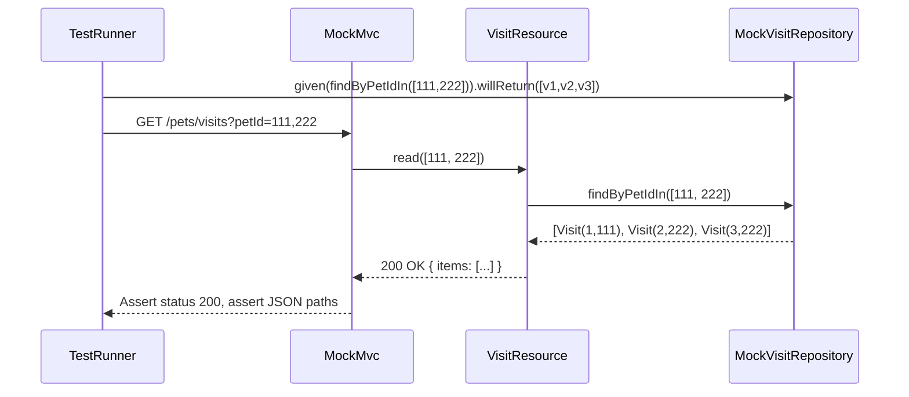

### Steps

1. **Set up mock VisitRepository to return predefined Visit list when findByPetIdIn([111, 222]) is called**
   📍 `VisitResourceTest.java`: `void shouldFetchVisits() throws Exception`
   ```java
   given(visitRepository.findByPetIdIn(asList(111, 222)))
       .willReturn(
           asList(
               Visit.VisitBuilder.aVisit()
                   .id(1)
                   .petId(111)
                   .build(),
               Visit.VisitBuilder.aVisit()
                   .id(2)
                   .petId(222)
                   .build(),
               Visit.VisitBuilder.aVisit()
                   .id(3)
                   .petId(222)
                   .build()
           )
       );
   ```

2. **Perform HTTP GET request to /pets/visits?petId=111,222 via MockMvc**
   📍 `VisitResourceTest.java`: `void shouldFetchVisits() throws Exception`
   ```java
   mvc.perform(get("/pets/visits?petId=111,222"))
   ```

3. **Assert HTTP response status is 200 OK**
   📍 `VisitResourceTest.java`: `void shouldFetchVisits() throws Exception`
   ```java
   .andExpect(status().isOk())
   ```

4. **Assert response JSON contains items array with 3 Visit objects**
   📍 `VisitResourceTest.java`: `void shouldFetchVisits() throws Exception`
   ```java
   .andExpect(jsonPath("$.items[0].id").value(1))
   .andExpect(jsonPath("$.items[1].id").value(2))
   .andExpect(jsonPath("$.items[2].id").value(3))
   .andExpect(jsonPath("$.items[0].petId").value(111))
   .andExpect(jsonPath("$.items[1].petId").value(222))
   .andExpect(jsonPath("$.items[2].petId").value(222));
   ```

### Success Outcome

```
Test PASSED:
- HTTP 200 OK
- $.items[0].id == 1, $.items[0].petId == 111
- $.items[1].id == 2, $.items[1].petId == 222
- $.items[2].id == 3, $.items[2].petId == 222
- VisitRepository.findByPetIdIn() called once with [111, 222]
```

### Failure Modes

| Condition | Outcome | Error Code | Retryable |
|-----------|---------|------------|-----------|
| VisitRepository mock not configured correctly | Test fails with AssertionError or NullPointerException | `MOCK_SETUP_FAILED` | ❌ No |
| VisitResource.read() method signature changed | Test fails with compilation error or NoSuchMethodException | `METHOD_NOT_FOUND` | ❌ No |
| JSON response structure differs from expected | Test fails with AssertionError on jsonPath assertion | `ASSERTION_FAILED` | ❌ No |

### Side Effects

- Mockito verifies mock interaction
- MockMvc simulates HTTP request/response cycle
- No actual database operations

### Test Coverage

Tested by `spring-petclinic-visits-service/src/test/java/org/springframework/samples/petclinic/visits/web/VisitResourceTest.java:shouldFetchVisits`

---

## See Also

- [Spring PetClinic Microservices Repository](https://github.com/spring-petclinic/spring-petclinic-microservices) — parent project with all microservices
- [VisitResource.java](spring-petclinic-visits-service/src/main/java/org/springframework/samples/petclinic/visits/web/VisitResource.java) — primary REST controller source
- [VisitResourceTest.java](spring-petclinic-visits-service/src/test/java/org/springframework/samples/petclinic/visits/web/VisitResourceTest.java) — unit test source
- [application-test.yml](spring-petclinic-visits-service/src/test/resources/application-test.yml) — test profile configuration